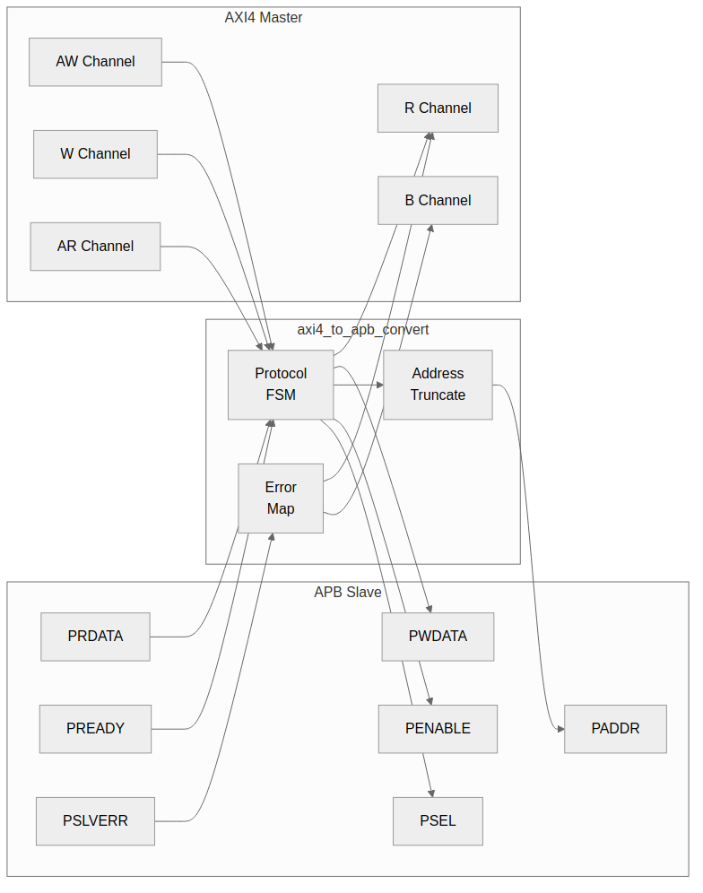
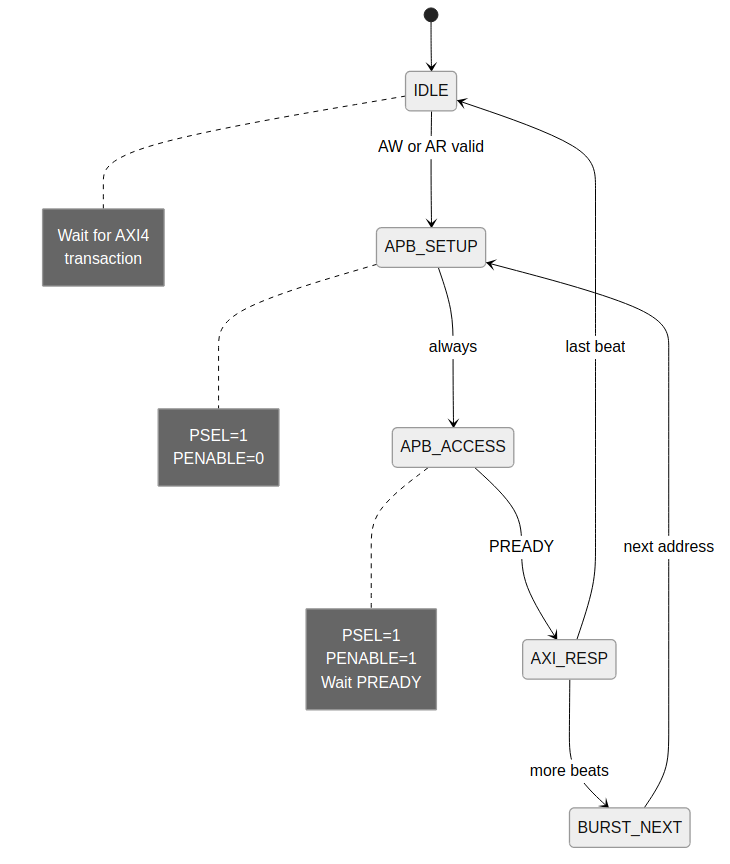

<!-- RTL Design Sherpa Documentation Header -->
<table>
<tr>
<td width="80">
  <a href="https://github.com/sean-galloway/RTLDesignSherpa">
    
  </a>
</td>
<td>
  <strong>RTL Design Sherpa</strong> · <em>Learning Hardware Design Through Practice</em><br>
  <sub>
    <a href="https://github.com/sean-galloway/RTLDesignSherpa">GitHub</a> ·
    <a href="https://github.com/sean-galloway/RTLDesignSherpa/blob/main/docs/DOCUMENTATION_INDEX.md">Documentation Index</a> ·
    <a href="https://github.com/sean-galloway/RTLDesignSherpa/blob/main/LICENSE">MIT License</a>
  </sub>
</td>
</tr>
</table>

---

<!-- End Header -->

# 3.4 AXI4 to APB Converter

The **axi4_to_apb4_convert** module provides full protocol translation from AXI4 to APB, enabling AXI4 masters to access APB peripherals.

## 3.4.1 Purpose

AXI4 and APB differ on just about every axis:

| Aspect | AXI4 | APB |
|--------|------|-----|
| Channels | 5 (AW, W, B, AR, R) | 1 (combined) |
| Phases | Pipelined | 2-phase (setup, access) |
| Bursts | Up to 256 beats | Single transfer |
| Address width | Up to 64 bits | Typically 32 bits |
| Data width | 8-1024 bits | 8-32 bits |

: Table 3.15: AXI4 vs APB Comparison

## 3.4.2 Block Diagram

### Figure 3.6: AXI4 to APB Converter



## 3.4.3 Interface Specification

### Parameters

**`axi4_to_apb4_convert`** — the conversion core:

| Parameter | Type | Default | Description |
|-----------|------|---------|-------------|
| AXI_ADDR_WIDTH | int | 32 | AXI4 address width |
| AXI_DATA_WIDTH | int | 32 | AXI4 data width |
| AXI_ID_WIDTH | int | 8 | AXI4 ID width |
| AXI_USER_WIDTH | int | 1 | AXI4 user-signal width |
| APB_ADDR_WIDTH | int | 32 | APB address width |
| APB_DATA_WIDTH | int | 32 | APB data width |
| SIDE_DEPTH | int | 6 | Side-channel FIFO depth (ID/user carried past the APB hop) |

: Table 3.16: AXI4 to APB Parameters

**`axi4_to_apb4_shim`** — the wrapper integrators actually instantiate.
It adds the channel FIFOs around the core, and is what the bridge
generator emits:

| Parameter | Type | Default | Description |
|-----------|------|---------|-------------|
| DEPTH_AW / DEPTH_AR | int | 2 | Write/read address channel FIFO depth |
| DEPTH_W / DEPTH_R | int | 4 | Write/read data channel FIFO depth |
| DEPTH_B | int | 2 | Write response channel FIFO depth |
| SIDE_DEPTH | int | 4 | Side-channel FIFO depth |
| APB_CMD_DEPTH | int | 4 | APB command FIFO depth |
| APB_RSP_DEPTH | int | 4 | APB response FIFO depth |
| USE_JOHNSON | int | 0 | CDC-FIFO pointer encoding: 0 = Gray (power-of-2 depth only), 1 = Johnson |
| AXI_*/APB_* widths | int | as above | Same width parameters as the core |

: Table 3.17: AXI4 to APB Shim Parameters

The shim's defaults differ from the core's `SIDE_DEPTH` (4 vs 6); it
sets its own rather than inheriting.

### Ports

```systemverilog
// The conversion CORE. It does not sit on the AXI4 channels directly:
// the shim packs each channel into a packet plus a count and hands those
// in, which is why the ports below are r_s_axi_*_pkt rather than the raw
// AXI signals. Integrators instantiate axi4_to_apb4_shim instead; its
// parameters are in the shim table above.

module axi4_to_apb4_convert #(
    parameter int SIDE_DEPTH        = 6,
    parameter int AXI_ID_WIDTH      = 8,
    parameter int AXI_ADDR_WIDTH    = 32,
    parameter int AXI_DATA_WIDTH    = 32,
    parameter int AXI_USER_WIDTH    = 1,
    parameter int APB_ADDR_WIDTH    = 32,
    parameter int APB_DATA_WIDTH    = 32,
    parameter int AXI_WSTRB_WIDTH   = AXI_DATA_WIDTH / 8,
    parameter int APB_WSTRB_WIDTH   = APB_DATA_WIDTH / 8,
    // short and calculated params
    parameter int AW                = AXI_ADDR_WIDTH,
    parameter int DW                = AXI_DATA_WIDTH,
    parameter int IW                = AXI_ID_WIDTH,
    parameter int UW                = AXI_USER_WIDTH,
    parameter int SW                = AXI_DATA_WIDTH / 8,
    parameter int APBAW             = APB_ADDR_WIDTH,
    parameter int APBDW             = APB_DATA_WIDTH,
    parameter int APBSW             = APB_DATA_WIDTH / 8,
    parameter int AXI2APBRATIO      = DW / APBDW,
    parameter int AWSize            = IW + AW + 8 + 3 + 2 + 1 + 4 + 3 + 4 + 4 + UW,
    parameter int WSize             = DW + SW + 1 + UW,
    parameter int BSize             = IW + 2 + UW,
    parameter int ARSize            = IW + AW + 8 + 3 + 2 + 1 + 4 + 3 + 4 + 4 + UW,
    parameter int RSize             = IW + DW + 2 + 1 + UW,
    parameter int APBCmdWidth       = APBAW + APBDW + APBSW + 3 + 1 + 1 + 1,
    parameter int APBRspWidth       = APBDW + 1 + 1 + 1,
    parameter int SideSize          = 1 + IW + 1 + UW
) (
    // Clock and Reset
    input  logic                    aclk,
    input  logic                    aresetn,

    // Inputs from axi_slave_stub
    input  logic [AWSize-1:0]       r_s_axi_aw_pkt,
    input  logic [3:0]              r_s_axi_aw_count,
    input  logic                    r_s_axi_awvalid,
    output logic                    w_s_axi_awready,

    input  logic [WSize-1:0]        r_s_axi_w_pkt,
    input  logic                    r_s_axi_wvalid,
    output logic                    w_s_axi_wready,

    output logic [BSize-1:0]        r_s_axi_b_pkt,
    output logic                    w_s_axi_bvalid,
    input  logic                    r_s_axi_bready,

    input  logic [ARSize-1:0]       r_s_axi_ar_pkt,
    input  logic [3:0]              r_s_axi_ar_count,
    input  logic                    r_s_axi_arvalid,
    output logic                    w_s_axi_arready,

    output logic [RSize-1:0]        r_s_axi_r_pkt,
    output logic                    w_s_axi_rvalid,
    input  logic                    r_s_axi_rready,

    // APB Master Interface
    output logic                    w_cmd_valid,
    input  logic                    r_cmd_ready,
    output logic [APBCmdWidth-1:0]  r_cmd_data,

    input  logic                    r_rsp_valid,
    output logic                    w_rsp_ready,
    input  logic [APBRspWidth-1:0]  r_rsp_data
);
```

## 3.4.4 Clock Domains

The shim is a **two-clock** block. `aclk` runs the AXI side and `pclk`
the APB side, with independent resets (`aresetn`, `presetn`). Commands
cross aclk->pclk and responses pclk->aclk through gray-pointer
asynchronous FIFOs (`gaxi_fifo_async`).

The reset behaviour is the part worth knowing. Each domain resets its own
pointer and its crossed copy of the remote pointer from its LOCAL reset,
so resetting one side alone leaves that side self-consistent -- both
pointers at 0, meaning empty. Because the pointers are absolute positions
rather than toggle parity, an independent reset of one side cannot
fabricate or swallow a transfer. The earlier 2-phase handshake could, and
the failure was permanent rather than transient: the response stream ends
up offset by one and every read returns the previous read's data.

CDC FIFO depths follow the APB cmd/rsp queue depths, floored at 4:

```systemverilog
localparam int CDC_CMD_DEPTH = (APB_CMD_DEPTH < 4) ? 4 : APB_CMD_DEPTH;
localparam int CDC_RSP_DEPTH = (APB_RSP_DEPTH < 4) ? 4 : APB_RSP_DEPTH;
```

A power-of-2 depth is preferred: the default `USE_JOHNSON=0` Gray
encoding requires it (see the parameter table above).

## 3.4.5 State Machine

### Figure 3.7: AXI4 to APB FSM



### States

The convert core runs TWO state machines, and neither of them touches
PSEL/PENABLE -- the APB setup/access phases belong to `apb4_master`, on
the far side of the shim's CDC. The core's job is packetizing.

**Command FSM** -- walks the accepted AXI burst and emits one APB
command packet per APB-width beat into the cmd stream:

```systemverilog
typedef enum logic [2:0] {
    IDLE  = 3'b001,   // wait for an accepted AW+W pair or AR
    READ  = 3'b010,   // emit one read command per beat
    WRITE = 3'b100    // emit one write command per beat
} apb_state_t;
```

Writes are preferred over reads when both are pending. Each command
carries `first`/`last` flags; `last` is set on the final beat, which is
also when the AXI address channel is released (`awready`/`arready`).
A data pointer sub-divides each AXI beat into `AXI2APBRATIO` APB beats
when the widths differ, and the next address comes from the shared
`axi_gen_addr` (INCR/FIXED/WRAP per the AXI burst type).

**Response FSM** -- assembles returning rsp packets into AXI responses:

```systemverilog
typedef enum logic [1:0] {
    RSP_IDLE   = 2'b01,   // no response in flight
    RSP_ACTIVE = 2'b10    // consuming rsp packets for one transaction
} rsp_state_t;
```

Read data re-packs APB-width beats into AXI-width R beats; write
responses collapse into the single B, worst response winning. The
`first` flag in the command stream is what arms this FSM -- stamping it
from transaction progress rather than the previous command state is the
fix for a hang recorded in the RTL history (a `first=0` first command
froze the response FSM in RSP_IDLE).


## 3.4.6 Burst Handling

### Burst Decomposition

AXI4 bursts are decomposed into sequential APB transfers:

```
AXI4: AWADDR=0x1000, AWLEN=3 (4 beats)

APB sequence:
  Transfer 0: PADDR=0x1000
  Transfer 1: PADDR=0x1004
  Transfer 2: PADDR=0x1008
  Transfer 3: PADDR=0x100C
```

### Address Calculation

The per-beat address comes from the shared `axi_gen_addr` block, keyed
on the AXI burst type (INCR/FIXED/WRAP) and size -- the convert core
does not roll its own increment, and there is no APB-phase state here
(PREADY pacing happens in `apb4_master` beyond the CDC; see 3.4.5).

## 3.4.7 Address Width Adaptation

### 64-bit to 32-bit Conversion

```systemverilog
// Truncate upper address bits
assign paddr = s_awaddr[APB_ADDR_WIDTH-1:0];

// Optional: Check for out-of-range access
wire w_addr_oor = |s_awaddr[AXI_ADDR_WIDTH-1:APB_ADDR_WIDTH];
```

## 3.4.8 Error Response Mapping

| APB Signal | AXI4 Response |
|------------|---------------|
| PSLVERR = 0 | OKAY (2'b00) |
| PSLVERR = 1 | SLVERR (2'b10) |

: Table 3.18: Error Mapping

### Error Aggregation

Each rsp packet carries the APB `pslverr` for its beat. The response
FSM accumulates across the transaction's packets and maps any error to
SLVERR on the AXI side -- B for writes, per-beat RRESP for reads (the
error lands on the beats it belongs to, not smeared across the burst).
There is no APB-phase sampling here; `pslverr` is captured by
`apb4_master` and travels back in the packet.

## 3.4.9 Implementation

The implementation is the two FSMs of 3.4.5 plus the packet plumbing:
the shim skid-buffers each AXI channel, packs AW/W/AR into per-channel
packets for the core, and carries the core's cmd/rsp streams through
gray-pointer async FIFOs to `apb4_master`, which owns the actual APB
setup/access phases. The full source is
`projects/components/converters/rtl/axi4_to_apb4_convert.sv` (core) and
`axi4_to_apb4_shim.sv` (integration); their headers document the packet
formats. No separate simplified listing is maintained here -- an earlier
one drifted into describing states the RTL never had.

## 3.4.10 Resource Utilization

```
State machine:        ~50 LUTs, ~20 regs
Address logic:        ~30 LUTs, ~40 regs
Data buffering:       ~10 LUTs, ~70 regs
Control:              ~60 LUTs, ~20 regs

Total: ~150 LUTs, ~150 regs
```

## 3.4.11 Performance

### Timing Analysis

| Operation | Cycles |
|-----------|--------|
| Single write | 3-4 APB-side + ~2 pclk in + ~2 aclk out for the CDC crossings (see 3.4.4) |
| Single read | 3-4 (setup + access + R) |
| N-beat write burst | ~2N+1 APB-side + the same two CDC crossings, paid once per command run |
| N-beat read burst | ~2N+1 APB-side |

: Table 3.19: APB Converter Timing

The 2N+1 shape falls out of the FSM: the first transfer pays
IDLE→SETUP→ACCESS (3 pclk), but with commands queued in the skid the
ACCESS state hands straight back to SETUP — every subsequent transfer is
SETUP→ACCESS, 2 pclk, PREADY permitting.

### Throughput

**Best case (sustained):** 1 transfer per 2 pclk cycles once the first
transfer's extra IDLE cycle is paid
**With slow PREADY:** Additional cycles per transfer

## 3.4.12 Usage Example

Integrators instantiate the SHIM (the core's cmd/rsp packet ports are
internal plumbing):

```systemverilog
axi4_to_apb4_shim #(
    .AXI_ID_WIDTH     (8),
    .AXI_ADDR_WIDTH   (32),
    .AXI_DATA_WIDTH   (32),
    .APB_ADDR_WIDTH   (32),
    .APB_DATA_WIDTH   (32),
    .APB_CMD_DEPTH    (4),
    .APB_RSP_DEPTH    (4)
) u_axi2apb (
    // AXI side clock/reset
    .aclk             (aclk),
    .aresetn          (aresetn),
    // APB side clock/reset -- this is a TWO-CLOCK block (see 3.4.4)
    .pclk             (pclk),
    .presetn          (presetn),

    // AXI4 slave interface: s_axi_aw*/w*/b*/ar*/r* (full signal list in
    // the module header)
    .s_axi_awvalid    (cpu_awvalid),
    .s_axi_awready    (cpu_awready),
    // ...

    // APB master interface
    .m_apb_PSEL       (periph_psel),
    .m_apb_PENABLE    (periph_penable),
    .m_apb_PADDR      (periph_paddr),
    .m_apb_PWRITE     (periph_pwrite),
    .m_apb_PWDATA     (periph_pwdata),
    .m_apb_PSTRB      (periph_pstrb),
    .m_apb_PPROT      (periph_pprot),
    .m_apb_PRDATA     (periph_prdata),
    .m_apb_PSLVERR    (periph_pslverr),
    .m_apb_PREADY     (periph_pready)
);
```

