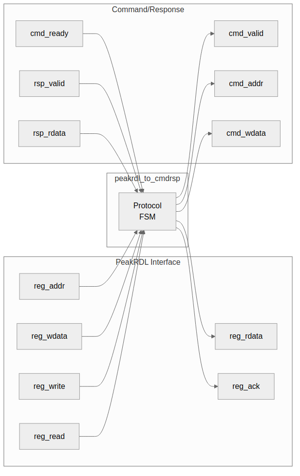

<!-- RTL Design Sherpa Documentation Header -->
<table>
<tr>
<td width="80">
  <a href="https://github.com/sean-galloway/RTLDesignSherpa">
    
  </a>
</td>
<td>
  <strong>RTL Design Sherpa</strong> · <em>Learning Hardware Design Through Practice</em><br>
  <sub>
    <a href="https://github.com/sean-galloway/RTLDesignSherpa">GitHub</a> ·
    <a href="https://github.com/sean-galloway/RTLDesignSherpa/blob/main/docs/DOCUMENTATION_INDEX.md">Documentation Index</a> ·
    <a href="https://github.com/sean-galloway/RTLDesignSherpa/blob/main/LICENSE">MIT License</a>
  </sub>
</td>
</tr>
</table>

---

<!-- End Header -->

# 3.5 PeakRDL Adapter

The **peakrdl_to_cmdrsp** module adapts PeakRDL-generated register interfaces to a custom command/response protocol, enabling protocol decoupling and flexible register implementations.

## 3.5.1 Purpose

PeakRDL generates register blocks with an APB-style interface. This adapter:

1. Decouples register interface from implementation
2. Provides clean handshake protocol
3. Enables pipelined register access
4. Supports custom control logic integration

## 3.5.2 Block Diagram

### Figure 3.8: PeakRDL Adapter



## 3.5.3 Interface Specification

### Parameters

| Parameter | Type | Default | Description |
|-----------|------|---------|-------------|
| ADDR_WIDTH | int | 32 | Address width |
| DATA_WIDTH | int | 32 | Data width |

: Table 3.20: PeakRDL Adapter Parameters

### Ports

```systemverilog
module peakrdl_to_cmdrsp #(
    parameter int ADDR_WIDTH = 32,
    parameter int DATA_WIDTH = 32
) (
    input  logic clk,
    input  logic rst_n,

    // Register interface (from PeakRDL)
    input  logic [ADDR_WIDTH-1:0]   reg_addr,
    input  logic [DATA_WIDTH-1:0]   reg_wdata,
    input  logic                    reg_write,
    input  logic                    reg_read,
    output logic [DATA_WIDTH-1:0]   reg_rdata,
    output logic                    reg_error,
    output logic                    reg_ack,

    // Command interface (output)
    output logic                    cmd_valid,
    input  logic                    cmd_ready,
    output logic [ADDR_WIDTH-1:0]   cmd_addr,
    output logic [DATA_WIDTH-1:0]   cmd_wdata,
    output logic                    cmd_write,

    // Response interface (input)
    input  logic                    rsp_valid,
    output logic                    rsp_ready,
    input  logic [DATA_WIDTH-1:0]   rsp_rdata,
    input  logic                    rsp_error
);
```

## 3.5.4 Operation

### Write Transaction

```
Cycle 0: reg_write asserted
         cmd_valid = 1, cmd_write = 1
Cycle 1: cmd_ready = 1 (downstream accepts)
         Wait for response
Cycle N: rsp_valid = 1
         reg_ack = 1
Cycle N+1: Transaction complete
```

### Read Transaction

```
Cycle 0: reg_read asserted
         cmd_valid = 1, cmd_write = 0
Cycle 1: cmd_ready = 1 (downstream accepts)
         Wait for response
Cycle N: rsp_valid = 1
         reg_rdata = rsp_rdata
         reg_ack = 1
Cycle N+1: Transaction complete
```

## 3.5.5 Implementation

```systemverilog
// State machine
typedef enum logic [1:0] {
    IDLE    = 2'b00,
    CMD     = 2'b01,
    RSP     = 2'b10
} state_t;

state_t r_state;
logic r_is_write;

always_ff @(posedge clk or negedge rst_n) begin
    if (!rst_n) begin
        r_state <= IDLE;
    end else begin
        case (r_state)
            IDLE: begin
                if (reg_write || reg_read) begin
                    r_state <= CMD;
                    r_is_write <= reg_write;
                end
            end

            CMD: begin
                if (cmd_ready) begin
                    r_state <= RSP;
                end
            end

            RSP: begin
                if (rsp_valid) begin
                    r_state <= IDLE;
                end
            end
        endcase
    end
end

// Command interface
assign cmd_valid = (r_state == CMD);
assign cmd_addr = reg_addr;
assign cmd_wdata = reg_wdata;
assign cmd_write = r_is_write;

// Response interface
assign rsp_ready = (r_state == RSP);

// Register interface
assign reg_rdata = rsp_rdata;
assign reg_error = rsp_error;
assign reg_ack = (r_state == RSP) && rsp_valid;
```

## 3.5.6 Resource Utilization

```
State machine:  ~20 LUTs, ~10 regs
Data paths:     ~10 LUTs, ~40 regs
Control:        ~20 LUTs, ~5 regs

Total: ~50 LUTs, ~55 regs
```

## 3.5.7 Use Cases

### 1. PeakRDL to Custom Control

```
PeakRDL Registers → Adapter → Custom State Machine
                            → Hardware Accelerator
                            → Debug Controller
```

### 2. Register Access Logging

```
PeakRDL Registers → Adapter → Logger → Registers
                            ↓
                         Log Buffer
```

### 3. Pipeline Insertion

```
PeakRDL Registers → Adapter → Pipeline → Slow Registers
                             (for timing)
```

## 3.5.8 Integration Example

```systemverilog
// Instantiate PeakRDL-generated register block
my_regs u_regs (
    .clk        (clk),
    .rst_n      (rst_n),

    // APB-style interface from CPU
    .s_apb_psel    (apb_psel),
    .s_apb_penable (apb_penable),
    // ... other APB signals

    // Register interface to adapter
    .reg_addr   (reg_addr),
    .reg_wdata  (reg_wdata),
    .reg_write  (reg_write),
    .reg_read   (reg_read),
    .reg_rdata  (reg_rdata),
    .reg_error  (reg_error),
    .reg_ack    (reg_ack)
);

// Adapter to custom protocol
peakrdl_to_cmdrsp #(
    .ADDR_WIDTH(32),
    .DATA_WIDTH(32)
) u_adapter (
    .clk        (clk),
    .rst_n      (rst_n),

    // From PeakRDL registers
    .reg_addr   (reg_addr),
    .reg_wdata  (reg_wdata),
    .reg_write  (reg_write),
    .reg_read   (reg_read),
    .reg_rdata  (reg_rdata),
    .reg_error  (reg_error),
    .reg_ack    (reg_ack),

    // To custom control logic
    .cmd_valid  (ctrl_cmd_valid),
    .cmd_ready  (ctrl_cmd_ready),
    .cmd_addr   (ctrl_cmd_addr),
    .cmd_wdata  (ctrl_cmd_wdata),
    .cmd_write  (ctrl_cmd_write),

    .rsp_valid  (ctrl_rsp_valid),
    .rsp_ready  (ctrl_rsp_ready),
    .rsp_rdata  (ctrl_rsp_rdata),
    .rsp_error  (ctrl_rsp_error)
);
```

---

**Next:** [Chapter 4: FSM Design](../ch04_fsm_design/01_width_fsms.md)
