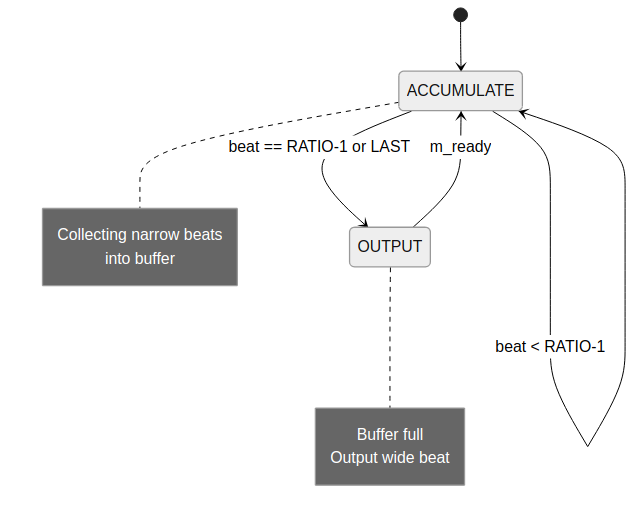
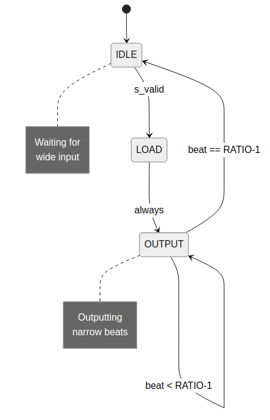

<!-- RTL Design Sherpa Documentation Header -->
<table>
<tr>
<td width="80">
  <a href="https://github.com/sean-galloway/RTLDesignSherpa">
    
  </a>
</td>
<td>
  <strong>RTL Design Sherpa</strong> · <em>Learning Hardware Design Through Practice</em><br>
  <sub>
    <a href="https://github.com/sean-galloway/RTLDesignSherpa">GitHub</a> ·
    <a href="https://github.com/sean-galloway/RTLDesignSherpa/blob/main/docs/DOCUMENTATION_INDEX.md">Documentation Index</a> ·
    <a href="https://github.com/sean-galloway/RTLDesignSherpa/blob/main/LICENSE">MIT License</a>
  </sub>
</td>
</tr>
</table>

---

<!-- End Header -->

# 4.1 Width Converter FSMs

This section describes the state machines used in data width converter modules.

## 4.1.1 Upsize FSM

The **axi_data_upsize** module uses a simple accumulation state machine.

### Figure 4.1: Upsize FSM



### States

| State | Description |
|-------|-------------|
| ACCUMULATE | Collecting narrow beats into buffer |
| OUTPUT | Buffer full, outputting wide beat |

: Table 4.1: Upsize FSM States

### Transitions

```
ACCUMULATE:
  - s_valid && count < RATIO-1 → stay, increment count
  - s_valid && (count == RATIO-1 || s_last) → OUTPUT

OUTPUT:
  - m_ready → ACCUMULATE, reset count
  - !m_ready → stay
```

### Implementation

```systemverilog
typedef enum logic {
    ACCUMULATE = 1'b0,
    OUTPUT     = 1'b1
} upsize_state_t;

upsize_state_t r_state;

always_ff @(posedge clk or negedge rst_n) begin
    if (!rst_n) begin
        r_state <= ACCUMULATE;
    end else begin
        case (r_state)
            ACCUMULATE: begin
                if (s_valid && s_ready) begin
                    if (s_last || r_count == RATIO - 1)
                        r_state <= OUTPUT;
                end
            end

            OUTPUT: begin
                if (m_ready)
                    r_state <= ACCUMULATE;
            end
        endcase
    end
end
```

## 4.1.2 Downsize FSM (Single Buffer)

The **axi_data_dnsize** single-buffer mode uses a load/output state machine.

### Figure 4.2: Downsize Single-Buffer FSM



### States

| State | Description |
|-------|-------------|
| IDLE | Waiting for wide input |
| LOAD | Loading wide beat |
| OUTPUT | Outputting narrow beats |

: Table 4.2: Downsize FSM States

### Transitions

```
IDLE:
  - s_valid → LOAD

LOAD:
  - always → OUTPUT (combinational)

OUTPUT:
  - m_ready && count < RATIO-1 → stay, increment count
  - m_ready && count == RATIO-1 → IDLE
```

## 4.1.3 Downsize FSM (Dual Buffer)

Dual-buffer mode uses two parallel state machines with an arbiter.

### Buffer State Machine

```systemverilog
typedef enum logic [1:0] {
    BUF_EMPTY     = 2'b00,
    BUF_LOADED    = 2'b01,
    BUF_OUTPUTTING = 2'b10
} buf_state_t;

buf_state_t r_buf_a_state, r_buf_b_state;
```

### Arbiter Logic

```systemverilog
// Select which buffer outputs
always_comb begin
    if (r_buf_a_state == BUF_OUTPUTTING)
        output_sel = 1'b0;  // Buffer A
    else if (r_buf_b_state == BUF_OUTPUTTING)
        output_sel = 1'b1;  // Buffer B
    else if (r_buf_a_state == BUF_LOADED)
        output_sel = 1'b0;  // A loaded first
    else
        output_sel = 1'b1;  // B loaded first
end

// Select which buffer loads
always_comb begin
    if (r_buf_a_state == BUF_EMPTY)
        load_sel = 1'b0;
    else
        load_sel = 1'b1;
end
```

## 4.1.4 Full Converter FSMs

### Write Converter (axi4_dwidth_converter_wr)

```
IDLE:
  - AW valid → accept AW, store info
  - W valid → buffer W data

AW_ACCEPT:
  - downstream AW ready → forward adjusted AW

W_CONVERT:
  - upsize accumulating narrow W beats
  - on output → forward wide W beat

B_FORWARD:
  - B from downstream → forward to master
```

### Read Converter (axi4_dwidth_converter_rd)

```
IDLE:
  - AR valid → accept AR, store info, forward adjusted AR

AR_FORWARD:
  - downstream AR ready → wait for R

R_CONVERT:
  - downsize splitting wide R into narrow beats
  - track burst count for RLAST

R_FORWARD:
  - narrow R beat ready → forward to master
  - on RLAST → IDLE
```

## 4.1.5 Timing Diagrams

### Upsize Timing (8:1 ratio)

```
clk     __|¯¯|__|¯¯|__|¯¯|__|¯¯|__|¯¯|__|¯¯|__|¯¯|__|¯¯|__|¯¯|__|¯¯|
s_valid ¯¯¯¯¯¯¯¯¯¯¯¯¯¯¯¯¯¯¯¯¯¯¯¯¯¯¯¯¯¯¯¯¯¯¯¯¯¯¯¯¯¯¯¯|_______|¯¯¯¯¯
s_data    D0   D1   D2   D3   D4   D5   D6   D7       -     D8
s_ready ¯¯¯¯¯¯¯¯¯¯¯¯¯¯¯¯¯¯¯¯¯¯¯¯¯¯¯¯¯¯¯¯¯¯¯|_______|¯¯¯¯¯¯¯¯¯¯¯¯¯
m_valid ____________________________________________|¯¯¯¯¯¯¯|______
m_data                                              WIDE0
m_ready ¯¯¯¯¯¯¯¯¯¯¯¯¯¯¯¯¯¯¯¯¯¯¯¯¯¯¯¯¯¯¯¯¯¯¯¯¯¯¯¯¯¯¯¯¯¯¯¯¯¯¯¯¯¯¯¯¯
```

### Downsize Timing (8:1 ratio, single buffer)

```
clk     __|¯¯|__|¯¯|__|¯¯|__|¯¯|__|¯¯|__|¯¯|__|¯¯|__|¯¯|__|¯¯|__|¯¯|
s_valid ¯¯¯¯¯¯¯|_______________________________________________|¯¯¯
s_data    WIDE0                                                 WIDE1
s_ready ¯¯¯¯¯¯¯|_______________________________________________|¯¯¯
m_valid ________|¯¯¯¯¯¯¯¯¯¯¯¯¯¯¯¯¯¯¯¯¯¯¯¯¯¯¯¯¯¯¯¯¯¯¯¯¯¯¯¯¯¯¯¯¯|___
m_data          D0   D1   D2   D3   D4   D5   D6   D7
m_ready ¯¯¯¯¯¯¯¯¯¯¯¯¯¯¯¯¯¯¯¯¯¯¯¯¯¯¯¯¯¯¯¯¯¯¯¯¯¯¯¯¯¯¯¯¯¯¯¯¯¯¯¯¯¯¯
```

---

**Next:** [Protocol Converter FSMs](02_protocol_fsms.md)
