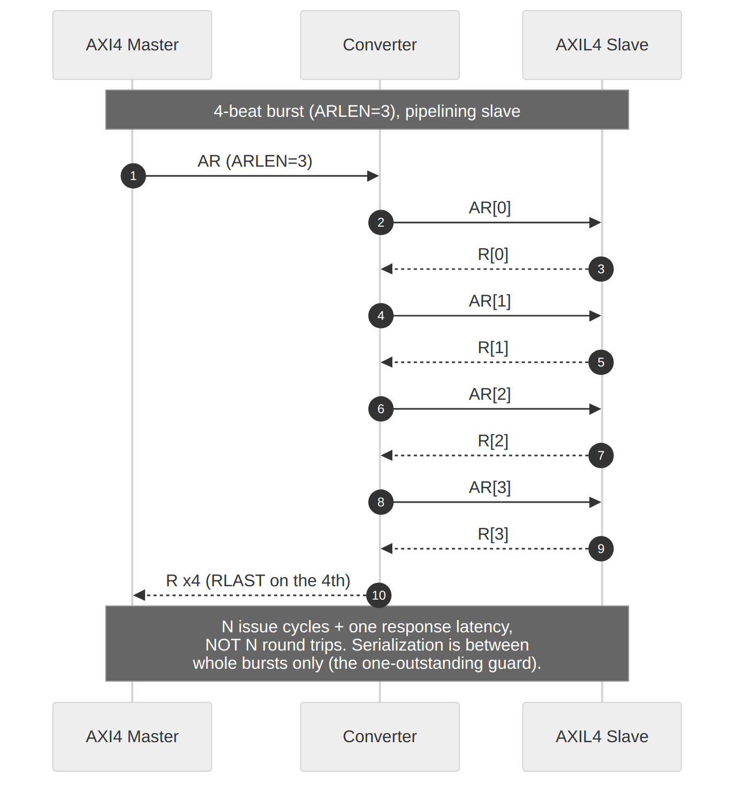

<!-- RTL Design Sherpa Documentation Header -->
<table>
<tr>
<td width="80">
  <a href="https://github.com/sean-galloway/RTLDesignSherpa">
    
  </a>
</td>
<td>
  <strong>RTL Design Sherpa</strong> · <em>Learning Hardware Design Through Practice</em><br>
  <sub>
    <a href="https://github.com/sean-galloway/RTLDesignSherpa">GitHub</a> ·
    <a href="https://github.com/sean-galloway/RTLDesignSherpa/blob/main/docs/DOCUMENTATION_INDEX.md">Documentation Index</a> ·
    <a href="https://github.com/sean-galloway/RTLDesignSherpa/blob/main/LICENSE">MIT License</a>
  </sub>
</td>
</tr>
</table>

---

<!-- End Header -->

# 4.3 Burst Decomposition

Burst handling is where the two converter families diverge: width converters rescale the burst length, protocol converters split the burst into single beats.

## 4.3.1 Width Converter Burst Handling

### Burst Length Adjustment

When converting widths, burst length changes inversely with data width:

```
M_AWLEN = ceil((S_AWLEN + 1) / RATIO) - 1  =  ((S_AWLEN + 1) + RATIO - 1) / RATIO - 1

Example (64-bit to 512-bit, RATIO=8):
  S_AWLEN = 7 (8 beats × 64 bits = 512 bits)
  M_AWLEN = (7 + 1) / 8 - 1 = 0 (1 beat × 512 bits)

  S_AWLEN = 15 (16 beats × 64 bits = 1024 bits)
  M_AWLEN = (15 + 1) / 8 - 1 = 1 (2 beats × 512 bits)
```

### Figure 4.5: Width Burst Conversion



### Non-Aligned Bursts

When the burst length is not a multiple of the ratio:

```
S_AWLEN = 5 (6 beats), RATIO = 8
M_AWLEN = ((5 + 1) + 7) / 8 - 1 = 0  (1 wide beat -- the ceiling term is what prevents the -1 a floor divide gives)

The 6 narrow beats pack into 1 wide beat.
Last 2 positions have WSTRB = 0 (no write).
```

## 4.3.2 Protocol Converter Burst Handling

### AXI4 to AXI4-Lite Decomposition

AXI4-Lite only supports single-beat transactions, so all bursts must be decomposed:

```
AXI4 Burst:
  ARADDR = 0x1000
  ARLEN = 3 (4 beats)
  ARSIZE = 2 (4 bytes)

AXIL4 Sequence:
  Transaction 0: ARADDR = 0x1000
  Transaction 1: ARADDR = 0x1004
  Transaction 2: ARADDR = 0x1008
  Transaction 3: ARADDR = 0x100C
```

### Address Increment Calculation

```systemverilog
// Calculate address increment based on burst type and size
function automatic [ADDR_WIDTH-1:0] next_address(
    input [ADDR_WIDTH-1:0] current_addr,
    input [2:0] size,
    input [1:0] burst,
    input [7:0] len,
    input [7:0] beat
);
    logic [ADDR_WIDTH-1:0] increment;
    logic [ADDR_WIDTH-1:0] wrap_mask;

    increment = 1 << size;

    case (burst)
        2'b00: // FIXED
            return current_addr;  // No increment

        2'b01: // INCR
            return current_addr + increment;

        2'b10: // WRAP
            wrap_mask = ((len + 1) << size) - 1;
            return (current_addr & ~wrap_mask) |
                   ((current_addr + increment) & wrap_mask);

        default:
            return current_addr + increment;
    endcase
endfunction
```

## 4.3.3 Response Aggregation

Several downstream responses collapse into one upstream response, worst
case winning (OKAY < EXOKAY < SLVERR < DECERR by numeric compare). The
subtlety is WHERE the final beat's own response enters the result, and
getting it wrong is not hypothetical: the converters shipped with the
registered-only version below, and every single-beat error was reported
upstream as OKAY.

**Wrong (the shipped bug).** Accumulate in a register and emit the
register:

```systemverilog
always_ff @(posedge aclk or negedge aresetn) begin
    ...
    else if (m_axil_bvalid && m_axil_bready)
        if (m_axil_bresp > r_b_resp_accum)
            r_b_resp_accum <= m_axil_bresp;
end

assign s_axi_bresp = r_b_resp_accum;   // WRONG
```

The accumulator is a non-blocking assign: on the handshake that emits
the response it does not yet contain THAT beat's `bresp`. For a
single-beat transfer the only beat is the final one, so its error is
exactly the one dropped.

**Right (the current RTL).** Fold the live beat combinationally at the
point of emission:

```systemverilog
assign w_b_resp_worst = (m_axil_bresp > r_b_resp_accum) ? m_axil_bresp
                                                        : r_b_resp_accum;
assign s_axi_bresp    = w_b_resp_worst;
```

The read path is the same shape, gated to the final beat:

```systemverilog
assign s_axi_rresp = (r_r_beat_count == r_r_len) ? w_r_resp_worst
                                                 : m_axil_rresp;
```

Both were fixed with tests that inject SLVERR from the downstream slave
and assert it reaches the upstream master -- including the
last-beat-only case, where earlier beats cannot mask the loss. See
`test_error_response` in the axi4_to_axil4 testbenches.

## 4.3.4 Burst Tracking Registers

### Required State

The listing below is the generic PATTERN, not the RTL's register names:
the real modules split this state between separate read and write
converters and count UP (`r_ar_beat_count`/`r_aw_beat_count` against a
stored length) rather than down — grep for those names, not these.

```systemverilog
// Burst tracking registers (generic pattern)
logic [ADDR_WIDTH-1:0] r_base_addr;
logic [ADDR_WIDTH-1:0] r_current_addr;
logic [7:0]            r_original_len;
logic [7:0]            r_remaining_beats;
logic [2:0]            r_size;
logic [1:0]            r_burst;
logic [ID_WIDTH-1:0]   r_id;
logic                  r_is_write;
```

### Initialization

```systemverilog
always_ff @(posedge clk) begin
    if (accept_new_transaction) begin
        r_base_addr <= s_axaddr;
        r_current_addr <= s_axaddr;
        r_original_len <= s_axlen;
        r_remaining_beats <= s_axlen;
        r_size <= s_axsize;
        r_burst <= s_axburst;
        r_id <= s_axid;
        r_is_write <= is_write_transaction;
    end else if (beat_complete) begin
        r_current_addr <= next_address(...);
        r_remaining_beats <= r_remaining_beats - 1;
    end
end
```

## 4.3.5 Timing Impact

### Decomposition Overhead

| Transaction Type | Overhead |
|------------------|----------|
| Single-beat | 0 cycles (passthrough) |
| N-beat burst | none per beat -- requests stream at the downstream accept rate, independent of responses (see 4.2.4) |
| Back-to-back bursts | serialized by the one-outstanding-burst guard |

: Table 4.6: Decomposition Overhead

The old "2 cycles per beat" figure described a request-response lockstep
the RTL does not have; nothing in the address path waits on responses.

### Pipeline Considerations

Decomposed requests are independent of responses (Table 4.6 above):
- ARs issue at the downstream accept rate — nothing in the AR path
  samples `m_axil_rvalid`
- AW/W beats advance on their own handshakes; intermediate Bs are
  absorbed (`m_axil_bready = s_axi_bready || !w_b_all_beats_done`)
  without stalling issuance

Against a pipelining AXIL4 slave, an N-beat burst costs N issue cycles
plus one response latency — not N round trips. The only serialization
the converter imposes is between whole bursts (the one-outstanding
guard).

---

**Next:** [Chapter 5: Verification](../ch05_verification/01_test_strategy.md)
