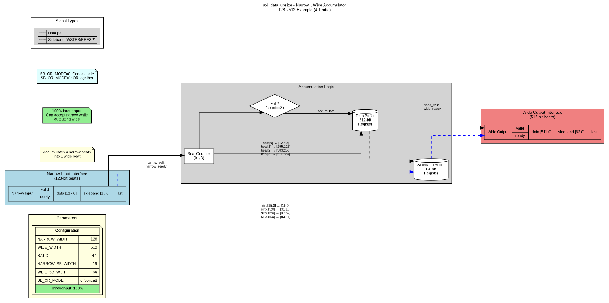
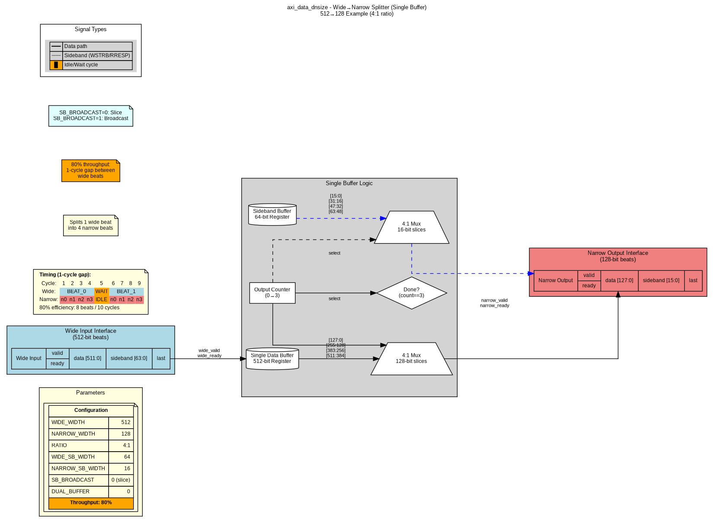
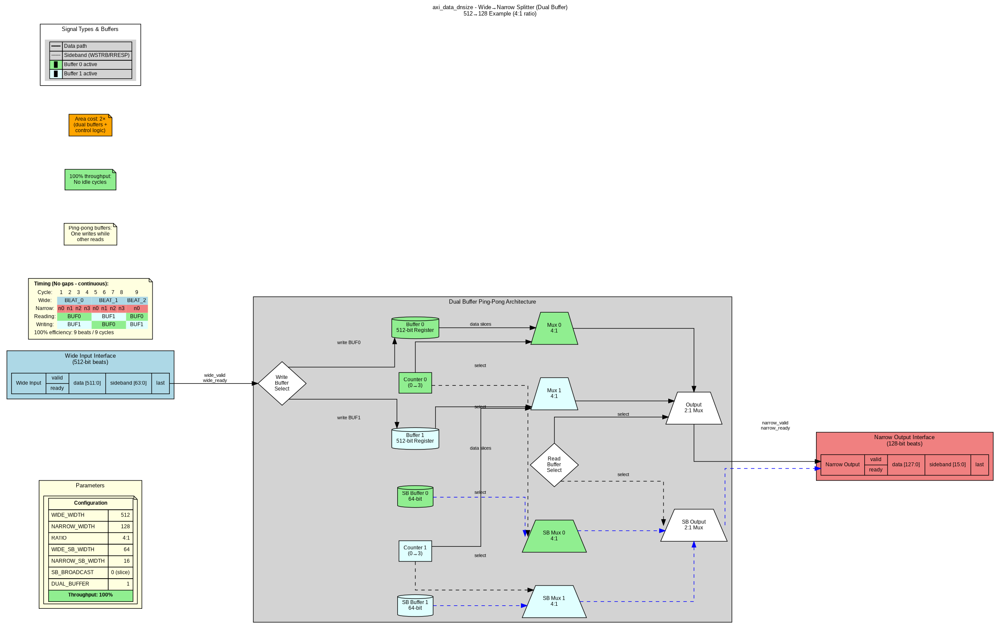
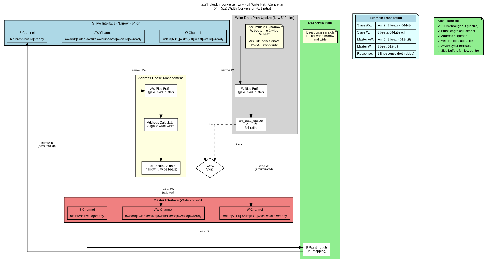
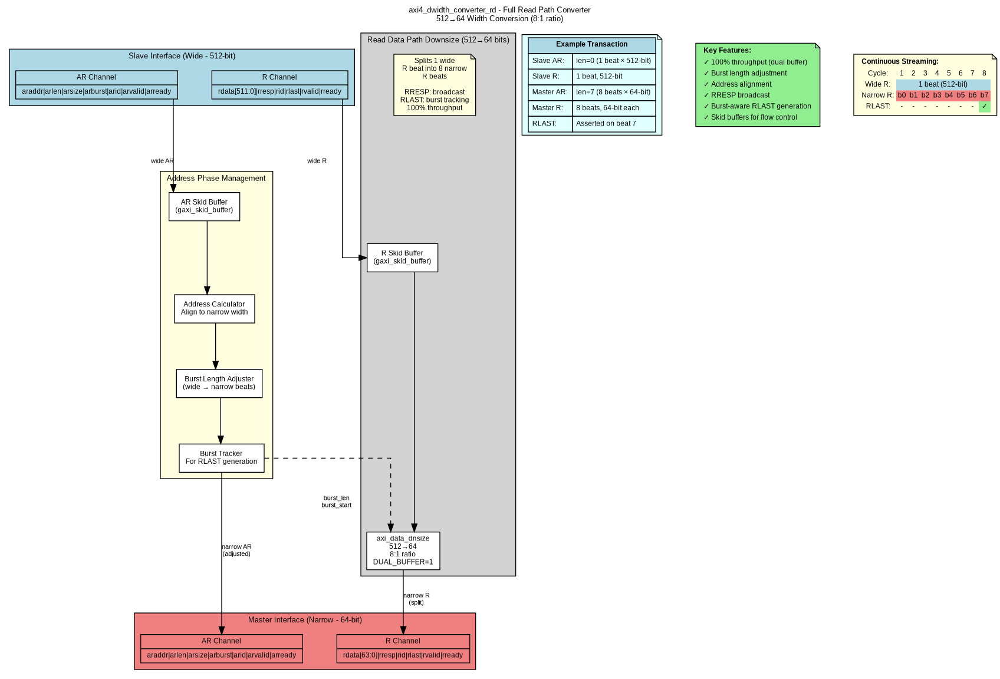

# Chapter 2: Data Width Converters - Overview

## Introduction

Data width converters enable communication between components with mismatched data bus widths, a common challenge in modern SoC designs where different IP blocks operate at different data widths.

## Module Hierarchy

```
Data Width Converters
├── Generic Building Blocks
│   ├── axi_data_upsize.sv      - Narrow→Wide accumulator
│   └── axi_data_dnsize.sv      - Wide→Narrow splitter
│
└── Full AXI4 Converters
    ├── axi4_dwidth_converter_wr.sv - Write path (AW + W + B)
    └── axi4_dwidth_converter_rd.sv - Read path (AR + R)
```

## Generic Building Blocks

### axi_data_upsize - Narrow→Wide Accumulator

**Purpose:** Accumulate N narrow beats into 1 wide beat

**Key Features:**
- 100% throughput (single buffer sufficient)
- Configurable sideband modes (concatenate or OR)
- Supports any integer width ratio
- Minimal area overhead

**Block Diagram:**



**Documentation:** [02_axi_data_upsize.md](02_axi_data_upsize.md)

---

### axi_data_dnsize - Wide→Narrow Splitter

**Purpose:** Split 1 wide beat into N narrow beats

**Key Features:**
- Two modes: Single buffer (80%) or Dual buffer (100%) throughput
- Configurable sideband modes (slice or broadcast)
- Optional burst tracking for LAST generation
- Trade-off: throughput vs area

**Block Diagrams:**


*Single Buffer Mode - 80% throughput, 1× area*


*Dual Buffer Mode - 100% throughput, 2× area*

**Documentation:** [03_axi_data_dnsize.md](03_axi_data_dnsize.md) | [04_dual_buffer_mode.md](04_dual_buffer_mode.md)

---

## Full AXI4 Converters

### axi4_dwidth_converter_wr - Write Path Converter

**Purpose:** Complete write path conversion with AW, W, and B channels

**Features:**
- Address phase management
- Burst length adjustment
- Skid buffers for flow control
- Integrates axi_data_upsize for data conversion

**Block Diagram:**



**Documentation:** [05_axi4_dwidth_converter_wr.md](05_axi4_dwidth_converter_wr.md)

---

### axi4_dwidth_converter_rd - Read Path Converter

**Purpose:** Complete read path conversion with AR and R channels

**Features:**
- Address phase management
- Burst length adjustment
- Burst-aware RLAST generation
- Integrates axi_data_dnsize for data conversion

**Block Diagram:**



**Documentation:** [06_axi4_dwidth_converter_rd.md](06_axi4_dwidth_converter_rd.md)

---

## Throughput Comparison

| Module | Mode | Throughput | Area | When to Use |
|--------|------|------------|------|-------------|
| **axi_data_upsize** | Single buffer | 100% | 1× | All narrow→wide conversions |
| **axi_data_dnsize** | Single buffer | 80% | 1× | Area-constrained designs |
| **axi_data_dnsize** | Dual buffer | 100% | 2× | High-bandwidth requirements |

**Recommendation:**
- Upsize: Always use single buffer (100% throughput at minimal cost)
- Downsize: Choose based on system requirements:
  - Single buffer for area-constrained or non-continuous traffic
  - Dual buffer for high-performance DMA or continuous streaming

---

## Common Configuration Examples

### Example 1: 64→512 bit (Write Path)
```systemverilog
axi_data_upsize #(
    .NARROW_WIDTH(64),
    .WIDE_WIDTH(512),
    .NARROW_SB_WIDTH(8),   // WSTRB
    .WIDE_SB_WIDTH(64),
    .SB_OR_MODE(0)         // Concatenate
) u_upsize (...);
```

### Example 2: 512→128 bit (Read Path, High Performance)
```systemverilog
axi_data_dnsize #(
    .WIDE_WIDTH(512),
    .NARROW_WIDTH(128),
    .WIDE_SB_WIDTH(2),     // RRESP
    .NARROW_SB_WIDTH(2),
    .SB_BROADCAST(1),      // Broadcast
    .DUAL_BUFFER(1)        // 100% throughput
) u_dnsize (...);
```

---

**Next Sections:**
- [02_axi_data_upsize.md](02_axi_data_upsize.md) - Detailed upsize module documentation
- [03_axi_data_dnsize.md](03_axi_data_dnsize.md) - Detailed dnsize module documentation
- [04_dual_buffer_mode.md](04_dual_buffer_mode.md) - Dual-buffer architecture deep dive
