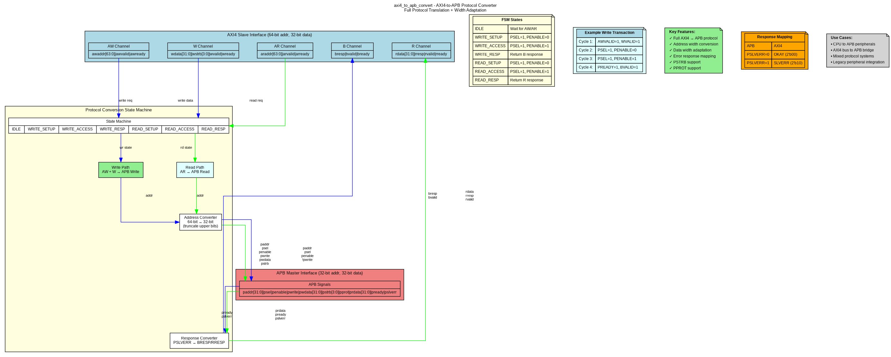
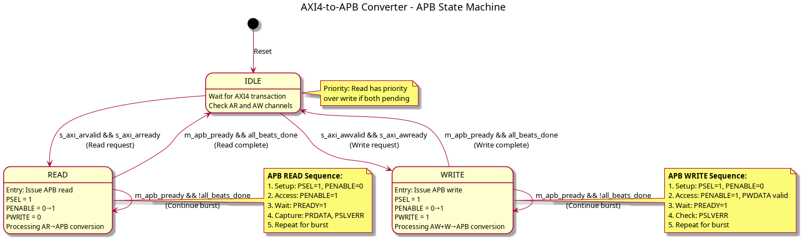
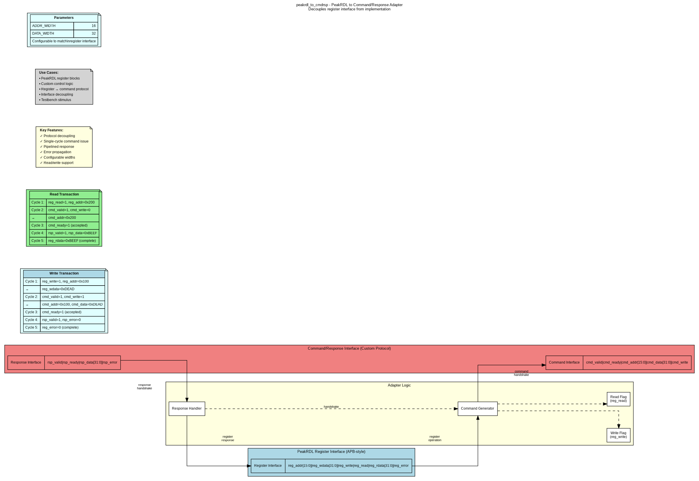

# Chapter 3: Protocol Converters - Overview

## Introduction

Protocol converters enable communication between components using different communication protocols, essential for integrating diverse IP blocks in complex SoC designs.

## Available Converters

### 1. AXI4 to AXI4-Lite (Protocol Downgrade)
- **Modules:** `axi4_to_axil4_rd.sv`, `axi4_to_axil4_wr.sv`, `axi4_to_axil4.sv`
- **Purpose:** Burst decomposition from full AXI4 to simplified AXI4-Lite
- **Features:** Multi-beat burst splitting, response aggregation, zero-cycle single-beat passthrough
- **Test Status:** ✅ 28/28 tests passing

### 2. AXI4-Lite to AXI4 (Protocol Upgrade)
- **Modules:** `axil4_to_axi4_rd.sv`, `axil4_to_axi4_wr.sv`, `axil4_to_axi4.sv`
- **Purpose:** Add AXI4 burst signals with default values
- **Features:** Zero-overhead combinational passthrough, configurable default IDs
- **Test Status:** ✅ 14/14 tests passing

### 3. AXI4-to-APB Bridge
- **Module:** `axi4_to_apb_convert.sv`
- **Purpose:** Full protocol translation from AXI4 to APB
- **Features:** Address width adaptation, state machine control, error mapping

### 4. PeakRDL Adapter
- **Module:** `peakrdl_to_cmdrsp.sv`
- **Purpose:** Register interface to command/response protocol
- **Features:** Protocol decoupling, single-cycle commands, pipelined responses

### 5. UART to AXI4-Lite Bridge
- **Module:** `uart_axil_bridge.sv` (plus `uart_rx.sv`, `uart_tx.sv`)
- **Purpose:** ASCII command-line control of AXI4-Lite peripherals via UART
- **Features:** Human-readable commands, 115200 baud default, timing isolation
- **Documentation:** See `rtl/uart_to_axil4/README.md`

---

## AXI4 ↔ AXI4-Lite Converters

### Overview

Bidirectional protocol conversion between full AXI4 and simplified AXI4-Lite protocols.

**Key Features:**
- Burst decomposition (AXI4→AXIL4): Multi-beat → multiple single-beat
- Protocol upgrade (AXIL4→AXI4): Add default burst signals
- Independent read/write paths
- Data width must match (no width conversion)
- Production ready with comprehensive test coverage

### AXI4 → AXI4-Lite (Downgrade)

Converts full AXI4 with burst support to AXI4-Lite single-beat transactions.

**Challenges:**
- Decomposing multi-beat bursts into sequential single beats
- Synchronizing AW and W channels (write path)
- Aggregating responses across burst
- Maintaining ID through burst decomposition

**Block Diagram:**

```
AXI4 Master                                    AXI4-Lite Slave
(CPU/DMA)                                      (Peripherals)
   |                                                |
   | ARLEN=3 (4-beat burst)                        |
   | ARADDR=0x1000                                 |
   +--[axi4_to_axil4_rd]-->                        |
                           AR: 0x1000 -------->    |
                           <------ R: data0        |
                           AR: 0x1004 -------->    |
                           <------ R: data1        |
                           AR: 0x1008 -------->    |
                           <------ R: data2        |
                           AR: 0x100C -------->    |
   <-- R: data0,1,2,3      <------ R: data3        |
       RLAST=1                                     |
```

**Performance:**
- Single-beat: 0 cycles (passthrough)
- Multi-beat: 2 × N cycles (N = burst length)
- Throughput: 100% (single) / ~50% (burst)

### AXI4-Lite → AXI4 (Upgrade)

Adds AXI4 burst signals with default values for seamless AXIL4 slave integration.

**Features:**
- Combinational logic only (no FSM)
- Zero-cycle overhead
- Configurable default transaction IDs
- All transactions marked as single-beat (LEN=0)

**Block Diagram:**

```
AXI4-Lite Slave                                AXI4 Master
(Peripheral)                                   (Interconnect)
   |                                                |
   | Simple interface (addr, data, prot)           |
   +--[axil4_to_axi4]----------------------------> |
                                     ARADDR -----> |
                                     ARPROT -----> |
                                     ARLEN=0 -----> | (default)
                                     ARSIZE=2 ----> | (32-bit)
                                     ARBURST=INCR-> | (default)
                                     ARID=0 -------> | (default)
```

**Performance:**
- Latency: 0 cycles (combinational)
- Throughput: 100%
- Area: ~110 LUTs (combinational only)

### Use Cases

**AXI4 → AXIL4:**
1. CPU with AXI4 burst master → simple AXIL4 peripherals
2. DMA controller → memory-mapped registers
3. High-performance masters → low-complexity slaves

**AXIL4 → AXI4:**
1. Legacy AXIL4 IP → new AXI4 system
2. Simplified peripheral design → full AXI4 fabric
3. Register blocks → burst-capable interconnect

### Documentation

- [04_axi4_to_axil4.md](04_axi4_to_axil4.md) - Detailed AXI4→AXIL4 specification
- [05_axil4_to_axi4.md](05_axil4_to_axi4.md) - Detailed AXIL4→AXI4 specification

---

## AXI4-to-APB Bridge

### Overview

Converts AXI4 master transactions (from CPU, DMA) to APB peripheral accesses.

**Key Challenges:**
- Protocol differences (5-channel AXI4 vs 2-phase APB)
- Address width mismatch (64-bit AXI4 vs 32-bit APB)
- Burst support (AXI4 bursts → sequential APB transactions)
- Error response mapping (PSLVERR → BRESP/RRESP)

### Block Diagram



### State Machine

The converter uses a state machine to manage protocol translation:



**States:**
- **IDLE** - Wait for AXI4 transaction
- **READ** - Process AXI4 read → APB read
- **WRITE** - Process AXI4 write → APB write

### Use Cases

1. **CPU to APB Peripherals** - Main processor accessing GPIO, UART, SPI
2. **DMA to Configuration Registers** - DMA controller configuring peripherals
3. **Mixed Protocol Systems** - Integrating AXI4 fabric with legacy APB devices

### Documentation

See [02_axi4_to_apb.md](02_axi4_to_apb.md) for detailed specification.

---

## PeakRDL Adapter

### Overview

Converts PeakRDL-generated register interface to a custom command/response protocol, enabling protocol decoupling and flexible register implementations.

**Key Features:**
- APB-style register interface (input)
- Command/response handshake (output)
- Configurable address and data widths
- Single-cycle command issue

### Block Diagram



### Interface Types

**Register Interface (APB-style):**
- `reg_addr[ADDR_WIDTH-1:0]` - Register address
- `reg_wdata[DATA_WIDTH-1:0]` - Write data
- `reg_write` - Write enable
- `reg_read` - Read enable
- `reg_rdata[DATA_WIDTH-1:0]` - Read data
- `reg_error` - Error flag

**Command/Response Protocol:**
- Command: valid/ready handshake with addr, data, write flag
- Response: valid/ready handshake with data, error flag

### Use Cases

1. **PeakRDL Register Blocks** - Decoupling register interface from implementation
2. **Custom Control Logic** - Flexible register access mechanism
3. **Testbench Stimulus** - Command-driven register access in verification

### Documentation

See [03_peakrdl_adapter.md](03_peakrdl_adapter.md) for detailed specification.

---

## Comparison

| Feature | AXI4→AXIL4 | AXIL4→AXI4 | AXI4→APB | PeakRDL Adapter |
|---------|-----------|-----------|----------|-----------------|
| **Direction** | Protocol downgrade | Protocol upgrade | Protocol bridge | Interface adapter |
| **Input Protocol** | AXI4 (5 ch, bursts) | AXIL4 (5 ch, single) | AXI4 (5 ch, bursts) | APB-style register |
| **Output Protocol** | AXIL4 (5 ch, single) | AXI4 (5 ch, bursts) | APB (2 phases) | Command/response |
| **Complexity** | Medium (FSM, decomposition) | Very Low (combinational) | High (FSM, burst, APB) | Low (pass-through) |
| **Latency** | 0 (single) / 2×N (burst) | 0 cycles | 3-5 cycles per txn | 1 cycle |
| **Throughput** | 100% (single) / 50% (burst) | 100% | Sequential | 100% |
| **Area** | ~450 LUTs + FFs | ~110 LUTs | High (FSM + state) | Low |
| **Use Case** | Burst master → simple slave | Simple slave → full fabric | AXI4 → APB peripherals | Register decoupling |
| **Test Status** | ✅ 28/28 passing | ✅ 14/14 passing | In development | Production |

---

## Design Considerations

### When to Use Protocol Converters

**Use AXI4→AXIL4 when:**
- CPU/DMA with burst support needs to access simple AXIL4 peripherals
- Want to simplify peripheral design (no burst handling)
- Need automatic burst decomposition
- Data widths match between master and slave

**Use AXIL4→AXI4 when:**
- Legacy AXIL4 IP needs to connect to AXI4 fabric
- Designing simple peripheral for AXI4 system
- Want zero-overhead protocol upgrade
- Don't need burst capability

**Use AXI4-to-APB when:**
- Integrating AXI4 masters with APB peripherals
- Building CPU-to-peripheral bridges
- System has mixed protocol requirements

**Use PeakRDL adapter when:**
- Decoupling register interface from implementation
- Need flexible register access protocol
- Building custom control/configuration logic

### Integration Guidelines

1. **Address Map Planning** - Ensure non-overlapping regions
2. **Error Handling** - Map error responses appropriately
3. **Performance Analysis** - Consider latency impact
4. **Testing Strategy** - Verify protocol compliance

---

**Next Sections:**
- [02_axi4_to_apb.md](02_axi4_to_apb.md) - Detailed AXI4-to-APB specification
- [03_peakrdl_adapter.md](03_peakrdl_adapter.md) - Detailed PeakRDL adapter specification
- [04_axi4_to_axil4.md](04_axi4_to_axil4.md) - Detailed AXI4→AXIL4 specification
- [05_axil4_to_axi4.md](05_axil4_to_axi4.md) - Detailed AXIL4→AXI4 specification
