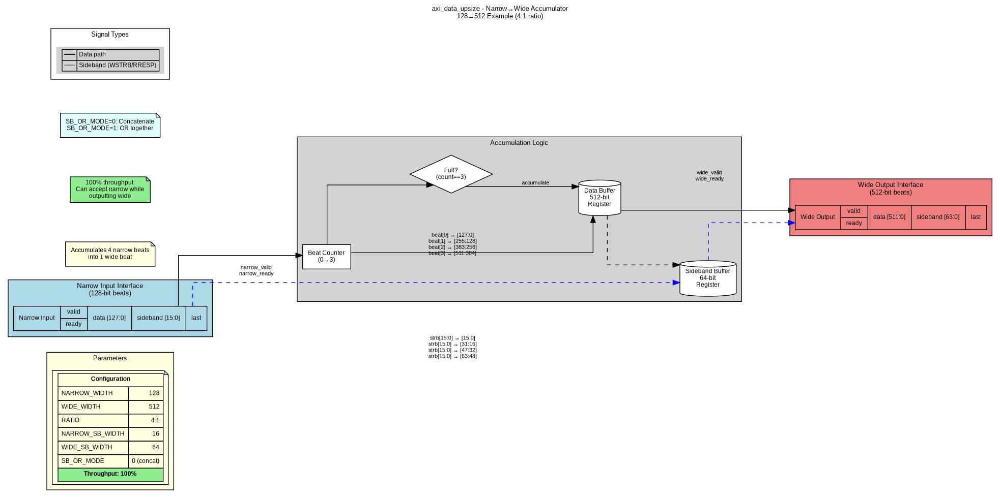
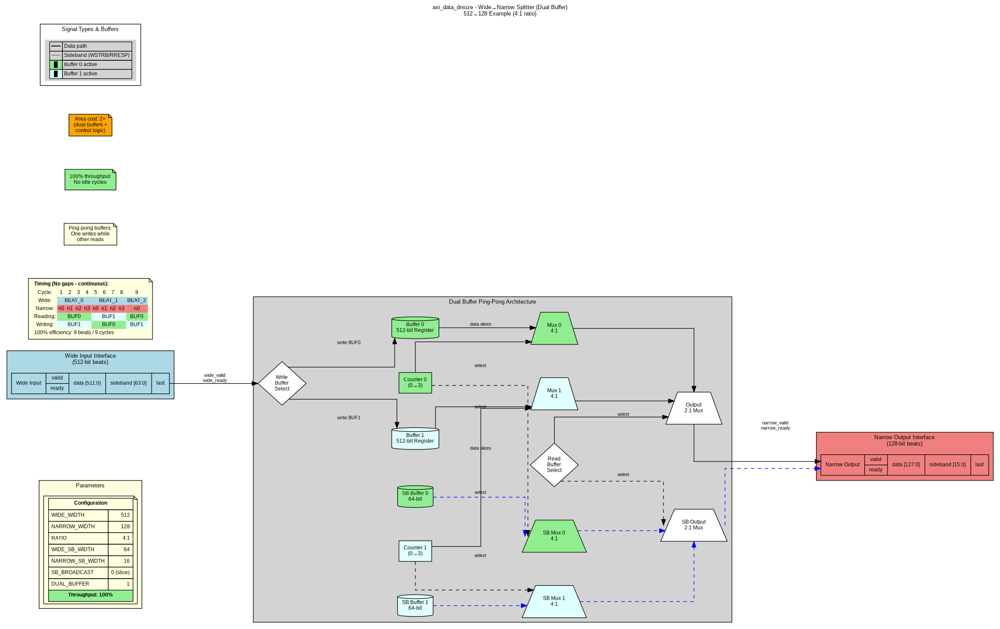
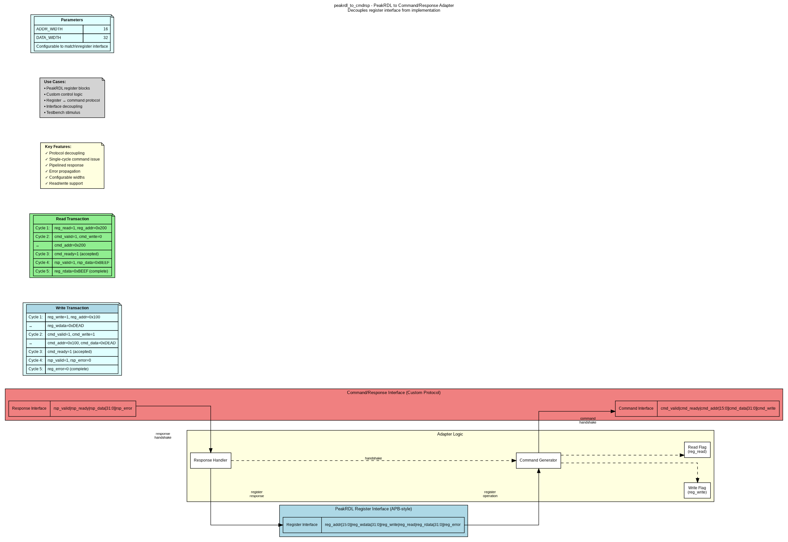
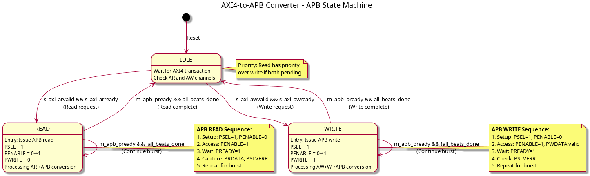

# Converters Component Specification

**Version:** 1.2
**Status:** Production Ready
**Last Updated:** 2025-10-26

---

## Document Overview

This specification provides comprehensive documentation for the Converters component, which includes data width conversion and protocol conversion modules for seamless system integration.

**Document Structure:**
- **Chapter 1:** Overview and Architecture
- **Chapter 2:** Data Width Converters
- **Chapter 3:** Protocol Converters
- **Chapter 4:** Usage Examples and Integration

---

## Quick Navigation

### Chapter 1: Overview
- [01_introduction.md](ch01_overview/01_introduction.md) - Component overview and key features
- [02_architecture.md](ch01_overview/02_architecture.md) - System architecture and module hierarchy
- [03_design_philosophy.md](ch01_overview/03_design_philosophy.md) - Design decisions and rationale

### Chapter 2: Data Width Converters
- [01_overview.md](ch02_data_width_converters/01_overview.md) - Data width conversion overview
- [02_axi_data_upsize.md](ch02_data_width_converters/02_axi_data_upsize.md) - Narrow→Wide accumulator
- [03_axi_data_dnsize.md](ch02_data_width_converters/03_axi_data_dnsize.md) - Wide→Narrow splitter
- [04_dual_buffer_mode.md](ch02_data_width_converters/04_dual_buffer_mode.md) - High-performance dual-buffer mode
- [05_axi4_dwidth_converter_wr.md](ch02_data_width_converters/05_axi4_dwidth_converter_wr.md) - Full write path converter
- [06_axi4_dwidth_converter_rd.md](ch02_data_width_converters/06_axi4_dwidth_converter_rd.md) - Full read path converter

### Chapter 3: Protocol Converters
- [01_overview.md](ch03_protocol_converters/01_overview.md) - Protocol conversion overview
- [02_axi4_to_apb.md](ch03_protocol_converters/02_axi4_to_apb.md) - AXI4-to-APB bridge
- [03_peakrdl_adapter.md](ch03_protocol_converters/03_peakrdl_adapter.md) - PeakRDL adapter

### Chapter 4: Usage Examples
- [01_configuration_guide.md](ch04_usage_examples/01_configuration_guide.md) - Parameter configuration guide
- [02_common_scenarios.md](ch04_usage_examples/02_common_scenarios.md) - Common use case examples
- [03_integration_patterns.md](ch04_usage_examples/03_integration_patterns.md) - System integration patterns

---

## Component Summary

### Data Width Converters

**Generic Building Blocks:**
- **axi_data_upsize** - Accumulates N narrow beats into 1 wide beat (100% throughput)
- **axi_data_dnsize** - Splits 1 wide beat into N narrow beats (80% or 100% throughput)

**Full AXI4 Converters:**
- **axi4_dwidth_converter_wr** - Complete write path (AW + W + B channels)
- **axi4_dwidth_converter_rd** - Complete read path (AR + R channels)

**Block Diagrams:**

*Figure 1: axi_data_upsize - Narrow-to-Wide Accumulator*

*Figure 2: axi_data_dnsize - Wide-to-Narrow Splitter (Single Buffer, 80% throughput)*

*Figure 3: axi_data_dnsize - Wide-to-Narrow Splitter (Dual Buffer, 100% throughput)*

### Protocol Converters

**Available Converters:**
- **axi4_to_apb_convert** - Full AXI4-to-APB protocol bridge
- **axi4_to_apb_shim** - Simplified AXI4-to-APB wrapper
- **peakrdl_to_cmdrsp** - PeakRDL register to command/response adapter

**Block Diagrams:**

*Figure 4: axi4_to_apb_convert - Protocol Conversion*

*Figure 5: peakrdl_to_cmdrsp - Register Interface Adapter*

**FSM Diagram:**

*Figure 6: AXI4-to-APB State Machine*

---

## Performance Summary

| Module | Configuration | Throughput | Area | Use Case |
|--------|--------------|------------|------|----------|
| **axi_data_upsize** | Single buffer | 100% | 1× | Narrow→Wide (always optimal) |
| **axi_data_dnsize** | Single buffer | 80% | 1× | Wide→Narrow (area-efficient) |
| **axi_data_dnsize** | Dual buffer | 100% | 2× | Wide→Narrow (high-performance) |
| **axi4_dwidth_converter_wr** | With upsize | 100% | Standard | Full write path |
| **axi4_dwidth_converter_rd** | With dual dnsize | 100% | +100% | Full read path |
| **axi4_to_apb** | Protocol FSM | Sequential | Small | Protocol conversion |

---

## Key Features

### Data Width Conversion
- Flexible width ratios (any integer multiple: 2:1, 4:1, 8:1, 16:1, etc.)
- Configurable sideband handling (concatenate or broadcast)
- Optional burst tracking for LAST signal generation
- Dual-buffer mode for 100% throughput (downsize only)
- Generic building blocks for custom converters

### Protocol Conversion
- Full AXI4-to-APB protocol translation
- Address width adaptation (64-bit→32-bit)
- Data width adaptation (configurable)
- Error response mapping (PSLVERR→BRESP/RRESP)
- PeakRDL register interface decoupling

---

## Documentation Assets

### Graphviz Block Diagrams
Located in `assets/graphviz/`:
- axi_data_upsize.gv/.png
- axi_data_dnsize_single.gv/.png
- axi_data_dnsize_dual.gv/.png
- axi4_dwidth_converter_wr.gv/.png
- axi4_dwidth_converter_rd.gv/.png
- axi4_to_apb.gv/.png
- peakrdl_adapter.gv/.png

See [assets/graphviz/README.md](assets/graphviz/README.md) for regeneration instructions.

### PlantUML FSM Diagrams
Located in `assets/puml/`:
- axi4_to_apb_fsm.puml/.png

See [assets/puml/README.md](assets/puml/README.md) for regeneration instructions.

---

## Related Documentation

**Component-Level:**
- [../../README.md](../../README.md) - Component quick start guide
- [../../DUAL_BUFFER_IMPLEMENTATION.md](../../DUAL_BUFFER_IMPLEMENTATION.md) - Dual-buffer feature deep dive
- [../../ANALYSIS_APB_CONVERTER.md](../../ANALYSIS_APB_CONVERTER.md) - APB converter analysis

**Repository-Level:**
- RTL source: `projects/components/converters/rtl/`
- Test suite: `projects/components/converters/dv/tests/`
- Usage examples: Chapter 4 of this specification

---

## Version History

| Version | Date | Description |
|---------|------|-------------|
| 1.2 | 2025-10-26 | Added comprehensive specification with block diagrams |
| 1.1 | 2025-10-25 | Added dual-buffer mode for axi_data_dnsize |
| 1.0 | 2025-10-24 | Initial release with generic and full converters |

---

## Document Conventions

**Notation:**
- `parameter_name` - RTL parameters and signals
- **Bold** - Important concepts and module names
- *Italic* - Figure captions and references

**Diagrams:**
- Light blue - Input interfaces
- Light coral - Output interfaces
- Light yellow - Control logic
- Light gray - Data path elements
- Arrows - Data/control flow

---

**Author:** RTL Design Sherpa Project
**Maintained By:** Converters Component Team
**Last Review:** 2025-10-26

