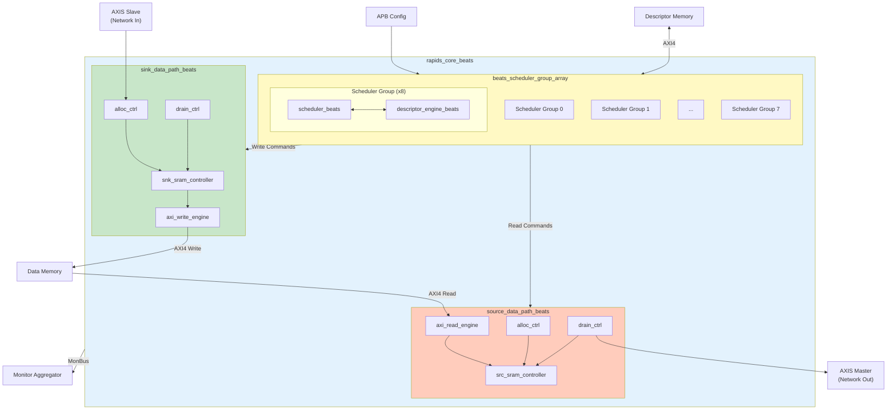
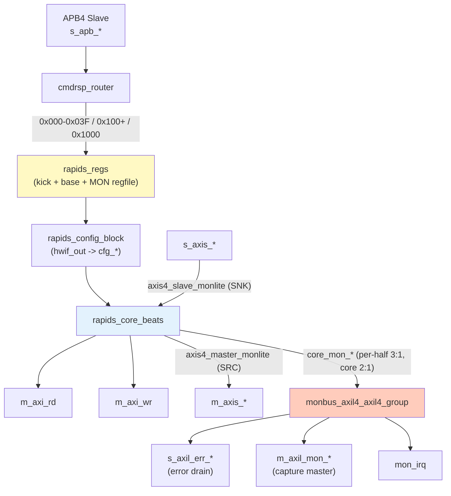

<!-- RTL Design Sherpa Documentation Header -->
<table>
<tr>
<td width="80">
  <a href="https://github.com/sean-galloway/RTLDesignSherpa">
    
  </a>
</td>
<td>
  <strong>RTL Design Sherpa</strong> · <em>Learning Hardware Design Through Practice</em><br>
  <sub>
    <a href="https://github.com/sean-galloway/RTLDesignSherpa">GitHub</a> ·
    <a href="https://github.com/sean-galloway/RTLDesignSherpa/blob/main/docs/DOCUMENTATION_INDEX.md">Documentation Index</a> ·
    <a href="https://github.com/sean-galloway/RTLDesignSherpa/blob/main/LICENSE">MIT License</a>
  </sub>
</td>
</tr>
</table>

---

<!-- End Header -->

# Block Diagram

## Top-Level Architecture



## Top-Level Integration (rapids_beats_top)

`rapids_core_beats` is wrapped by `rapids_beats_top`, which adds the software
register interface, configuration mapping, and monitoring infrastructure. A
single APB slave feeds a command/response router into the `rapids_regs`
register block (base config at 0x100-0x3FF, monitor regfile at 0x1000); the
per-channel kick registers live at 0x000-0x03F inside that same block.
`rapids_config_block` translates the register `hwif_out` into the core/monitor
`cfg_*` signals.

When `USE_AXI_MONITORS = 1`, each half carries two monitor-lites:
`axi4_master_rd_monlite` on its descriptor read master and an AXIS monitor-lite
on its network port (`axis4_slave_monlite` on the sink's `s_axis_*`,
`axis4_master_monlite` on the source's `m_axis_*`; rapids TASK-015). Their
packets join the scheduler groups' events in the half's 3:1 `monbus_arbiter`,
the core merges the two halves, and the top delivers the stream through a
`monbus_axil4_axil4_group` to an AXI-Lite error-drain slave, an AXI-Lite
capture master, and a `mon_irq` interrupt. The data masters `m_axi_rd` and
`m_axi_wr` carry no monitors.



## Component Summary

### Scheduler Group Array

The scheduler group array manages 8 independent channels:

| Component | Instance Count | Purpose |
|-----------|----------------|---------|
| `scheduler_beats` | 8 | Transfer coordination per channel |
| `descriptor_engine_beats` | 8 | Descriptor fetch and parse |
| Descriptor AXI Arbiter | 1 | Shared AXI4 for descriptor fetch |

: Scheduler Array Components

### Sink Data Path

Network-to-memory data flow:

| Component | Purpose |
|-----------|---------|
| `snk_sram_controller_beats` | Multi-channel SRAM management |
| `axi_write_engine_beats` | AXI4 burst write generation |
| `alloc_ctrl_beats` | Space allocation tracking |
| `drain_ctrl_beats` | Data availability tracking |

: Sink Path Components

### Source Data Path

Memory-to-network data flow:

| Component | Purpose |
|-----------|---------|
| `axi_read_engine_beats` | AXI4 burst read generation |
| `src_sram_controller_beats` | Multi-channel SRAM management |
| `alloc_ctrl_beats` | Space allocation tracking |
| `drain_ctrl_beats` | Data availability tracking |

: Source Path Components

## Hierarchy

```
rapids_core_beats
├── monbus_arbiter
├── rapids_src_beats
│   ├── scheduler_group_array_beats
│   │   ├── scheduler_group_beats [0..7]
│   │   │   ├── scheduler_beats
│   │   │   ├── descriptor_engine_beats
│   │   │   ├── ctrlrd_engine
│   │   │   └── ctrlwr_engine
│   │   ├── arbiter_round_robin [x3]
│   │   ├── axi4_master_rd_monlite
│   │   └── axi_bus_meter
│   ├── monbus_arbiter (3:1)
│   ├── axis4_master_monlite (source-egress AXIS monitor-lite)
│   └── src_data_path_axis_beats
│       └── src_data_path_beats
│           ├── axi_read_engine_beats
│           └── src_sram_controller_beats
│               └── sram_controller (STREAM)
│                   └── sram_controller_unit [0..7]
│                       ├── stream_alloc_ctrl
│                       ├── gaxi_fifo_sync
│                       ├── stream_drain_ctrl
│                       └── stream_latency_bridge
└── rapids_snk_beats
    ├── scheduler_group_array_beats (same shape)
    ├── monbus_arbiter (3:1)
    ├── axis4_slave_monlite (sink-ingress AXIS monitor-lite)
    └── snk_data_path_axis_beats
        └── snk_data_path_beats
            ├── axi_write_engine_beats
            └── snk_sram_controller_beats
                └── sram_controller (STREAM)
                    └── sram_controller_unit [0..7]
```

## Internal Buses

| Bus | Width | Description |
|-----|-------|-------------|
| Descriptor Bus | 256-bit | Parsed descriptor to scheduler |
| Scheduler Command | Variable | Transfer parameters to data paths |
| SRAM Data | 512-bit | Data to/from SRAM buffers |
| MonBus | 64-bit | Monitor packets (aggregated) |

: Internal Bus Summary
