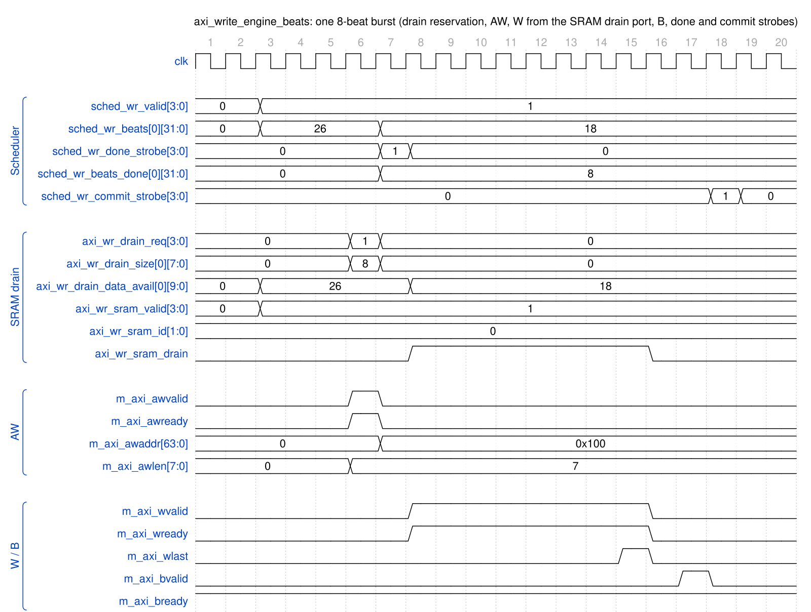

<!-- RTL Design Sherpa Documentation Header -->
<table>
<tr>
<td width="80">
  <a href="https://github.com/sean-galloway/RTLDesignSherpa">
    
  </a>
</td>
<td>
  <strong>RTL Design Sherpa</strong> · <em>Learning Hardware Design Through Practice</em><br>
  <sub>
    <a href="https://github.com/sean-galloway/RTLDesignSherpa">GitHub</a> ·
    <a href="https://github.com/sean-galloway/RTLDesignSherpa/blob/main/docs/DOCUMENTATION_INDEX.md">Documentation Index</a> ·
    <a href="https://github.com/sean-galloway/RTLDesignSherpa/blob/main/LICENSE">MIT License</a>
  </sub>
</td>
</tr>
</table>

---

<!-- End Header -->

# AXI Write Engine Specification

**Module:** `axi_write_engine_beats.sv`
**Location:** `projects/components/dma-ip/rapids/rtl/fub_beats/`
**Status:** Implemented
**Last Updated:** 2026-09-29

---

## Overview

The AXI Write Engine reads data from SRAM and performs burst writes to system memory. It operates as a streaming pipeline and includes write response handling for completion tracking.

### Key Features

- **Streaming Pipeline:** No FSM - pure streaming architecture
- **Multi-Channel Support:** Channel ID in AXI ID field
- **Write Response Tracking:** B channel completion handling
- **Configurable Burst Length:** Up to 256 beats per burst
- **Registered SRAM read:** consumes the SRAM controller's registered `drain_*` stream (the latency bridge lives in STREAM's `sram_controller_unit`, not here)

### Block Diagram

### Figure 2.4.1: AXI Write Engine Block Diagram

```
                        +---------------------------+
    sched_wr_valid   -->|                           |--> m_axi_awid
    sched_wr_addr    -->|                           |--> m_axi_awaddr
    sched_wr_beats   -->|    AXI WRITE ENGINE       |--> m_axi_awlen
    sched_wr_id      -->|                           |--> m_axi_awvalid
                        |    (Streaming Pipeline)   |<-- m_axi_awready
    cfg_xfer_beats   -->|                           |
                        |                           |--> m_axi_wdata
    sched_wr_done    <--|                           |--> m_axi_wstrb
    sched_wr_beats_d <--|                           |--> m_axi_wlast
    sched_wr_error   <--|                           |--> m_axi_wvalid
                        |                           |<-- m_axi_wready
    sram_rd_en       <--|                           |
    sram_rd_addr     <--|                           |<-- m_axi_bid
    sram_rd_data     -->|                           |<-- m_axi_bresp
    sram_rd_id       <--|                           |<-- m_axi_bvalid
                        |                           |--> m_axi_bready
                        +---------------------------+
```

---

## Parameters

```systemverilog
parameter int NUM_CHANNELS = 8;                  // Number of channels
parameter int ADDR_WIDTH = 64;                   // Address bus width
parameter int DATA_WIDTH = 512;                  // Data bus width
parameter int AXI_ID_WIDTH = 8;                  // AXI ID width
parameter int MAX_OUTSTANDING = 8;               // Max outstanding AW transactions
parameter int W_FIFO_DEPTH = 64;                 // Write data FIFO depth
parameter int B_FIFO_DEPTH = 16;                 // Write response FIFO depth
parameter int PIPELINE = 1;                      // Pipeline stages

// Derived
parameter int CHAN_WIDTH = $clog2(NUM_CHANNELS);
```

: Table 2.4.1: AXI Write Engine Parameters

---

## Port List

### Clock and Reset

| Signal | Direction | Width | Description |
|--------|-----------|-------|-------------|
| `clk` | input | 1 | System clock |
| `rst_n` | input | 1 | Active-low reset |

: Table 2.4.2: Clock and Reset

### Scheduler Interface

| Signal | Direction | Width | Description |
|--------|-----------|-------|-------------|
| `sched_wr_valid` | input | NC | Channel requests write |
| `sched_wr_ready` | output | NC | Engine ready for channel |
| `sched_wr_addr` | input | NC x AW | Destination addresses |
| `sched_wr_beats` | input | NC x 32 | Beats remaining to write |
| `sched_wr_burst_len` | input | NC x 8 | Requested burst length |
| `sched_wr_done_strobe` | output | NC | Burst ISSUED on AW handshake (pulsed 1 cycle) |
| `sched_wr_beats_done` | output | NC x 32 | Beats issued in burst (`awlen + 1`) |
| `sched_wr_commit_strobe` | output | NC | Burst COMMITTED on B response (pulsed 1 cycle) |
| `sched_wr_commit_beats` | output | NC x 32 | Beats committed in burst |
| `sched_wr_error` | output | NC | Sticky error flag per channel (bad B response) |

: Table 2.4.3: Scheduler Interface

**Two completion strobes per channel.** The engine reports write progress to the
scheduler at two points, letting the scheduler gate completion on data actually
landing in memory:

- `sched_wr_done_strobe` / `sched_wr_beats_done` pulse when the **AW command
  handshakes** (`m_axi_awvalid && m_axi_awready`); the beat count is taken
  directly from `m_axi_awlen + 1`. This advances the scheduler's destination
  address (ISSUE tracking).
- `sched_wr_commit_strobe` / `sched_wr_commit_beats` pulse when the matching **B
  response** arrives (`m_axi_bvalid && m_axi_bready` for the channel); the beat
  count is recovered from the per-channel B-phase transaction FIFO. This is the
  COMMIT the scheduler uses to declare the transfer complete.

### AXI4 Write Master Interface

| Signal | Direction | Width | Description |
|--------|-----------|-------|-------------|
| `m_axi_awid` | output | IW | Write address ID |
| `m_axi_awaddr` | output | AW | Write address |
| `m_axi_awlen` | output | 8 | Burst length (beats - 1) |
| `m_axi_awsize` | output | 3 | Burst size |
| `m_axi_awburst` | output | 2 | Burst type (INCR) |
| `m_axi_awvalid` | output | 1 | Address valid |
| `m_axi_awready` | input | 1 | Address ready |
| `m_axi_wdata` | output | DW | Write data |
| `m_axi_wstrb` | output | DW/8 | Write strobes |
| `m_axi_wlast` | output | 1 | Last beat |
| `m_axi_wuser` | output | UW | Channel ID for transaction tracking |
| `m_axi_wvalid` | output | 1 | Data valid |
| `m_axi_wready` | input | 1 | Data ready |
| `m_axi_bid` | input | IW | Response ID |
| `m_axi_bresp` | input | 2 | Write response |
| `m_axi_bvalid` | input | 1 | Response valid |
| `m_axi_bready` | output | 1 | Response ready |

: Table 2.4.4: AXI4 Write Master Interface

### SRAM Reservation and Drain Interface

| Signal | Direction | Width | Description |
|--------|-----------|-------|-------------|
| `axi_wr_drain_req` | output | NC | Channel requests to reserve data |
| `axi_wr_drain_size` | output | NC x 8 | Beats to reserve |
| `axi_wr_drain_data_avail` | input | NC x SCW | Data available after reservations |
| `axi_wr_sram_valid` | input | NC | Per-channel valid (registered, for arbitration) |
| `axi_wr_sram_valid_comb` | input | NC | Per-channel valid (combinational, gates `m_axi_wvalid`) |
| `axi_wr_sram_drain` | output | 1 | Drain request (consumer ready) |
| `axi_wr_sram_id` | output | CIW | Channel ID select for drain |
| `axi_wr_sram_data` | input | DW | Data from the selected channel (muxed) |

: Table 2.4.5: SRAM Read Interface

---

## Operation

### Burst Length Cap (rapids BUG-009)

`cfg_axi_wr_xfer_beats` is an AWLEN (0..255), but a burst can never be larger
than the SRAM that stages it: `w_has_data` waits for the whole burst to be in
the buffer, and a burst the buffer cannot hold would wait forever. The engine
therefore clamps the configured value to `XFER_MAX = min(2^(SCW-1) - 1, 254)`
-- the buffer depth `SEG_COUNT_WIDTH` encodes, minus one, and 254 beyond that
so every beat count fits the 8-bit size ports shared with `sram_controller`.
On the Genesys 2 build (128-deep) AWLEN 255 runs as 128-beat bursts.

Before the clamp (2026-09-29), AWLEN 255 was taken literally and the 8-bit
`AWLEN + 1` in the gate wrapped to 0: `w_has_data` passed on an empty buffer,
the AW went out, `drain_ctrl` reserved 0 beats and the W phase pulled 256
beats that were never reserved. The channel's `drain_data_available` then read
0 for good (`CHANNEL_RESET` does not reach `sram_controller`), and every later
run on the channel accepted one buffer of ingress and never issued an AW.

### Write Transaction Phases

AXI writes have three phases that can overlap:

```
Phase 1: AW (Address)    Phase 2: W (Data)    Phase 3: B (Response)
    |                        |                      |
    +-- Issue address        +-- Stream data        +-- Receive response
        before data             from SRAM               track completion
```

### Timing Diagram

### Figure 2.4.2: AXI Write Burst Timing



**Source:** [axi_write_engine_burst.json](../assets/wavedrom/axi_write_engine_burst.json),
captured from `dv/tests/fub_beats/test_axi_write_engine_beats.py` (`single`, 4 ch,
256-bit, `cfg_axi_wr_xfer_beats = 7`, seed 7) with `WAVES=1`.

Reading it: the SRAM model reports 26 beats available for channel 0 and the
scheduler holds `sched_wr_valid`. The arbiter grants the channel, the AW
(`awlen = 7`) is registered and handshakes; in that same cycle
`axi_wr_drain_req` reserves 8 beats (`data_avail` drops to 18 two cycles later,
the controller's reporting latency), and the cycle after, `sched_wr_done_strobe`
reports 8 beats issued so the scheduler advances (`awaddr` for the next AW is
already 0x100). W beats stream from the ID-selected drain port
(`axi_wr_sram_drain` is exactly `wvalid && wready`), `wlast` closes the burst,
and the B response two cycles later raises `sched_wr_commit_strobe`. At
`PIPELINE = 0` the channel's next AW waits for that B.

That wait is the throughput cost of `PIPELINE = 0`: with 8-beat bursts a
channel spends the AW-to-B round trip idle, and on the Genesys 2 the
8-channel sink write path measured 49.9 % engaged utilization at 4096
beats per channel once BUG-005 made the engine honour one-in-flight (the
pre-fix engine had run two by accident and read 100 %). The top and core
therefore default `PIPELINE = 1`, which restores line rate, and since
2026-09-28 so does every module that declares the parameter, this engine
included: `0` is selectable, never the default.

---

## Error Handling

| Error | Detection | Response |
|-------|-----------|----------|
| AXI SLVERR | `m_axi_bresp == 2'b10` | Set `sched_wr_error` |
| AXI DECERR | `m_axi_bresp == 2'b11` | Set `sched_wr_error` |

: Table 2.4.6: Error Handling

---

**Last Updated:** 2026-09-29
