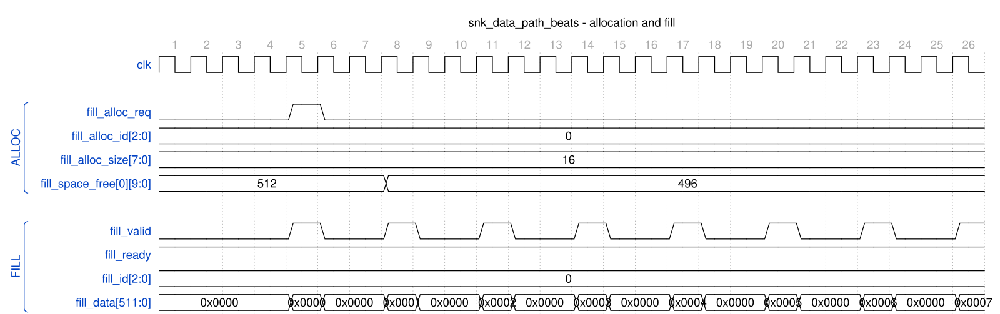
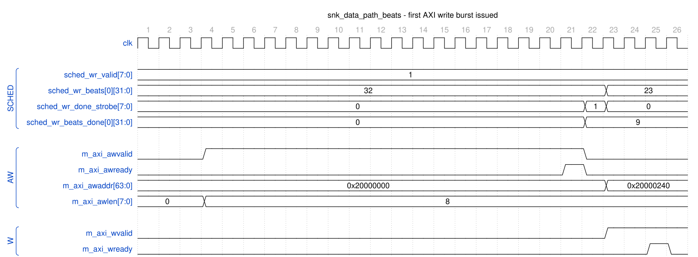
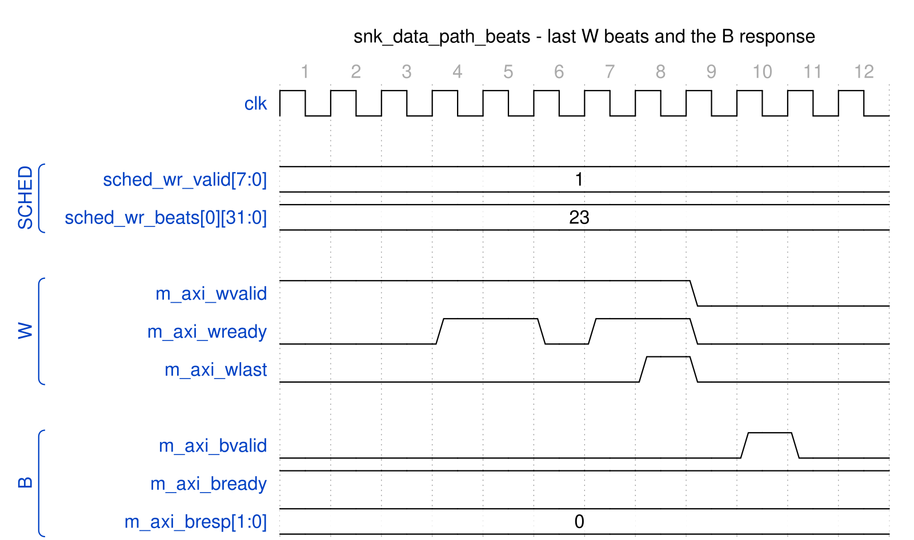

<!-- RTL Design Sherpa Documentation Header -->
<table>
<tr>
<td width="80">
  <a href="https://github.com/sean-galloway/RTLDesignSherpa">
    
  </a>
</td>
<td>
  <strong>RTL Design Sherpa</strong> · <em>Learning Hardware Design Through Practice</em><br>
  <sub>
    <a href="https://github.com/sean-galloway/RTLDesignSherpa">GitHub</a> ·
    <a href="https://github.com/sean-galloway/RTLDesignSherpa/blob/main/docs/DOCUMENTATION_INDEX.md">Documentation Index</a> ·
    <a href="https://github.com/sean-galloway/RTLDesignSherpa/blob/main/LICENSE">MIT License</a>
  </sub>
</td>
</tr>
</table>

---

<!-- End Header -->

# Sink Data Path Specification

**Module:** `snk_data_path_beats.sv`
**Location:** `projects/components/dma-ip/rapids/rtl/macro_beats/`
**Status:** Implemented
**Last Updated:** 2025-01-10

---

## Overview

The Sink Data Path integrates the SRAM controller and AXI write engine for network-to-memory transfers. Data enters through the fill interface, is buffered in SRAM, and is written to system memory via AXI4.

### Key Features

- **8-Channel SRAM Controller:** Per-channel buffering with flow control
- **AXI Write Engine:** Streaming burst writes to system memory
- **Beat-Level Tracking:** Precise flow control at beat granularity
- **Scheduler Integration:** Receives transfer requests from scheduler

### Block Diagram

### Figure 3.3.1: Sink Data Path Block Diagram

```
                        sink_data_path
    +-------------------------------------------------------+
    |                                                       |
    |    Fill Interface (External)                          |
    |         |                                             |
    |         v                                             |
    |  +---------------------------------------------+      |
    |  |         snk_sram_controller                 |      |
    |  |  +-------+  +-------+       +-------+       |      |
    |  |  | unit  |  | unit  |  ...  | unit  |       |      |
    |  |  |  [0]  |  |  [1]  |       |  [7]  |       |      |
    |  |  +-------+  +-------+       +-------+       |      |
    |  |      |          |              |            |      |
    |  |      v          v              v            |      |
    |  |  +-------------------------------------+    |      |
    |  |  |        Channel Arbitration          |    |      |
    |  |  +------------------+------------------+    |      |
    |  +---------------------|----------------------+       |
    |                        |                              |
    |                        v                              |
    |  +---------------------------------------------+      |
    |  |            axi_write_engine                 |      |
    |  |  - Burst generation                         |      |
    |  |  - W channel streaming                      |      |
    |  |  - B channel response tracking              |      |
    |  +---------------------+-----------------------+      |
    |                        |                              |
    +------------------------|------------------------------+
                             v
                     AXI Write Master
                   (to System Memory)
```

**Source:** [03_sink_data_path_block.mmd](../assets/mermaid/03_sink_data_path_block.mmd)

---

## Parameters

```systemverilog
parameter int NUM_CHANNELS = 8;
parameter int ADDR_WIDTH = 64;
parameter int DATA_WIDTH = 512;
parameter int AXI_ID_WIDTH = 8;
parameter int SRAM_DEPTH = 512;
parameter int AW_MAX_OUTSTANDING = 8;
parameter int W_PHASE_FIFO_DEPTH = 64;
parameter int B_PHASE_FIFO_DEPTH = 16;
```

: Table 3.3.1: Sink Data Path Parameters

---

## Data Flow

### Figure 3.3.2: Sink Path Data Flow Sequence

```
1. Fill Request
   - snk_fill_alloc_req = 1
   - snk_fill_alloc_size = N (beats to allocate)
   - snk_fill_alloc_id = channel
        |
        v
2. Space Check (stream_alloc_ctrl inside STREAM's sram_controller)
   - Check snk_fill_space_free[channel] >= N
   - Allocate N beats of space
        |
        v
3. Fill Data Transfer
   - snk_fill_valid = 1
   - snk_fill_data = data beats
   - snk_fill_id = channel
        |
        v
4. SRAM Write
   - Data written to channel's SRAM partition
   - stream_drain_ctrl notified of data availability
        |
        v
5. AXI Write Request
   - Scheduler requests write: sched_wr_valid
   - Address and beat count provided
        |
        v
6. SRAM Read + AXI Write
   - axi_write_engine reads from SRAM
   - Issues AXI bursts to memory
        |
        v
7. Completion
   - B channel response received
   - sched_wr_done_strobe = 1
```

---

## Timing Diagram

### Figure 3.3.3: Sink Path Transfer Timing

Three windows from one transfer: the allocation and fill, the first AXI write burst
being issued, and the end of that burst with its response.

**(a) Allocation and fill**



**(b) First AXI write burst issued**



**(c) Last W beats and the B response**



**Source:** [snk_data_path_fill_alloc.json](../assets/wavedrom/snk_data_path_fill_alloc.json),
[snk_data_path_axi_write_aw.json](../assets/wavedrom/snk_data_path_axi_write_aw.json),
[snk_data_path_axi_write_b.json](../assets/wavedrom/snk_data_path_axi_write_b.json),
captured inside `rapids_core_beats.u_snk.u_sink_data_path` from
`dv/tests/top_beats/test_rapids_core_beats.py` (sink path, channel 0, 32 beats,
512-bit data, `cfg_alloc_size = 16`, `TEST_LEVEL=full`) with `WAVES=1`.

Reading (a): the first beat for channel 0 arrives with no space allocated, so the
path raises `fill_alloc_req` for 16 beats; `fill_space_free[0]` drops 512 to 496 three
cycles later and the beat is accepted on the same cycle as the request. The remaining
beats are accepted one per handshake (`fill_ready` stays high; the gaps are the AXIS
producer's pacing). Reading (b): once the descriptor arrives the scheduler holds
`sched_wr_valid` with 32 beats remaining; the engine issues the AW (`awlen = 8`,
9 beats) and, the cycle after the AW handshake, pulses `sched_wr_done_strobe` with
`beats_done = 9`, on which the scheduler advances to 23 remaining and the next AW
address is already 0x20000240. Reading (c): W beats drain at the memory's pace
(`wready` from the AXI slave BFM), `wlast` marks the ninth beat, and the B response
arrives two cycles later with `bresp = OKAY`. The done strobe is reported at issue,
not at B; completion of the whole transfer is what `snk_system_idle` reflects.

---

## Interface Summary

### Fill Interface (Input)

| Signal | Direction | Description |
|--------|-----------|-------------|
| `fill_alloc_req` | input | Allocation request (single, ID-selected) |
| `fill_alloc_size` | input | Beats to allocate |
| `fill_alloc_id` | input | Transaction ID selects the channel |
| `fill_space_free` | output | Available space per channel |
| `fill_valid` | input | Fill data valid |
| `fill_ready` | output | Ready for fill data |
| `fill_id` | input | Transaction ID selects the channel |
| `fill_data` | input | Fill data |

: Table 3.3.2: Fill Interface

### Scheduler Interface

| Signal | Direction | Description |
|--------|-----------|-------------|
| `sched_wr_valid` | input | Channel requests write |
| `sched_wr_ready` | output | Path ready for channel |
| `sched_wr_addr` | input | Destination addresses |
| `sched_wr_beats` | input | Beats remaining to write |
| `sched_wr_burst_len` | input | Requested burst length |
| `sched_wr_done_strobe` | output | Burst ISSUED on AW handshake |
| `sched_wr_beats_done` | output | Beats issued in burst |
| `sched_wr_commit_strobe` | output | Burst COMMITTED on B response |
| `sched_wr_commit_beats` | output | Beats committed in burst |
| `sched_wr_error` | output | Sticky error flag per channel |

: Table 3.3.3: Scheduler Interface

---

**Last Updated:** 2025-01-10
