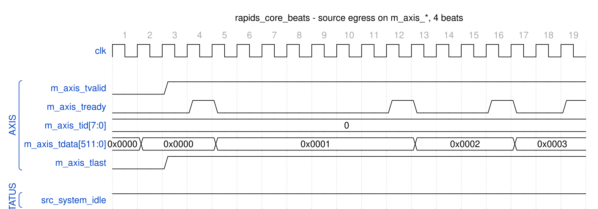

<!-- RTL Design Sherpa Documentation Header -->
<table>
<tr>
<td width="80">
  <a href="https://github.com/sean-galloway/RTLDesignSherpa">
    
  </a>
</td>
<td>
  <strong>RTL Design Sherpa</strong> · <em>Learning Hardware Design Through Practice</em><br>
  <sub>
    <a href="https://github.com/sean-galloway/RTLDesignSherpa">GitHub</a> ·
    <a href="https://github.com/sean-galloway/RTLDesignSherpa/blob/main/docs/DOCUMENTATION_INDEX.md">Documentation Index</a> ·
    <a href="https://github.com/sean-galloway/RTLDesignSherpa/blob/main/LICENSE">MIT License</a>
  </sub>
</td>
</tr>
</table>

---

<!-- End Header -->

# Source Data Path AXIS Wrapper Specification

**Module:** `src_data_path_axis_beats.sv`
**Location:** `projects/components/dma-ip/rapids/rtl/macro_beats/`
**Status:** Implemented
**Last Updated:** 2025-01-10

---

## Overview

The Source Data Path AXIS wrapper adds an AXI-Stream master interface to the source data path, enabling standard AXIS egress for memory-to-network transfers.

### Key Features

- **AXI-Stream Master Interface:** Standard AXIS for data egress
- **Per-Channel TID Mapping:** Drain channel ID maps to AXIS TID
- **TLAST Generation:** Packet boundary marking
- **Core Source Integration:** Wraps source_data_path module

### Block Diagram

### Figure 3.7.1: Source Data Path AXIS Block Diagram

```
                        source_data_path_axis
    +-------------------------------------------------------+
    |                                                       |
    |    AXI Read Master (from System Memory)               |
    |         |                                             |
    |         v                                             |
    |    +-------------------------------------------+      |
    |    |           source_data_path                |      |
    |    |  (axi_read_engine + src_sram_controller)  |      |
    |    +--------------------+----------------------+      |
    |                         |                             |
    |                         v                             |
    |    +-------------------------------------------+      |
    |    |          Drain to AXIS Converter          |      |
    |    |  - drain_id -> TID                        |      |
    |    |  - drain_last -> TLAST                    |      |
    |    |  - drain handshaking -> TVALID/TREADY    |      |
    |    +--------------------+----------------------+      |
    |                         |                             |
    |                         v                             |
    |    +-------------------------------------------+      |
    |    | m_axis_tvalid   m_axis_tready             |      |
    |    | m_axis_tdata    m_axis_tlast              |      |
    |    | m_axis_tid      m_axis_tkeep              |      |
    |    +-------------------------------------------+      |
    |    AXI-Stream Master Interface                        |
    |                                                       |
    +-------------------------------------------------------+
```

---

## Parameters

```systemverilog
parameter int NUM_CHANNELS = 8;
parameter int ADDR_WIDTH = 64;
parameter int DATA_WIDTH = 512;
parameter int AXI_ID_WIDTH = 8;
parameter int SRAM_DEPTH = 512;
parameter int TID_WIDTH = 3;                     // log2(NUM_CHANNELS)
parameter int TDEST_WIDTH = 1;
parameter int TUSER_WIDTH = 1;
```

: Table 3.7.1: Source Data Path AXIS Parameters

---

## Port List

### Clock and Reset

| Signal | Direction | Width | Description |
|--------|-----------|-------|-------------|
| `clk` | input | 1 | System clock |
| `rst_n` | input | 1 | Active-low reset |

: Table 3.7.2: Clock and Reset

### Configuration

| Signal | Direction | Width | Description |
|--------|-----------|-------|-------------|
| `cfg_axi_rd_xfer_beats` | input | 8 | AXI read transfer size in beats (all channels) |
| `cfg_drain_size` | input | 8 | Beats to drain per request |

: Table 3.7.3: Configuration

### Scheduler Interface

| Signal | Direction | Width | Description |
|--------|-----------|-------|-------------|
| `sched_rd_valid` | input | NC | Channel requests read |
| `sched_rd_addr` | input | NC x AW | Source addresses |
| `sched_rd_beats` | input | NC x 32 | Beats remaining to read |
| `sched_rd_done_strobe` | output | NC | Burst completed (pulsed 1 cycle) |
| `sched_rd_beats_done` | output | NC x 32 | Beats completed in burst |
| `sched_rd_error` | output | NC | Sticky error flag per channel |

: Table 3.7.4: Scheduler Interface

### AXI Read Master Interface

| Signal | Direction | Width | Description |
|--------|-----------|-------|-------------|
| `m_axi_arvalid` | output | 1 | AR channel valid |
| `m_axi_arready` | input | 1 | AR channel ready |
| `m_axi_araddr` | output | AW | Read address |
| `m_axi_arlen` | output | 8 | Burst length |
| `m_axi_arsize` | output | 3 | Burst size |
| `m_axi_arburst` | output | 2 | Burst type |
| `m_axi_arid` | output | ID_W | Transaction ID |
| `m_axi_rvalid` | input | 1 | R channel valid |
| `m_axi_rready` | output | 1 | R channel ready |
| `m_axi_rdata` | input | DW | Read data |
| `m_axi_rresp` | input | 2 | Read response |
| `m_axi_rid` | input | ID_W | Response ID |
| `m_axi_rlast` | input | 1 | Last beat |

: Table 3.7.5: AXI Read Master Interface

### AXI-Stream Master Interface

| Signal | Direction | Width | Description |
|--------|-----------|-------|-------------|
| `m_axis_tvalid` | output | 1 | Data valid |
| `m_axis_tready` | input | 1 | Consumer ready |
| `m_axis_tdata` | output | DW | Data payload |
| `m_axis_tstrb` | output | SW | Byte strobes |
| `m_axis_tlast` | output | 1 | Last beat of packet |
| `m_axis_tid` | output | AXIS_ID_WIDTH | Stream ID (channel) |
| `m_axis_tdest` | output | AXIS_DEST_WIDTH | Destination |
| `m_axis_tuser` | output | AXIS_USER_WIDTH | User sideband |

: Table 3.7.6: AXI-Stream Master Interface

---

## Signal Mapping

### Figure 3.7.2: Drain to AXIS Interface Mapping

```
    Drain Interface               AXIS Master
    +----------------+            +----------------+
    | src_drain_valid|----------->| m_axis_tvalid  |
    | src_drain_ready|<-----------| m_axis_tready  |
    | src_drain_data |----------->| m_axis_tdata   |
    | src_drain_last |----------->| m_axis_tlast   |
    | src_drain_id   |----------->| m_axis_tid     |
    | src_drain_strb |----------->| m_axis_tkeep   |
    +----------------+            +----------------+
```

---

## Timing Diagram

### Figure 3.7.3: AXIS Egress Timing



**Source:** [src_data_path_axis_egress.json](../assets/wavedrom/src_data_path_axis_egress.json),
captured from `dv/tests/top_beats/test_rapids_core_beats.py` (source path, channel 0, 4 beats, 512-bit data, `REG_LEVEL=GATE`) with `WAVES=1`; the consumer is the framework AXIS slave with its default ready pacing.

Reading it: `m_axis_tvalid` rises with the first word and stays high for the whole
burst; each beat leaves on a `tready` pulse from the consumer (cycles 4, 12, 16 and 19),
`tdata` advancing 0, 1, 2, 3 in the low bits and `tid` naming channel 0. `tlast`
closes each drain request's packet (`cfg_drain_size` beats at most); the words
arrived from the read engine one at a time here, so every request carried a single
word and every beat is marked last. `src_system_idle` is already back high:
`system_idle` is the AND of the schedulers' idle flags, and the source scheduler
retires a descriptor on the read engine's done strobe (Figure 3.6.3), before the
words have drained to the AXIS side. The sink half is different -- its scheduler
waits for the write commits, so `snk_system_idle` follows the last B response.

---

## Usage Notes

1. **TID Generation:** Drain channel ID directly maps to AXIS TID
2. **TLAST Generation:** Drain last signal maps to AXIS TLAST
3. **Backpressure:** Network TREADY backpressure propagates to SRAM drain
4. **Packet Boundaries:** TLAST marks end of AXIS packets

---

## Integration Example

```systemverilog
src_data_path_axis_beats #(
    .NUM_CHANNELS(8),
    .ADDR_WIDTH(64),
    .DATA_WIDTH(512),
    .AXIS_ID_WIDTH (3)
) u_source_axis (
    .clk                    (clk),
    .rst_n                  (rst_n),

    // Scheduler interface
    .sched_rd_valid         (sched_rd_valid),
    .sched_rd_addr          (sched_rd_addr),
    .sched_rd_beats         (sched_rd_beats),
    .sched_rd_done_strobe   (sched_rd_done_strobe),

    // AXI read master
    .m_axi_arvalid          (src_axi_arvalid),
    .m_axi_arready          (src_axi_arready),
    .m_axi_araddr           (src_axi_araddr),
    .m_axi_rvalid           (src_axi_rvalid),
    .m_axi_rready           (src_axi_rready),
    .m_axi_rdata            (src_axi_rdata),

    // AXIS master
    .m_axis_tvalid          (network_tvalid),
    .m_axis_tready          (network_tready),
    .m_axis_tdata           (network_tdata),
    .m_axis_tlast           (network_tlast),
    .m_axis_tid             (network_tid)
);
```

---

**Last Updated:** 2025-01-10
