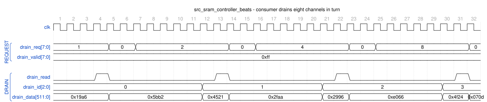

<!-- RTL Design Sherpa Documentation Header -->
<table>
<tr>
<td width="80">
  <a href="https://github.com/sean-galloway/RTLDesignSherpa">
    
  </a>
</td>
<td>
  <strong>RTL Design Sherpa</strong> · <em>Learning Hardware Design Through Practice</em><br>
  <sub>
    <a href="https://github.com/sean-galloway/RTLDesignSherpa">GitHub</a> ·
    <a href="https://github.com/sean-galloway/RTLDesignSherpa/blob/main/docs/DOCUMENTATION_INDEX.md">Documentation Index</a> ·
    <a href="https://github.com/sean-galloway/RTLDesignSherpa/blob/main/LICENSE">MIT License</a>
  </sub>
</td>
</tr>
</table>

---

<!-- End Header -->

# Source SRAM Controller Specification

**Module:** `src_sram_controller_beats.sv`
**Location:** `projects/components/dma-ip/rapids/rtl/macro_beats/`
**Status:** Implemented
**Last Updated:** 2025-01-10

---

## Overview

The Source SRAM Controller is a naming wrapper, with no logic of its own, around STREAM's `sram_controller` -- the one per-channel SRAM implementation both DMAs share since `bdf4e0dff`. It maps the RAPIDS `fill_*`/`drain_*` names onto STREAM's ports; the eight per-channel units (allocation counter, FIFO, drain counter, latency bridge) live inside STREAM's block. It manages 8 channel units for the source data path, providing per-channel buffering with channel arbitration for data delivery to the network.

### Key Features

- **One shared implementation:** instantiates STREAM's `sram_controller` once; it holds 8 `sram_controller_unit`s, each a `gaxi_fifo_sync` FIFO with `stream_alloc_ctrl`, `stream_drain_ctrl` and `stream_latency_bridge`
- **Channel Arbitration:** none inside the controller -- the AXIS egress arbiter picks a channel and presents it on `drain_id`
- **Flow Control Integration:** per-channel `stream_alloc_ctrl` / `stream_drain_ctrl` virtual FIFOs; the drain counter's virtual depth is 2 x SRAM_DEPTH (stream BUG-011)
- **Data Availability Tracking:** Reports available data per channel

### Block Diagram

### Figure 3.8.1: Source SRAM Controller Block Diagram

```
                    src_sram_controller_beats
    +------------------------------------------------------------------+
    |                                                                  |
    |  fill_* (from the AXI read engine)         src_sram_controller_beats |
    |         |                                (names only)            |
    |         v                                                        |
    |  +------------------------------------------------------------+  |
    |  |  sram_controller  (STREAM, shared with the STREAM DMA)     |  |
    |  |  +-----------+ +-----------+       +-----------+           |  |
    |  |  | unit [0]  | | unit [1]  |  ...  | unit [7]  |           |  |
    |  |  | alloc_ctrl| | alloc_ctrl|       | alloc_ctrl|           |  |
    |  |  | fifo_sync | | fifo_sync |       | fifo_sync |           |  |
    |  |  | drain_ctrl| | drain_ctrl|       | drain_ctrl|           |  |
    |  |  | lat.bridge| | lat.bridge|       | lat.bridge|           |  |
    |  |  +-----+-----+ +-----+-----+       +-----+-----+           |  |
    |  |        |drain_valid  |drain_valid        |drain_valid      |  |
    |  |        v             v                   v                 |  |
    |  |  +--------------------------------------------------------+ |  |
    |  |  | drain_id select (the consumer arbitrates, 1 beat/cycle)| |  |
    |  |  +--------------------------------------------------------+ |  |
    |  +------------------------------------------------------------+  |
    |                               |                                  |
    |                               v                                  |
    |                    Drain Interface                               |
    |                    (to Network Master)                           |
    |                                                                  |
    +------------------------------------------------------------------+
```

---

## Parameters

```systemverilog
parameter int NUM_CHANNELS = 8;
parameter int DATA_WIDTH = 512;
parameter int SRAM_DEPTH = 512;                  // Per-channel depth
parameter int ADDR_WIDTH = $clog2(SRAM_DEPTH);
```

: Table 3.8.1: Source SRAM Controller Parameters

---

## Port List

### Clock and Reset

| Signal | Direction | Width | Description |
|--------|-----------|-------|-------------|
| `clk` | input | 1 | System clock |
| `rst_n` | input | 1 | Active-low reset |

: Table 3.8.2: Clock and Reset

### Fill Interface (ID-Selected, from AXI Read Engine)

| Signal | Direction | Width | Description |
|--------|-----------|-------|-------------|
| `fill_alloc_req` | input | 1 | Allocation request (single, ID-selected) |
| `fill_alloc_size` | input | 8 | Beats to allocate |
| `fill_alloc_id` | input | CIW | Transaction ID selects the channel |
| `fill_space_free` | output | NC x SCW | Available space per channel |
| `fill_valid` | input | 1 | Fill data valid |
| `fill_ready` | output | 1 | Ready for fill data |
| `fill_id` | input | CIW | Transaction ID selects the channel |
| `fill_data` | input | DW | Fill data |

: Table 3.8.3: Fill Interface (ID-Selected)

### Arbitrated Drain Interface (to Network)

| Signal | Direction | Width | Description |
|--------|-----------|-------|-------------|
| `drain_data_avail` | output | NC x SCW | Data available per channel |
| `drain_req` | input | NC | Drain reservation request per channel |
| `drain_size` | input | NC x 8 | Beats to reserve |
| `drain_valid` | output | NC | Drain data valid per channel |
| `drain_valid_comb` | output | NC | Combinational per-channel valid (beat gate) |
| `drain_read` | input | 1 | Consumer read strobe |
| `drain_id` | input | CIW | Channel ID select for drain |
| `drain_data` | output | DW | Drain data (muxed from selected channel) |

: Table 3.8.4: Arbitrated Drain Interface

### Debug Interface

| Signal | Direction | Width | Description |
|--------|-----------|-------|-------------|
| `dbg_bridge_pending` | output | NC | Bridge has a pending beat per channel |
| `dbg_bridge_out_valid` | output | NC | Bridge output valid per channel |

: Table 3.8.5: Debug Interface

---

## Drain Selection

There is no arbiter inside the controller. Every channel unit raises its own
`drain_valid[ch]` / `drain_size[ch]` when it has data; the AXIS egress arbiter picks a channel,
drives it on `drain_id`, and the controller steers that channel's beats to the
single `drain_*` port. Switching channels costs nothing beyond the consumer's own
decision, and a channel keeps presenting `drain_valid` until it is empty.

### Figure 3.8.2: Drain Selection by the Consumer



**Source:** [src_sram_controller_drain_select.json](../assets/wavedrom/src_sram_controller_drain_select.json),
captured from `dv/tests/macro_beats/test_src_sram_controller_beats.py` (`multi_channel`,
8 channels, 512-bit data, 512-entry SRAM, `REG_LEVEL=GATE`) with `WAVES=1`.

Reading it: the same selection contract as the sink controller (Figure 3.5.2). With
`drain_valid` = 0xff the consumer asks for one channel at a time through `drain_req`;
`drain_id` and `drain_data` follow the request on the same cycle and `drain_read` pops
the word. The nine-cycle turn per channel is the test's pacing, not the controller's.

---

## Comparison: Sink vs Source SRAM Controller

| Aspect | Sink Controller | Source Controller |
|--------|-----------------|-------------------|
| Fill Source | Network ingress | AXI read data |
| Drain Destination | AXI write engine | Network egress |
| Fill Interface | Per-channel from network | Per-channel from AXI R |
| Drain Interface | Arbitrated SRAM read | Arbitrated drain to network |
| Primary Use | Network -> Memory | Memory -> Network |

: Table 3.8.6: Sink vs Source Controller Comparison

---

## Integration Example

```systemverilog
src_sram_controller_beats #(
    .NUM_CHANNELS(8),
    .DATA_WIDTH(512),
    .SRAM_DEPTH(512)
) u_src_sram_ctrl (
    .clk                    (clk),
    .rst_n                  (rst_n),

    // Per-channel fill interface (from AXI read engine)
    .fill_alloc_req         (fill_alloc_req),
    .fill_alloc_size        (fill_alloc_size),
    .fill_space_free        (fill_space_free),
    .fill_valid             (fill_valid),
    .fill_ready             (fill_ready),
    .fill_data              (fill_data),

    // Arbitrated drain interface (to network)
    .drain_valid            (src_drain_valid),
    .drain_data             (src_drain_data),
    .drain_id               (src_drain_id),

    // Status
    .drain_data_avail       (channel_data_avail),
    .dbg_bridge_pending     (channel_empty),
    .dbg_bridge_out_valid   (channel_full)
);
```

---

**Last Updated:** 2025-01-10
