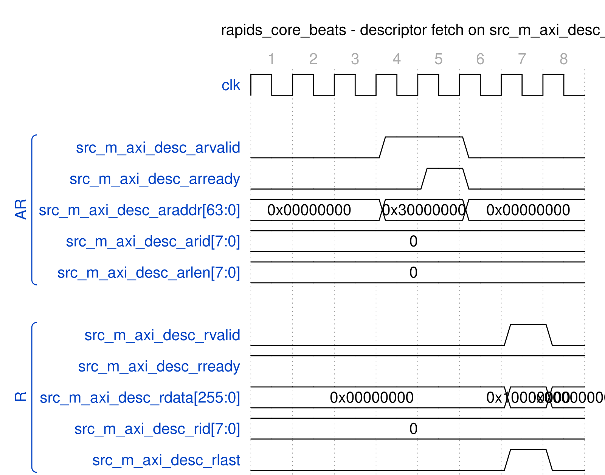
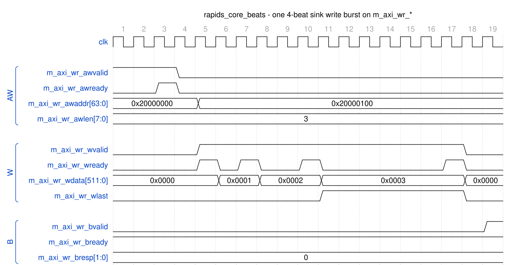
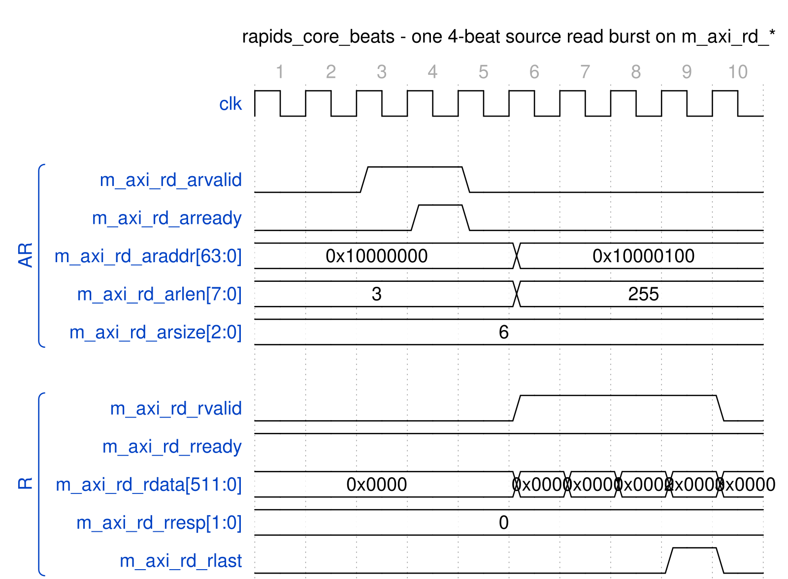

<!-- RTL Design Sherpa Documentation Header -->
<table>
<tr>
<td width="80">
  
</td>
<td>
  <strong>RTL Design Sherpa</strong> · <em>Learning Hardware Design Through Practice</em> 
  
    <a href="https://github.com/sean-galloway/RTLDesignSherpa">GitHub</a> ·
    <a href="https://github.com/sean-galloway/RTLDesignSherpa/blob/main/docs/DOCUMENTATION_INDEX.md">Documentation Index</a> ·
    <a href="https://github.com/sean-galloway/RTLDesignSherpa/blob/main/LICENSE">MIT License</a>
  
</td>
</tr>
</table>

---

<!-- End Header -->

# AXI4 Interface Specification

**Last Updated:** 2025-01-10

---

## Overview

The RAPIDS Beats architecture uses three AXI4 master interfaces:
1. **Descriptor AXI:** Fetches descriptors from memory (256-bit data)
2. **Sink AXI Write:** Writes sink data to memory (512-bit data, configurable)
3. **Source AXI Read:** Reads source data from memory (512-bit data, configurable)

---

## Descriptor AXI Master Interface

### Purpose

Fetches descriptor packets from system memory. Shared across all 8 channels with round-robin arbitration.

### Signal Table

| Signal | Direction | Width | Description |
|--------|-----------|-------|-------------|
| `m_axi_arvalid` | output | 1 | AR channel valid |
| `m_axi_arready` | input | 1 | AR channel ready |
| `m_axi_araddr` | output | AW | Read address |
| `m_axi_arid` | output | ID_W | Transaction ID |
| `m_axi_arlen` | output | 8 | Burst length (fixed: 0 = 1 beat) |
| `m_axi_arsize` | output | 3 | Burst size (fixed: 5 = 32 bytes) |
| `m_axi_arburst` | output | 2 | Burst type (fixed: INCR) |
| `m_axi_rvalid` | input | 1 | R channel valid |
| `m_axi_rready` | output | 1 | R channel ready |
| `m_axi_rdata` | input | 256 | Read data (descriptor) |
| `m_axi_rid` | input | ID_W | Response ID |
| `m_axi_rresp` | input | 2 | Read response |
| `m_axi_rlast` | input | 1 | Last beat |

: Table 4.1.1: Descriptor AXI Master Interface Signals

### Transaction Characteristics

| Parameter | Value | Description |
|-----------|-------|-------------|
| Data Width | 256 bits | Fixed descriptor size |
| Burst Length | 1 beat | Single descriptor per transaction |
| Burst Type | INCR | Incrementing burst |
| Max Outstanding | 8 | Configurable via parameter |
| ID Usage | Per-channel | ID encodes source channel |

: Table 4.1.2: Descriptor AXI Transaction Characteristics

### Timing Diagram

### Figure 4.1.1: Descriptor Fetch Timing

**Source:** [axi4_descriptor_fetch.json](../assets/wavedrom/axi4_descriptor_fetch.json),
captured from `dv/tests/top_beats/test_rapids_core_beats.py` (source path, channel 0, 4 beats, 512-bit data, `REG_LEVEL=GATE`) with `WAVES=1`.

Reading it: one single-beat read (`arlen = 0`) of the 256-bit descriptor at 0x30000000
with `arid` = channel 0. The AR handshakes when the slave raises `arready` two cycles
after `arvalid`; the R beat returns two cycles after that with `rlast` set and `rid`
echoing the channel. The descriptor itself is the 256-bit `rdata` (its low word,
0x10000000, is the source address).

---

## Sink AXI Write Master Interface

### Purpose

Writes sink data from SRAM to system memory. Supports burst transactions for efficient memory bandwidth.

### Signal Table

| Signal | Direction | Width | Description |
|--------|-----------|-------|-------------|
| `m_axi_awvalid` | output | 1 | AW channel valid |
| `m_axi_awready` | input | 1 | AW channel ready |
| `m_axi_awaddr` | output | AW | Write address |
| `m_axi_awid` | output | ID_W | Transaction ID |
| `m_axi_awlen` | output | 8 | Burst length (0-255) |
| `m_axi_awsize` | output | 3 | Burst size |
| `m_axi_awburst` | output | 2 | Burst type |
| `m_axi_wvalid` | output | 1 | W channel valid |
| `m_axi_wready` | input | 1 | W channel ready |
| `m_axi_wdata` | output | DW | Write data |
| `m_axi_wstrb` | output | DW/8 | Write strobes |
| `m_axi_wlast` | output | 1 | Last beat |
| `m_axi_bvalid` | input | 1 | B channel valid |
| `m_axi_bready` | output | 1 | B channel ready |
| `m_axi_bid` | input | ID_W | Response ID |
| `m_axi_bresp` | input | 2 | Write response |

: Table 4.1.3: Sink AXI Write Master Interface Signals

### Transaction Characteristics

| Parameter | Value | Description |
|-----------|-------|-------------|
| Data Width | 512 bits | Configurable |
| Burst Length | 1-256 beats | Based on transfer size |
| Burst Type | INCR | Incrementing burst |
| Max Outstanding AW | 8 | Configurable |
| W FIFO Depth | 64 | Configurable |
| B FIFO Depth | 16 | Configurable |

: Table 4.1.4: Sink AXI Write Transaction Characteristics

### Timing Diagram

### Figure 4.1.2: Sink AXI Write Burst Timing

**Source:** [axi4_sink_write_burst.json](../assets/wavedrom/axi4_sink_write_burst.json),
captured from `dv/tests/top_beats/test_rapids_core_beats.py` (sink path, channel 0, 4 beats, 512-bit data, `REG_LEVEL=GATE`) with `WAVES=1`; the memory is the framework AXI4 write slave with its default pacing.

Reading it: the AW (`awlen = 3`, address 0x20000000) had been held for the slave and
handshakes at cycle 3; `awaddr` steps to the next burst's 0x20000100 immediately. W
starts two cycles later and the four beats go out on the slave's `wready` pulses, the
low word of `wdata` counting 0 to 3 and `wlast` on the fourth; `bvalid` (OKAY) comes
one cycle after the last W handshake.

---

## Source AXI Read Master Interface

### Purpose

Reads source data from system memory into SRAM. Supports burst transactions for efficient memory bandwidth.

### Signal Table

| Signal | Direction | Width | Description |
|--------|-----------|-------|-------------|
| `m_axi_arvalid` | output | 1 | AR channel valid |
| `m_axi_arready` | input | 1 | AR channel ready |
| `m_axi_araddr` | output | AW | Read address |
| `m_axi_arid` | output | ID_W | Transaction ID |
| `m_axi_arlen` | output | 8 | Burst length (0-255) |
| `m_axi_arsize` | output | 3 | Burst size |
| `m_axi_arburst` | output | 2 | Burst type |
| `m_axi_rvalid` | input | 1 | R channel valid |
| `m_axi_rready` | output | 1 | R channel ready |
| `m_axi_rdata` | input | DW | Read data |
| `m_axi_rid` | input | ID_W | Response ID |
| `m_axi_rresp` | input | 2 | Read response |
| `m_axi_rlast` | input | 1 | Last beat |

: Table 4.1.5: Source AXI Read Master Interface Signals

### Transaction Characteristics

| Parameter | Value | Description |
|-----------|-------|-------------|
| Data Width | 512 bits | Configurable |
| Burst Length | 1-256 beats | Based on transfer size |
| Burst Type | INCR | Incrementing burst |
| Max Outstanding AR | 8 | Configurable |
| R FIFO Depth | 64 | Configurable |

: Table 4.1.6: Source AXI Read Transaction Characteristics

### Timing Diagram

### Figure 4.1.3: Source AXI Read Burst Timing

**Source:** [axi4_source_read_burst.json](../assets/wavedrom/axi4_source_read_burst.json),
captured from `dv/tests/top_beats/test_rapids_core_beats.py` (source path, channel 0, 4 beats, 512-bit data, `REG_LEVEL=GATE`) with `WAVES=1`.

Reading it: AR for four 64-byte beats (`arlen = 3`, `arsize = 6`) at 0x10000000
handshakes at cycle 4; the four R beats follow back to back from cycle 6 with
`rready` held high, `rresp` OKAY and `rlast` on the fourth. `araddr` and `arlen`
return to their idle values (the next address, 0x10000100, and 0xff) once the AR is
accepted.

---

## AXI Protocol Compliance

### Supported Features

| Feature | Descriptor | Sink Write | Source Read |
|---------|------------|------------|-------------|
| Burst Type INCR | Yes | Yes | Yes |
| Burst Type FIXED | No | No | No |
| Burst Type WRAP | No | No | No |
| Exclusive Access | No | No | No |
| Locked Access | No | No | No |
| Unaligned Access | No | Yes | Yes |
| Narrow Transfers | No | Yes | Yes |

: Table 4.1.7: AXI Feature Support

### Error Handling

- **SLVERR:** Transaction aborted, error reported to scheduler
- **DECERR:** Transaction aborted, error reported to scheduler
- **Timeout:** Configurable watchdog, error reported to scheduler

---

**Last Updated:** 2025-01-10
