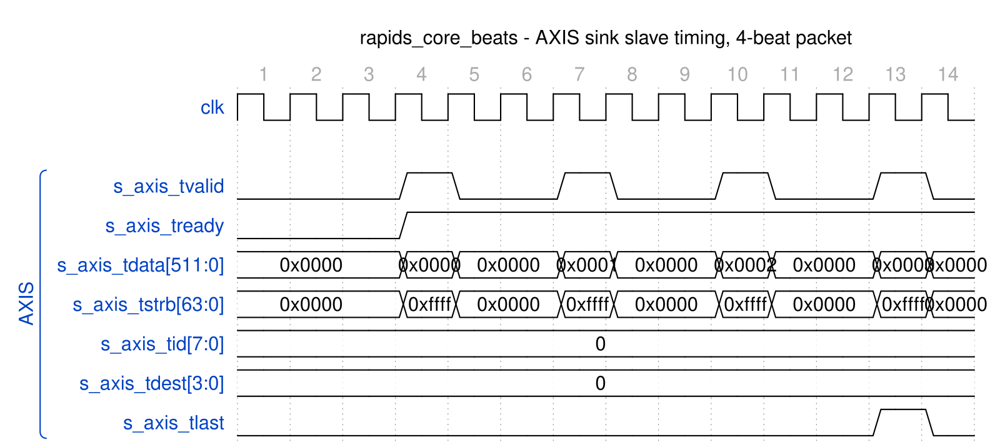
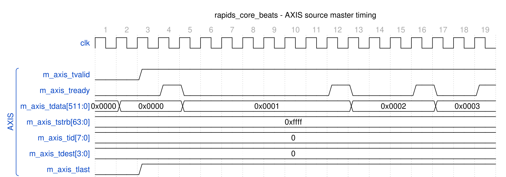

<!-- RTL Design Sherpa Documentation Header -->
<table>
<tr>
<td width="80">
  <a href="https://github.com/sean-galloway/RTLDesignSherpa">
    
  </a>
</td>
<td>
  <strong>RTL Design Sherpa</strong> · <em>Learning Hardware Design Through Practice</em><br>
  <sub>
    <a href="https://github.com/sean-galloway/RTLDesignSherpa">GitHub</a> ·
    <a href="https://github.com/sean-galloway/RTLDesignSherpa/blob/main/docs/DOCUMENTATION_INDEX.md">Documentation Index</a> ·
    <a href="https://github.com/sean-galloway/RTLDesignSherpa/blob/main/LICENSE">MIT License</a>
  </sub>
</td>
</tr>
</table>

---

<!-- End Header -->

# AXI-Stream Interface Specification

**Last Updated:** 2025-01-10

---

## Overview

The RAPIDS Beats architecture provides optional AXI-Stream (AXIS) wrappers for network interfaces:
1. **AXIS Sink Slave:** Receives network data for memory writes
2. **AXIS Source Master:** Transmits network data from memory reads

These wrappers are available when `ENABLE_AXIS_WRAPPERS = 1`.

---

## AXIS Sink Slave Interface

### Purpose

Receives streaming network data and routes to per-channel SRAM buffers based on TID.

### Signal Table

| Signal | Direction | Width | Description |
|--------|-----------|-------|-------------|
| `s_axis_tvalid` | input | 1 | Data valid |
| `s_axis_tready` | output | 1 | Ready to accept data |
| `s_axis_tdata` | input | DATA_WIDTH | Data payload |
| `s_axis_tstrb` | input | DATA_WIDTH/8 | Byte enables (not used by the beats design) |
| `s_axis_tlast` | input | 1 | Last beat of packet |
| `s_axis_tid` | input | TID_WIDTH | Stream ID (channel select) |
| `s_axis_tdest` | input | TDEST_WIDTH | Destination routing |
| `s_axis_tuser` | input | TUSER_WIDTH | User sideband |

: Table 4.2.1: AXIS Sink Slave Interface Signals

### Signal Details

#### TID (Transaction ID)

TID is used for per-channel routing:

| TID Value | Destination |
|-----------|-------------|
| 0 | Channel 0 SRAM |
| 1 | Channel 1 SRAM |
| 2 | Channel 2 SRAM |
| 3 | Channel 3 SRAM |
| 4 | Channel 4 SRAM |
| 5 | Channel 5 SRAM |
| 6 | Channel 6 SRAM |
| 7 | Channel 7 SRAM |

: Table 4.2.2: TID Channel Mapping

#### TSTRB (Byte Enables)

The ports are `s_axis_tstrb` / `m_axis_tstrb` (there is no `tkeep`). In the
beats design they are not load-bearing: the source drives all ones and the
sink ignores the ingress strobes, so every beat carries DATA_WIDTH/8 valid
bytes. The byte-granular RAPIDS (`rtl/top/rapids_top.sv`, rapids TASK-019)
packs bytes from lane 0 and uses a contiguous `tstrb` on the last beat of a
packet.

| DATA_WIDTH | TSTRB Width | Beats design | Byte-granular RAPIDS |
|------------|-------------|--------------|----------------------|
| 512 bits | 64 bits | all ones | contiguous from lane 0, partial on the last beat |
| 256 bits | 32 bits | all ones | contiguous from lane 0, partial on the last beat |

: Table 4.2.3: TSTRB Configuration

#### TLAST (Packet Boundary)

TLAST marks the end of an AXIS packet. This is mapped to the internal `fill_last` signal for packet boundary tracking.

### Timing Diagram

### Figure 4.2.1: AXIS Sink Slave Timing



**Source:** [axis_sink_slave.json](../assets/wavedrom/axis_sink_slave.json), captured from `dv/tests/top_beats/test_rapids_core_beats.py` (sink path, channel 0, 4 beats, 512-bit data, `REG_LEVEL=GATE`) with `WAVES=1`;
the producer is the framework AXIS master.

Reading it: `s_axis_tready` is high from the moment the sink has space, so each beat
is accepted the cycle it is offered; the producer's pacing leaves two idle cycles
between beats. `tstrb` is all ones on every beat, `tid` selects channel 0 and `tlast`
marks the fourth beat as the end of the packet.

### Backpressure

The sink interface asserts backpressure (`s_axis_tready = 0`) when:
- Target channel SRAM is full
- No space allocated for incoming data
- Internal pipeline stalls

---

## AXIS Source Master Interface

### Purpose

Transmits streaming network data from per-channel SRAM buffers with TID indicating source channel.

### Signal Table

| Signal | Direction | Width | Description |
|--------|-----------|-------|-------------|
| `m_axis_tvalid` | output | 1 | Data valid |
| `m_axis_tready` | input | 1 | Ready to accept data |
| `m_axis_tdata` | output | DATA_WIDTH | Data payload |
| `m_axis_tstrb` | output | DATA_WIDTH/8 | Byte enables (all ones in the beats design) |
| `m_axis_tlast` | output | 1 | Last beat of packet |
| `m_axis_tid` | output | TID_WIDTH | Stream ID (source channel) |
| `m_axis_tdest` | output | TDEST_WIDTH | Destination routing |
| `m_axis_tuser` | output | TUSER_WIDTH | User sideband |

: Table 4.2.4: AXIS Source Master Interface Signals

### Timing Diagram

### Figure 4.2.2: AXIS Source Master Timing



**Source:** [axis_source_master.json](../assets/wavedrom/axis_source_master.json),
captured from `dv/tests/top_beats/test_rapids_core_beats.py` (source path, channel 0, 4 beats, 512-bit data, `REG_LEVEL=GATE`) with `WAVES=1`; the consumer is the framework AXIS slave with its default ready pacing.

Reading it: the master raises `m_axis_tvalid` and holds it, with `tdata`, `tstrb`
(all ones), `tid` and `tdest` stable, until the consumer's `tready` pulse takes the
beat; it then presents the next word without dropping `tvalid`. Four beats leave on
four `tready` pulses. `tlast` is high on every beat of this capture because the
source packetises per drain request and each request carried one word (see
Figure 3.7.3); with `cfg_drain_size` larger than one and data queued, a packet spans
several beats and `tlast` marks only its final one.

### Flow Control

The source interface respects network backpressure:
- Data held when `m_axis_tready = 0`
- No data loss on backpressure
- SRAM drain pauses until ready

---

## AXIS vs Custom Fill/Drain Interfaces

### Comparison

| Aspect | Custom Fill/Drain | AXIS |
|--------|------------------|------|
| Standard | Proprietary | AXI-Stream |
| Channel ID | fill_id / drain_id | TID |
| Packet Boundary | fill_last / drain_last | TLAST |
| Byte Enables | fill_strb / drain_strb | TSTRB |
| Interoperability | RAPIDS only | Industry standard |

: Table 4.2.5: Interface Comparison

### Selection Guide

| Use Case | Recommended Interface |
|----------|----------------------|
| Internal RAPIDS testing | Custom Fill/Drain |
| Network IP integration | AXIS |
| FPGA board-level design | AXIS |
| Maximum performance | Custom Fill/Drain |

: Table 4.2.6: Interface Selection Guide

---

## Configuration Parameters

```systemverilog
// AXIS Interface Parameters
parameter int DATA_WIDTH = 512;       // Data payload width
parameter int TID_WIDTH = 3;          // Stream ID width (log2 channels)
parameter int TDEST_WIDTH = 1;        // Destination width
parameter int TUSER_WIDTH = 1;        // User sideband width
```

---

**Last Updated:** 2025-01-10
