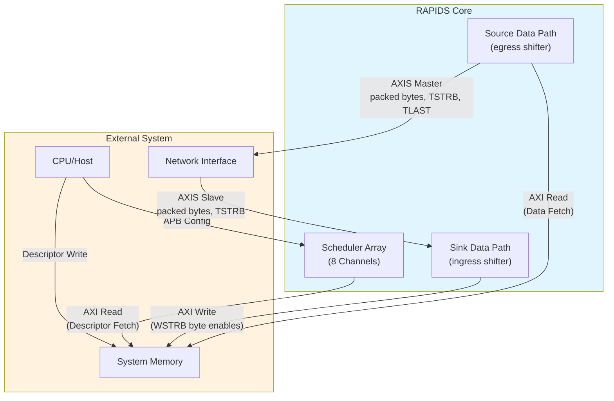

<!-- RTL Design Sherpa Documentation Header -->
<table>
<tr>
<td width="80">
  
</td>
<td>
  <strong>RTL Design Sherpa</strong> · <em>Learning Hardware Design Through Practice</em> 
  
    <a href="https://github.com/sean-galloway/RTLDesignSherpa">GitHub</a> ·
    <a href="https://github.com/sean-galloway/RTLDesignSherpa/blob/main/docs/DOCUMENTATION_INDEX.md">Documentation Index</a> ·
    <a href="https://github.com/sean-galloway/RTLDesignSherpa/blob/main/LICENSE">MIT License</a>
  
</td>
</tr>
</table>

---

<!-- End Header -->

# Product Overview

## Introduction

RAPIDS is a high-performance network-to-memory accelerator for descriptor-based data movement. It bridges network interfaces (AXI-Stream) with system memory (AXI4), moving data without CPU intervention.

RAPIDS is byte-granular. A descriptor gives a length in bytes and byte addresses. The sink writes exactly the bytes the network sent, using byte enables on the AXI4 write data channel. The source emits exactly the bytes the descriptor names, packed from lane 0 of the AXI-Stream, with a partial last beat when the length is not a multiple of the bus width. A transfer may begin at any byte address.

The earlier RAPIDS Beats design moved whole beats only. It was the stepping stone to this design, it stays supported, and its specification is the RAPIDS Beats HAS.

## System Context

## Target Applications

| Application | Description | Key Requirements |
|-------------|-------------|------------------|
| **Network Offload** | Receive packets from the network, store to memory | Low latency, arbitrary packet lengths |
| **Scatter-Gather DMA** | Multi-descriptor data movement | Descriptor chaining |
| **Protocol Processing** | Header and payload separation at byte boundaries | Any byte offset, one packet per descriptor |
| **Streaming Accelerator** | Front-end for compute engines | Continuous data flow |

: Target Applications

## What the Byte Design Adds

| Capability | RAPIDS Beats | RAPIDS |
|------------|--------------|--------|
| **Transfer unit** | Full beats only | Bytes |
| **Address alignment** | Pre-aligned required | Any byte for linear descriptors |
| **Sink write** | Every lane written | Byte enables mark the bytes written |
| **Source stream** | Full beats | Packed bytes, partial last beat, TLAST per descriptor |
| **Flow control** | Backpressure-based | Backpressure-based |

: Byte Design Additions

Flow control is unchanged: both designs rely on backpressure, and neither has credit management.

### Key Capabilities

1. **8 Independent Channels** - Concurrent transfers with dedicated resources
2. **Byte-Granular Transfers** - Length in bytes, start at any byte address
3. **Descriptor Chaining** - Automatic next-descriptor fetch
4. **Dual Data Paths** - Simultaneous sink (write) and source (read)
5. **Monitor Integration** - Real-time event reporting via MonBus
6. **Error Detection** - AXI error propagation, and a packet-length check on the sink

## Permanent Limitation

TYPE=EXT descriptors, which stride across rows and columns, stay beat-aligned by design. Their addresses SHALL be beat-aligned and their lengths SHALL be a multiple of the beat size. This is a permanent property of the design, not a phase of a schedule. Linear descriptors carry no such restriction. See the Descriptor Format chapter.
