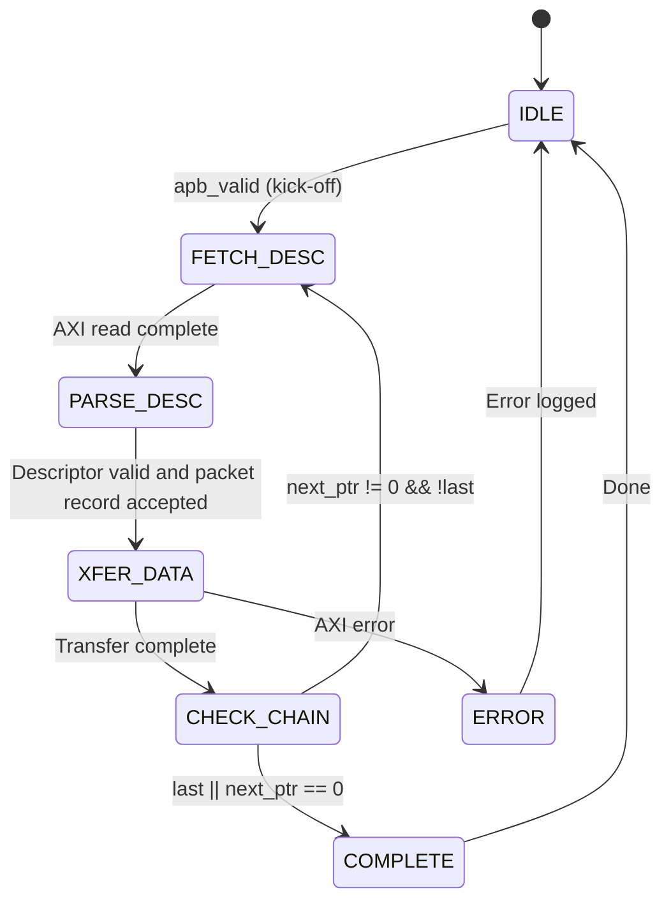

<!-- RTL Design Sherpa Documentation Header -->
<table>
<tr>
<td width="80">
  
</td>
<td>
  <strong>RTL Design Sherpa</strong> · <em>Learning Hardware Design Through Practice</em> 
  
    <a href="https://github.com/sean-galloway/RTLDesignSherpa">GitHub</a> ·
    <a href="https://github.com/sean-galloway/RTLDesignSherpa/blob/main/docs/DOCUMENTATION_INDEX.md">Documentation Index</a> ·
    <a href="https://github.com/sean-galloway/RTLDesignSherpa/blob/main/LICENSE">MIT License</a>
  
</td>
</tr>
</table>

---

<!-- End Header -->

# Key Features

## Feature Summary

### Multi-Channel Architecture

- **8 Independent Channels** with dedicated schedulers
- **Per-Channel State Machines** for concurrent operation
- **Shared AXI Infrastructure** with arbitrated access
- **Channel Isolation** prevents cross-channel interference

### Byte-Granular Data Movement

- **Length in Bytes.** The descriptor length field counts bytes. A length of zero moves nothing.
- **Any Start Byte.** Source and destination byte addresses may have any offset within a beat (linear descriptors).
- **Byte Enables on the Write Master.** WSTRB is exactly the set of bytes the descriptor writes. The first beat of a transfer strobes from the start offset, the last beat strobes up to the final byte, and every beat between strobes all lanes.
- **Packed AXI-Stream.** The sink accepts packed bytes with a contiguous TSTRB on the last beat. The source emits packed bytes, contiguous TSTRB, and TLAST on the last beat of each descriptor.
- **One Packet per Descriptor.** The source ends every descriptor with TLAST. The sink expects one TLAST-delimited packet per descriptor and checks its byte count against the descriptor length.
- **Beat-Aligned Bus Traffic.** AXI addresses are beat-aligned and no burst crosses a 4 KB boundary. The byte offset never reaches an AXI address: the sink carries it in WSTRB and the source drops it at the egress.

### Descriptor-Based Control

- **256-bit Descriptor Format** with all transfer parameters
- **Automatic Chaining** follows next_descriptor_ptr links
- **Last Descriptor Flag** terminates chain processing
- **IRQ Generation** via gen_irq descriptor flag
- **Control Descriptors** (`CTRL_READ` consumer gate, `CTRL_WRITE` producer doorbell) for in-memory producer and consumer synchronization without moving payload. They are unchanged from RAPIDS Beats; see the Descriptor Format chapter and the shared Descriptor Chaining chapter.

### High-Performance Data Paths

| Path | Direction | Bandwidth | Features |
|------|-----------|-----------|----------|
| **Sink** | Network to Memory | `DATA_WIDTH` per clock | Ingress byte shifter, SRAM buffering, AXI burst writes with byte enables |
| **Source** | Memory to Network | `DATA_WIDTH` per clock | AXI burst reads, SRAM buffering, egress byte re-packer |

: Data Path Summary

### Monitoring and Debug

- **64-bit MonBus Packets** for all significant events
- **State Transition Reports** track FSM activity
- **Error Event Codes** for fault diagnosis
- **Performance Metrics** for throughput analysis

## Feature Details

### Descriptor Processing

The scheduler leaves the descriptor-fetch state only when every data path the descriptor uses has room for its packet record. A full record queue holds the channel there; it is backpressure, not an error.

### SRAM Buffering

Each data path includes dedicated SRAM buffering:

| Parameter | Default | Description |
|-----------|---------|-------------|
| `SRAM_DEPTH` | 4096 | Entries per data path (parameter of `rapids_top`) |
| Source entry | `DATA_WIDTH` bits | Data only |
| Sink entry | `DATA_WIDTH + DATA_WIDTH/8` bits | Data plus one byte-enable bit per lane |

: SRAM Buffer Parameters

**Buffer Operation:**

- **Sink Path:** Fill from AXIS through the ingress shifter, drain to the AXI write engine
- **Source Path:** Fill from the AXI read engine, drain through the egress re-packer to AXIS
- **Flow Control:** Backpressure when the buffer is full or empty

### AXI Burst Optimization

| Feature | Implementation |
|---------|----------------|
| **Burst Length** | Up to 256 beats (AXI4 maximum) |
| **Outstanding Transactions** | Configurable |
| **Address Alignment** | Beat-aligned AxADDR; the byte offset rides in WSTRB or is dropped at the egress |
| **4KB Boundary** | Every burst is capped at the boundary |

: AXI Optimization Features

### Error Handling

| Error Type | Detection | Response |
|------------|-----------|----------|
| **AXI SLVERR** | Response check | Transfer aborted |
| **AXI DECERR** | Response check | Transfer aborted |
| **Timeout** | Watchdog timer | Recoverable error |
| **Packet length mismatch** | Sink counts strobed bytes at TLAST | Sticky per-channel write error |

: Error Handling Summary
