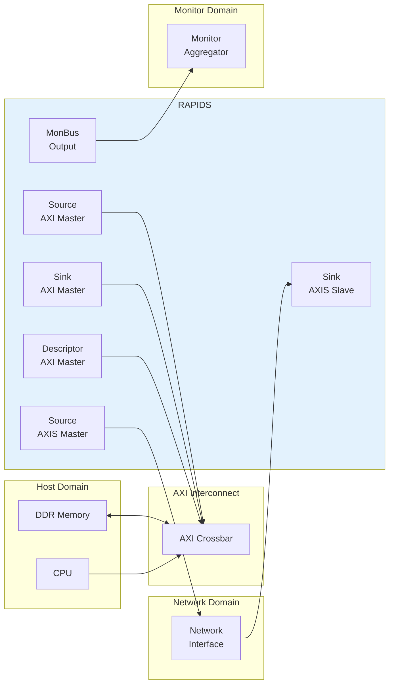

<!-- RTL Design Sherpa Documentation Header -->
<table>
<tr>
<td width="80">
  
</td>
<td>
  <strong>RTL Design Sherpa</strong> · <em>Learning Hardware Design Through Practice</em> 
  
    <a href="https://github.com/sean-galloway/RTLDesignSherpa">GitHub</a> ·
    <a href="https://github.com/sean-galloway/RTLDesignSherpa/blob/main/docs/DOCUMENTATION_INDEX.md">Documentation Index</a> ·
    <a href="https://github.com/sean-galloway/RTLDesignSherpa/blob/main/LICENSE">MIT License</a>
  
</td>
</tr>
</table>

---

<!-- End Header -->

# System Context

## Integration Overview

RAPIDS integrates into a system as a DMA engine bridging network interfaces and system memory. This chapter describes the external connections and the system-level requirements that differ from RAPIDS Beats. Everything not mentioned here matches the RAPIDS Beats System Context chapter.

## System Block Diagram

## Interface Connections

### Memory Interface

RAPIDS requires three AXI4 master ports connected to system memory:

| Port | Access Pattern | Typical Bandwidth |
|------|----------------|-------------------|
| **Descriptor AXI** | Random read (256-bit) | Low (<100 MB/s) |
| **Sink AXI** | Sequential write with byte enables | High (up to interface max) |
| **Source AXI** | Sequential read | High (up to interface max) |

: AXI Memory Interface Requirements

**Interconnect Requirements:**

- All three ports MAY share a single physical AXI port with arbitration
- The descriptor port has the lowest bandwidth requirement
- Sink and Source ports should have balanced bandwidth allocation
- The memory system SHALL honor WSTRB on the sink write master. A slave that ignores byte enables corrupts the bytes outside a partial beat. Every AXI4-conformant slave honors them.

### Network Interface

RAPIDS uses standard AXI-Stream for network connectivity:

| Interface | Role | Signals |
|-----------|------|---------|
| **Sink AXIS** | Receives data from the network | TDATA, TSTRB, TLAST, TID, TVALID, TREADY |
| **Source AXIS** | Sends data to the network | TDATA, TSTRB, TLAST, TID, TVALID, TREADY |

: AXIS Network Interface

**Protocol Notes:**

- Byte-granular: the byte lanes are strobed by TSTRB, and the strobed lanes of a beat SHALL be contiguous from lane 0. RAPIDS does not use TKEEP. Only the last beat of a packet may have a partial TSTRB.
- A packet is the bytes of one descriptor, delimited by TLAST. The source ends every descriptor with TLAST. The sink expects its packet to match the descriptor's byte length.
- TID selects the channel. TDEST and TUSER are available for sideband information.
- The sink holds TREADY low for a beat until the packet record of that beat's channel (TID) exists, which is after that channel's descriptor has been fetched. TREADY is one signal, so a waiting beat also holds up the beats behind it on the same stream. Software SHOULD issue a channel's descriptor before its packet arrives, or stream one channel at a time.

### Configuration Interface

Software configures RAPIDS through register writes:

| Method | Interface | Usage |
|--------|-----------|-------|
| **Direct Write** | Memory-mapped | Register configuration |
| **Descriptor Kick** | APB-style | Start descriptor processing |

: Configuration Methods

## Clock and Reset

### Clock Domains

| Clock | Frequency | Usage |
|-------|-----------|-------|
| `aclk` | 100-500 MHz | All RAPIDS logic |

: Clock Domains

**Note:** RAPIDS uses a single clock domain. Crossing into other frequency domains is handled externally.

### Reset Requirements

| Signal | Type | Description |
|--------|------|-------------|
| `aresetn` | Active-low | Async assert, sync deassert |

: Reset Signals

**Reset Sequence:**

1. Assert `aresetn` low for minimum 4 clock cycles
2. Ensure all AXI interfaces are idle before reset
3. Release reset synchronously to `aclk` rising edge
4. Wait 16 clock cycles before initiating transfers

Reset clears every packet record, every ingress spill, and every sticky write error.
