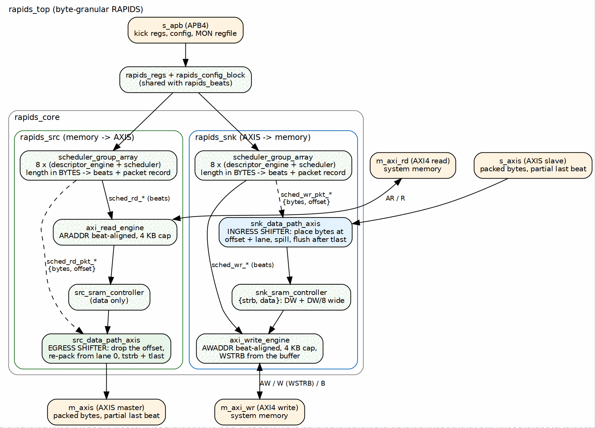
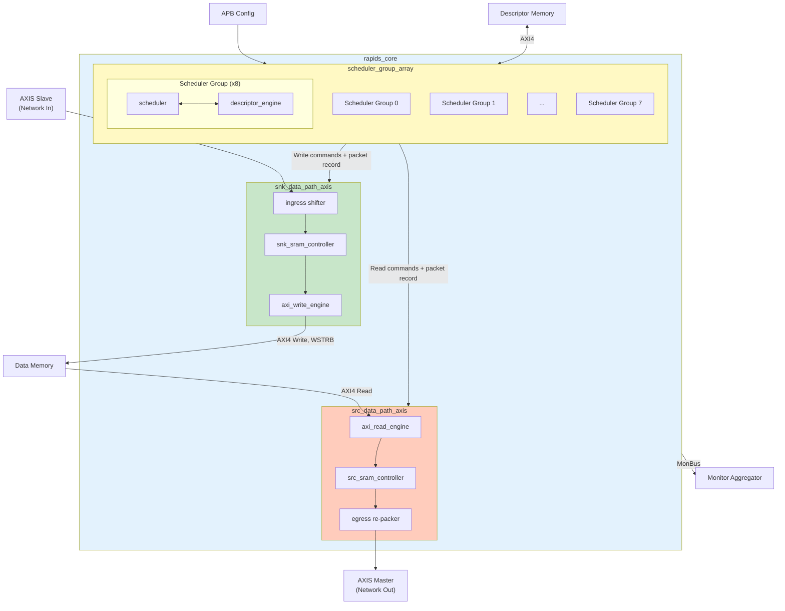

<!-- RTL Design Sherpa Documentation Header -->
<table>
<tr>
<td width="80">
  <a href="https://github.com/sean-galloway/RTLDesignSherpa">
    
  </a>
</td>
<td>
  <strong>RTL Design Sherpa</strong> · <em>Learning Hardware Design Through Practice</em><br>
  <sub>
    <a href="https://github.com/sean-galloway/RTLDesignSherpa">GitHub</a> ·
    <a href="https://github.com/sean-galloway/RTLDesignSherpa/blob/main/docs/DOCUMENTATION_INDEX.md">Documentation Index</a> ·
    <a href="https://github.com/sean-galloway/RTLDesignSherpa/blob/main/LICENSE">MIT License</a>
  </sub>
</td>
</tr>
</table>

---

<!-- End Header -->

# Block Diagram

## Top-Level Architecture

RAPIDS has the same block structure as RAPIDS Beats: a scheduler group array per direction, a data path per direction, and a top level that adds the registers, configuration mapping and monitoring. What the byte design adds sits at the edges of the two data paths: an ingress shifter on the sink, an egress re-packer on the source, and a packet record passed from each scheduler to its data path.

### Figure 2.1: RAPIDS Block Diagram



**Source:** [01_byte_block_diagram.dot](../assets/graphviz/01_byte_block_diagram.dot)



## Top-Level Integration (rapids_top)

`rapids_core` is wrapped by `rapids_top`, which adds the software register interface, configuration mapping, and monitoring infrastructure. The integration is identical to `rapids_beats_top`: a single APB slave feeds a command/response router into the `rapids_regs` register block, `rapids_config_block` translates the register outputs into the `cfg_*` signals, and a `monbus_axil4_axil4_group` delivers the merged monitor stream to an AXI-Lite error-drain slave, an AXI-Lite capture master, and a `mon_irq` interrupt. The register map, the APB interface and the MonBus interface are shared with RAPIDS Beats; see the linked chapters.

The top-level ports have the same names as `rapids_beats_top`. The only port-level differences are the byte enables: the sink write master's `m_axi_wr_wstrb` is driven from the buffered byte enables instead of all ones, and the two AXI-Stream ports use `tstrb` as a real byte mask.

## Component Summary

### Scheduler Group Array

The scheduler group array manages 8 independent channels per direction:

| Component | Instance Count | Purpose |
|-----------|----------------|---------|
| `scheduler` | 8 | Transfer coordination per channel; converts bytes to beats, issues the packet record |
| `descriptor_engine` | 8 | Descriptor fetch and parse (unchanged from RAPIDS Beats) |
| Descriptor AXI Arbiter | 1 | Shared AXI4 for descriptor fetch |

: Scheduler Array Components

### Sink Data Path

Network-to-memory data flow:

| Component | Purpose |
|-----------|---------|
| `snk_data_path_axis` | Ingress: accepts packed bytes, shifts them to `offset + lane`, holds the spill, flushes after TLAST, counts the packet |
| `snk_sram_controller` | Multi-channel SRAM management; each entry is data plus byte enables |
| `axi_write_engine` | AXI4 burst write generation; beat-aligned AWADDR, 4 KB cap, WSTRB from the buffer |
| `alloc_ctrl`, `drain_ctrl` | Space and data availability tracking (unchanged) |

: Sink Path Components

### Source Data Path

Memory-to-network data flow:

| Component | Purpose |
|-----------|---------|
| `axi_read_engine` | AXI4 burst read generation; beat-aligned ARADDR, 4 KB cap |
| `src_sram_controller` | Multi-channel SRAM management (data only) |
| `src_data_path_axis` | Egress: drops the start offset, re-packs from lane 0, sets TSTRB and TLAST |
| `alloc_ctrl`, `drain_ctrl` | Space and data availability tracking (unchanged) |

: Source Path Components

## Hierarchy

```
rapids_core
├── monbus_arbiter
├── rapids_src
│   ├── scheduler_group_array
│   │   └── scheduler_group [0..7]
│   │       ├── scheduler
│   │       ├── descriptor_engine
│   │       ├── ctrlrd_engine
│   │       └── ctrlwr_engine
│   ├── axis4_master_monlite
│   └── src_data_path_axis
│       └── src_data_path
│           ├── axi_read_engine
│           └── src_sram_controller
└── rapids_snk
    ├── scheduler_group_array (same shape)
    ├── axis4_slave_monlite
    └── snk_data_path_axis
        └── snk_data_path
            ├── axi_write_engine
            └── snk_sram_controller
```

## Internal Buses

| Bus | Width | Description |
|-----|-------|-------------|
| Descriptor Bus | 256-bit | Parsed descriptor to scheduler |
| Scheduler Command | Variable | Beat count and byte address to the engines |
| Packet Record | Bytes count plus offset | One per descriptor and direction, scheduler to data path |
| Source SRAM Data | `DATA_WIDTH` | Data to and from the source SRAM |
| Sink SRAM Data | `DATA_WIDTH + DATA_WIDTH/8` | Data plus byte enables |
| MonBus | 64-bit | Monitor packets (aggregated) |

: Internal Bus Summary
