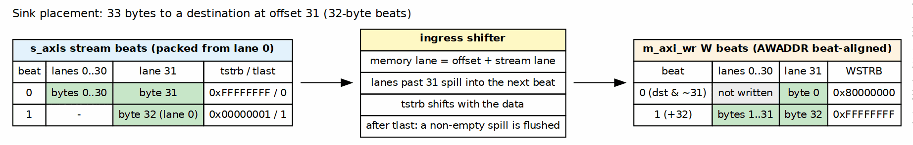
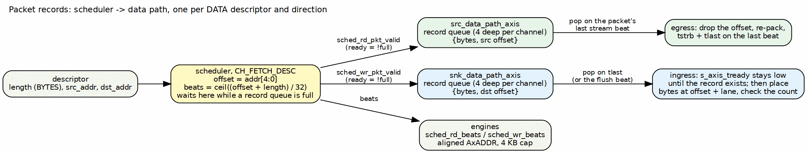
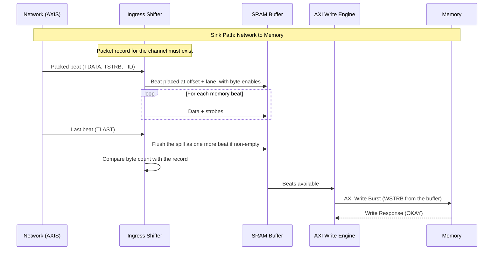
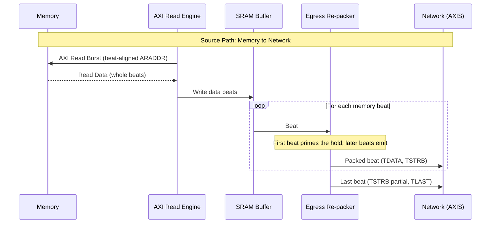

<!-- RTL Design Sherpa Documentation Header -->
<table>
<tr>
<td width="80">
  
</td>
<td>
  <strong>RTL Design Sherpa</strong> · <em>Learning Hardware Design Through Practice</em> 
  
    <a href="https://github.com/sean-galloway/RTLDesignSherpa">GitHub</a> ·
    <a href="https://github.com/sean-galloway/RTLDesignSherpa/blob/main/docs/DOCUMENTATION_INDEX.md">Documentation Index</a> ·
    <a href="https://github.com/sean-galloway/RTLDesignSherpa/blob/main/LICENSE">MIT License</a>
  
</td>
</tr>
</table>

---

<!-- End Header -->

# Data Flow

## Overview

RAPIDS implements two independent data paths that can operate concurrently:

1. **Sink Path:** Network to Memory (AXIS Slave -> AXI Write)
2. **Source Path:** Memory to Network (AXI Read -> AXIS Master)

The flow is the RAPIDS Beats flow with three additions: a packet record that carries the byte length and offset from the scheduler to the data path, an ingress shifter on the sink, and an egress re-packer on the source.

## Byte Placement Rules

A descriptor names a byte length `L` and a byte address `A`. With `BYTE_LANES` bytes per beat and `OFF = A mod BYTE_LANES`:

| Quantity | Value |
|----------|-------|
| Start offset | `OFF` = the low `log2(BYTE_LANES)` bits of `A` |
| Memory beats | `0` if `L` = 0, else `ceil((OFF + L) / BYTE_LANES)` |
| First memory beat | address `A` rounded down to a beat boundary; lanes below `OFF` are not written (sink) or dropped (source) |
| Last memory beat | lanes above the final byte are not written (sink) or dropped (source) |
| Beats between | all lanes carry data |
| Later addresses | rounded-down address plus the beats already moved, times `BYTE_LANES` |

: Byte Placement Rules

The stream side is packed: a packet of `L` bytes occupies `ceil(L / BYTE_LANES)` stream beats, all full except possibly the last. The number of memory beats and stream beats can differ by one, because the offset shifts the boundary. The data paths absorb the difference.

### Figure 2.2: Sink Byte Placement

**Source:** [02_byte_placement.dot](../assets/graphviz/02_byte_placement.dot)

## The Packet Record

For every DATA descriptor, the scheduler hands each data path it uses a record: the byte count and the start offset. The scheduler pulses the record once per descriptor and direction as it leaves the descriptor-fetch state. Each data path keeps a small per-channel queue of records (four deep). If a queue is full, the scheduler stays in descriptor fetch until there is room, so a full queue holds the channel and never drops a record. A zero-length descriptor carries no record.

The record is what lets the data path work in bytes while the engines work in beats. The sink ingress uses it to place bytes and to check the packet length. The source egress uses it to drop the offset and to set TSTRB and TLAST.

### Figure 2.3: Packet Record Flow

**Source:** [03_packet_record_flow.dot](../assets/graphviz/03_packet_record_flow.dot)

## Sink Path Data Flow

The ingress accepts a beat only when the channel's packet record exists. Until then TREADY stays low for that channel. After TLAST, if the offset pushed bytes into a further memory beat, the ingress flushes it as one more beat and holds TREADY low for that cycle.

The byte-enable timing on the write master is in the AXI4 Master Interface chapter.

## Source Path Data Flow

The source always reads whole beats and lets the egress discard the bytes outside the descriptor. The first memory beat only primes the egress hold when the offset is non-zero; every later beat emits one stream beat, and a final flush emits the bytes left in the hold. The result is one AXI-Stream packet per descriptor, TLAST on its last beat.

The AXI-Stream chapter carries the waveform for a packet whose last beat is partial.

## Concurrent Operation

Both data paths operate independently and can run simultaneously. Neither shares a resource with the other.

### Deadlock Prevention

RAPIDS prevents deadlock through independent resource allocation:

| Resource | Sink Path | Source Path | Shared |
|----------|-----------|-------------|--------|
| SRAM Buffer | Dedicated | Dedicated | No |
| AXI Port | Write only | Read only | No |
| Scheduler | Per-channel | Per-channel | No |
| Packet record queue | Per-channel, sink | Per-channel, source | No |

: Resource Isolation

The sink's TREADY is one signal, qualified by the TID of the beat on the bus. A beat for a channel whose descriptor has not been issued holds TREADY low, and it holds up any beats queued behind it on the same AXI-Stream, whatever their channel. A network source that interleaves channels on one stream SHOULD therefore issue every channel's descriptor before it streams, or present one channel at a time. The record queues and the ingress hold are per channel, so a stalled channel never corrupts another; it can only delay it.
