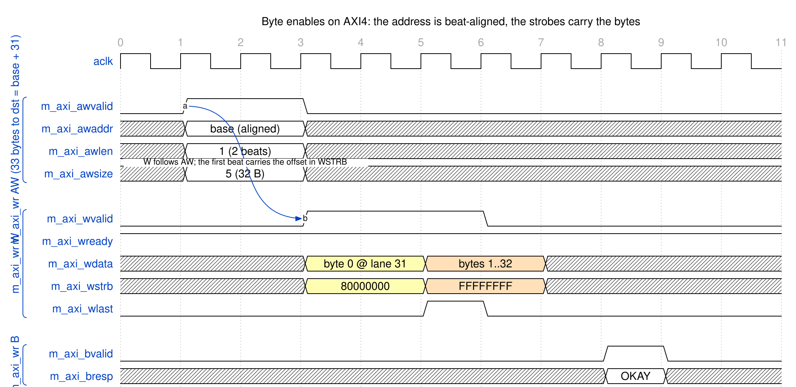

<!-- RTL Design Sherpa Documentation Header -->
<table>
<tr>
<td width="80">
  <a href="https://github.com/sean-galloway/RTLDesignSherpa">
    
  </a>
</td>
<td>
  <strong>RTL Design Sherpa</strong> · <em>Learning Hardware Design Through Practice</em><br>
  <sub>
    <a href="https://github.com/sean-galloway/RTLDesignSherpa">GitHub</a> ·
    <a href="https://github.com/sean-galloway/RTLDesignSherpa/blob/main/docs/DOCUMENTATION_INDEX.md">Documentation Index</a> ·
    <a href="https://github.com/sean-galloway/RTLDesignSherpa/blob/main/LICENSE">MIT License</a>
  </sub>
</td>
</tr>
</table>

---

<!-- End Header -->

# AXI4 Interface Specification

## Overview

RAPIDS uses AXI4 master interfaces for all memory access:

1. **Descriptor AXI** - Fetches 256-bit descriptors (read-only), one master per half (`src_m_axi_desc_*`, `snk_m_axi_desc_*`)
2. **Sink AXI** - Writes network data to memory (`m_axi_wr_*`)
3. **Source AXI** - Reads memory data for the network (`m_axi_rd_*`)
4. **Control AXI** - Single-word control reads and writes (`*_m_axi_ctrlrd_*`, `*_m_axi_ctrlwr_*`), unchanged from RAPIDS Beats

The descriptor and control masters behave exactly as in RAPIDS Beats; see
[the RAPIDS Beats AXI4 chapter](../../rapids_beats_has/ch03_interfaces/02_axi4_interface.md)
for their timing. This chapter specifies what changed: the data masters carry
byte-granular transfers.

### Byte Granularity on the Memory Side

The descriptor length is a byte count and the source and destination
addresses are byte addresses. The data masters keep AXI4 conventional by
splitting the two concerns:

| Concern | Where it is carried |
|---------|---------------------|
| Which beats are transferred | `AxADDR` (beat-aligned) and `AxLEN` |
| Which bytes within a beat are transferred | `WSTRB` on the write master; the egress drops unwanted bytes on the read side |

: Where byte granularity is carried on AXI4

`AxSIZE` is always the full beat (`log2(DATA_WIDTH/8)`), so the masters remain
ordinary full-width INCR masters that any interconnect accepts.

## Descriptor AXI Master

Unchanged from RAPIDS Beats. One 256-bit single-beat INCR read per
descriptor, `ARLEN` = 0, `ARSIZE` = 5, `ARID` carries the channel. The source
half and the sink half each own a master, and the descriptor address is 32-byte
aligned. The descriptor's contents (Chapter 5) differ: its length field is in
bytes.

## Sink AXI Master (Write)

### Purpose

Writes packed network bytes from the SRAM buffer to system memory. The SRAM
holds each beat as data plus a strobe (`{strb, data}`), placed by the sink
ingress at the byte offset of the destination address. The write master emits
that strobe on `WSTRB` unchanged.

### Configuration

| Parameter | Default | Range | Description |
|-----------|---------|-------|-------------|
| `DATA_WIDTH` | 512 | 32-1024 (power of two) | Beat width; 32-byte beats (256-bit) in the Genesys 2 build |
| `ADDR_WIDTH` | 64 | Configurable | System address space |
| `AXI_ID_WIDTH` | 8 | Configurable | Transaction tracking (channel in low bits) |
| Max burst | `WR_XFER_BEATS` register | 1-256 | Per-channel burst cap, further capped at 4 KB |
| Outstanding | 8 | 1-16 | Concurrent AW requests |

: Sink AXI Configuration

### Signal List

| Signal | Width | Direction | Description |
|--------|-------|-----------|-------------|
| `m_axi_wr_awid` | `AXI_ID_WIDTH` | output | Write ID |
| `m_axi_wr_awaddr` | `ADDR_WIDTH` | output | Write address, **beat-aligned** |
| `m_axi_wr_awlen` | 8 | output | Burst length - 1 |
| `m_axi_wr_awsize` | 3 | output | Full beat, `log2(DATA_WIDTH/8)` |
| `m_axi_wr_awburst` | 2 | output | INCR |
| `m_axi_wr_awvalid` / `awready` | 1 | output / input | Address handshake |
| `m_axi_wr_wdata` | `DATA_WIDTH` | output | Write data |
| `m_axi_wr_wstrb` | `DATA_WIDTH/8` | output | **Byte enables: the bytes this beat writes** |
| `m_axi_wr_wlast` | 1 | output | Last beat of the burst |
| `m_axi_wr_wvalid` / `wready` | 1 | output / input | Data handshake |
| `m_axi_wr_bid` | `AXI_ID_WIDTH` | input | Response ID |
| `m_axi_wr_bresp` | 2 | input | Write response |
| `m_axi_wr_bvalid` / `bready` | 1 | input / output | Response handshake |

: Sink AXI Signals

### WSTRB Contract

For a descriptor that writes `length` bytes starting at byte address `dst`,
let `offset = dst mod (DATA_WIDTH/8)`. The transfer covers
`ceil((offset + length) / (DATA_WIDTH/8))` beats.

| Beat | `WSTRB` |
|------|---------|
| First beat | Lanes `offset` to the end of the beat, or to the last byte if the transfer ends inside this beat |
| Middle beats | All ones |
| Last beat | Lanes 0 to the last byte, or up to the last lane if the transfer ends on a beat boundary |
| Single-beat transfer | Lanes `offset` to `offset + length - 1` |

: WSTRB per beat

Lanes outside the run have `WSTRB` = 0 and their `WDATA` bytes are not
significant. RAPIDS never writes a byte the descriptor did not name, so a
destination memory that honors byte enables is left untouched outside
`[dst, dst + length)`. Every beat in the transfer carries at least one
strobed byte.

#### Waveform 3.1: Unaligned Sink Write, Byte Enables on AXI4



**Source:** [02_axi_byte_enables.json](../assets/wavedrom/02_axi_byte_enables.json)

A 33-byte transfer to `base + 31` occupies two beats of a 32-byte-beat
interface. `AWADDR` is `base`, not `base + 31`. The first beat strobes only
lane 31 (`0x80000000`) and carries byte 0 there; the second beat strobes all
32 lanes and carries bytes 1 to 32.

## Source AXI Master (Read)

### Purpose

Reads whole beats from system memory into the SRAM buffer. The read master
does not use byte enables (AXI has none on the read side). It fetches every
beat that overlaps `[src, src + length)`, and the source egress
([Chapter 3.2](03_axis_interface.md)) drops the leading and trailing bytes
that were fetched but not requested.

### Configuration

| Parameter | Default | Range | Description |
|-----------|---------|-------|-------------|
| `DATA_WIDTH` | 512 | 32-1024 (power of two) | Beat width |
| `ADDR_WIDTH` | 64 | Configurable | System address space |
| `AXI_ID_WIDTH` | 8 | Configurable | Transaction tracking |
| Max burst | `RD_XFER_BEATS` register | 1-256 | Per-channel burst cap, further capped at 4 KB |
| Outstanding | 8 | 1-16 | Concurrent AR requests |

: Source AXI Configuration

### Signal List

| Signal | Width | Direction | Description |
|--------|-------|-----------|-------------|
| `m_axi_rd_arid` | `AXI_ID_WIDTH` | output | Read ID |
| `m_axi_rd_araddr` | `ADDR_WIDTH` | output | Read address, **beat-aligned** |
| `m_axi_rd_arlen` | 8 | output | Burst length - 1 |
| `m_axi_rd_arsize` | 3 | output | Full beat |
| `m_axi_rd_arburst` | 2 | output | INCR |
| `m_axi_rd_arvalid` / `arready` | 1 | output / input | Address handshake |
| `m_axi_rd_rid` | `AXI_ID_WIDTH` | input | Response ID |
| `m_axi_rd_rdata` | `DATA_WIDTH` | input | Read data |
| `m_axi_rd_rresp` | 2 | input | Read response |
| `m_axi_rd_rlast` | 1 | input | Last beat |
| `m_axi_rd_rvalid` / `rready` | 1 | input / output | Data handshake |

: Source AXI Signals

### Read Coverage

A read of `length` bytes from byte address `src` fetches
`ceil((offset + length) / (DATA_WIDTH/8))` beats starting at `src` rounded
down to a beat boundary. Bytes fetched outside `[src, src + length)` are
never delivered to the network.

## AXI Protocol Constraints

### Address Alignment

| Transfer Type | Alignment Requirement |
|---------------|----------------------|
| Descriptor | 32-byte aligned |
| Sink data, linear descriptor | **None**: any byte address |
| Source data, linear descriptor | **None**: any byte address |
| Sink or source data, TYPE=EXT descriptor | Beat-aligned address, beat-multiple length (permanent) |

: Address Alignment Requirements

The AXI address on the wire is always beat-aligned, whatever the descriptor
holds. Only EXT (row and column striding) descriptors restrict the
descriptor's own addresses; that is a permanent design decision, not a
phase limitation.

### 4 KB Boundary Handling

AXI4 forbids a burst crossing a 4 KB boundary. RAPIDS caps every burst at the
next 4 KB boundary, computed from the beat-aligned address, on both data
masters. The cap combines with the configured burst limit: the burst is the
smaller of the two.

```
Example: 4035 bytes to dst = 0x0CB (32-byte beats, offset = 0x0B)
  Beats total = ceil((11 + 4035) / 32) = 127
  Aligned start = 0x0C0; beats from there to the 4 KB boundary = 122
  With WR_XFER_BEATS = 16 the bursts are 16-beat, the last one before the boundary
  ends at 0x1000 (a 122-beat run is 7 bursts of 16 and one of 10);
  the remaining 5 beats start at AWADDR = 0x1000.
```

The first burst's `WSTRB` carries the offset (`0xFFFFF800`, lanes 11 to 31).
After the first burst the working address is the aligned address plus the
beats completed, so every later burst is beat-aligned.

### Response Handling

| Response | Code | RAPIDS Behavior |
|----------|------|-----------------|
| OKAY | 2'b00 | Normal completion |
| EXOKAY | 2'b01 | Treated as OKAY |
| SLVERR | 2'b10 | Error, transfer aborted |
| DECERR | 2'b11 | Error, transfer aborted |

: AXI Response Handling
