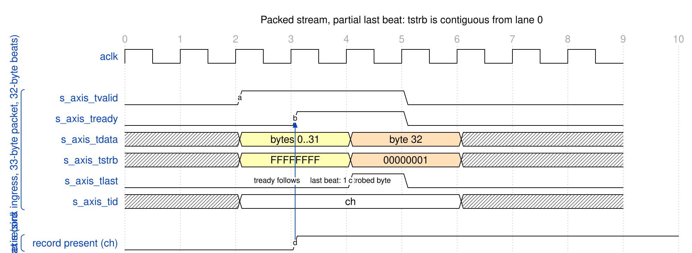

<!-- RTL Design Sherpa Documentation Header -->
<table>
<tr>
<td width="80">
  
</td>
<td>
  <strong>RTL Design Sherpa</strong> · <em>Learning Hardware Design Through Practice</em> 
  
    <a href="https://github.com/sean-galloway/RTLDesignSherpa">GitHub</a> ·
    <a href="https://github.com/sean-galloway/RTLDesignSherpa/blob/main/docs/DOCUMENTATION_INDEX.md">Documentation Index</a> ·
    <a href="https://github.com/sean-galloway/RTLDesignSherpa/blob/main/LICENSE">MIT License</a>
  
</td>
</tr>
</table>

---

<!-- End Header -->

# AXIS Interface Specification

## Overview

RAPIDS uses AXI-Stream interfaces for network data transfer:

1. **Sink AXIS Slave** - Receives packed bytes from the network (ingress)
2. **Source AXIS Master** - Sends packed bytes to the network (egress)

Both streams carry **packed bytes**: a packet is a contiguous run of bytes
starting at lane 0 of its first beat, with every beat full except possibly the
last. The stream is byte-granular through `TSTRB`, and `TLAST` delimits
exactly one descriptor's worth of data.

### Byte Semantics

| Property | Rule |
|----------|------|
| Byte qualifier | `TSTRB` (there is no `TKEEP` on RAPIDS) |
| Packing | Bytes are packed from lane 0; no gaps inside a packet |
| Full beats | `TSTRB` all ones |
| Last beat | `TSTRB` is a contiguous run from lane 0 (`2^n - 1`), `n` = bytes in the beat |
| Packet | One descriptor's `length` bytes, ending with `TLAST` |

: Byte Semantics of the RAPIDS Streams

The destination address offset never appears on the stream. A descriptor that
writes to byte address 5 of a beat still receives its packet packed from lane
0; the sink places the bytes at the destination offset internally
([Chapter 2](../ch02_architecture/02_data_flow.md)).

## Sink AXIS Slave

### Purpose

Receives a packet, places its bytes at the descriptor's destination offset,
and writes them to the SRAM buffer for the sink AXI master.

### Configuration

| Parameter | Default | Range | Description |
|-----------|---------|-------|-------------|
| `DATA_WIDTH` | 512 | 32-1024 (power of two) | TDATA width |
| `AXIS_ID_WIDTH` | 8 | 1-8 | TID width; TID selects the channel |
| `AXIS_DEST_WIDTH` | 8 | 0-8 | TDEST width (not used to route) |
| `AXIS_USER_WIDTH` | 1 | 0-16 | TUSER width (not used) |

: Sink AXIS Configuration

### Signal List

| Signal | Width | Direction | Description |
|--------|-------|-----------|-------------|
| `s_axis_tdata` | `DATA_WIDTH` | input | Data payload |
| `s_axis_tstrb` | `DATA_WIDTH/8` | input | Byte qualifier, contiguous from lane 0 |
| `s_axis_tlast` | 1 | input | Last beat of the packet |
| `s_axis_tid` | `AXIS_ID_WIDTH` | input | Channel select |
| `s_axis_tdest` | `AXIS_DEST_WIDTH` | input | Destination (accepted, not used) |
| `s_axis_tuser` | `AXIS_USER_WIDTH` | input | User sideband (accepted, not used) |
| `s_axis_tvalid` | 1 | input | Data valid |
| `s_axis_tready` | 1 | output | Ready to accept |

: Sink AXIS Signals

### Packet Contract

A sink packet SHALL:

1. Be delimited by `TLAST`, with one `TID` for all its beats.
2. Be packed: every beat but the last has `TSTRB` all ones, and the last beat's `TSTRB` is a contiguous run from lane 0.
3. Contain exactly as many strobed bytes as the descriptor's `length` for that channel.

The byte count is checked at `TLAST`. A packet whose count differs from the
descriptor length is not silently padded or dropped: the channel's sticky
`sched_wr_error` bit is set and stays set until reset.

### Descriptor-First Ordering

The sink cannot place bytes until it knows the destination offset, and the
offset comes from the channel's descriptor. `s_axis_tready` is a single
signal. It is qualified by the `TID` of the beat currently on the bus: it is
low whenever that channel has no packet record, in addition to the output
register being busy or a flush beat pending.

A beat for a channel whose descriptor has not been fetched therefore stalls
the whole stream, including beats for other channels queued behind it. There
is no per-channel backpressure. Software SHOULD issue a channel's descriptor
before its packet arrives, or stream one channel at a time until its
descriptor is known.

This is the one flow-control difference from RAPIDS Beats, whose sink
buffered beats before any descriptor existed. A transmitter that blocks its
own descriptor kick behind the stalled stream will deadlock; kick first.

#### Waveform 3.1: Sink Packet With a Partial Last Beat

**Source:** [01_axis_partial_last_beat.json](../assets/wavedrom/01_axis_partial_last_beat.json)

A 33-byte packet occupies two 32-byte beats. The first beat is full
(`TSTRB = FFFFFFFF`); the second carries one byte (`TSTRB = 00000001`) and
`TLAST`. `s_axis_tready` rises only after the channel's record exists, so
`TVALID` waits for it.

### Backpressure Behavior

`s_axis_tready` deasserts when:

| Cause | Meaning |
|-------|---------|
| No record for the beat's channel | The descriptor for the `TID` on the bus has not been fetched; the whole stream waits |
| SRAM space | The channel's SRAM partition is full |
| Ingress output register busy | The write into the SRAM controller has not completed |
| Flush cycle | `TREADY` drops for one cycle while the spill beat that follows `TLAST` is emitted |

: Reasons the Sink Deasserts TREADY

The flush cycle occurs when a packet's last bytes spill into a memory beat
beyond the stream's last beat: for example, 33 bytes to destination offset 5
occupy 38 bytes, so the stream's second beat maps to two memory beats.

## Source AXIS Master

### Purpose

Reads memory beats through the SRAM buffer and emits the descriptor's bytes
as one packed AXIS packet.

### Configuration

| Parameter | Default | Range | Description |
|-----------|---------|-------|-------------|
| `DATA_WIDTH` | 512 | 32-1024 (power of two) | TDATA width |
| `AXIS_ID_WIDTH` | 8 | 1-8 | TID width; carries the channel |
| `AXIS_DEST_WIDTH` | 8 | 0-8 | TDEST width; carries the channel |
| `AXIS_USER_WIDTH` | 1 | 0-16 | TUSER width; driven 0 |

: Source AXIS Configuration

### Signal List

| Signal | Width | Direction | Description |
|--------|-------|-----------|-------------|
| `m_axis_tdata` | `DATA_WIDTH` | output | Data payload |
| `m_axis_tstrb` | `DATA_WIDTH/8` | output | Byte qualifier, contiguous from lane 0 |
| `m_axis_tlast` | 1 | output | Last beat of the packet |
| `m_axis_tid` | `AXIS_ID_WIDTH` | output | Channel |
| `m_axis_tdest` | `AXIS_DEST_WIDTH` | output | Channel (zero-extended) |
| `m_axis_tuser` | `AXIS_USER_WIDTH` | output | Driven 0 |
| `m_axis_tvalid` | 1 | output | Data valid |
| `m_axis_tready` | 1 | input | Downstream ready |

: Source AXIS Signals

### Egress Packet Contract

| Property | Behavior |
|----------|----------|
| Packet framing | One AXIS packet per descriptor, however many drain blocks it spans |
| Bytes | Exactly `length` bytes, from the descriptor's source byte address |
| First beat | Starts at lane 0: the egress shifts memory beats down by the source offset |
| Middle beats | `TSTRB` all ones |
| Last beat | Contiguous `TSTRB` and `TLAST` |
| Zero-length descriptor | No packet |

: Egress Packet Contract

RAPIDS Beats cut a packet at the end of each drain block and asserted
`TLAST` on every one. RAPIDS asserts `TLAST` once, on the last byte of the
descriptor.

### Timing

The partial last beat is the mirror image of the sink case
(Waveform 3.1 above): the
final beat carries a contiguous run of `n` bytes and `TLAST`. The re-pack
mechanism that produces it, including the beat that only primes the shifter,
is specified in the MAS.

### Data Availability

The source asserts `TVALID` only when packed data is available. The first
memory beat of a packet with a nonzero source offset only primes the egress
shifter and produces no output unless the entire packet fits in that beat.

## AXIS Protocol Notes

### Handshake Rules

Standard AXI-Stream handshake applies:

1. `TVALID` asserts when data is available
2. `TREADY` asserts when the receiver can accept
3. A transfer occurs on a clock edge when both are high
4. `TVALID` SHALL NOT depend on `TREADY`
5. `TREADY` MAY depend on `TVALID`

### TLAST Semantics

| Scenario | TLAST Behavior |
|----------|----------------|
| Sink packet | Assert on the last beat of the packet; the byte count must equal the descriptor length |
| Source packet | Asserted once per descriptor, on its last stream beat |
| Continuous stream | Not supported: every transfer is a descriptor-sized packet |

: TLAST Usage

### TSTRB Usage

| TSTRB Value (32-byte beat) | Meaning |
|----------------------------|---------|
| `FFFFFFFF` | All 32 bytes valid (every beat but the last) |
| `0000FFFF` | Last beat, lower 16 bytes valid |
| `00000001` | Last beat, one byte valid |
| Any non-contiguous pattern | Not produced by RAPIDS; not accepted on the sink |

: TSTRB Examples

### Channel Multiplexing via TID

Channels share each stream through `TID`. A sink packet SHALL keep one `TID`
from its first beat to `TLAST`. Each channel is packed independently, so
packets of different channels may follow one another, but `s_axis_tready`
does not distinguish channels: a channel that is not ready stalls the stream
for all of them (see Descriptor-First Ordering). The source stream emits one
packet at a time, tagged with the channel in `TID` and `TDEST`.
