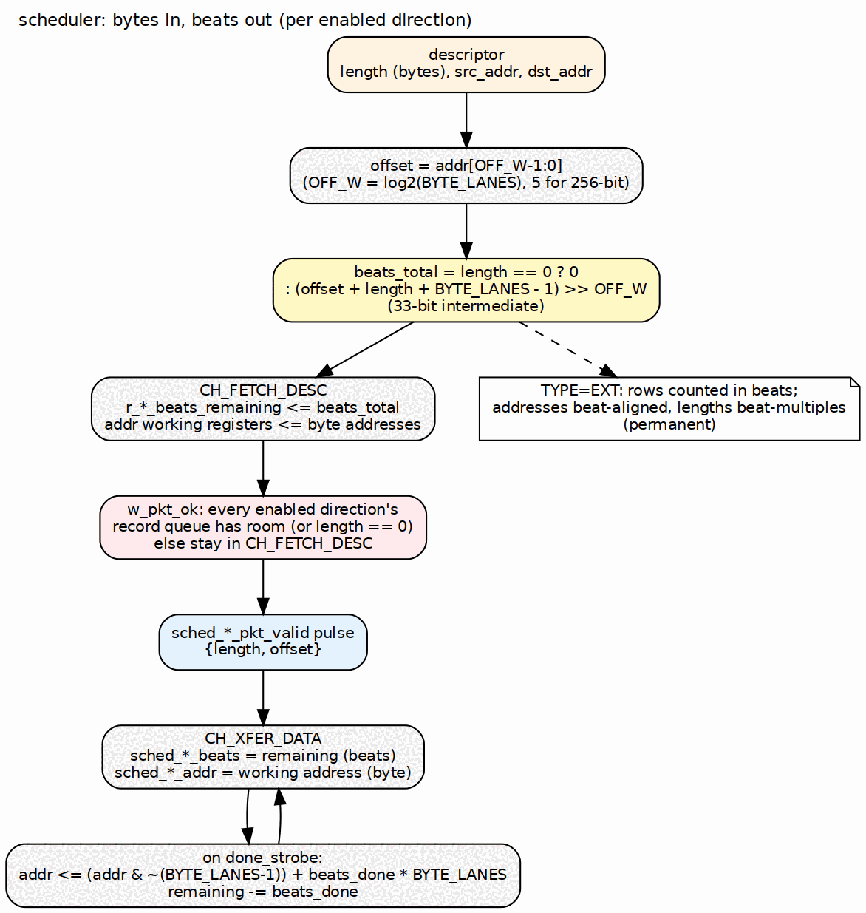

<!-- RTL Design Sherpa Documentation Header -->
<table>
<tr>
<td width="80">
  <a href="https://github.com/sean-galloway/RTLDesignSherpa">
    
  </a>
</td>
<td>
  <strong>RTL Design Sherpa</strong> · <em>Learning Hardware Design Through Practice</em><br>
  <sub>
    <a href="https://github.com/sean-galloway/RTLDesignSherpa">GitHub</a> ·
    <a href="https://github.com/sean-galloway/RTLDesignSherpa/blob/main/docs/DOCUMENTATION_INDEX.md">Documentation Index</a> ·
    <a href="https://github.com/sean-galloway/RTLDesignSherpa/blob/main/LICENSE">MIT License</a>
  </sub>
</td>
</tr>
</table>

---

<!-- End Header -->

# Scheduler

**Module:** `scheduler.sv`
**Location:** `projects/components/dma-ip/rapids/rtl/fub/`
**Status:** Implemented
**Last Updated:** 2026-09-30

---

## Overview

The scheduler coordinates one channel. It accepts a 256-bit descriptor from the descriptor engine, turns the descriptor's byte length and byte addresses into beat counts for the AXI engines, tells the data paths how the packet is laid out, and tracks progress until every source beat is read and every destination beat is committed.

Compared with the RAPIDS Beats scheduler, the state machine, the timeout logic, the control-descriptor path and the MonBus events are the same. Three things change: the beat math, the address advance, and the packet record.

### Key Features

- **Byte length:** the descriptor's 32-bit length is a byte count.
- **Byte addresses:** the offset of a transfer inside its first beat is `addr[OFF_W-1:0]`.
- **Beat math:** beats moved are derived from offset and length, in a 33-bit intermediate.
- **Packet record:** one `{bytes, offset}` pulse per DATA descriptor, per enabled direction, held back while the data path cannot take it.
- **Concurrent read and write:** both directions run inside one XFER_DATA state.
- **Recoverable write-progress timeout:** strikes escalate to a sticky error only when a limit is set.
- **Control descriptors:** CTRL_READ and CTRL_WRITE drive the control engines, unchanged.
- **Directional halves:** `EN_READ` and `EN_WRITE` select the source or sink half.

### Block Diagram

### Figure 2.1.1: Scheduler Byte Math



**Source:** `assets/graphviz/03_scheduler_byte_math.dot`

---

## Parameters

| Parameter | Type | Default | Description |
|-----------|------|---------|-------------|
| `CHANNEL_ID` | int | 0 | Channel index of this scheduler |
| `NUM_CHANNELS` | int | 8 | Channel count |
| `CHAN_WIDTH` | int | `$clog2(NUM_CHANNELS)` | Channel field width |
| `ADDR_WIDTH` | int | 64 | Address width |
| `DATA_WIDTH` | int | 512 | Data width in bits; the board design uses 256 |
| `MON_AGENT_ID` | logic [15:0] | 16'h0040 | MonBus agent ID |
| `MON_UNIT_ID` | logic [7:0] | 8'h01 | MonBus unit ID |
| `MON_CHANNEL_ID` | logic [8:0] | 9'h000 | MonBus base channel ID |
| `DESC_WIDTH` | int | 256 | Descriptor width; fixed at 256 (elaboration fails otherwise) |
| `EN_READ` | bit | 1 | Enable the read direction for DATA descriptors |
| `EN_WRITE` | bit | 1 | Enable the write direction for DATA descriptors |
| `USE_ROW_COL_MAJOR_ADDRESSING` | int | 1 | Enable TYPE=EXT run-base generators |
| `BYTE_LANES` | int | `DATA_WIDTH/8` | Bytes per beat |
| `OFF_W` | int | `(BYTE_LANES>1) ? $clog2(BYTE_LANES) : 1` | Offset field width |

: Table 2.1.1: Scheduler Parameters

`BYTE_LANES` and `OFF_W` are the two parameters that do not exist in the Beats scheduler. A directional half sets exactly one of `EN_READ` and `EN_WRITE`: the source half reads only, the sink half writes only.

---

## Port List

### Clock, Reset and Configuration

| Signal | Dir | Width | Description |
|--------|-----|-------|-------------|
| `clk` | in | 1 | Clock |
| `rst_n` | in | 1 | Active-low reset |
| `cfg_channel_enable` | in | 1 | Channel enable; IDLE leaves only when set |
| `cfg_channel_reset` | in | 1 | Channel reset; forces IDLE and clears sticky state |
| `cfg_sched_timeout_cycles` | in | 32 | Write-progress timeout window in cycles |
| `cfg_sched_timeout_limit` | in | 8 | Consecutive windows before escalation; 0 = never |
| `cfg_sched_timeout_enable` | in | 1 | Enable timeout detection |

: Table 2.1.2: Clock, Reset and Configuration Ports

### Status

| Signal | Dir | Width | Description |
|--------|-----|-------|-------------|
| `scheduler_idle` | out | 1 | High in CH_IDLE with no channel reset pending |
| `scheduler_state` | out | 7 | One-hot state (see Table 2.1.12) |
| `sched_error` | out | 1 | Sticky, high in CH_ERROR |
| `dbg_descriptor_error` | out | 1 | Latched fatal descriptor-level error |
| `dbg_read_error_sticky` | out | 1 | Latched read-engine error |
| `dbg_write_error_sticky` | out | 1 | Latched write-engine error |
| `dbg_timeout_expired` | out | 1 | Live: the timeout window has elapsed |

: Table 2.1.3: Status Ports

### Descriptor Engine Interface

| Signal | Dir | Width | Description |
|--------|-----|-------|-------------|
| `descriptor_valid` | in | 1 | A descriptor is available |
| `descriptor_ready` | out | 1 | High in CH_IDLE and CH_NEXT_DESC |
| `descriptor_packet` | in | 256 | Descriptor (layout in Table 2.1.10) |
| `descriptor_ext_packet` | in | 256 | Extended chunk; used only when TYPE=EXT |
| `descriptor_error` | in | 1 | Descriptor fetch or parse error |

: Table 2.1.4: Descriptor Engine Interface

### Data Read Interface (to AXI Read Engine)

| Signal | Dir | Width | Description |
|--------|-----|-------|-------------|
| `sched_rd_valid` | out | 1 | Read request |
| `sched_rd_addr` | out | `ADDR_WIDTH` | Source byte address (working register) |
| `sched_rd_beats` | out | 32 | Beats remaining to read |
| `sched_rd_pkt_valid` | out | 1 | Packet record pulse to the source egress |
| `sched_rd_pkt_ready` | in | 1 | Source egress record queue has room |
| `sched_rd_pkt_bytes` | out | 32 | Descriptor length in bytes |
| `sched_rd_pkt_offset` | out | `OFF_W` | Source byte offset inside the first beat |

: Table 2.1.5: Data Read Interface

### Data Write Interface (to AXI Write Engine)

| Signal | Dir | Width | Description |
|--------|-----|-------|-------------|
| `sched_wr_valid` | out | 1 | Write request |
| `sched_wr_ready` | in | 1 | Write engine can take the channel |
| `sched_wr_addr` | out | `ADDR_WIDTH` | Destination byte address (working register) |
| `sched_wr_beats` | out | 32 | Beats remaining to issue |
| `sched_wr_pkt_valid` | out | 1 | Packet record pulse to the sink ingress |
| `sched_wr_pkt_ready` | in | 1 | Sink ingress record queue has room |
| `sched_wr_pkt_bytes` | out | 32 | Descriptor length in bytes |
| `sched_wr_pkt_offset` | out | `OFF_W` | Destination byte offset inside the first beat |

: Table 2.1.6: Data Write Interface

### Completion Interface

| Signal | Dir | Width | Description |
|--------|-----|-------|-------------|
| `sched_rd_done_strobe` | in | 1 | A read burst completed |
| `sched_rd_beats_done` | in | 32 | Beats in that burst |
| `sched_wr_done_strobe` | in | 1 | A write burst was issued (AW handshake) |
| `sched_wr_beats_done` | in | 32 | Beats in that burst |
| `sched_wr_commit_strobe` | in | 1 | A write burst was committed (B response) |
| `sched_wr_commit_beats` | in | 32 | Beats in that burst |
| `sched_rd_error` | in | 1 | Read engine error |
| `sched_wr_error` | in | 1 | Write engine error, including the sink packet length error |

: Table 2.1.7: Completion and Error Interface

### Control Engine Interface

| Signal | Dir | Width | Description |
|--------|-----|-------|-------------|
| `ctrlrd_valid` | out | 1 | CTRL_READ request |
| `ctrlrd_ready` | in | 1 | Engine accepted the request |
| `ctrlrd_addr` | out | `ADDR_WIDTH` | Poll address (descriptor source slot) |
| `ctrlrd_data` | out | 32 | Expected value (`dst_addr[31:0]`) |
| `ctrlrd_mask` | out | 32 | Compare mask (`dst_addr[63:32]`) |
| `ctrlrd_error` | in | 1 | Engine error (retries exhausted or AXI error) |
| `ctrlrd_idle` | in | 1 | Engine idle |
| `ctrlwr_valid` | out | 1 | CTRL_WRITE request |
| `ctrlwr_ready` | in | 1 | Engine accepted the request |
| `ctrlwr_addr` | out | `ADDR_WIDTH` | Doorbell address (descriptor source slot) |
| `ctrlwr_data` | out | 32 | Doorbell data (`dst_addr[31:0]`) |
| `ctrlwr_error` | in | 1 | Engine error |
| `ctrlwr_idle` | in | 1 | Engine idle |

: Table 2.1.8: Control Engine Interface

### Monitor Bus Interface

| Signal | Dir | Width | Description |
|--------|-----|-------|-------------|
| `i_mon_time` | in | timestamp | Time base for packets |
| `mon_valid` | out | 1 | Packet valid |
| `mon_ready` | in | 1 | Consumer ready |
| `mon_packet` | out | 128 | Monitor packet |
| `mon_timestamp` | out | 64 | Side-band timestamp |

: Table 2.1.9: Monitor Bus Interface

The control interface tables do not change from RAPIDS Beats. The packet-record ports in Tables 2.1.5 and 2.1.6 are the new ports.

---

## Descriptor Format

| Bits | Field | Notes |
|------|-------|-------|
| [63:0] | `src_addr` | Byte address |
| [127:64] | `dst_addr` | Byte address |
| [159:128] | `length` | Bytes |
| [191:160] | `next_descriptor_ptr` | Chain pointer |
| [192] | `valid` | Must be 1 |
| [193] | `gen_irq` | Emit an IRQ event on completion |
| [194] | `last` | End of chain |
| [195] | `error` | Error flag |
| [199:196] | `channel_id` | |
| [207:200] | `priority` | |
| [209:208] | `opcode` | DATA = 0, CTRL_READ = 1, CTRL_WRITE = 2 |
| [212:210] | `type` | LEGACY = 0, EXT = 1 |

: Table 2.1.10: Descriptor Layout

For CTRL_READ and CTRL_WRITE the address and data slots are reinterpreted as in Tables 2.1.8; the length field does not describe a byte count and no packet record is issued.

---

## Byte-to-Beat Math

For each enabled direction the scheduler forms the offset from the low `OFF_W` bits of that side's address and derives the number of memory beats the transfer touches.

```
w_rd_off        = src_addr[OFF_W-1:0]
w_wr_off        = dst_addr[OFF_W-1:0]
w_rd_span       = 33'(w_rd_off) + 33'(length) + 33'(BYTE_LANES-1)
w_wr_span       = 33'(w_wr_off) + 33'(length) + 33'(BYTE_LANES-1)
w_rd_beats_total = (length == 0) ? 0 : 32'(w_rd_span >> OFF_W)
w_wr_beats_total = (length == 0) ? 0 : 32'(w_wr_span >> OFF_W)
```

The span is 33 bits wide so a length near 4 GiB does not overflow. The read and write beat totals are computed separately because the two addresses can have different offsets; a 60-byte transfer read from offset 5 and written at offset 0 touches three source beats and two destination beats on a 32-byte design.

: Table 2.1.11: Beat Totals for a 32-byte Beat

| Length (bytes) | Offset | Beats |
|----------------|--------|-------|
| 0 | any | 0 |
| 1 | 0 | 1 |
| 32 | 0 | 1 |
| 32 | 1 | 2 |
| 60 | 5 | 3 |
| 60 | 0 | 2 |
| 64 | 0 | 2 |

The values load in CH_FETCH_DESC:

- `r_beats_remaining` loads `EN_READ ? rd_total : wr_total`.
- `r_read_beats_remaining` loads `EN_READ ? rd_total : 0`.
- `r_write_beats_remaining` and `r_write_beats_to_commit` load `EN_WRITE ? wr_total : 0`.

A disabled direction therefore loads zero, so its valid never asserts and its completion term is true from the start. Completion collapses onto the enabled direction.

For TYPE=EXT the run counters load `min(run_size, beats_total)` instead of the whole total, and `stream_run_addr_gen.cfg_total_beats` takes the beats total. TYPE=EXT is beat-aligned by design: addresses are aligned and lengths are beat multiples, so the offset is zero and the math reduces to the Beats result.

---

## Address Advance

The working address registers start at the descriptor's byte addresses. On each done strobe the address moves forward by the beats reported:

```
r_src_addr <= {r_src_addr[AW-1:OFF_W], {OFF_W{1'b0}}} + (AW'(sched_rd_beats_done) << OFF_W)   // on sched_rd_done_strobe
r_dst_addr <= {r_dst_addr[AW-1:OFF_W], {OFF_W{1'b0}}} + (AW'(sched_wr_beats_done) << OFF_W)   // on sched_wr_done_strobe
```

The low bits are cleared before the add. Only the first burst of a descriptor starts inside a beat; every later burst starts on a beat boundary, so aligning down first is correct for both. The write address advances on the AW handshake (issue), not on the B response. The B response decrements `r_write_beats_to_commit` instead.

The scheduler reports the working address to the engines unmodified. The engines align it (see [AXI Read Engine](03_axi_read_engine.md)); the offset reaches the data path through the packet record, not through the address bus.

---

## Packet Records

A DATA descriptor with a non-zero length causes one record pulse per enabled direction, on the cycle the scheduler leaves CH_FETCH_DESC:

```
w_pkt_ok = !w_is_data || length == 0 ||
           ((!EN_READ  || sched_rd_pkt_ready) &&
            (!EN_WRITE || sched_wr_pkt_ready))

sched_{rd,wr}_pkt_valid = w_state_fetch_desc && r_descriptor.valid && w_is_data &&
                          EN_{READ,WRITE} && w_pkt_ok && (length != 0)
sched_{rd,wr}_pkt_bytes  = r_descriptor.length
sched_{rd,wr}_pkt_offset = w_{rd,wr}_off
```

Both directions share `w_pkt_ok`, so each enabled direction sees exactly one pulse. `w_pkt_ok` also gates the FETCH_DESC to XFER_DATA transition: while a record queue is full, the scheduler holds in CH_FETCH_DESC and the pulse does not fire. Control descriptors and zero-length transfers carry no record. See [Packet Record Interface](../ch04_interfaces/04_packet_record_interface_spec.md).

---

## Finite State Machine

The state is one-hot and is `rapids_pkg::channel_state_t`.

| State | Encoding | Description |
|-------|----------|-------------|
| CH_IDLE | 7'b0000001 | Waiting for a descriptor and `cfg_channel_enable` |
| CH_FETCH_DESC | 7'b0000010 | Descriptor latched; working registers and counters load; record pulses |
| CH_XFER_DATA | 7'b0000100 | Read and write engines run concurrently; control ops issue |
| CH_COMPLETE | 7'b0001000 | Descriptor done; chain decision |
| CH_NEXT_DESC | 7'b0010000 | Waiting for the chained descriptor |
| CH_ERROR | 7'b0100000 | Sticky; only channel reset leaves it |
| CH_RESERVED | 7'b1000000 | Unused |

: Table 2.1.12: State Encoding

Transition priority is: registered channel reset to IDLE, then a hard error or timeout escalation to ERROR, then the normal case.

| From | To | Condition |
|------|----|-----------|
| IDLE | FETCH_DESC | `descriptor_valid && cfg_channel_enable` |
| FETCH_DESC | XFER_DATA | `r_descriptor.valid && w_pkt_ok` |
| FETCH_DESC | FETCH_DESC | `r_descriptor.valid` and `w_pkt_ok` false (record queue full) |
| FETCH_DESC | ERROR | descriptor `valid` bit clear |
| XFER_DATA | COMPLETE | `w_exec_complete` |
| COMPLETE | NEXT_DESC | `next_descriptor_ptr != 0 && !last` |
| COMPLETE | IDLE | otherwise |
| NEXT_DESC | FETCH_DESC | `descriptor_valid` |
| ERROR | ERROR | always; channel reset is the only exit |
| any other | ERROR | default |

: Table 2.1.13: Transitions

`w_exec_complete` is `w_transfer_complete` for a DATA descriptor and `w_ctrl_complete` for a control descriptor. `w_transfer_complete` is the read remaining count reaching zero together with the commit remaining count reaching zero. `w_ctrl_complete` is the control request having been accepted and the control engine having returned to idle.

`scheduler_idle` is `CH_IDLE && !r_channel_reset_active`. `sched_error` is the ERROR state.

---

## Operation

### Data Request Outputs

`sched_rd_valid` is high in XFER_DATA for a DATA descriptor while `!w_read_complete`, `!w_sched_rd_completing_this_cycle` and, for TYPE=EXT, `!w_rd_need_base`. `sched_rd_beats` is the read remaining count, or for EXT the current run's remainder. `sched_wr_valid` is high in XFER_DATA for a DATA descriptor while `r_write_beats_remaining != 0`, the commit count has not reached zero, `!w_sched_wr_completing_this_cycle` and `!w_wr_need_base`.

The look-ahead terms drop the valid on the same cycle the last done strobe arrives. Without them the engine would see a still-asserted valid for one more cycle and issue an extra burst.

### Write Completion

The write direction has two counters. `r_write_beats_remaining` decrements on the AW done strobe and drives burst sizing and the destination address. `r_write_beats_to_commit` decrements on the B commit strobe and gates `w_write_complete`. The channel therefore completes only after every issued burst has been acknowledged.

### Control Descriptors

CTRL_READ and CTRL_WRITE do not use the data engines. `ctrlrd_valid` and `ctrlwr_valid` assert in XFER_DATA until the engine accepts (`r_ctrl_issued`), and completion is the engine returning to idle after acceptance.

---

## Error Handling

`w_hard_error` is the OR of:

- `descriptor_error`, `sched_rd_error`, `sched_wr_error`
- the sticky read and write error flags
- `ctrlrd_error` while the descriptor is CTRL_READ
- `ctrlwr_error` while the descriptor is CTRL_WRITE

A hard error, or a timeout escalation, moves the FSM to CH_ERROR. The sink packet length check reports through `sched_wr_error` (see [Sink Data Path AXIS](../ch03_macro_blocks/04_snk_data_path_axis.md)), so a stream packet whose byte count differs from the descriptor length is a hard error for that channel. Sticky read and write flags and the descriptor error clear in CH_IDLE and also on the registered channel reset, in every state. Clearing on the reset matters: the data engines and the data paths clear their own error levels on the same channel reset, so the scheduler no longer re-enters CH_ERROR from a stale level when it reaches CH_IDLE. A channel reset therefore recovers a data read or write response error and a sink packet length error, and the channel accepts a good descriptor afterwards. The reset also clears the descriptor-loaded flag, the remaining beat counts and the control issued flag, so nothing of the failed descriptor carries into the next one.

---

## Recoverable Write-Progress Timeout

The timeout counter increments while `sched_wr_valid && !sched_wr_ready`. It resets on `sched_wr_done_strobe` or `sched_wr_commit_strobe`, and also when the condition is false. When the counter reaches `cfg_sched_timeout_cycles` with `cfg_sched_timeout_enable` set, `w_timeout_expired` pulses and the counter re-arms.

Each expiry adds one strike, in an 8-bit counter that saturates. Strikes clear on write progress, in CH_IDLE, and on channel reset. Escalation is:

```
w_timeout_escalate = (cfg_sched_timeout_limit != 0) && (strikes >= cfg_sched_timeout_limit)
```

A limit of zero never escalates: the timeout is then purely informational.

---

## MonBus Events

Packets are `PktTypeCompletion` from `PROTOCOL_CORE` unless noted.

| State | Event | Data |
|-------|-------|------|
| CH_FETCH_DESC | `RAPIDS_EVENT_DESC_START` | descriptor length (bytes) |
| CH_COMPLETE | `RAPIDS_EVENT_IRQ` when `gen_irq`, else `RAPIDS_EVENT_DESC_COMPLETE` | |
| CH_ERROR | `RAPIDS_EVENT_ERROR` (`PktTypeError`), once per error episode | `{29'h0, wr_sticky, rd_sticky, 33'h0}` |

: Table 2.1.14: MonBus Events

There are no events during XFER_DATA. The only difference from RAPIDS Beats is that the DESC_START data field is a byte count.

---

## Waveforms

#### Waveform 2.1: Byte Descriptor Start

The beat-count arithmetic and the record pulse are combinational functions of the latched descriptor, so the start of a descriptor is short:

```
cycle                    : 0     1        2        3
state                    : IDLE  FETCH    XFER     XFER
descriptor_valid         : 1     0        0        0
sched_wr_pkt_ready       : 1     1        1        1
sched_wr_pkt_valid       : 0     1        0        0     (one pulse, the last FETCH cycle)
r_write_beats_remaining  : 0     0        N        N     (loads at the end of FETCH)
sched_wr_valid           : 0     0        1        1
```

If `sched_wr_pkt_ready` is low in FETCH, the state holds and the pulse is delayed until it rises.
