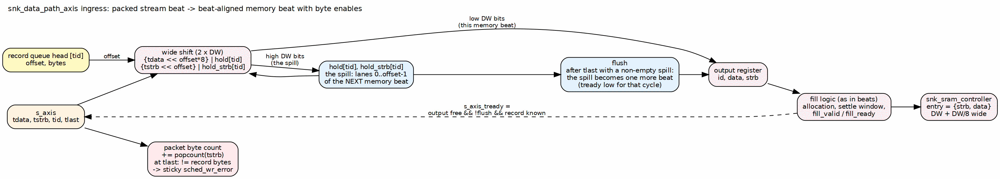

<!-- RTL Design Sherpa Documentation Header -->
<table>
<tr>
<td width="80">
  
</td>
<td>
  <strong>RTL Design Sherpa</strong> · <em>Learning Hardware Design Through Practice</em> 
  
    <a href="https://github.com/sean-galloway/RTLDesignSherpa">GitHub</a> ·
    <a href="https://github.com/sean-galloway/RTLDesignSherpa/blob/main/docs/DOCUMENTATION_INDEX.md">Documentation Index</a> ·
    <a href="https://github.com/sean-galloway/RTLDesignSherpa/blob/main/LICENSE">MIT License</a>
  
</td>
</tr>
</table>

---

<!-- End Header -->

# Sink Data Path with AXIS (Ingress)

**Module:** `snk_data_path_axis.sv`
**Location:** `projects/components/dma-ip/rapids/rtl/macro/`
**Status:** Implemented
**Last Updated:** 2026-09-30

---

## Overview

This module puts an AXI-Stream slave in front of the [Sink Data Path](03_snk_data_path.md) and converts a packed byte stream into beat-aligned memory beats with byte enables. It is the block that makes the sink side byte-granular.

A packet arrives with its bytes packed from lane 0. Its destination in memory starts at a byte offset inside the first memory beat. The scheduler supplies that offset in a packet record. The module shifts each stream beat up by the offset, holds the bytes that spill past the beat boundary, and merges them into the next memory beat. After the last stream beat, a non-empty spill becomes one more, partial, memory beat.

### Key Features

- **Barrel shift by the destination offset:** stream lane `l` lands in memory lane `offset + l`.
- **Byte enables follow the data:** the shifted strobe is stored beside the data and becomes WSTRB.
- **Per-channel state:** spill hold, received-byte count and length-error flag per channel, so packets of different channels interleave by beat.
- **Packet record queue:** four records per channel, fed by the scheduler.
- **Descriptor gating:** the stream is accepted only when the channel has a packet record.
- **Length check:** a packet whose byte count differs from the descriptor sets a sticky channel error.
- **Allocation logic unchanged from RAPIDS Beats**, including the settle wait.

### Figure 3.4.1: Ingress Shifter

**Source:** [01_ingress_shifter.dot](../assets/graphviz/01_ingress_shifter.dot)

---

## Parameters

Parameters of [Sink Data Path](03_snk_data_path.md) apply unchanged. The additions are:

| Parameter | Default | Description |
|-----------|---------|-------------|
| `AXIS_ID_WIDTH` | 8 | `tid` width. The low `CIW` bits select the channel. |
| `AXIS_DEST_WIDTH` | 4 | `tdest` width. Not used to select a channel. |
| `AXIS_USER_WIDTH` | 1 | `tuser` width. Not used. |
| `SW` | `DW / 8` | Byte lanes per beat. |
| `OFF_W` | `$clog2(SW)` | Width of the packet-record offset. |

: Table 3.4.1: Additional Parameters

---

## Interfaces

### AXI-Stream Slave

| Signal | Direction | Width | Description |
|--------|-----------|-------|-------------|
| `s_axis_tdata` | input | DW | Packed data. |
| `s_axis_tstrb` | input | SW | Byte strobes. Contiguous from lane 0. Partial only on the `tlast` beat. |
| `s_axis_tlast` | input | 1 | Last beat of the packet. |
| `s_axis_tid` | input | AXIS_ID_WIDTH | Channel select. |
| `s_axis_tdest` | input | AXIS_DEST_WIDTH | Unused. |
| `s_axis_tuser` | input | AXIS_USER_WIDTH | Unused. |
| `s_axis_tvalid` | input | 1 | Beat valid. |
| `s_axis_tready` | output | 1 | Beat accepted. |

: Table 3.4.2: AXI-Stream Slave

`s_axis_tready` is high when the output register is free, no flush beat is pending and the addressed channel has a packet record queued. A channel's stream therefore stalls until its scheduler has fetched the descriptor. `s_axis_tready` is a single signal qualified by the TID of the beat on the bus, so a beat for a channel that has no record blocks the stream, and any channel's beats behind it, until that record arrives. Channels on one stream are not isolated from each other; a system that needs isolation gives each channel its own stream or guarantees the descriptor is queued before the packet is sent.

### Scheduler Interface

The write request and completion ports are those of [Sink Data Path](03_snk_data_path.md). The packet record ports are new:

| Signal | Direction | Width | Description |
|--------|-----------|-------|-------------|
| `sched_wr_pkt_valid` | input | NC | Record pulse from the scheduler. |
| `sched_wr_pkt_ready` | output | NC | Record queue not full. |
| `sched_wr_pkt_bytes` | input | NC x 32 | Packet length in bytes. |
| `sched_wr_pkt_offset` | input | NC x OFF_W | Destination offset in the first memory beat. |

: Table 3.4.3: Packet Record Ports

`sched_wr_error` is the OR of the write engine's B-response error and the packet length error of the channel.

### Other Ports

The AXI4 write master is that of [Sink Data Path](03_snk_data_path.md). `cfg_alloc_size` (8 bits) is the allocation segment per request, with 0 treated as 1. The debug outputs are `dbg_sram_bridge_pending`, `dbg_sram_bridge_out_valid`, `dbg_axis_beats_received` and `dbg_axis_packets_received`. `o_active_channel_id` and `o_active_channel_valid` carry the write engine's active channel to the per-channel bus meter.

---

## Ingress Operation

### Packet Records

Each channel has a four-entry queue of `{offset, bytes}`. A record is pushed on `sched_wr_pkt_valid` when the queue is not full and popped when the packet completes. The head record supplies the offset for every beat of the packet and the expected length at `tlast`.

### Placement

For an accepted stream beat, with `off` the head record's offset:

- The wide word is `(tdata << off*8) | hold_data`, of width `2*DW`.
- The wide strobe is `(tstrb << off) | hold_strb`, of width `2*SW`.
- The low half goes to the output register as the memory beat and its enables.
- The high half becomes the new hold for the channel.

The first memory beat has its low `off` strobe bits clear, so the bytes below the start address are not written.

### Flush and Completion

On `tlast` the received-byte total is compared with the head record. If the wide strobe's high half is non-zero, a flush is scheduled and `s_axis_tready` drops until the hold has been emitted as the last memory beat. The packet then completes and its record pops. If the high half is empty the packet completes on the `tlast` beat itself.

### Length Check

`r_pkt_rx_bytes` counts the popcount of `tstrb` over the packet. At `tlast`, a total that differs from the record's byte count sets the channel's sticky error. Nothing is padded or dropped. The error is visible on `sched_wr_error` and the scheduler treats it as fatal.

### Allocation

The output register holds one memory beat for the fill interface. Allocation follows the beats design:

- A channel requests `cfg_alloc_size` beats, or the remainder when less is free.
- The next allocation of a channel waits three cycles after its previous one so `fill_space_free` is current.
- A beat leaves the output register only when the fill interface accepts it.

---

## Differences from RAPIDS Beats

| Item | RAPIDS Beats | RAPIDS |
|------|--------------|--------|
| Stream beat to memory beat | one to one, full lanes | shifted by the offset, spill held |
| `s_axis_tstrb` | full only | partial on the `tlast` beat |
| Byte enables into SRAM | none | `{strb, data}` word |
| Packet record queue | absent | four per channel |
| Stream gating | buffers before the descriptor | waits for the packet record |
| Length mismatch | not checked | sticky channel error |

: Table 3.4.4: Ingress Delta

The beats chapter is [Sink Data Path with AXIS](../../rapids_beats_mas/ch03_macro_blocks/04_sink_data_path_axis.md).

---

**Last Updated:** 2026-09-30
