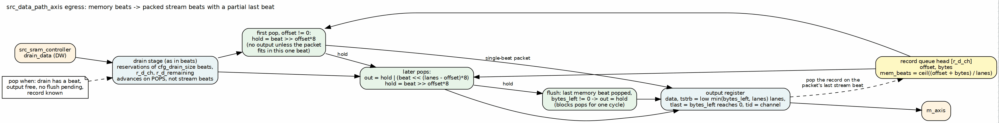
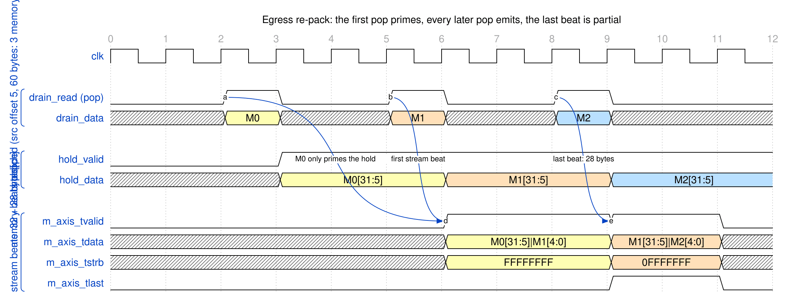

<!-- RTL Design Sherpa Documentation Header -->
<table>
<tr>
<td width="80">
  
</td>
<td>
  <strong>RTL Design Sherpa</strong> · <em>Learning Hardware Design Through Practice</em> 
  
    <a href="https://github.com/sean-galloway/RTLDesignSherpa">GitHub</a> ·
    <a href="https://github.com/sean-galloway/RTLDesignSherpa/blob/main/docs/DOCUMENTATION_INDEX.md">Documentation Index</a> ·
    <a href="https://github.com/sean-galloway/RTLDesignSherpa/blob/main/LICENSE">MIT License</a>
  
</td>
</tr>
</table>

---

<!-- End Header -->

# Source Data Path with AXIS (Egress)

**Module:** `src_data_path_axis.sv`
**Location:** `projects/components/dma-ip/rapids/rtl/macro/`
**Status:** Implemented
**Last Updated:** 2026-09-30

---

## Overview

This module puts an AXI-Stream master behind the source data path. It pops beat-aligned memory beats from the SRAM and re-packs them into stream beats that start at lane 0, so a packet leaves as exactly the bytes its descriptor named.

A descriptor's source address may start in the middle of a beat. The scheduler supplies that offset and the byte length in a packet record. The module shifts each memory beat down by the offset, holds the bytes that belong to the next stream beat, and marks the last stream beat with a contiguous strobe and `tlast`. One descriptor produces one AXI-Stream packet.

### Key Features

- **Barrel shift by the source offset:** memory lane `offset + l` goes out on stream lane `l`.
- **Partial last beat:** `tstrb` is the low `min(bytes_left, SW)` lanes and `tlast` marks the final beat.
- **Packets follow descriptors,** not drain reservations.
- **Two-stage reservation and drain,** unchanged from RAPIDS Beats. The drain stage advances on memory-beat pops, not on stream handshakes.
- **Per-channel state:** hold, bytes-left and beats-left per channel, so reservations of different channels interleave.
- **Packet record queue:** four records per channel, fed by the scheduler.

### Figure 3.7.1: Egress Shifter

**Source:** [02_egress_shifter.dot](../assets/graphviz/02_egress_shifter.dot)

---

## Parameters

| Parameter | Default | Description |
|-----------|---------|-------------|
| `NUM_CHANNELS` | 8 | Channels (alias `NC`). |
| `ADDR_WIDTH` | 64 | Address width (alias `AW`). |
| `DATA_WIDTH` | 512 | Data width in bits (alias `DW`). The board uses 256. |
| `AXI_ID_WIDTH` | 8 | AXI ID width (alias `IW`). |
| `SRAM_DEPTH` | 512 | Words per channel partition. |
| `SEG_COUNT_WIDTH` | `$clog2(SRAM_DEPTH) + 1` | Space counter width. |
| `PIPELINE` | 1 | SRAM read pipeline setting. |
| `AR_MAX_OUTSTANDING` | 8 | ARs the read engine may have in flight. |
| `AXIS_ID_WIDTH` | 8 | `tid` width. |
| `AXIS_DEST_WIDTH` | 4 | `tdest` width. |
| `AXIS_USER_WIDTH` | 1 | `tuser` width. |
| `SW` | `DW / 8` | Byte lanes per beat. |
| `OFF_W` | `$clog2(SW)` | Width of the packet-record offset. |

: Table 3.7.1: Parameters

---

## Interfaces

### Configuration

| Signal | Direction | Width | Description |
|--------|-----------|-------|-------------|
| `cfg_axi_rd_xfer_beats` | input | 8 | Read burst size cap in beats, minus one. |
| `cfg_drain_size` | input | 8 | Beats per drain reservation. 0 is treated as 1. |
| `cfg_channel_reset` | input | NC | Per-channel reset, level or pulse. Clears the channel's queue, hold, egress counters, drain reservations and error flag. |

: Table 3.7.2: Configuration

### Scheduler Interface

| Signal | Direction | Width | Description |
|--------|-----------|-------|-------------|
| `sched_rd_valid` | input | NC | Channel requests reads. |
| `sched_rd_addr` | input | NC x AW | Working source byte address. |
| `sched_rd_beats` | input | NC x 32 | Beats still to read. |
| `sched_rd_pkt_valid` | input | NC | Record pulse from the scheduler. |
| `sched_rd_pkt_ready` | output | NC | Record queue not full. |
| `sched_rd_pkt_bytes` | input | NC x 32 | Packet length in bytes. |
| `sched_rd_pkt_offset` | input | NC x OFF_W | Source offset in the first memory beat. |
| `sched_rd_done_strobe` | output | NC | AR issued. |
| `sched_rd_beats_done` | output | NC x 32 | Beats in that AR. |
| `sched_rd_error` | output | NC | Sticky read error. |

: Table 3.7.3: Scheduler Interface

### AXI-Stream Master

| Signal | Direction | Width | Description |
|--------|-----------|-------|-------------|
| `m_axis_tdata` | output | DW | Packed data. |
| `m_axis_tstrb` | output | SW | Contiguous from lane 0. Partial only on the `tlast` beat. |
| `m_axis_tlast` | output | 1 | Last beat of the packet. |
| `m_axis_tid` | output | AXIS_ID_WIDTH | Channel. |
| `m_axis_tdest` | output | AXIS_DEST_WIDTH | Channel. |
| `m_axis_tuser` | output | AXIS_USER_WIDTH | Zero. |
| `m_axis_tvalid` | output | 1 | Beat valid. |
| `m_axis_tready` | input | 1 | Consumer ready. |

: Table 3.7.4: AXI-Stream Master

### Other Ports

The AXI4 read master is that of the [AXI Read Engine](../ch02_fub_blocks/03_axi_read_engine.md), with `IW`-bit IDs and `DW`-bit data. The debug outputs are `dbg_rd_all_complete`, `dbg_r_beats_rcvd`, `dbg_sram_writes`, `dbg_arb_request`, `dbg_sram_bridge_pending`, `dbg_sram_bridge_out_valid`, `dbg_axis_beats_sent` and `dbg_axis_packets_sent`.

---

## Egress Operation

### Reservation and Drain

Unchanged from RAPIDS Beats. A round-robin decision per cycle selects a channel whose available data, less reservations still in flight, reaches `cfg_drain_size` beats. It may also select one whose fill is finished and has any data left. Each decision is a one-cycle `drain_req` of up to `cfg_drain_size` beats. Up to four reservations queue ahead of the drain stage, which loads the next entry on the last beat of the current one.

### Pop

A memory beat is popped when all of these hold:

- The drain stage is active on channel `c` and has a beat.
- The output register is free or being taken.
- No flush is pending.
- The channel's packet record is known.

Each pop counts against the reservation block, so the drain stage advances on pops.

### Shift and Hold

With `off` the head record's offset:

| Situation | Action |
|-----------|--------|
| `off = 0` | Every pop emits a stream beat. |
| `off > 0`, first pop | The pop only primes the hold with `beat >> off*8`. It emits only when the packet fits in that single memory beat. |
| `off > 0`, later pops | Emit `hold | (beat << (SW - off)*8)`. The new hold is `beat >> off*8`. |
| Last memory beat popped, bytes left | The flush emits the hold alone. |

: Table 3.7.5: Egress Shift Rules

The memory beat count of a packet is `(off + bytes + SW - 1) >> OFF_W`, computed in 33 bits.

### Strobe and Last

Each emitted beat carries `n = min(bytes_left, SW)` bytes. `tstrb` is the low `n` lanes. `tlast` is set on the beat where `bytes_left` equals `n`. That beat also retires the packet record and clears the channel's hold, started flag and counters.

### Waveform 3.7: Egress Re-pack

**Source:** [01_egress_repack.json](../assets/wavedrom/01_egress_repack.json)

Offset 5, 60 bytes and a 256-bit beat give three memory beats. The first pop, M0, only primes the hold. The second pop emits the first stream beat with 32 bytes. The third pop emits the last beat with 28 bytes, `tstrb` `0FFFFFFF` and `tlast`.

---

## Channel Reset

`cfg_channel_reset[ch]` is a register level, so a pulse and a held level must both work. As in the sink ingress the data path forms `w_rst[ch] = cfg_channel_reset[ch] | r_rst_d1[ch]`, a two-cycle stretch of a pulse. The read engine clears its error flag and settles the reads in flight (see [AXI Read Engine](../ch02_fub_blocks/03_axi_read_engine.md)); the data path clears everything that would otherwise let the old descriptor keep streaming:

| State | Action on `w_rst[ch]` |
|-------|-----------------------|
| Packet record queue | Pointers cleared. A record arriving on the reset cycle is not pushed. |
| Egress state | `r_eg_started`, `r_hold_valid`, `r_hold_data`, `r_eg_bytes_left` and `r_eg_mem_left` cleared. |
| Drain reservation | Grants for the channel are masked. `r_drain_tminus1[ch]` is cleared. |
| Reservation queue | Entries that belong to the channel are zeroed. An entry of size 0 loads the drain stage idle, so the drain stage skips it. A reservation being drained for the channel is dropped. |
| Output register | A beat already in `r_out` completes, so `m_axis` stays stable. |

: Table 3.7.6: Channel Reset Actions

The channel's SRAM partition is cleared by `src_sram_controller`, which holds one single-channel `sram_controller` per channel with a registered per-channel reset `r_ch_rst_n[ch]`. The shared STREAM controller has no channel reset of its own and is not modified. Reads of the old descriptor that are already on the bus are discarded by the read engine, so no stale data reaches the cleared partition.

**A packet cut by the reset is left unterminated.** If the reset lands after the first beat of a packet has gone out and before its `tlast` beat, the data path does not send a `tlast` and does not send a null terminator. The downstream receiver sees the packet stop. A packet that had not started, or whose `tlast` beat was already in `r_out` when the reset hit, is unaffected. A receiver that needs to resynchronize after a channel reset treats the reset as the end of the packet.

Other channels are unaffected: every term above is indexed by channel, the drain and reservation stages skip only the channel in reset, and their beats keep flowing through the shared `m_axis`.

---

## Differences from RAPIDS Beats

| Item | RAPIDS Beats | RAPIDS |
|------|--------------|--------|
| Stream beat from memory beat | one to one, full lanes | shifted by the offset, hold merged |
| `m_axis_tstrb` | all ones | contiguous, partial on the last beat |
| `m_axis_tlast` | on the drain block boundary | on the last byte of the descriptor |
| Drain advance | stream handshakes | memory-beat pops |
| Packet framing | one per drain block | one per descriptor |
| Packet record queue | absent | four per channel |
| Channel reset | not applicable | per-channel clear of every stage, cut packet left unterminated |
| Reservation stage, allocation of drain | | Unchanged |

: Table 3.7.7: Egress Delta

The beats chapter is [Source Data Path with AXIS](../../rapids_beats_mas/ch03_macro_blocks/07_source_data_path_axis.md).

---

**Last Updated:** 2026-09-30
