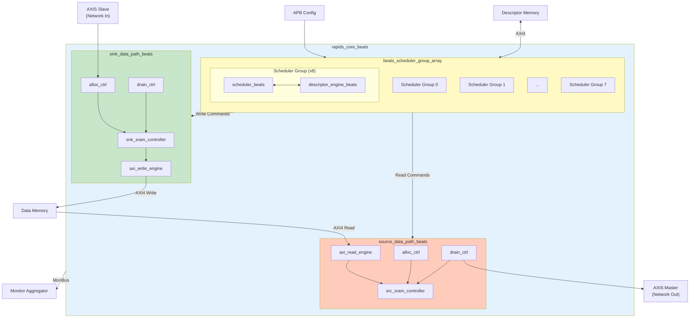
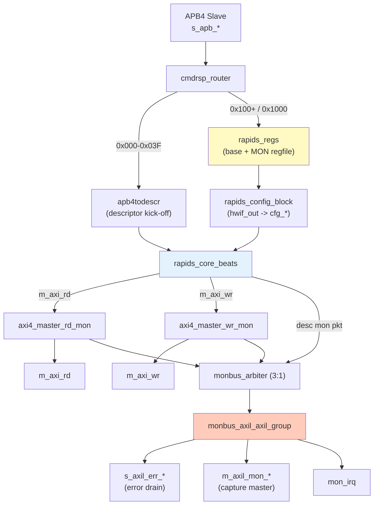

<!-- RTL Design Sherpa Documentation Header -->
<table>
<tr>
<td width="80">
  <a href="https://github.com/sean-galloway/RTLDesignSherpa">
    
  </a>
</td>
<td>
  <strong>RTL Design Sherpa</strong> · <em>Learning Hardware Design Through Practice</em><br>
  <sub>
    <a href="https://github.com/sean-galloway/RTLDesignSherpa">GitHub</a> ·
    <a href="https://github.com/sean-galloway/RTLDesignSherpa/blob/main/docs/DOCUMENTATION_INDEX.md">Documentation Index</a> ·
    <a href="https://github.com/sean-galloway/RTLDesignSherpa/blob/main/LICENSE">MIT License</a>
  </sub>
</td>
</tr>
</table>

---

<!-- End Header -->

# Block Diagram

## Top-Level Architecture


**Source:** [04_block_diagram.mmd](../assets/mermaid/04_block_diagram.mmd)



## Top-Level Integration (rapids_beats_top)

`rapids_core_beats` is wrapped by `rapids_beats_top`, which adds the software
register interface, configuration mapping, and monitoring infrastructure. A
single APB slave feeds a command/response router that splits accesses between
per-channel descriptor kick-off (`apb4todescr`, 0x000-0x03F) and the `rapids_regs`
register block (base config at 0x100-0x3FF, monitor regfile at 0x1000).
`rapids_config_block` translates the register `hwif_out` into the core/monitor
`cfg_*` signals.

When `USE_AXI_MONITORS = 1`, AXI transaction monitors observe the read and write
data masters; their packets are merged with the core descriptor-monitor packet
by a `monbus_arbiter` and delivered through a `monbus_axil_axil_group` to an
AXI-Lite error-drain slave, an AXI-Lite capture master, and a `mon_irq`
interrupt.



## Component Summary

### Scheduler Group Array

The scheduler group array manages 8 independent channels:

| Component | Instance Count | Purpose |
|-----------|----------------|---------|
| `scheduler_beats` | 8 | Transfer coordination per channel |
| `descriptor_engine_beats` | 8 | Descriptor fetch and parse |
| Descriptor AXI Arbiter | 1 | Shared AXI4 for descriptor fetch |

: Scheduler Array Components

### Sink Data Path

Network-to-memory data flow:

| Component | Purpose |
|-----------|---------|
| `snk_sram_controller_beats` | Multi-channel SRAM management |
| `axi_write_engine_beats` | AXI4 burst write generation |
| `alloc_ctrl_beats` | Space allocation tracking |
| `drain_ctrl_beats` | Data availability tracking |

: Sink Path Components

### Source Data Path

Memory-to-network data flow:

| Component | Purpose |
|-----------|---------|
| `axi_read_engine_beats` | AXI4 burst read generation |
| `src_sram_controller_beats` | Multi-channel SRAM management |
| `alloc_ctrl_beats` | Space allocation tracking |
| `drain_ctrl_beats` | Data availability tracking |

: Source Path Components

## Hierarchy

```
rapids_core_beats
├── beats_scheduler_group_array
│   ├── beats_scheduler_group [0]
│   │   ├── scheduler_beats
│   │   └── descriptor_engine_beats
│   ├── beats_scheduler_group [1..6]
│   │   └── ...
│   └── beats_scheduler_group [7]
│       └── ...
├── sink_data_path_beats
│   ├── snk_sram_controller_beats
│   │   └── snk_sram_controller_unit_beats [0..7]
│   ├── axi_write_engine_beats
│   ├── alloc_ctrl_beats
│   └── drain_ctrl_beats
└── source_data_path_beats
    ├── axi_read_engine_beats
    ├── src_sram_controller_beats
    │   └── src_sram_controller_unit_beats [0..7]
    ├── alloc_ctrl_beats
    └── drain_ctrl_beats
```

## Internal Buses

| Bus | Width | Description |
|-----|-------|-------------|
| Descriptor Bus | 256-bit | Parsed descriptor to scheduler |
| Scheduler Command | Variable | Transfer parameters to data paths |
| SRAM Data | 512-bit | Data to/from SRAM buffers |
| MonBus | 64-bit | Monitor packets (aggregated) |

: Internal Bus Summary
