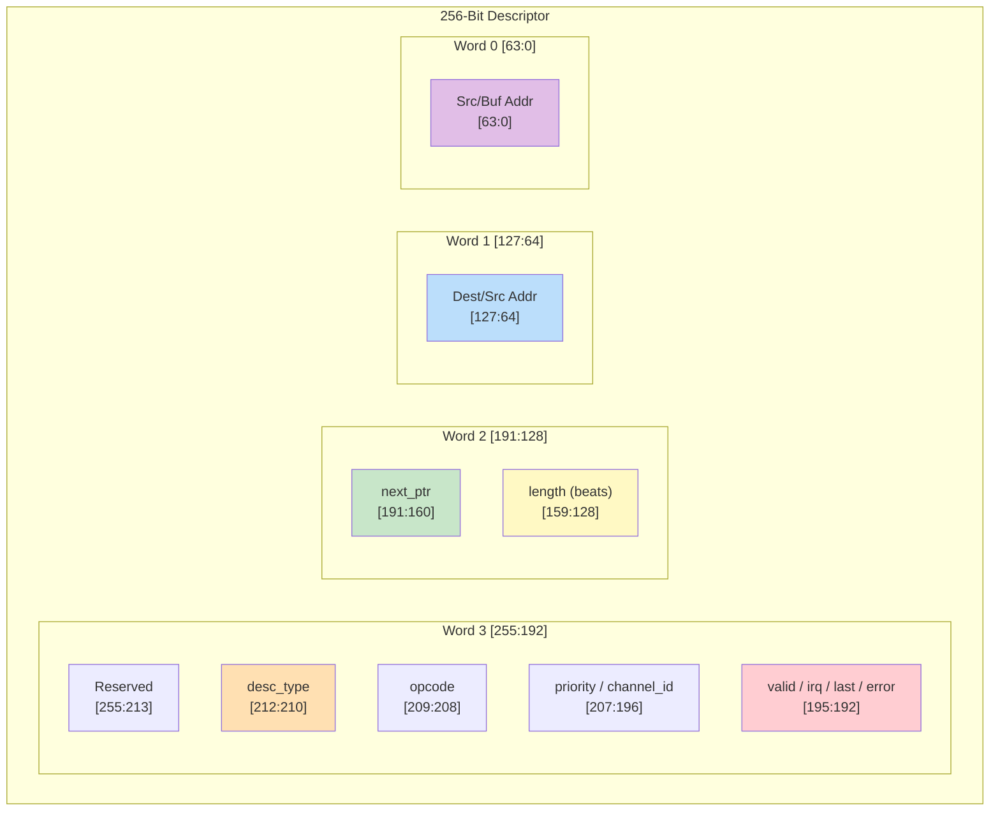

<!-- RTL Design Sherpa Documentation Header -->
<table>
<tr>
<td width="80">
  <a href="https://github.com/sean-galloway/RTLDesignSherpa">
    
  </a>
</td>
<td>
  <strong>RTL Design Sherpa</strong> · <em>Learning Hardware Design Through Practice</em><br>
  <sub>
    <a href="https://github.com/sean-galloway/RTLDesignSherpa">GitHub</a> ·
    <a href="https://github.com/sean-galloway/RTLDesignSherpa/blob/main/docs/DOCUMENTATION_INDEX.md">Documentation Index</a> ·
    <a href="https://github.com/sean-galloway/RTLDesignSherpa/blob/main/LICENSE">MIT License</a>
  </sub>
</td>
</tr>
</table>

---

<!-- End Header -->

# Descriptor Format

## Overview

RAPIDS Beats uses 256-bit (32-byte) descriptors to define DMA transfers. Descriptors are stored in system memory and fetched by the Descriptor Engine when a channel is kicked.

## Descriptor Layout

### 256-Bit Structure

```
Bit Range    Field Name           Width  Description
────────────────────────────────────────────────────────────────────────
[255:213]    reserved             43     Reserved (write 0)
[212:210]    desc_type            3      0 = LEGACY, 1 = EXTENDED (see below)
[209:208]    opcode               2       0 = DATA, 1 = CTRL_READ, 2 = CTRL_WRITE
[207:200]    priority             8      Transfer priority (informational)
[199:196]    channel_id           4      Channel ID (informational)
[195]        error                1      Error flag (written by hardware)
[194]        last                 1      Last descriptor in chain
[193]        gen_irq              1      Generate interrupt on completion
[192]        valid                1      Descriptor valid flag
[191:160]    next_descriptor_ptr  32     Address of next descriptor (0 = last)
[159:128]    length               32     Transfer length in BEATS (not bytes)
[127:64]     dst_addr             64     Destination address
[63:0]       src_addr             64     Source address
```

: 256-Bit Descriptor Layout (`rapids_pkg::descriptor_t`)

The authoritative definition is `rapids_pkg::descriptor_t` in
`rtl/includes/rapids_pkg.sv`; the same layout is restated in the scheduler's
header comment. Note the struct is declared 272 bits wide with a 16-bit pad
above bit 255 -- only `[255:0]` is fetched and used.

### Visual Layout



## Field Descriptions

### Control Bits [195:192]

| Bit | Field | Description |
|-----|-------|-------------|
| 192 | `valid` | Must be 1; a descriptor with valid=0 raises a descriptor error |
| 193 | `gen_irq` | Set to 1 to generate a completion interrupt |
| 194 | `last` | Set to 1 for the last descriptor in a chain |
| 195 | `error` | Error flag; written by hardware, write 0 |

: Control Bits

### Direction

There is no direction field in the descriptor. Direction is a property of the
**half** that owns the channel: the SOURCE half (memory -> AXIS) reads from
`src_addr`, the SINK half (AXIS -> memory) writes to `dst_addr`. A descriptor
is delivered to one half's descriptor engine by the address it was staged at,
so the same layout serves both.

### Transfer Length [159:128]

- 32-bit field specifying transfer size in BEATS, not bytes
- 1 beat = DATA_WIDTH bits (512 bits = 64 bytes in the default build)
- Length of 0 is reserved (no operation)

### Next Pointer [191:160]

- **32-bit** address of the next descriptor (zero-extended to the engine's
  64-bit address width)
- Value of 0 terminates the chain, as does `last` = 1
- Autonomous chaining also requires the address to fall inside one of the two
  configured descriptor address ranges

### Address Fields [127:0]

**For SINK transfers (network to memory):**
| Field | Usage |
|-------|-------|
| `dest_addr` [127:64] | Memory write destination address |
| `src_addr` [63:0] | Not used (write 0) |

**For SOURCE transfers (memory to network):**
| Field | Usage |
|-------|-------|
| `dest_addr` [127:64] | Not used (write 0) |
| `src_addr` [63:0] | Memory read source address |

: Address Field Usage

## Descriptor Opcodes (DATA / CTRL_READ / CTRL_WRITE)

Beyond plain `DATA` transfers, a descriptor carries a 2-bit opcode
(`rapids_pkg` `desc_op_e`) that selects one of three behaviors. `DATA`
descriptors move payload through the concurrent read/write engines (above);
the two control opcodes let a channel synchronize with a producer/consumer in
memory without moving payload -- the basis of the RAPIDS producer/consumer flow.

| Opcode | Value | Behavior |
|--------|-------|----------|
| `DATA` | `2'b00` | Concurrent read/write payload transfer (fields as above) |
| `CTRL_READ` | `2'b01` | **Consumer gate** -- poll a memory location until `(read & mask) == expected`, then release the descriptor/chain |
| `CTRL_WRITE` | `2'b10` | **Producer doorbell** -- single 32-bit write of a value to a memory location, then continue |

**CTRL_READ (consumer gate)** re-interprets the descriptor fields as a poll
specification. The scheduler drives the per-channel control-read engine, which
reads the gate address once per retry and compares the masked value; the
descriptor completes when the gate is satisfied. The retry budget is bounded by
`CTRL_CONFIG.CTRLRD_MAX_TRY` (0-511, reset 16) so a never-satisfied gate cannot
hang the channel -- exhaustion raises an error instead.

| Field | Bits | Usage |
|-------|------|-------|
| `poll_addr` | [63:0] | Gate address to poll |
| `expected` | [95:64] | Expected value after masking |
| `mask` | [127:96] | Compare mask (`(read & mask) == expected`) |
| `max_try` | [143:128] | Per-descriptor retry hint (capped by `CTRLRD_MAX_TRY`) |

**CTRL_WRITE (producer doorbell)** performs one single-beat 32-bit AXI write,
after which the chain continues. It has no poll/retry -- it is an unconditional
write used to signal a consumer.

| Field | Bits | Usage |
|-------|------|-------|
| `wr_addr` | [63:0] | Doorbell address |
| `wr_data` | [95:64] | 32-bit value to write |

The control opcodes are handled by dedicated engines (control-read /
control-write), one pair per channel, driven by the scheduler's control
interface. See the MAS Scheduler (Section 2.1) and Control-Read / Control-Write
Engine specifications (Sections 2.8 / 2.9).

## Extended Descriptors (row/col-major addressing)

`desc_type` = 1 (EXTENDED) selects strided / 2-D / circular addressing instead
of linear accumulation. It is gated at build time by
`USE_ROW_COL_MAJOR_ADDRESSING`; when that parameter is 0 the second-chunk fetch
is unreachable and synthesizes away, and an EXT descriptor is treated as legacy.

An extended descriptor is **512 bits in two 256-bit chunks**. Chunk 0 is the
layout above with `desc_type` = 1. Chunk 1 holds the address-generator
configuration and is fetched by a second single-beat read at
`descriptor_addr + 0x20`, so the two chunks must be contiguous in memory.

```
Chunk 1 (at descriptor_addr + 0x20)
Bit Range    Field Name        Width  Description
──────────────────────────────────────────────────────────────────────
[255:192]    reserved_hi       64     Reserved (future 3rd dimension)
[191:188]    wr_reserved       4      Reserved
[187:182]    wr_wrap1_log2     6      Write outer wrap window, log2 (0 = off)
[181:176]    wr_wrap0_log2     6      Write inner wrap window, log2 (0 = off)
[175:160]    wr_inner_count    16     Write beats per contiguous run
[159:128]    wr_stride_1       32     Write outer stride, SIGNED bytes
[127:96]     wr_stride_0       32     Write inner stride, SIGNED bytes
[95:92]      rd_reserved       4      Reserved
[91:86]      rd_wrap1_log2     6      Read outer wrap window, log2 (0 = off)
[85:80]      rd_wrap0_log2     6      Read inner wrap window, log2 (0 = off)
[79:64]      rd_inner_count    16     Read beats per contiguous run
[63:32]      rd_stride_1       32     Read outer stride, SIGNED bytes
[31:0]       rd_stride_0       32     Read inner stride, SIGNED bytes
```

: Extended Descriptor Chunk 1 (`rapids_pkg::descriptor_ext_t`)

Read and write are configured independently, which is what makes transpose
possible: one side bursts while the other issues single beats.

**Mode selection is implicit.** The hardware compares `stride_0` against the
beat size (`DATA_WIDTH/8`):

| Condition | Mode | Behaviour |
|-----------|------|-----------|
| `stride_0 == beat_size` | run-contiguous | bursts `inner_count` beats, then jumps to the next run base |
| `stride_0 != beat_size` | per-beat 2-D | one beat per address; transpose, gather, scatter |

Addresses follow `addr = base + (i0 * stride_0) + (i1 * stride_1)`, with each
offset masked by `(1 << wrap_log2) - 1` when that wrap field is non-zero, giving
circular buffers. `i0` is the fast index and runs to `inner_count`. Strides are
signed, so negative values walk backwards.

The layout is byte-compatible with STREAM's `descriptor_ext_t`, so one
descriptor builder serves both engines.

## Descriptor Fetch Timing

```wavedrom
{
  "signal": [
    {"name": "clk", "wave": "p..........|........."},
    {},
    ["AXI Read",
      {"name": "arvalid", "wave": "01.0.......|........."},
      {"name": "arready", "wave": "1..........|........."},
      {"name": "araddr", "wave": "x=.x.......|.........", "data": ["DESC_ADDR"]},
      {"name": "arlen", "wave": "x=.x.......|.........", "data": ["0 (1 beat)"]},
      {"name": "arsize", "wave": "x=.x.......|.........", "data": ["5 (32B)"]}
    ],
    {},
    ["AXI Read Data",
      {"name": "rvalid", "wave": "0...1.0....|........."},
      {"name": "rready", "wave": "1..........|........."},
      {"name": "rdata", "wave": "x...=.x....|.........", "data": ["DESC[255:0]"]},
      {"name": "rlast", "wave": "0...1.0....|........."}
    ],
    {},
    ["Parsed Fields",
      {"name": "desc_valid", "wave": "0....1.0...|........."},
      {"name": "desc_type", "wave": "x....=.x...|.........", "data": ["LEGACY"]},
      {"name": "desc_opcode", "wave": "x....=.x...|.........", "data": ["DATA"]},
      {"name": "desc_length", "wave": "x....=.x...|.........", "data": ["0x100"]},
      {"name": "desc_next_ptr", "wave": "x....=.x...|.........", "data": ["0x1000"]}
    ]
  ],
  "config": {"hscale": 1},
  "head": {"text": "Descriptor Fetch and Parse"}
}
```

## Alignment Requirements

| Field | Alignment | Notes |
|-------|-----------|-------|
| Descriptor address | 32-byte | One descriptor is 32 bytes; an EXTENDED descriptor's chunk 1 is fetched at `+0x20` |
| `next_ptr` [191:160] | 32-byte | 32-bit descriptor address, zero-extended by the engine |
| `dst_addr` [127:64] | DATA_WIDTH/8 | 64-byte for 512-bit data |
| `src_addr` [63:0] | DATA_WIDTH/8 | 64-byte for 512-bit data |

: Address Alignment Requirements

**Note:** Unaligned addresses may cause unpredictable behavior or AXI protocol violations.

## Descriptor Examples

### Sink Descriptor (Network to Memory)

A 256-beat sink transfer to `0x1_0000_0000`, chained to a descriptor at
`0x2000`, raising an interrupt on completion.

```
64-bit words, LSB word first:
[63:0]    = 0x0000_0000_0000_0000  // src_addr  (unused by the SINK half)
[127:64]  = 0x0000_0001_0000_0000  // dst_addr  = 0x1_0000_0000
[191:128] = 0x0000_2000_0000_0100  // next_ptr[191:160]=0x2000, length[159:128]=256
[255:192] = 0x0000_0000_0000_0007  // valid=1, gen_irq=1, last=1

Word 3 detail:
  [192] = 1        // valid
  [193] = 1        // gen_irq
  [194] = 1        // last
  [195] = 0        // error (hardware-written)
  [199:196] = 0    // channel_id (informational)
  [207:200] = 0    // priority
  [209:208] = 00   // opcode = DATA
  [212:210] = 000  // desc_type = LEGACY
```

### Source Descriptor (Memory to Network)

A 128-beat source transfer from `0x2_0000_0000`, terminated by `next_ptr = 0`.

```
64-bit words, LSB word first:
[63:0]    = 0x0000_0002_0000_0000  // src_addr = 0x2_0000_0000
[127:64]  = 0x0000_0000_0000_0000  // dst_addr (unused by the SOURCE half)
[191:128] = 0x0000_0000_0000_0080  // next_ptr = 0 (terminates), length = 128
[255:192] = 0x0000_0000_0000_0003  // valid=1, gen_irq=1, last=0

Word 3 detail:
  [192] = 1        // valid
  [193] = 1        // gen_irq
  [194] = 0        // not last -- next_ptr = 0 terminates the chain
  [209:208] = 00   // opcode = DATA
  [212:210] = 000  // desc_type = LEGACY
```

## Software Construction

### C Structure Example

```c
typedef struct __attribute__((packed, aligned(32))) {
    uint64_t src_addr;      // [63:0]
    uint64_t dst_addr;      // [127:64]
    uint32_t length;        // [159:128]  transfer length in BEATS
    uint32_t next_ptr;      // [191:160]  32-bit, 0 terminates the chain
    uint32_t flags;         // [223:192]  see macros below
    uint32_t reserved[2];   // [255:224]
} rapids_descriptor_t;

// flags bit positions are relative to descriptor bit 192
#define DESC_VALID          (1u << 0)   // [192]
#define DESC_GEN_IRQ        (1u << 1)   // [193]
#define DESC_LAST           (1u << 2)   // [194]
#define DESC_ERROR          (1u << 3)   // [195] hardware-written
#define DESC_CHANNEL_ID(n)  (((n) & 0xFu) << 4)    // [199:196]
#define DESC_PRIORITY(n)    (((n) & 0xFFu) << 8)   // [207:200]
#define DESC_OPCODE(n)      (((n) & 0x3u) << 16)   // [209:208]
#define DESC_TYPE(n)        (((n) & 0x7u) << 18)   // [212:210]

#define DESC_OP_DATA        0x0
#define DESC_OP_CTRL_READ   0x1
#define DESC_OP_CTRL_WRITE  0x2

#define DESC_TYPE_LEGACY    0x0
#define DESC_TYPE_EXT       0x1
```

### Descriptor Ring Setup

```c
// Allocate descriptor ring (must be 32-byte aligned)
rapids_descriptor_t *desc_ring = aligned_alloc(32, NUM_DESC * sizeof(rapids_descriptor_t));

// Initialize chain
for (int i = 0; i < NUM_DESC - 1; i++) {
    desc_ring[i].next_ptr = (uint64_t)&desc_ring[i + 1];
    desc_ring[i].control = DESC_CTRL_IRQ_EN;
}

// Last descriptor
desc_ring[NUM_DESC - 1].next_ptr = 0;
desc_ring[NUM_DESC - 1].control = DESC_CTRL_LAST | DESC_CTRL_IRQ_EN;
```

