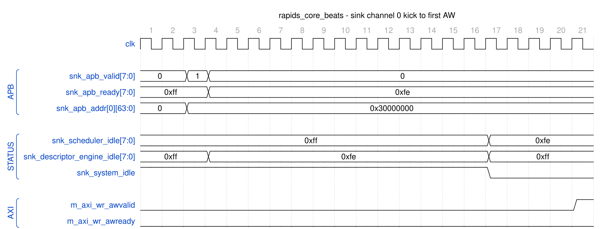

<!-- RTL Design Sherpa Documentation Header -->
<table>
<tr>
<td width="80">
  <a href="https://github.com/sean-galloway/RTLDesignSherpa">
    
  </a>
</td>
<td>
  <strong>RTL Design Sherpa</strong> · <em>Learning Hardware Design Through Practice</em><br>
  <sub>
    <a href="https://github.com/sean-galloway/RTLDesignSherpa">GitHub</a> ·
    <a href="https://github.com/sean-galloway/RTLDesignSherpa/blob/main/docs/DOCUMENTATION_INDEX.md">Documentation Index</a> ·
    <a href="https://github.com/sean-galloway/RTLDesignSherpa/blob/main/LICENSE">MIT License</a>
  </sub>
</td>
</tr>
</table>

---

<!-- End Header -->

# Architecture Overview

**Module:** `rapids_core_beats.sv`
**Location:** `projects/components/dmas/rapids/rtl/macro_beats/`
**Status:** Implemented
**Last Updated:** 2025-01-10

---

## Overview

The RAPIDS "Beats" architecture is a Phase 1 implementation providing network-to-memory and memory-to-network data transfer capabilities. The name "beats" reflects the design decision to track all transfers at beat granularity (data-width units) for simplified flow control.

### Key Features

- **8 Independent Channels:** Each channel has its own descriptor chain and SRAM allocation
- **Separate Data Paths:** Sink (network-to-memory) and source (memory-to-network) paths
- **Beat-Level Tracking:** All flow control operates at beat granularity
- **SRAM Buffering:** Separate sink and source SRAM buffers for data staging
- **MonBus Integration:** Comprehensive monitoring for all subsystems
- **Streaming Pipelines:** No FSM in data engines - pure streaming for maximum throughput

### Block Diagram

### Figure 1.1.1: RAPIDS Beats Architecture Block Diagram

```
                              rapids_core_beats
    +-------------------------------------------------------------------------+
    |                                                                         |
    |  +-------------------------------------------------------------------+  |
    |  |              beats_scheduler_group_array (8 channels)             |  |
    |  |  +----------------+  +----------------+       +----------------+  |  |
    |  |  | scheduler_grp  |  | scheduler_grp  |  ...  | scheduler_grp  |  |  |
    |  |  |    [0]         |  |    [1]         |       |    [7]         |  |  |
    |  |  +----------------+  +----------------+       +----------------+  |  |
    |  |         |                   |                        |           |  |
    |  |         v                   v                        v           |  |
    |  |  +----------------------------------------------------------+    |  |
    |  |  |           Shared Descriptor AXI Master                   |    |  |
    |  |  |              (Round-Robin Arbitration)                   |    |  |
    |  |  +----------------------------------------------------------+    |  |
    |  +-------------------------------------------------------------------+  |
    |         |                                              |                |
    |         v                                              v                |
    |  +--------------------+                    +------------------------+   |
    |  |   SINK DATA PATH   |                    |   SOURCE DATA PATH     |   |
    |  | (Network -> Memory)|                    | (Memory -> Network)    |   |
    |  |                    |                    |                        |   |
    |  |  Fill Interface    |                    |  Drain Interface       |   |
    |  |       |            |                    |        ^               |   |
    |  |       v            |                    |        |               |   |
    |  |  snk_sram_ctrl     |                    |  src_sram_ctrl         |   |
    |  |       |            |                    |        ^               |   |
    |  |       v            |                    |        |               |   |
    |  |  axi_write_engine  |                    |  axi_read_engine       |   |
    |  |       |            |                    |        ^               |   |
    |  +-------|------------+                    +--------|---------------+   |
    |          v                                          |                   |
    +----------|------------------------------------------|-----------------+
               |                                          |
               v                                          |
        AXI Write Master                           AXI Read Master
        (to System Memory)                         (from System Memory)
```

---

## Data Flow Overview

### Sink Path (Network to Memory)

The sink path receives data from an external source (via Fill interface) and writes it to system memory:

### Figure 1.1.2: Sink Path Data Flow

```
1. External Fill Valid
        |
        v
2. sram_controller (STREAM): stream_alloc_ctrl reserves space
        |
        v
3. sram_controller: per-channel gaxi_fifo_sync takes the beats
        |
        v
4. sram_controller: stream_drain_ctrl reports data available
        |
        v
5. axi_write_engine_beats (AXI Burst Write)
        |
        v
6. System Memory
```

### Source Path (Memory to Network)

The source path reads data from system memory and sends it to an external destination (via Drain interface):

### Figure 1.1.3: Source Path Data Flow

```
1. Scheduler Request
        |
        v
2. sram_controller (STREAM): stream_alloc_ctrl reserves space
        |
        v
3. axi_read_engine_beats (AXI Burst Read)
        |
        v
4. sram_controller: per-channel gaxi_fifo_sync takes the beats
        |
        v
5. sram_controller: stream_drain_ctrl reports data available
        |
        v
6. External Drain Ready
```

---

## Key Architectural Decisions

### Beat-Level Tracking

All flow control uses beat granularity:

| Operation | Granularity | Example (512-bit DW) |
|-----------|-------------|----------------------|
| Space allocation | Beats | Request 8 beats = 512 bytes |
| Data availability | Beats | 16 beats ready = 1024 bytes |
| AXI burst length | Beats | ARLEN=15 = 16 beats |
| Latency compensation | Beats | 2-beat pipeline delay |

: Table 1.1.1: Beat Granularity Examples

### Concurrent Read/Write

To prevent deadlock with large transfers:

```
Example: 100MB transfer with 2KB SRAM buffer

Sequential operation (WRONG):
1. Read 100MB -> DEADLOCK at 2KB (SRAM full, can't complete read)

Concurrent operation (CORRECT):
1. Read starts filling SRAM -> SRAM becomes full (2KB)
2. Read pauses (natural backpressure)
3. Write drains SRAM -> SRAM has free space
4. Read resumes -> Both continue until 100MB complete
```

### Virtual FIFOs (Alloc/Drain)

The alloc_ctrl and drain_ctrl modules are "virtual FIFOs" that track space/data without storing actual data:

- **stream_alloc_ctrl:** Tracks allocated space (write pointer advances on allocation, read pointer on actual write)
- **stream_drain_ctrl:** Tracks available data (write pointer advances on data arrival, read pointer on drain reservation). Its virtual depth is 2 x SRAM_DEPTH so the latency bridge's parked beats never make it refuse a real write (stream BUG-011)
- Both live inside STREAM's `sram_controller_unit`, one per channel, reached through the `snk_`/`src_sram_controller_beats` naming wrappers since `bdf4e0dff`. RAPIDS' own `alloc_ctrl_beats` / `drain_ctrl_beats` / `latency_bridge_beats` are kept and tested but no longer in this path.

---

## Module Hierarchy

```
rapids_core_beats
├── monbus_arbiter                       (merges the two halves' monbus)
├── rapids_src_beats                     (SOURCE half)
│   ├── scheduler_group_array_beats
│   │   ├── scheduler_group_beats [0..7]
│   │   │   ├── scheduler_beats
│   │   │   ├── descriptor_engine_beats
│   │   │   ├── ctrlrd_engine
│   │   │   └── ctrlwr_engine
│   │   ├── arbiter_round_robin [x3]     (desc / ctrlrd / ctrlwr AXI masters)
│   │   ├── axi4_master_rd_monlite       (descriptor-fetch monitor)
│   │   └── axi_bus_meter
│   └── src_data_path_axis_beats
│       └── src_data_path_beats
│           ├── axi_read_engine_beats
│           └── src_sram_controller_beats    (naming wrapper)
│               └── sram_controller          (STREAM, shared)
│                   └── sram_controller_unit [0..7]
│                       ├── stream_alloc_ctrl
│                       ├── gaxi_fifo_sync   (the per-channel SRAM)
│                       ├── stream_drain_ctrl
│                       └── stream_latency_bridge
└── rapids_snk_beats                     (SINK half, same shape)
    ├── scheduler_group_array_beats
    │   └── ...
    └── snk_data_path_axis_beats
        └── snk_data_path_beats
            ├── axi_write_engine_beats
            └── snk_sram_controller_beats
                └── sram_controller (STREAM, shared)
                    └── sram_controller_unit [0..7]
```

`alloc_ctrl_beats`, `drain_ctrl_beats` and `latency_bridge_beats` (fub_beats) are
not in this tree: since `bdf4e0dff` the SRAM path is STREAM's controller. They
keep their tests and filelists as standalone FUBs.

---

## Timing Diagram: Basic Transfer

### Figure 1.1.4: Basic Sink Path Transfer Timing



**Source:** [rapids_core_beats_sink_kick.json](../assets/wavedrom/rapids_core_beats_sink_kick.json),
captured from `dv/tests/top_beats/test_rapids_core_beats.py` (sink path, channel 0,
32 beats, 512-bit data, `TEST_LEVEL=full`) with `WAVES=1`.

Reading it: the AXIS packet is already sitting in the sink SRAM when software kicks
channel 0 (`snk_apb_valid[0]` for one cycle with the descriptor address 0x30000000).
`snk_apb_ready[0]` drops the same cycle and stays low while the channel is busy.
The descriptor engine leaves idle immediately to fetch the descriptor; twelve cycles
later it hands the descriptor to the scheduler, its own idle returns, and
`snk_scheduler_idle[0]` and `snk_system_idle` fall together. The first AW follows four
cycles after that. `snk_system_idle` returns after the last B response of the transfer
(not in this window); the busy-then-idle sequence is what the top-level tests wait on.

---

## Related Documentation

- **[Top-Level Port List](02_port_list.md)** - Complete port specification
- **[Clocks and Reset](03_clocks_and_reset.md)** - Timing requirements
- **[Beats Scheduler Group](../ch03_macro_blocks/01_beats_scheduler_group.md)** - Scheduler integration
- **[Sink Data Path](../ch03_macro_blocks/03_sink_data_path.md)** - Sink path details

---

**Last Updated:** 2025-01-10
