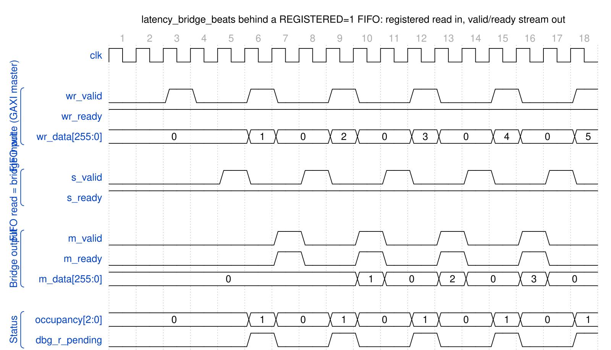

<!-- RTL Design Sherpa Documentation Header -->
<table>
<tr>
<td width="80">
  <a href="https://github.com/sean-galloway/RTLDesignSherpa">
    
  </a>
</td>
<td>
  <strong>RTL Design Sherpa</strong> · <em>Learning Hardware Design Through Practice</em><br>
  <sub>
    <a href="https://github.com/sean-galloway/RTLDesignSherpa">GitHub</a> ·
    <a href="https://github.com/sean-galloway/RTLDesignSherpa/blob/main/docs/DOCUMENTATION_INDEX.md">Documentation Index</a> ·
    <a href="https://github.com/sean-galloway/RTLDesignSherpa/blob/main/LICENSE">MIT License</a>
  </sub>
</td>
</tr>
</table>

---

<!-- End Header -->

# Latency Bridge (beats) Specification

**Module:** `latency_bridge_beats.sv`
**Location:** `projects/components/dmas/rapids/rtl/fub_beats/`
**Status:** Implemented, tested, not in the SRAM path
**Last Updated:** 2026-09-27

> **Not in the SRAM datapath since 2026-09-26.** RAPIDS' SRAM path is STREAM's
> `sram_controller`, which carries its own `stream_latency_bridge` (the same
> design), reached through the `snk_`/`src_sram_controller_beats` naming
> wrappers (`bdf4e0dff`). This FUB is still built and verified -- it keeps its
> test, its filelist and its `rapids_all.f` entry -- but nothing in
> `rapids_core_beats` instantiates it. This page is the FUB's own
> specification.

---

## Overview

`latency_bridge_beats` turns a **registered-read FIFO** -- one whose data
appears the cycle *after* the read handshake -- into a plain **valid/ready
stream** the consumer can stall at will. It is a data-width bridge: it moves
`DATA_WIDTH` bits per beat and carries nothing else. There is no beat count, no
channel ID and no programmable delay in it; an earlier version of this page
described such an interface, and it never existed in this module.

### Key Features

- **One-cycle glue, one skid buffer:** a single flop (`r_drain_ip`) remembers
  that a FIFO read was accepted, so the data that lands the next cycle is pushed
  into a `gaxi_fifo_sync` skid of depth `SKID_DEPTH`
- **Full throughput when the consumer is ready:** back-to-back reads are accepted
  as long as the skid keeps draining
- **Backpressure absorbed in the skid:** `s_ready` drops only when a skid write is
  actually stalled, so the FIFO is never read into a slot that does not exist
- **Occupancy reported:** `occupancy` counts the beats the bridge holds (the one
  in flight plus the skid contents), which is what an occupancy-based
  data-available counter needs
- **Debug taps:** `dbg_r_pending` and `dbg_r_out_valid` expose the in-flight flop
  and the skid output valid, for catching stuck data from a test

### Block Diagram

### Figure 2.7.1: Latency Bridge Block Diagram

```
                     latency_bridge_beats
       +-----------------------------------------------------+
       |                                                     |
 s_valid ---->|                  |            |              |
 s_ready <----|  glue: r_drain_ip|--valid---->| gaxi_fifo_   |----> m_valid
 s_data  ---->|  (1 cycle)       |--data----->| sync (skid,  |<---- m_ready
       |      |                  |            | SKID_DEPTH)  |----> m_data
       |      +------------------+            +------+-------+     |
       |                                             |             |
       |   occupancy = r_drain_ip + skid_count  <----+             |
       +-----------------------------------------------------+
```

---

## Concept: bridging a registered read

A FIFO with `REGISTERED=1` read (the SRAM style this repo uses so BRAM infers
cleanly) answers a read handshake with data **one cycle later**. A consumer
speaking valid/ready expects data *with* valid, and may deassert ready at any
time. Without a bridge the FIFO has already popped a beat the consumer did not
take.

```
cycle 0   s_valid && s_ready         FIFO read accepted        r_drain_ip <= 1
cycle 1   data arrives on s_data     skid_wr_valid = r_drain_ip, data pushed
cycle N   m_valid && m_ready         consumer drains the skid at its own pace
```

The bridge never guesses about downstream readiness: `s_ready` is derived from
the skid's room, counting only a write that is *stalled* this cycle as pending
(a write that completes this cycle frees its slot at the same edge). That is
why full throughput holds while writes complete immediately, and why the FIFO is
never over-read when they do not.

---

## Parameters

```systemverilog
parameter int DATA_WIDTH = 64;   // Beat width
parameter int SKID_DEPTH = 4;    // Skid buffer depth (2-4 recommended)
parameter int DW = DATA_WIDTH;   // Short alias
```

: Table 2.7.1: Latency Bridge Parameters

`occupancy` is 3 bits wide and counts 0..5 at the default depth (one beat in
flight plus four in the skid); a larger `SKID_DEPTH` needs the port widened.

---

## Port List

### Clock and Reset

| Signal | Direction | Width | Description |
|--------|-----------|-------|-------------|
| `clk` | input | 1 | System clock |
| `rst_n` | input | 1 | Active-low reset |

: Table 2.7.2: Clock and Reset

### Upstream Interface (from the registered FIFO)

| Signal | Direction | Width | Description |
|--------|-----------|-------|-------------|
| `s_valid` | input | 1 | FIFO has a beat to read (not empty) |
| `s_ready` | output | 1 | Bridge accepts a read this cycle; the data lands NEXT cycle |
| `s_data` | input | DW | Read data, valid one cycle after the `s_valid && s_ready` handshake |

: Table 2.7.3: Upstream Interface

### Downstream Interface (to the consumer)

| Signal | Direction | Width | Description |
|--------|-----------|-------|-------------|
| `m_valid` | output | 1 | Beat available |
| `m_ready` | input | 1 | Consumer takes the beat |
| `m_data` | output | DW | Beat data, valid with `m_valid` |

: Table 2.7.4: Downstream Interface

### Status and Debug

| Signal | Direction | Width | Description |
|--------|-----------|-------|-------------|
| `occupancy` | output | 3 | Beats held by the bridge: the in-flight read plus the skid contents (0..5) |
| `dbg_r_pending` | output | 1 | `r_drain_ip`: a read was accepted and its data is due next cycle |
| `dbg_r_out_valid` | output | 1 | Skid output valid (mirrors `m_valid`) |

: Table 2.7.5: Status and Debug

---

## Operation

### Figure 2.7.2: Latency Bridge Timing (consumer always ready)



**Source:** [latency_bridge_beats_streaming.json](../assets/wavedrom/latency_bridge_beats_streaming.json),
captured from `dv/tests/fub_beats/test_latency_bridge_beats.py` (`streaming`,
256-bit, seed 7) with `WAVES=1`. The test drives a `REGISTERED = 1`
`gaxi_fifo_sync` in front of the bridge (`dv/tb/latency_bridge_beats_tb_top.sv`),
because that is the only way to produce the bridge's upstream contract: a
valid/ready master presents data *with* valid, a registered FIFO presents it
one cycle *after* the read handshake.

Reading it: each `wr_valid` beat lands in the FIFO and `s_valid` (FIFO not empty)
rises a cycle later; the bridge reads it at once (`s_ready` stays high) and
`dbg_r_pending` marks the cycle the data is in flight. Two cycles after the
write the beat is on `m_valid`/`m_data` with its payload intact (1, 2, 3, ...),
and `occupancy` shows exactly one beat inside the bridge per transfer. With a
consumer that is always ready the bridge adds the FIFO's read latency and no
more.

An earlier revision of this test drove `s_*` directly from the BFM and never
compared `m_data`; every beat came out 0 and the test passed (rapids TASK-003).
(`dv/tests/fub_beats/test_latency_bridge_beats.py`).

---

## Integration Context

The bridge sits between a `gaxi_fifo_sync` with `REGISTERED=1` and whatever
consumes the stream. The same arrangement, with STREAM's twin
`stream_latency_bridge`, is what `sram_controller_unit` uses inside the shared
SRAM controller today; `occupancy` there is what the drain accounting
must allow for (stream BUG-011).

```systemverilog
latency_bridge_beats #(
    .DATA_WIDTH (512),
    .SKID_DEPTH (4)
) u_bridge (
    .clk             (clk),
    .rst_n           (rst_n),
    // registered-read FIFO side
    .s_valid         (fifo_rd_valid),
    .s_ready         (fifo_rd_ready),
    .s_data          (fifo_rd_data),
    // consumer side
    .m_valid         (drain_valid),
    .m_ready         (drain_read),
    .m_data          (drain_data),
    // status / debug
    .occupancy       (bridge_occupancy),
    .dbg_r_pending   (dbg_bridge_pending),
    .dbg_r_out_valid (dbg_bridge_out_valid)
);
```

---

## Design Considerations

| SKID_DEPTH | Behaviour |
|---:|---|
| 2 | Minimum: one stall of the consumer costs a bubble on the next read |
| 4 | Default: absorbs a short consumer stall with no upstream bubble |
| 8 | Deeper stall absorption; `occupancy` must be widened past 3 bits |

: Table 2.7.6: Skid Depth Selection

The skid does not need to cover the FIFO's read latency (that is the one
`r_drain_ip` flop's job); it needs to cover how long the *consumer* stalls
without the bridge stopping upstream reads.

---

**Last Updated:** 2026-09-27
