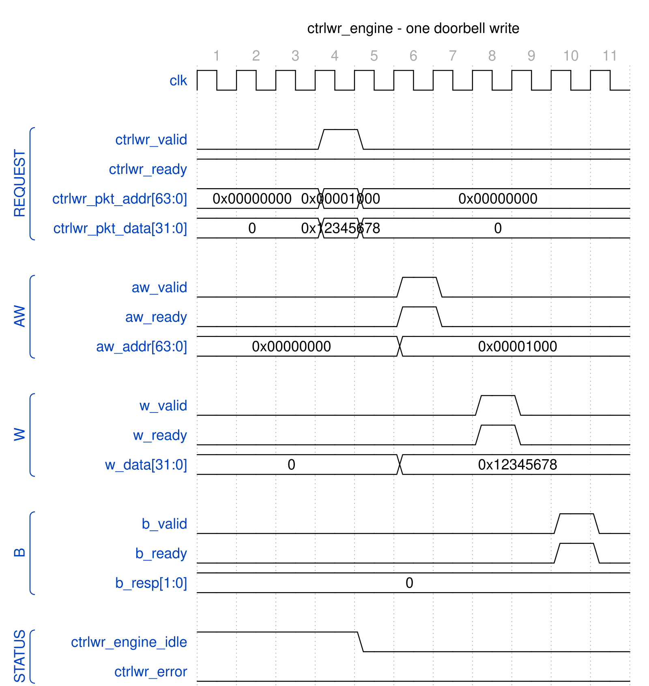

<!-- RTL Design Sherpa Documentation Header -->
<table>
<tr>
<td width="80">
  <a href="https://github.com/sean-galloway/RTLDesignSherpa">
    
  </a>
</td>
<td>
  <strong>RTL Design Sherpa</strong> · <em>Learning Hardware Design Through Practice</em><br>
  <sub>
    <a href="https://github.com/sean-galloway/RTLDesignSherpa">GitHub</a> ·
    <a href="https://github.com/sean-galloway/RTLDesignSherpa/blob/main/docs/DOCUMENTATION_INDEX.md">Documentation Index</a> ·
    <a href="https://github.com/sean-galloway/RTLDesignSherpa/blob/main/LICENSE">MIT License</a>
  </sub>
</td>
</tr>
</table>

---

<!-- End Header -->

# Control-Write Engine Specification

**Module:** `ctrlwr_engine.sv`
**Location:** `projects/components/dmas/rapids/rtl/fub/`
**Status:** Implemented
**Last Updated:** 2025-01-10

---

## Overview

The Control-Write Engine executes a `CTRL_WRITE` control descriptor (`DESC_OP_CTRL_WRITE = 2'b10`). A `CTRL_WRITE` is a producer doorbell: the engine performs a single-beat AXI4 write of the descriptor's 32-bit `wr_data` value to its 64-bit `wr_addr` target, then completes so the descriptor chain continues. One instance is dedicated per channel.

The write target address must be 4-byte aligned because the transfer is a 32-bit (`aw_size = 3'b010`) single-beat write. A null address (`wr_addr == 0`) is treated as a no-op and the request completes without issuing an AXI transaction.

### Key Features

- **Single-Beat AXI4 Write:** One 32-bit doorbell write per request (`aw_len = 0`, `w_last = 1`)
- **Producer Doorbell Semantics:** Write value to target, then release the chain (no poll, no retry)
- **Address Alignment Check:** Requires 4-byte-aligned `wr_addr`; misalignment raises an error
- **Null-Address Skip:** `wr_addr == 0` completes as a no-op
- **Channel Reset Support:** `cfg_channel_reset` returns the FSM to idle and drains any write still on the fabric
- **MonBus Integration:** Completion and error event reporting

### Block Diagram

### Figure 2.9.1: Control-Write Engine Block Diagram

```
                        +---------------------------+
    ctrlwr_valid     -->|                           |--> aw_valid
    ctrlwr_ready     <--|                           |<-- aw_ready
    ctrlwr_pkt_addr  -->|                           |--> aw_addr
    ctrlwr_pkt_data  -->|                           |--> aw_len/aw_size
                        |   CONTROL-WRITE ENGINE    |
    cfg_channel_reset-->|                           |--> w_valid
                        |                           |<-- w_ready
    ctrlwr_error     <--|                           |--> w_data/w_strb/w_last
    ctrlwr_engine_idle<-|                           |
                        |                           |<-- b_valid
                        |                           |--> b_ready
                        |                           |<-- b_id/b_resp
                        |                           |
                        |                           |--> mon_valid
                        |                           |--> mon_packet
                        +---------------------------+
```

---

## Parameters

```systemverilog
parameter int CHANNEL_ID = 0;                    // Channel identifier
parameter int NUM_CHANNELS = 32;                 // Total channels
parameter int CHAN_WIDTH = $clog2(NUM_CHANNELS); // Derived channel index width
parameter int ADDR_WIDTH = 64;                   // Address bus width
parameter int AXI_ID_WIDTH = 8;                  // AXI transaction ID width

// Monitor Bus Parameters
parameter logic [15:0] MON_AGENT_ID  = 16'h0020; // Ctrlwr Engine Agent ID
parameter logic [7:0]  MON_UNIT_ID   = 8'h01;    // Unit identifier
parameter logic [8:0]  MON_CHANNEL_ID = 9'h000;  // Base channel ID
```

: Table 2.9.1: Control-Write Engine Parameters

Note: `AXI_ID_WIDTH` must be `>= CHAN_WIDTH` (checked by an elaboration-time
`$fatal`). When instantiated in `scheduler_group_beats.sv` as `u_ctrlwr_engine`,
`MON_AGENT_ID` is overridden to `16'h0021` (`CTRLWR_MON_AGENT_ID`) to distinguish
it from the Control-Read Engine's `16'h0020`.

---

## Port List

### Clock and Reset

| Signal | Direction | Width | Description |
|--------|-----------|-------|-------------|
| `clk` | input | 1 | System clock |
| `rst_n` | input | 1 | Active-low asynchronous reset |

: Table 2.9.2: Clock and Reset

### Configuration Interface

| Signal | Direction | Width | Description |
|--------|-----------|-------|-------------|
| `cfg_channel_reset` | input | 1 | Per-channel reset: blocks new requests, drains transaction, forces idle |

: Table 2.9.3: Configuration Interface

### Scheduler Interface

| Signal | Direction | Width | Description |
|--------|-----------|-------|-------------|
| `ctrlwr_valid` | input | 1 | Request valid (doorbell write requested) |
| `ctrlwr_ready` | output | 1 | Ready to accept request |
| `ctrlwr_pkt_addr` | input | AW | Doorbell target address (`wr_addr`, 4-byte aligned) |
| `ctrlwr_pkt_data` | input | 32 | Doorbell write value (`wr_data`) |
| `ctrlwr_error` | output | 1 | Error flag (alignment or AXI response error) |
| `ctrlwr_engine_idle` | output | 1 | Engine idle (in `WRITE_IDLE`, no active transaction, not in channel reset) |

: Table 2.9.4: Scheduler Interface

### AXI4 Write Master Interface

| Signal | Direction | Width | Description |
|--------|-----------|-------|-------------|
| `aw_valid` | output | 1 | Write address valid |
| `aw_ready` | input | 1 | Write address ready |
| `aw_addr` | output | AW | Write address (`= wr_addr`) |
| `aw_len` | output | 8 | Burst length (`0` = single beat) |
| `aw_size` | output | 3 | Transfer size (`3'b010` = 4 bytes / 32-bit) |
| `aw_burst` | output | 2 | Burst type (`2'b01` = INCR) |
| `aw_id` | output | AXI_ID_WIDTH | Transaction ID (derived from `CHANNEL_ID`) |
| `aw_lock` | output | 1 | Lock type (`0` = normal) |
| `aw_cache` | output | 4 | Cache type (`4'b0010` = non-cacheable bufferable) |
| `aw_prot` | output | 3 | Protection type (`3'b000`) |
| `aw_qos` | output | 4 | Quality of service (`0`) |
| `aw_region` | output | 4 | Region identifier (`0`) |
| `w_valid` | output | 1 | Write data valid |
| `w_ready` | input | 1 | Write data ready |
| `w_data` | output | 32 | Write data (`= wr_data`) |
| `w_strb` | output | 4 | Write strobes (`4'b1111` = all bytes) |
| `w_last` | output | 1 | Last beat (`1` = single beat) |
| `b_valid` | input | 1 | Write response valid |
| `b_ready` | output | 1 | Write response ready |
| `b_id` | input | AXI_ID_WIDTH | Response ID (matched against expected AXI ID) |
| `b_resp` | input | 2 | Write response code |

: Table 2.9.5: AXI4 Write Master Interface

### MonBus Interface

| Signal | Direction | Width | Description |
|--------|-----------|-------|-------------|
| `i_mon_time` | input | 64 | Monitor timestamp side-band input |
| `mon_valid` | output | 1 | Monitor packet valid |
| `mon_ready` | input | 1 | Monitor packet ready |
| `mon_packet` | output | 128 | Monitor packet (`monitor_packet_t`) |
| `mon_timestamp` | output | 64 | Monitor packet timestamp |

: Table 2.9.6: MonBus Interface

---

## FSM States

### Figure 2.9.2: Control-Write Engine FSM

```
                    +-------------+
        rst_n=0 --> | WRITE_IDLE  |<--------------------+
                    +------+------+                     |
                           |                            |
                  request accepted                      |
                           |                            |
                           v                            |
                  +-----------------+                   |
                  | WRITE_ISSUE_ADDR|                   |
                  +--------+--------+                   |
                           |                            |
            align error    | aw handshake  null addr    |
              |            |            |               |
              v            v            +-------------->-+
        +-----------+  +-----------------+               |
        |WRITE_ERROR|  | WRITE_ISSUE_DATA|               |
        +-----+-----+  +--------+--------+               |
              |                 |                        |
              |          both phases issued              |
              |                 |                        |
              |                 v                        |
              |         +---------------+                |
              |         | WRITE_WAIT_RESP|               |
              |         +-------+--------+               |
              |                 |                        |
              |         b_resp OK? ------ error -------->-+ (WRITE_ERROR)
              |                 |                        |
              |                 v                        |
              |         +---------------+                |
              |         | WRITE_COMPLETE|----------------+
              |         +---------------+                |
              +--------------------------------------->--+
```

State summary:

- **WRITE_IDLE:** Wait for a request from the request skid buffer; latch `wr_addr`/`wr_data` and the expected AXI ID.
- **WRITE_ISSUE_ADDR:** Drive `aw_valid` until `aw_ready`. A misaligned address routes to `WRITE_ERROR`; a null address returns to `WRITE_IDLE` (no-op skip).
- **WRITE_ISSUE_DATA:** Drive `w_valid` until `w_ready`; advance once both address and data phases have been issued.
- **WRITE_WAIT_RESP:** Accept the matching `b`-channel response; a non-OKAY `b_resp` routes to `WRITE_ERROR`, otherwise to `WRITE_COMPLETE`.
- **WRITE_COMPLETE:** Emit a completion MonBus packet (unless null address) and return to `WRITE_IDLE`.
- **WRITE_ERROR:** Latch `ctrlwr_error`, emit an error MonBus packet, and return to `WRITE_IDLE`. The error flag persists until reset or `cfg_channel_reset`.

---

## Operation

### Doorbell Write Sequence

### Figure 2.9.3: Control-Write Doorbell Timing



**Source:** [ctrlwr_engine_doorbell.json](../assets/wavedrom/ctrlwr_engine_doorbell.json),
captured from `dv/tests/fub/test_ctrlwr_engine.py` (`basic_write`, channel 0, 64-bit
address, `REG_LEVEL=GATE`) with `WAVES=1`; the AXI side is the framework write slave.

Reading it: the request handshakes in one cycle (`ctrlwr_ready` is held high by the
skid buffer) with the doorbell address 0x1000 and data 0x12345678, and the engine
leaves idle the next cycle. AW goes out two cycles after the request, W two cycles
after AW, and the slave answers B (OKAY) two cycles after W; `ctrlwr_engine_idle`
returns the cycle after the B handshake, eight cycles after the request. Nothing is
pipelined across doorbells: the engine takes one request at a time.

### Request Handshake and Skid Buffer

Incoming requests are captured through a depth-2 `gaxi_skid_buffer`. The engine
accepts a request (`ctrlwr_ready`) only when not in an active channel reset. The
FSM pops the buffered request in `WRITE_IDLE`, latching `{wr_addr, wr_data}` and
computing the expected AXI ID from `CHANNEL_ID`:

```
aw_id = {{(AXI_ID_WIDTH-CHAN_WIDTH){1'b0}}, CHANNEL_ID[CHAN_WIDTH-1:0]};
```

The `b`-channel response is matched against this expected ID (`b_id == r_expected_axi_id`)
so a shared write master can be demultiplexed per channel.

### Address Validation

```
Null (skip)  : wr_addr == 64'h0
Align error  : wr_addr[1:0] != 2'b00  (and not null)
```

A null address completes immediately as a no-op with no AXI activity and no
completion packet. A misaligned address never issues on AXI; it transitions to
`WRITE_ERROR`, asserts `ctrlwr_error`, and emits an error MonBus packet.

### Error Reporting

`ctrlwr_error` is a registered, sticky flag. It is set on an alignment error or on
a non-OKAY AXI write response (`b_resp != 2'b00`), and it persists until `rst_n`
or `cfg_channel_reset`. The MonBus error packet carries either the offending
address (alignment error) or the captured `b_resp` code (AXI response error).

### Channel Reset

Asserting `cfg_channel_reset` registers `r_channel_reset_active`, which blocks new
requests (`ctrlwr_ready` low), clears the error flag and the phase-issued state, and
drives the FSM back to `WRITE_IDLE`.

A write already on the fabric cannot be cancelled, so the engine drains it (rapids
TASK-014, 2026-09-27): a raised AW stays up until accepted (`r_drain_aw`), an accepted
AW is followed by its W beat with the latched data (`r_drain_w`), and the B response
is taken and discarded (`r_drain_b`, which alone lifts `b_ready` outside
`WRITE_WAIT_RESP`). The write that was already issued therefore lands. Until B is
taken `ctrlwr_engine_idle` stays low and the request path stays closed. Before this
the reset abandoned whatever phase was in flight and left a dangling response on the
channel's ID.

`ctrlwr_engine_idle` asserts only in `WRITE_IDLE` with no pending request, no active
channel reset and nothing left to drain.

---

## Contrast with the Control-Read Engine

The Control-Write Engine is the producer counterpart to the Control-Read Engine
(Section 2.8). Both are per-channel control-descriptor executors, but they
implement opposite half of the producer/consumer handshake:

| Aspect | Control-Read Engine (2.8) | Control-Write Engine (2.9) |
|--------|---------------------------|----------------------------|
| Opcode | `DESC_OP_CTRL_READ` (`2'b01`) | `DESC_OP_CTRL_WRITE` (`2'b10`) |
| Role | Consumer gate | Producer doorbell |
| AXI direction | Read (poll) | Single-beat write |
| Semantics | Poll until `(rd & mask) == expected` | Write `wr_data` to `wr_addr`, then continue |
| Retry budget | `max_try` retry budget (config default) | None (single unconditional write) |
| Chain effect | Holds off the chain until the gate passes | Releases the chain after the write completes |
| Descriptor fields | `poll_addr` / `expected` / `mask` / `max_try` | `wr_addr` / `wr_data` |

A `CTRL_WRITE` therefore has no maximum-try configuration: it is one unconditional
32-bit write, whereas `CTRL_READ` polls with a bounded retry budget before either
passing the gate or timing out.

---

**Last Updated:** 2026-07-12
