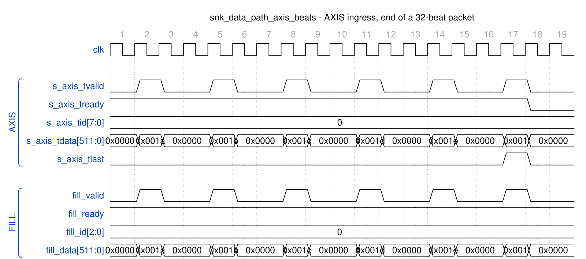

<!-- RTL Design Sherpa Documentation Header -->
<table>
<tr>
<td width="80">
  <a href="https://github.com/sean-galloway/RTLDesignSherpa">
    
  </a>
</td>
<td>
  <strong>RTL Design Sherpa</strong> · <em>Learning Hardware Design Through Practice</em><br>
  <sub>
    <a href="https://github.com/sean-galloway/RTLDesignSherpa">GitHub</a> ·
    <a href="https://github.com/sean-galloway/RTLDesignSherpa/blob/main/docs/DOCUMENTATION_INDEX.md">Documentation Index</a> ·
    <a href="https://github.com/sean-galloway/RTLDesignSherpa/blob/main/LICENSE">MIT License</a>
  </sub>
</td>
</tr>
</table>

---

<!-- End Header -->

# Sink Data Path AXIS Wrapper Specification

**Module:** `snk_data_path_axis_beats.sv`
**Location:** `projects/components/dmas/rapids/rtl/macro_beats/`
**Status:** Implemented
**Last Updated:** 2025-01-10

---

## Overview

The Sink Data Path AXIS wrapper adds an AXI-Stream slave interface to the sink data path, enabling standard AXIS ingress for network-to-memory transfers.

### Key Features

- **AXI-Stream Slave Interface:** Standard AXIS for data ingress
- **Per-Channel TID Mapping:** AXIS TID maps to fill channel ID
- **TLAST to Last Mapping:** Packet boundary tracking
- **Core Sink Integration:** Wraps sink_data_path module

### Block Diagram

### Figure 3.4.1: Sink Data Path AXIS Block Diagram

```
                        sink_data_path_axis
    +-------------------------------------------------------+
    |                                                       |
    |    AXI-Stream Slave Interface                         |
    |    +-------------------------------------------+      |
    |    | s_axis_tvalid   s_axis_tready             |      |
    |    | s_axis_tdata    s_axis_tlast              |      |
    |    | s_axis_tid      s_axis_tkeep              |      |
    |    +--------------------+----------------------+      |
    |                         |                             |
    |                         v                             |
    |    +-------------------------------------------+      |
    |    |          AXIS to Fill Converter           |      |
    |    |  - TID -> fill_id                         |      |
    |    |  - TLAST -> fill_last                     |      |
    |    |  - TVALID/TREADY -> fill handshaking     |      |
    |    +--------------------+----------------------+      |
    |                         |                             |
    |                         v                             |
    |    +-------------------------------------------+      |
    |    |            sink_data_path                 |      |
    |    |  (snk_sram_controller + axi_write_engine) |      |
    |    +--------------------+----------------------+      |
    |                         |                             |
    +-------------------------|-----------------------------+
                              v
                      AXI Write Master
```

---

## Parameters

```systemverilog
parameter int NUM_CHANNELS = 8;
parameter int ADDR_WIDTH = 64;
parameter int DATA_WIDTH = 512;
parameter int AXI_ID_WIDTH = 8;
parameter int SRAM_DEPTH = 512;
parameter int TID_WIDTH = 3;                     // log2(NUM_CHANNELS)
parameter int TDEST_WIDTH = 1;
parameter int TUSER_WIDTH = 1;
```

: Table 3.4.1: Sink Data Path AXIS Parameters

---

## Port List

### Clock and Reset

| Signal | Direction | Width | Description |
|--------|-----------|-------|-------------|
| `clk` | input | 1 | System clock |
| `rst_n` | input | 1 | Active-low reset |

: Table 3.4.2: Clock and Reset

### AXI-Stream Slave Interface

| Signal | Direction | Width | Description |
|--------|-----------|-------|-------------|
| `s_axis_tvalid` | input | 1 | Data valid |
| `s_axis_tready` | output | 1 | Ready for data |
| `s_axis_tdata` | input | DW | Data payload |
| `s_axis_tstrb` | input | SW | Byte strobes |
| `s_axis_tlast` | input | 1 | Last beat of packet |
| `s_axis_tid` | input | AXIS_ID_WIDTH | Stream ID (channel) |
| `s_axis_tdest` | input | AXIS_DEST_WIDTH | Destination |
| `s_axis_tuser` | input | AXIS_USER_WIDTH | User sideband |

: Table 3.4.3: AXI-Stream Slave Interface

### Allocation Configuration

| Signal | Direction | Width | Description |
|--------|-----------|-------|-------------|
| `cfg_alloc_size` | input | 8 | Default allocation size per request (beats) |

: Table 3.4.4: Allocation Configuration

### Scheduler Interface

| Signal | Direction | Width | Description |
|--------|-----------|-------|-------------|
| `sched_wr_valid` | input | NC | Channel requests write |
| `sched_wr_ready` | output | NC | Path ready for channel |
| `sched_wr_addr` | input | NC x AW | Destination addresses |
| `sched_wr_beats` | input | NC x 32 | Beats remaining to write |
| `sched_wr_burst_len` | input | NC x 8 | Requested burst length |
| `sched_wr_done_strobe` | output | NC | Burst ISSUED on AW handshake |
| `sched_wr_beats_done` | output | NC x 32 | Beats issued in burst |
| `sched_wr_commit_strobe` | output | NC | Burst COMMITTED on B response |
| `sched_wr_commit_beats` | output | NC x 32 | Beats committed in burst |
| `sched_wr_error` | output | NC | Sticky error flag per channel |

: Table 3.4.5: Scheduler Interface

### AXI Write Master Interface

| Signal | Direction | Width | Description |
|--------|-----------|-------|-------------|
| `m_axi_awvalid` | output | 1 | AW channel valid |
| `m_axi_awready` | input | 1 | AW channel ready |
| `m_axi_awaddr` | output | AW | Write address |
| `m_axi_awlen` | output | 8 | Burst length |
| `m_axi_awsize` | output | 3 | Burst size |
| `m_axi_awburst` | output | 2 | Burst type |
| `m_axi_awid` | output | ID_W | Transaction ID |
| `m_axi_wvalid` | output | 1 | W channel valid |
| `m_axi_wready` | input | 1 | W channel ready |
| `m_axi_wdata` | output | DW | Write data |
| `m_axi_wstrb` | output | DW/8 | Write strobes |
| `m_axi_wlast` | output | 1 | Last beat |
| `m_axi_bvalid` | input | 1 | B channel valid |
| `m_axi_bready` | output | 1 | B channel ready |
| `m_axi_bresp` | input | 2 | Write response |
| `m_axi_bid` | input | ID_W | Response ID |

: Table 3.4.6: AXI Write Master Interface

---

## Signal Mapping

### Figure 3.4.2: AXIS to Fill Interface Mapping

```
    AXIS Slave                    Fill Interface
    +----------------+            +----------------+
    | s_axis_tvalid  |----------->| snk_fill_valid |
    | s_axis_tready  |<-----------| snk_fill_ready |
    | s_axis_tdata   |----------->| snk_fill_data  |
    | s_axis_tlast   |----------->| snk_fill_last  |
    | s_axis_tid     |----------->| snk_fill_id    |
    | s_axis_tkeep   |----------->| snk_fill_strb  |
    +----------------+            +----------------+
```

---

## Timing Diagram

### Figure 3.4.3: AXIS Ingress Timing



**Source:** [snk_data_path_axis_ingress.json](../assets/wavedrom/snk_data_path_axis_ingress.json),
captured from `dv/tests/top_beats/test_rapids_core_beats.py` (sink path, channel 0,
32 beats, 512-bit data, `TEST_LEVEL=full`) with `WAVES=1`.

Reading it: each AXIS beat is passed straight through to the fill interface in the
same cycle -- `fill_valid` mirrors `s_axis_tvalid`, `fill_id` is `s_axis_tid`, and
`fill_data` is `s_axis_tdata` (the low 16 bits are shown; the payload counts up
0x1a..0x1f). `s_axis_tready` is high while channel 0 has allocated space and drops the
cycle after `s_axis_tlast` because the packet count is now complete and the next beat
would need a fresh allocation (Figure 3.3.3a).

---

## Usage Notes

1. **TID Usage:** AXIS TID directly maps to channel ID for multi-channel routing
2. **Allocation Required:** Space must be allocated via `snk_alloc_*` before AXIS data arrives
3. **Backpressure:** `s_axis_tready` deasserts when SRAM space exhausted
4. **Packet Boundaries:** TLAST marks end of AXIS packets, mapped to fill_last

---

**Last Updated:** 2025-01-10
