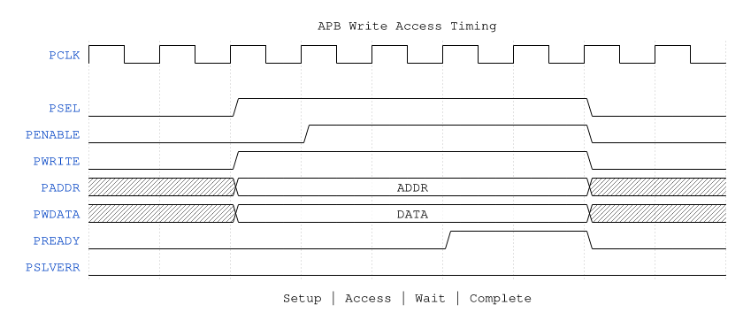
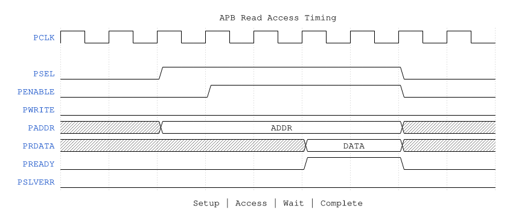

<!-- RTL Design Sherpa Documentation Header -->
<table>
<tr>
<td width="80">
  
</td>
<td>
  <strong>RTL Design Sherpa</strong> · <em>Learning Hardware Design Through Practice</em> 
  
    <a href="https://github.com/sean-galloway/RTLDesignSherpa">GitHub</a> ·
    <a href="https://github.com/sean-galloway/RTLDesignSherpa/blob/main/docs/DOCUMENTATION_INDEX.md">Documentation Index</a> ·
    <a href="https://github.com/sean-galloway/RTLDesignSherpa/blob/main/LICENSE">MIT License</a>
  
</td>
</tr>
</table>

---

<!-- End Header -->

# APB Configuration Interface

## Overview

STREAM provides an APB slave interface for software configuration and control. The interface supports:

- Channel kick-off (write descriptor address to start transfer)
- Status monitoring
- Interrupt control
- Error handling

---

## Signal Summary

| Signal | Direction | Width | Description |
|--------|-----------|-------|-------------|
| `s_apb_paddr` | Input | 13 | Address bus (8 KB space; reaches monitor block at 0x1000) |
| `s_apb_psel` | Input | 1 | Peripheral select |
| `s_apb_penable` | Input | 1 | Enable phase |
| `s_apb_pwrite` | Input | 1 | Write enable |
| `s_apb_pwdata` | Input | 32 | Write data |
| `s_apb_pstrb` | Input | 4 | Byte strobes |
| `s_apb_pready` | Output | 1 | Ready signal |
| `s_apb_prdata` | Output | 32 | Read data |
| `s_apb_pslverr` | Output | 1 | Slave error |

---

## Register Map Overview

| Offset | Register | Access | Description |
|--------|----------|--------|-------------|
| 0x000 | `CH0_CTRL_LOW` | RW | Channel 0 descriptor address [31:0] (staged) |
| 0x004 | `CH0_CTRL_HIGH` | RW | Channel 0 descriptor address [63:32] (staged) |
| 0x100 | `GLOBAL_CTRL` | RW | Global enable / reset |
| 0x104 | `GLOBAL_STATUS` | RO | SYSTEM_IDLE |
| 0x120 | `CHANNEL_ENABLE` | RW | Per-channel enable [7:0] |
| 0x124 | `CHANNEL_RESET` | RW | Per-channel reset [7:0] |
| 0x128 | `KICK_ENABLE` | RW | Launch staged addresses, one bit per channel |
| 0x140 | `CHANNEL_IDLE` | RO | Per-channel idle [7:0] |
| 0x148 | `SCHEDULER_IDLE` | RO | Scheduler idle |
| 0x150 | `CH_STATE0_STATE` | RO | Channel 0 scheduler state [6:0], one-hot |
| 0x170 | `SCHED_ERROR` | RO | Scheduler error status |
| 0x174 | `AXI_RD_COMPLETE` | RO | Read completion, one bit per channel |
| 0x178 | `AXI_WR_COMPLETE` | RO | Write completion, one bit per channel |
| 0x200 | `SCHED_TIMEOUT_CYCLES` | RW | Scheduler timeout cycles |
| 0x204 | `SCHED_CONFIG` | RW | Scheduler enable and packet enables |
| 0x220 | `DESCENG_CONFIG` | RW | Descriptor engine enable / prefetch / FIFO threshold |
| 0x2A0 | `AXI_XFER_CONFIG` | RW | RD_XFER_BEATS, WR_XFER_BEATS |
| 0x2B0 | `PERF_CONFIG` | RW | Perf profiler enable / mode / clear |
| 0x2C0 | `OBS_CTRL` | RW | Channel observation mux select |
| 0x2D0 | `PERF_DATA_LOW` | RO | Perf capture low word (FIFO head) |
| 0x2D4 | `PERF_DATA_HIGH` | RO | Perf capture high word, same entry; the FIFO pops once BOTH halves are read |
| 0x2D8 | `PERF_STATUS` | RO | EMPTY / FULL / COUNT |
| 0x1000+ | Monitor / performance registers | RW/RO | AXI monitor config (0x10C0-0x111F) and per-monitor perf counters (0x1150-0x11F4), in the separate `stream_mon_regs` regfile |

**Note:** The AXI monitor and performance registers live in a separate `stream_mon_regs` regfile instantiated at offset **0x1000** on the same APB slave. The APB address decode is therefore **13 bits (8 KB)** so those registers are addressable. Detailed monitor register layout is in the MAS (`stream_mas/ch04_registers/register_map.md`).

---

## Key Registers

### Global Control (CTRL) - 0x000

| Bits | Field | Access | Description |
|------|-------|--------|-------------|
| [0] | `ENABLE` | RW | Global enable |
| [1] | `SOFT_RESET` | RW | Soft reset (self-clearing) |
| [31:2] | Reserved | - | Reserved |

### Global Status (STATUS) - 0x004

| Bits | Field | Access | Description |
|------|-------|--------|-------------|
| [0] | `BUSY` | RO | Any channel active |
| [7:1] | Reserved | - | Reserved |
| [15:8] | `CH_ACTIVE` | RO | Per-channel active mask |
| [23:16] | `CH_ERROR` | RO | Per-channel error mask |
| [31:24] | Reserved | - | Reserved |

### Channel Control (CHn_CTRL) - 0x040 + n*0x10

| Bits | Field | Access | Description |
|------|-------|--------|-------------|
| [31:0] | `DESC_ADDR` | RW | Descriptor address (kick-off on write) |

Writing to `CHn_CTRL` initiates a transfer:
1. Descriptor address stored
2. Channel transitions from IDLE to FETCH
3. `PREADY` de-asserted until channel accepts kick-off

### Channel Status (CHn_STATUS) - 0x044 + n*0x10

| Bits | Field | Access | Description |
|------|-------|--------|-------------|
| [3:0] | `STATE` | RO | Channel FSM state |
| [4] | `IDLE` | RO | Channel is idle |
| [5] | `BUSY` | RO | Channel is processing |
| [6] | `ERROR` | RO | Error condition |
| [7] | `COMPLETE` | RO | Last transfer complete |
| [15:8] | `DESC_COUNT` | RO | Descriptors processed |
| [23:16] | `ERR_CODE` | RO | Error code if ERROR set |
| [31:24] | Reserved | - | Reserved |

### Channel Observation Control (OBS_CTRL) - 0x0C0

| Bits | Field | Access | Description |
|------|-------|--------|-------------|
| [2:0] | `CHANNEL_SEL` | RW | Channel index (0-7) for observation read |
| [31:3] | Reserved | - | Reserved |

Software writes the channel index to this register, then reads OBS_FLAGS and OBS_DATA0/DATA1 to observe that channel's internal state.

### Channel Observation Flags (OBS_FLAGS) - 0x0C4

| Bits | Field | Access | Description |
|------|-------|--------|-------------|
| [0] | `SCH_ERROR_STICKY` | RO | Scheduler error sticky (descriptor invalid, timeout, etc.) |
| [1] | `SCH_TIMEOUT` | RO | Scheduler timeout state (waiting on AXI master) |
| [7:2] | Reserved | - | Reserved |
| [31:8] | Reserved | - | Reserved |

These flags are driven by the scheduler's internal error and timeout monitoring. See `stream_mas/ch02_blocks/04_scheduler.md` for detailed definitions.

### Channel Observation Data (OBS_DATA0, OBS_DATA1) - 0x0C8, 0x0CC

Per-channel data such as descriptor state, current beat count, or other diagnostic fields. Exact contents vary by channel state; see the register map audit document for current field assignments.

---

## Access Timing

### Write Access

**Source:** [apb_write_access.json](../assets/wavedrom/apb_write_access.json)

### Read Access

**Source:** [apb_read_access.json](../assets/wavedrom/apb_read_access.json)

---

## Kick-off Blocking

When software writes to `CHn_CTRL`:

- If channel is IDLE: Immediate accept, `PREADY` asserted
- If channel is BUSY: `PREADY` held low until channel completes
- Prevents descriptor pointer corruption during active transfer

---

## Launching Channels Together (KICK_ENABLE)

Software stages a 64-bit descriptor address per channel in `CHn_CTRL_{LOW,HIGH}`
(0x000-0x03F, ordinary stored registers) and then launches with **one** write to
`KICK_ENABLE` (0x128). Each `KICKn` field is a single-pulse: the write emits a
one-cycle request and self-clears. Writing an address no longer kicks anything,
so staging and launching are separate steps and every channel starts on the same
cycle.

This matters when the APB path is reached over a slow transport (a UART-to-APB
bridge on an FPGA), where eight separate two-register kicks would serialize
channel starts over milliseconds.

**Historical note.** This replaced two earlier mechanisms: a kick block that
snooped the raw APB command stream so that the address write itself kicked (the
address was never readable state), and a pair of top-level `i_kick_burst_mask` /
`i_kick_burst_addr` ports that existed only to work around that latency from
`harness_csr`. **Neither exists in the RTL.** This page documented the
`i_kick_burst_*` ports as a live interface until 2026-09-26; there are no such
ports on any module, and `KICK_ENABLE` needs no port plumbing outside STREAM.
See the comment at `rtl/top/stream_top_ch8.sv:405-417`.