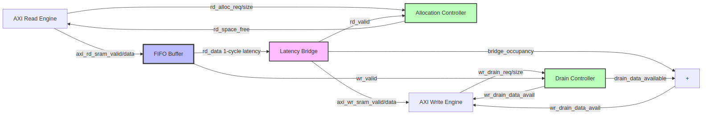

<!-- RTL Design Sherpa Documentation Header -->
<table>
<tr>
<td width="80">
  <a href="https://github.com/sean-galloway/RTLDesignSherpa">
    
  </a>
</td>
<td>
  <strong>RTL Design Sherpa</strong> · <em>Learning Hardware Design Through Practice</em><br>
  <sub>
    <a href="https://github.com/sean-galloway/RTLDesignSherpa">GitHub</a> ·
    <a href="https://github.com/sean-galloway/RTLDesignSherpa/blob/main/docs/DOCUMENTATION_INDEX.md">Documentation Index</a> ·
    <a href="https://github.com/sean-galloway/RTLDesignSherpa/blob/main/LICENSE">MIT License</a>
  </sub>
</td>
</tr>
</table>

---

<!-- End Header -->

# SRAM Controller Unit

**Module:** `sram_controller_unit.sv`
**Location:** `projects/components/dmas/stream/rtl/fub/`
**Category:** FUB (Functional Unit Block)
**Parent:** `sram_controller.sv`
**Status:** Implemented
**Last Updated:** 2025-11-30

---

## Overview

The `sram_controller_unit` module is a single-channel SRAM controller unit containing allocation controller, FIFO buffer, and latency bridge. It handles one channel's data flow from AXI read engine through buffering to AXI write engine with proper flow control.

### Key Features

- **Three-Component Architecture:**
  - Allocation controller (stream_alloc_ctrl) - Space tracking for reads
  - FIFO buffer (gaxi_fifo_sync) - Physical data storage
  - Latency bridge (stream_latency_bridge) - Timing compensation
- **Drain Controller:** Tracks data availability for write engine
- **Virtual FIFO Pattern:** Pointer arithmetic without data storage for flow control
- **Registered Outputs:** Breaks combinatorial paths for timing closure

---

## Architecture

### Block Diagram

### Figure 1: SRAM Controller Unit Block Diagram



**Source:** [06_sram_controller_unit_block.mmd](../assets/mermaid/06_sram_controller_unit_block.mmd)

### Component Hierarchy

```
sram_controller_unit
 stream_alloc_ctrl          # Allocation tracking (space availability)
 stream_drain_ctrl          # Drain tracking (data availability)
 gaxi_fifo_sync             # Physical data storage FIFO
 stream_latency_bridge      # 1-cycle latency compensation
```

### Data Flow

```
AXI Read Engine � FIFO Write Port � FIFO Storage � FIFO Read Port � Latency Bridge � AXI Write Engine
                                                                            
         Allocation Controller (space tracking) 
                                                                             
                                          Drain Controller (data tracking) 
```

### Controller Naming Convention (CRITICAL)

**Allocation Controller Perspective:**
- `wr` side = ALLOCATE (reserve space, advance wr_ptr)
- `rd` side = FULFILL (data arrives, advance rd_ptr, FREE space)

**Drain Controller Perspective:**
- `wr` side = DATA WRITTEN (increment occupancy)
- `rd` side = DRAIN REQUEST (reserve data for write burst)

This is OPPOSITE of normal FIFO naming conventions!

---

## Parameters

| Parameter | Type | Default | Description |
|-----------|------|---------|-------------|
| `DATA_WIDTH` | int | 512 | Data width in bits |
| `SRAM_DEPTH` | int | 512 | FIFO depth in entries |
| `SEG_COUNT_WIDTH` | int | $clog2(SRAM_DEPTH)+1 | Width for count signals |

: Parameters

### Derived Parameters

| Parameter | Derivation | Description |
|-----------|------------|-------------|
| `DW` | DATA_WIDTH | Short alias |
| `SD` | SRAM_DEPTH | Short alias |
| `SCW` | SEG_COUNT_WIDTH | Segment count width |
| `ADDR_WIDTH` | $clog2(SD) | FIFO address width |

: Derived Parameters

---

## Port List

### Clock and Reset

| Signal | Direction | Width | Description |
|--------|-----------|-------|-------------|
| `clk` | input | 1 | System clock |
| `rst_n` | input | 1 | Active-low asynchronous reset |

: Clock and Reset

### Allocation Interface (Read Engine Flow Control)

| Signal | Direction | Width | Description |
|--------|-----------|-------|-------------|
| `axi_rd_alloc_req` | input | 1 | Request space allocation |
| `axi_rd_alloc_size` | input | 8 | Beats to reserve |
| `axi_rd_alloc_space_free` | output | SCW | Free space available |

: Allocation Interface

### Write Interface (AXI Read Engine to FIFO)

| Signal | Direction | Width | Description |
|--------|-----------|-------|-------------|
| `axi_rd_sram_valid` | input | 1 | Write data valid |
| `axi_rd_sram_ready` | output | 1 | Ready to accept data |
| `axi_rd_sram_data` | input | DW | Write data payload |

: Write Interface

### Drain Interface (Write Engine Flow Control)

| Signal | Direction | Width | Description |
|--------|-----------|-------|-------------|
| `axi_wr_drain_data_avail` | output | SCW | Data available for drain |
| `axi_wr_drain_req` | input | 1 | Request to drain data |
| `axi_wr_drain_size` | input | 8 | Beats to drain |

: Drain Interface

### Read Interface (FIFO to AXI Write Engine)

| Signal | Direction | Width | Description |
|--------|-----------|-------|-------------|
| `axi_wr_sram_valid` | output | 1 | Read data valid |
| `axi_wr_sram_ready` | input | 1 | Ready to accept data |
| `axi_wr_sram_data` | output | DW | Read data payload |

: Read Interface

### Debug Interface

| Signal | Direction | Width | Description |
|--------|-----------|-------|-------------|
| `dbg_bridge_pending` | output | 1 | Data in flight in bridge |
| `dbg_bridge_out_valid` | output | 1 | Bridge output valid |

: Debug Interface

---

## Operation

### Allocation Flow

1. **Space Check:** Read engine checks `axi_rd_alloc_space_free`
2. **Reservation:** Read engine asserts `axi_rd_alloc_req` with burst size
3. **Space Decrement:** Allocation controller decrements space_free
4. **Data Arrival:** Data enters FIFO via `axi_rd_sram_*` interface
5. **Space Release:** When data exits (output handshake), space_free increments

### Drain Flow

1. **Data Check:** Write engine checks `axi_wr_drain_data_avail`
2. **Reservation:** Write engine asserts `axi_wr_drain_req` with burst size
3. **Data Decrement:** Drain controller decrements data_available
4. **Data Consumption:** Write engine reads via `axi_wr_sram_*` interface

### Data Available Calculation

```systemverilog
// Total data available = drain controller data + latency bridge occupancy
assign axi_wr_drain_data_avail = drain_data_available + SCW'(bridge_occupancy);
```

The latency bridge can hold 1 beat in flight plus up to 4 beats in its skid buffer, which must be accounted for in the data availability count.

---

## Integration Example

```systemverilog
sram_controller_unit #(
    .DATA_WIDTH     (512),
    .SRAM_DEPTH     (512),
    .SEG_COUNT_WIDTH(10)
) u_sram_controller_unit (
    .clk                    (clk),
    .rst_n                  (rst_n),

    // Allocation interface
    .axi_rd_alloc_req       (axi_rd_alloc_req[ch]),
    .axi_rd_alloc_size      (axi_rd_alloc_size),
    .axi_rd_alloc_space_free(axi_rd_alloc_space_free[ch]),

    // Write interface (from AXI Read Engine)
    .axi_rd_sram_valid      (axi_rd_sram_valid[ch]),
    .axi_rd_sram_ready      (axi_rd_sram_ready[ch]),
    .axi_rd_sram_data       (axi_rd_sram_data),

    // Drain interface
    .axi_wr_drain_data_avail(axi_wr_drain_data_avail[ch]),
    .axi_wr_drain_req       (axi_wr_drain_req[ch]),
    .axi_wr_drain_size      (axi_wr_drain_size[ch]),

    // Read interface (to AXI Write Engine)
    .axi_wr_sram_valid      (axi_wr_sram_valid[ch]),
    .axi_wr_sram_ready      (axi_wr_sram_ready[ch]),
    .axi_wr_sram_data       (axi_wr_sram_data[ch]),

    // Debug
    .dbg_bridge_pending     (dbg_bridge_pending[ch]),
    .dbg_bridge_out_valid   (dbg_bridge_out_valid[ch])
);
```

---

## Common Issues

### Issue 1: Space Accounting Mismatch

**Symptom:** Read engine sees space but FIFO overflows

**Root Causes:**
1. Allocation controller not receiving fulfillment signals
2. Output handshake not connected to allocation controller rd_valid

**Solution:** Ensure `axi_wr_sram_valid && axi_wr_sram_ready` connects to allocation controller.

### Issue 2: Data Available Undercount

**Symptom:** Write engine stalls despite data in FIFO

**Root Causes:**
1. Bridge occupancy not included in data_available calculation
2. Drain controller not receiving write handshakes

**Solution:** Verify `axi_wr_drain_data_avail = drain_data_available + bridge_occupancy`.

---

## Related Documentation

- **Parent:** `08_sram_controller.md` - Multi-channel SRAM controller
- **Allocation Controller:** `07_stream_alloc_ctrl.md` - Space tracking details
- **Drain Controller:** `11_stream_drain_ctrl.md` - Data tracking details
- **Latency Bridge:** `10_stream_latency_bridge.md` - Timing compensation
- **Read Engine:** `06_axi_read_engine.md` - Data producer
- **Write Engine:** `12_axi_write_engine.md` - Data consumer
---

## Revision History

| Version | Date | Author | Description |
|---------|------|--------|-------------|
| 0.90 | 2025-11-22 | seang | Initial block specification |
| 0.91 | 2026-01-02 | seang | Added table captions and figure numbers |

: SRAM Controller Unit Revision History

---

**Last Updated:** 2026-01-02
