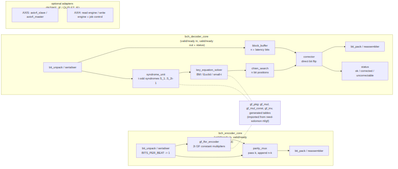

<!-- RTL Design Sherpa Documentation Header -->
<table>
<tr>
<td width="80">
  
</td>
<td>
  <strong>RTL Design Sherpa</strong> · <em>Learning Hardware Design Through Practice</em> 
  
    <a href="https://github.com/sean-galloway/RTLDesignSherpa">GitHub</a> ·
    <a href="https://github.com/sean-galloway/RTLDesignSherpa/blob/main/docs/DOCUMENTATION_INDEX.md">Documentation Index</a> ·
    <a href="https://github.com/sean-galloway/RTLDesignSherpa/blob/main/LICENSE">MIT License</a>
  
</td>
</tr>
</table>

---

<!-- End Header -->

# Block Diagram

### Figure 3.1: Codec block diagram

The two cores, the shared GF layer imported from the reed-solomon component,
and the optional adapters that wrap a core for standalone use.

## The encoder core

Four blocks in a straight line. `bit_unpack` (or its beat-to-bit serialiser)
slices each beat into the `BITS_PER_BEAT` lanes and tracks the position in
the block. `gf_lfsr_encoder` is the systematic encoder: a 2t-stage shift
register over GF(2^m) with the generator polynomial's coefficients as
constant multipliers on its taps; it is cleared at block start, the k data
bits shift through (the RS-shaped LFSR consumes them serially or in the
parallel form chosen by D6), and it then holds the parity symbols.
`parity_mux` passes the data bits and then appends the parity, raising
`last` on the final one. `bit_pack` reassembles beats. A skid buffer after
the unpack and before the pack decouples the stages.

## The decoder core

The received block is written into `block_buffer` and, in the same cycles,
into `syndrome_unit`, whose t cells each accumulate one odd syndrome by
Horner's rule as the bits arrive. When the block is complete the odd
syndromes go to `key_equation_solver` -- one of the candidates from PRD D11
-- which produces the error-locator polynomial in at most 2t iterations, or
flags the block uncorrectable. `chien_search` then walks every one of the n
bit positions, one per cycle (or more if D6 chooses a parallel tree), in
lock-step with the buffer read-out; where it finds a root, `corrector`
flips the bit leaving the buffer. `status` counts corrections and raises the
per-block verdict with the final bit. An all-zero syndrome set bypasses the
solver and drains the buffer uncorrected.

Because the code is binary there is no Forney evaluator: the error value is
always 1. A second syndrome unit over the corrected stream may be added as a
re-check, matching the RS decoder's release-on-verdict discipline; that is a
D11 / implementation detail, not part of the locator search.

## The GF layer

The GF layer is imported from `projects/components/ecc-ip/reed-solomon/rtl/gf/`.
`gf_pkg` holds the field: the primitive polynomial, the generator
coefficients and the log/antilog tables, all generated from the profile
parameters. Three primitives are built on it: `gf_mul_const` (a constant
multiply, an XOR network), `gf_mul` (full multiply, AND array plus
reduction) and `gf_inv` (table inverse). Everything arithmetic in both cores
is one of these three; the block counts are in chapter 5.3.

## The adapters

Present only when `INTAKE_IF` or `OUTLET_IF` is not `NONE`. The AXI-Stream
adapter is the house `axis4_slave` (intake) or `axis4_master` (outlet) timing
wrapper with TLAST as the block boundary and TUSER carrying any erasure flags
in or status out. The AXI4 adapter is a read engine (job in, stream out) or a
write engine (stream in, bursts out) with a job controller that sequences
them from the register block or a descriptor stream. Chapter 4 specifies each.

## Hierarchy

The complete bottom-up hierarchy -- every block, what it does and every
component it instantiates with counts -- will be recorded in a companion FUB
catalog once the RTL exists. This chapter names the blocks; that catalog will
be the authority on their contents.
