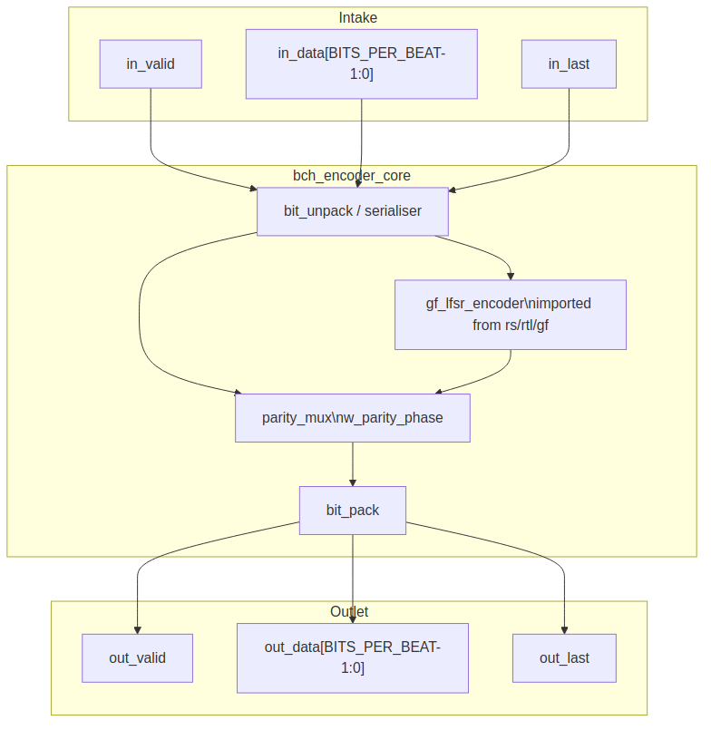

<!-- RTL Design Sherpa Documentation Header -->
<table>
<tr>
<td width="80">
  <a href="https://github.com/sean-galloway/RTLDesignSherpa">
    
  </a>
</td>
<td>
  <strong>RTL Design Sherpa</strong> · <em>Learning Hardware Design Through Practice</em><br>
  <sub>
    <a href="https://github.com/sean-galloway/RTLDesignSherpa/blob/main/docs/DOCUMENTATION_INDEX.md">Documentation Index</a> ·
    <a href="https://github.com/sean-galloway/RTLDesignSherpa/blob/main/docs/DOCUMENTATION_INDEX.md">MIT License</a>
  </sub>
</td>
</tr>
</table>

---

<!-- End Header -->

# Encoder Core (`bch_encoder_core`)

**Module:** `bch_encoder_core.sv`
**Location:** `rtl/`
**Category:** streaming datapath
**Parent:** `bch_top` / standalone encoder wrapper
**Status:** target — no RTL exists

---

## Purpose

`bch_encoder_core` systematically encodes a `K_BITS`-bit data block into an
`N_BITS`-bit BCH codeword. Data bits pass through unchanged; the block then
appends the `N_BITS - K_BITS` parity bits produced by a GF(2^m) LFSR whose taps
come from the generator polynomial computed by `gf_pkg`. The output stream is
longer than the input stream, so the encoder is not a pure back-to-back
pipeline: it holds `in_ready` low while parity drains.

### Figure 2.1: Encoder core block diagram



## Parameters

| Parameter | Type | Range | Default | Meaning | PRD |
|---|---|---|---|---|---|
| `FIELD_DIM` | int | 3..16 | **TBD** | `m`; field is GF(2^m) | D1 |
| `T_BITS` | int | 1..(2^m-1)/2 | **TBD** | correctable bit errors | D2 |
| `N_BITS` | int | 2t+1 .. 2^m-1 | **TBD** | codeword length in bits | D3 |
| `BITS_PER_BEAT` | int | 1 .. K_BITS | **TBD** | bits per valid/ready beat | D9 |

: Table 2.1: Encoder core parameters

Derived: `K_BITS = N_BITS - DEGREE_G`, where `DEGREE_G` is the degree of the
generator polynomial computed by `gf_pkg` from `m`, `t`, and the profile
parameters. `DEGREE_G` is at most `m * T_BITS` and equals `N_BITS - K_BITS`.

## Interface

| Signal | Direction | Width | Description |
|---|---|---|---|
| `aclk` | in | 1 | one clock for the whole core |
| `aresetn` | in | 1 | active-low synchronous reset |
| `in_valid` | in | 1 | a beat of data bits is offered |
| `in_ready` | out | 1 | the core takes it this cycle |
| `in_data` | in | `BITS_PER_BEAT` | data bits, bit 0 in the low bit; partial final beat uses `in_keep` |
| `in_keep` | in | `BITS_PER_BEAT` | present-bit mask, low-aligned; partial only on the block's final beat |
| `in_last` | in | 1 | this beat carries the `K_BITS`-th data bit |
| `out_valid` | out | 1 | a beat of coded bits is offered |
| `out_ready` | in | 1 | the consumer takes it |
| `out_data` | out | `BITS_PER_BEAT` | data bits while `!w_parity_phase`, parity bits while `w_parity_phase` |
| `out_keep` | out | `BITS_PER_BEAT` | present-bit mask; partial at the end of data and at the end of parity |
| `out_last` | out | 1 | this beat carries the `N_BITS`-th coded bit |
| `frame_err` | out | 1 | pulse: a block ended with other than `K_BITS` data bits |

: Table 2.2: Encoder core ports

## Microarchitecture internals

### Bit serialiser / unpack

The input beat `in_data` is serialised beat-by-beat into a single bit stream.
With `BITS_PER_BEAT = 1` this is a pass-through. With `BITS_PER_BEAT > 1` a
small barrel or counter-driven mux presents one valid bit per cycle to the
LFSR. The `in_keep` mask qualifies the final beat so that only real data bits
enter the LFSR.

### GF(2^m) LFSR parity generator

The parity generator is imported from the reed-solomon component per PRD D7:
`gf_lfsr_encoder` in `projects/components/ecc-ip/reed-solomon/rtl/gf/gf_lfsr_encoder.sv`.
It is a `2 * T_BITS`-stage shift register over GF(2^m) with constant
multipliers on the taps derived from `g(x)`. The encoder clears at block
start, consumes the `K_BITS` data bits serially, and then holds the parity
symbols.

The binary BCH use is identical to the RS encoder shape; the only difference
is that the input is bits, not symbols, so the LFSR advances once per bit.

### Parity mux

The output mux selects data bits while the block is in the data phase and
parity bits once the data phase completes:

```
w_parity_phase = (r_bit_count >= K_BITS) && w_beat_is_parity
```

`w_beat_is_parity` is true whenever the current output position is inside the
parity region; it is derived from the same bit counter:

```
w_beat_is_parity = (r_bit_count + BITS_PER_BEAT - 1) >= K_BITS
```

The mux output is `out_data = w_parity_phase ? w_parity_bits : w_data_bits`.

### Bit packer

The serial output stream is reassembled into `BITS_PER_BEAT`-bit output beats.
`out_keep` is full except on the final data beat and the final parity beat,
where it marks the partial beat. `out_last` raises on the beat that carries
the `N_BITS`-th coded bit:

```
w_enc_out_last = w_parity_phase && (r_parity_count == N_BITS - K_BITS - 1)
```

## FSM policy

This block carries **no FSM** (per `vault/handbook/design/streaming-no-fsm.md`).
The sequencing that another design might put in a state machine is replaced by:

- `r_bit_count`: counts input/output bit position in the block, 0 .. `N_BITS-1`
- `r_parity_count`: counts parity bits emitted, 0 .. `N_BITS-K_BITS-1`
- `r_valid` pipeline flags on the packer output stage
- `w_parity_phase`: combinational qualifier selecting parity vs data
- `w_last`: combinational qualifier marking the final output beat

`in_ready` is combinational `!r_valid || m_ready` at the input skid, ANDed with
the qualifier that the block is not currently draining parity.

## Timing

- One input beat is accepted per cycle while `in_ready` is high.
- The data phase is `ceil(K_BITS / BITS_PER_BEAT)` beats.
- The parity phase is `ceil((N_BITS - K_BITS) / BITS_PER_BEAT)` beats.
- `in_ready` is held low during the parity phase; back-to-back blocks need an
  upstream FIFO sized for at least `N_BITS - K_BITS` bits.
- The exact blocks-per-cycle numbers are placeholders tied to PRD D6 and D9.

## Notes

- **Wrong-length block handling:** If `in_last` arrives before or after the
  `K_BITS`-th data bit, `frame_err` pulses and the block is still encoded as
  given (systematic data pass-through with parity appended to whatever data
  arrived). This is the encoder-side analog of the decoder's
  `out_status_frame_err` (R1/R2):

  ```
  w_frame_err = in_last && (r_bit_count != K_BITS - 1)
  ```
- **OFF-state testing convention:** For tests that need to verify the core
  tolerates idle cycles, the LFSR clears on `in_last` acceptance and the output
  pipeline stalls cleanly when `out_ready` is low.
- The `gf_lfsr_encoder` instance is configured by the same `FIELD_DIM`,
  `T_BITS`, `N_BITS`, `PRIM_POLY`, and `FIRST_ROOT` parameters as the rest of
  the codec; its generator polynomial comes from `gf_pkg` (PRD D3/D8).
