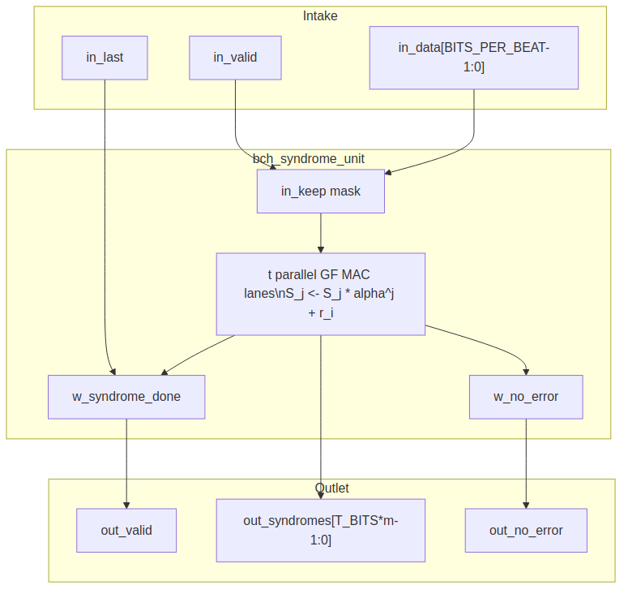

<!-- RTL Design Sherpa Documentation Header -->
<table>
<tr>
<td width="80">
  <a href="https://github.com/sean-galloway/RTLDesignSherpa">
    
  </a>
</td>
<td>
  <strong>RTL Design Sherpa</strong> · <em>Learning Hardware Design Through Practice</em><br>
  <sub>
    <a href="https://github.com/sean-galloway/RTLDesignSherpa/blob/main/docs/DOCUMENTATION_INDEX.md">Documentation Index</a> ·
    <a href="https://github.com/sean-galloway/RTLDesignSherpa/blob/main/docs/DOCUMENTATION_INDEX.md">MIT License</a>
  </sub>
</td>
</tr>
</table>

---

<!-- End Header -->

# Syndrome Unit (`bch_syndrome_unit`)

**Module:** `bch_syndrome_unit.sv`
**Location:** `rtl/fub/`
**Category:** streaming datapath
**Parent:** `bch_decoder_core`
**Status:** landed — `rtl/fub/bch_syndrome_unit.sv`, gate DV green on the three standing profiles

---

## Purpose

`bch_syndrome_unit` computes the `t` odd syndromes `S_1, S_3, ..., S_2t-1` of
the received BCH codeword as the bits arrive. The even syndromes are not
computed directly; they are recovered from the odd ones through the binary
BCH evenness shortcut `S_2j = S_j^2` (PRD §2). The unit contains `t` parallel
GF(2^m) multiply-accumulate lanes, one per odd syndrome.

### Figure 2.2: Syndrome unit block diagram



## Parameters

| Parameter | Type | Range | Default | Meaning | PRD |
|---|---|---|---|---|---|
| `FIELD_DIM` | int | 3..16 | **TBD** | `m`; field is GF(2^m) | D1 |
| `T_BITS` | int | 1..(2^m-1)/2 | **TBD** | correctable bit errors | D2 |
| `N_BITS` | int | 2t+1 .. 2^m-1 | **TBD** | codeword length in bits | D3 |
| `BITS_PER_BEAT` | int | 1 .. K_BITS | **TBD** | bits per valid/ready beat | D9 |

: Table 2.3: Syndrome unit parameters

## Interface

| Signal | Direction | Width | Description |
|---|---|---|---|
| `aclk` | in | 1 | one clock |
| `aresetn` | in | 1 | active-low synchronous reset |
| `in_valid` | in | 1 | received bits are offered |
| `in_ready` | out | 1 | unit takes them this cycle |
| `in_data` | in | `BITS_PER_BEAT` | received bits, low-aligned |
| `in_keep` | in | `BITS_PER_BEAT` | present-bit mask for partial final beat |
| `in_last` | in | 1 | this beat carries the `N_BITS`-th received bit |
| `out_valid` | out | 1 | `t` odd syndromes are valid |
| `out_ready` | in | 1 | downstream accepts the syndromes |
| `out_syndromes` | out | `T_BITS * m` | `{S_2t-1, ..., S_3, S_1}` packed GF values |
| `out_no_error` | out | 1 | all odd syndromes are zero |
| `i_clear` | in | 1 | abort the in-flight accumulation: bit counter and any pending `out_valid` drop, and the next accepted beat starts a fresh block. Asserted by the decoder core on a framing violation (a block past `N_BITS`, issue #90) so the garbage count cannot leak into the next block |

: Table 2.4: Syndrome unit ports

## Microarchitecture internals

### Odd-syndrome recurrence

For a received polynomial `r(x) = sum_{i=0}^{N_BITS-1} r_i x^i`, the odd
syndromes are:

```
S_j = r(alpha^j) = sum_i r_i * (alpha^j)^i   for j = 1, 3, ..., 2t-1
```

As bits arrive one at a time, each lane accumulates by Horner's rule:

```
S_j <- S_j * alpha^j + r_i
```

The multiplier by the constant `alpha^j` is a `gf_mul_const` instance (imported
from `projects/components/ecc-ip/reed-solomon/rtl/fub/gf/gf_mul_const.sv`). No
per-position power table is stored; the constant `alpha^j` is wired once per
lane.

With `BITS_PER_BEAT = B > 1`, each lane performs `B` Horner steps per cycle:

```
S_j <- (((S_j * alpha^j) + r_i0) * alpha^j + r_i1) * alpha^j + ... + r_iB-1
```

This is a short feed-forward chain of `B` constant multiplies and adds.

### All-zero bypass qualifier

The no-error bypass is a combinational qualifier, not a state:

```
w_no_error = (S_1 == 0) && (S_3 == 0) && ... && (S_2t-1 == 0)
```

When `w_no_error` is true on the cycle `w_syndrome_done` raises, the decoder
core skips the key-equation solver and Chien search and drains the block
buffer unchanged.

### Completion qualifier

The syndromes are complete once the last received bit has been accumulated:

```
w_syndrome_done = (r_bit_count == N_BITS - 1) && in_valid && in_ready
```

`out_valid` is a registered flag set by `w_syndrome_done` and cleared by the
handshake with the downstream solver.

## FSM policy

This block carries **no FSM** (per `vault/handbook/design/streaming-no-fsm.md`).
Control is reduced to:

- `r_bit_count`: counts received bits, 0 .. `N_BITS-1`
- `r_lane_valid`: registered output valid flag
- `w_syndrome_done`: combinational completion qualifier
- `w_no_error`: combinational all-zero qualifier

Each lane is a pure multiply-accumulate datapath; the lane count and the
output valid flag replace any state machine.

## Timing

- One received bit advances every lane by one Horner step.
- Serial case (`BITS_PER_BEAT = 1`): `N_BITS` cycles per block.
- Parallel-beat case: `ceil(N_BITS / BITS_PER_BEAT)` cycles per block, with
  `B` chained GF constant multiplies per lane per cycle.
- The exact cycle count is a placeholder tied to PRD D6.

## Notes

- A shortened code (`N_BITS < 2^m - 1`) is handled by treating the missing
  leading bits as zero: the Horner recurrence naturally accumulates starting
  from `S_j = 0`, which is equivalent to zero-padding the high-order
  coefficients.
- The evenness shortcut means the formal proof targets include
  `S_2j == gf_square(S_j)` for every odd `j`; the square in GF(2^m) is a
  linear bit-permutation and is cheap to verify.
- `out_no_error` is a combinational decode of the syndrome registers; it is
  stable from `w_syndrome_done` until the output handshake clears it.
