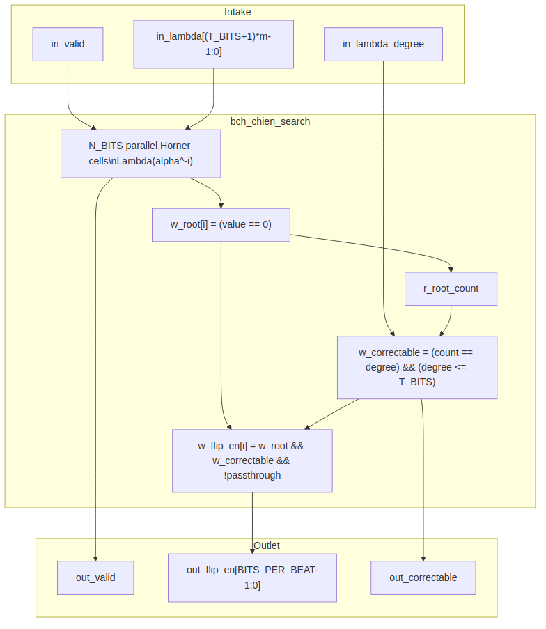

<!-- RTL Design Sherpa Documentation Header -->
<table>
<tr>
<td width="80">
  <a href="https://github.com/sean-galloway/RTLDesignSherpa">
    
  </a>
</td>
<td>
  <strong>RTL Design Sherpa</strong> · <em>Learning Hardware Design Through Practice</em><br>
  <sub>
    <a href="https://github.com/sean-galloway/RTLDesignSherpa/blob/main/docs/DOCUMENTATION_INDEX.md">Documentation Index</a> ·
    <a href="https://github.com/sean-galloway/RTLDesignSherpa/blob/main/docs/DOCUMENTATION_INDEX.md">MIT License</a>
  </sub>
</td>
</tr>
</table>

---

<!-- End Header -->

# Chien Search (`bch_chien_search`)

**Module:** `bch_chien_search.sv`
**Location:** `rtl/`
**Category:** streaming datapath
**Parent:** `bch_decoder_core`
**Status:** target — no RTL exists

---

## Purpose

`bch_chien_search` evaluates the error-locator polynomial `Lambda(x)` at every
one of the `N_BITS` bit positions of the received codeword. Where `Lambda` has
a root, the corresponding bit is in error. Because the code is binary, every
error value is 1 (PRD §2); the block therefore flips the bit directly and
needs no Forney evaluator. The block also feeds the uncorrectability verdict
by comparing the root count to the locator degree.

### Figure 2.3: Chien search block diagram



## Parameters

| Parameter | Type | Range | Default | Meaning | PRD |
|---|---|---|---|---|---|
| `FIELD_DIM` | int | 3..16 | **TBD** | `m`; field is GF(2^m) | D1 |
| `T_BITS` | int | 1..(2^m-1)/2 | **TBD** | correctable bit errors | D2 |
| `N_BITS` | int | 2t+1 .. 2^m-1 | **TBD** | codeword length in bits | D3 |
| `BITS_PER_BEAT` | int | 1 .. K_BITS | **TBD** | bits per valid/ready beat | D9 |

: Table 2.8: Chien search parameters

## Interface

| Signal | Direction | Width | Description |
|---|---|---|---|
| `aclk` | in | 1 | one clock |
| `aresetn` | in | 1 | active-low synchronous reset |
| `in_valid` | in | 1 | `Lambda(x)` coefficients are valid |
| `in_ready` | out | 1 | unit accepts `Lambda` |
| `in_lambda` | in | `(T_BITS + 1) * m` | locator coefficients `Lambda_0 .. Lambda_T_BITS` |
| `in_lambda_degree` | in | `$clog2(T_BITS + 1)` | actual degree of `Lambda` |
| `out_valid` | out | 1 | a beat of correction flags is offered |
| `out_ready` | in | 1 | downstream accepts correction flags |
| `out_flip_en` | out | `BITS_PER_BEAT` | one-hot bit-flip enable per position in the beat |
| `out_root_count` | out | `$clog2(T_BITS + 1)` | roots found so far |
| `out_last` | out | 1 | final position of the block |

: Table 2.9: Chien search ports

## Microarchitecture internals

### Parallel Horner cells

`Lambda(x)` is evaluated at consecutive powers of `alpha` using Horner cells.
For position `i`, the evaluation is:

```
Lambda(alpha^-i) = Lambda_0 + Lambda_1*alpha^-i + Lambda_2*alpha^-2i + ... + Lambda_t*alpha^-ti
```

Each cell holds a running partial sum and multiplies by a constant factor each
cycle, stepping from one position to the next. With `BITS_PER_BEAT = B > 1`,
each lane evaluates `B` positions per cycle by chaining `B` constant
multiplies from the same starting register.

The root flag per position is:

```
w_root[i] = (w_lambda_at_pos[i] == 0)
```

### Direct bit-flip accumulation

The correction qualifier for position `i` is:

```
w_flip_en[i] = w_root[i] && w_correctable && !w_release_passthrough
```

`w_correctable` comes from the decoder core and is true when the root count
matches the locator degree and the degree does not exceed `T_BITS`.
`w_release_passthrough` is true for uncorrectable blocks, which pass through
unchanged (R2). There is no error-value computation; every root means flip.

### Uncorrectability check

The block tracks the root count across the `N_BITS` positions:

```
w_correctable = (r_root_count == r_lambda_degree) && (r_lambda_degree <= T_BITS)
```

If the root count differs from the degree, or if the degree exceeds `T_BITS`,
the block is uncorrectable. The final `w_correctable` value is captured on the
last position and passed to the decoder core as the block verdict.

## FSM policy

This block carries **no FSM** (per `vault/handbook/design/streaming-no-fsm.md`).
The Chien walk is driven by:

- `r_position`: counts bit positions, 0 .. `N_BITS-1`
- `r_root_count`: running count of roots
- `out_valid`: registered pipeline flag
- `w_last`: combinational qualifier for the final position

The position counter replaces any state machine.

## Timing

- Serial case (`BITS_PER_BEAT = 1`): `N_BITS` cycles per block to evaluate all
  positions.
- Parallel-beat case: `ceil(N_BITS / BITS_PER_BEAT)` cycles per block, with
  `B` Horner evaluations per lane per cycle.
- The exact cycle count and throughput trade-off are placeholders tied to PRD
  D6.

## Notes

- A shortened code (`N_BITS < 2^m - 1`) is handled by starting the Chien walk
  at the appropriate offset so that the first emitted position corresponds to
  bit 0 of the shortened codeword.
- The no-Forney structure is a key formal target: prove that every root of
  `Lambda` in a correctable block corresponds to exactly one bit flip and that
  the resulting corrected block has zero syndrome.
- `out_flip_en` is a beat-wide vector; the corrector XORs it with the
  corresponding beat from the block buffer.
