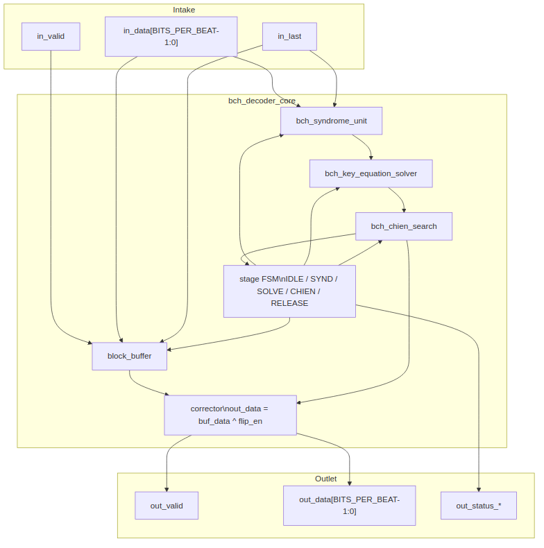

<!-- RTL Design Sherpa Documentation Header -->
<table>
<tr>
<td width="80">
  <a href="https://github.com/sean-galloway/RTLDesignSherpa">
    
  </a>
</td>
<td>
  <strong>RTL Design Sherpa</strong> · <em>Learning Hardware Design Through Practice</em><br>
  <sub>
    <a href="https://github.com/sean-galloway/RTLDesignSherpa/blob/main/docs/DOCUMENTATION_INDEX.md">Documentation Index</a> ·
    <a href="https://github.com/sean-galloway/RTLDesignSherpa/blob/main/docs/DOCUMENTATION_INDEX.md">MIT License</a>
  </sub>
</td>
</tr>
</table>

---

<!-- End Header -->

# Decoder Core Integration (`bch_decoder_core`)

**Module:** `bch_decoder_core.sv`
**Location:** `rtl/`
**Category:** integration block + one minimal control FSM
**Parent:** `bch_top` / standalone decoder wrapper
**Status:** target — no RTL exists; conditional on PRD D4/D6/D11

---

## Purpose

`bch_decoder_core` integrates the received-block buffer, syndrome unit,
key-equation solver, Chien search, and corrector into one valid/ready
streaming block. It is the only block in the decoder datapath that is allowed
to contain a control FSM, because the sequencing of distinct algorithmic
stages is genuine control, not per-beat datapath.

### Figure 2.4: Decoder core block diagram



## Parameters

| Parameter | Type | Range | Default | Meaning | PRD |
|---|---|---|---|---|---|
| `FIELD_DIM` | int | 3..16 | **TBD** | `m`; field is GF(2^m) | D1 |
| `T_BITS` | int | 1..(2^m-1)/2 | **TBD** | correctable bit errors | D2 |
| `N_BITS` | int | 2t+1 .. 2^m-1 | **TBD** | codeword length in bits | D3 |
| `BITS_PER_BEAT` | int | 1 .. K_BITS | **TBD** | bits per valid/ready beat | D9 |
| `ENABLE_ERASURES` | bit | | 0 **TBD** | erasure input and erasure-locator logic | D5 |
| `KES_ALGO` | string | `"RIBM"`, `"EUCLID"`, `"SMALL_T"` | **TBD** | solver algorithm | D11 |

: Table 2.10: Decoder core parameters

## Interface

| Signal | Direction | Width | Description |
|---|---|---|---|
| `aclk` | in | 1 | one clock |
| `aresetn` | in | 1 | active-low synchronous reset |
| `in_valid` / `in_ready` | in / out | 1 | valid/ready for received bits |
| `in_data` | in | `BITS_PER_BEAT` | received bits |
| `in_keep` | in | `BITS_PER_BEAT` | present-bit mask |
| `in_last` | in | 1 | this beat carries the `N_BITS`-th received bit |
| `in_erase` | in | `BITS_PER_BEAT` | (only with `ENABLE_ERASURES`) known-bad bits |
| `out_valid` / `out_ready` | out / in | 1 | valid/ready for corrected data |
| `out_data` | out | `BITS_PER_BEAT` | corrected data bits; parity lanes dropped |
| `out_keep` | out | `BITS_PER_BEAT` | present-bit mask |
| `out_last` | out | 1 | this beat carries the `K_BITS`-th data bit |
| `out_status_ok` | out | 1 | block had no errors |
| `out_status_corrected` | out | `$clog2(T_BITS + 1)` | bits corrected (0 .. `T_BITS`) |
| `out_status_uncorrectable` | out | 1 | correction failed |
| `out_status_frame_err` | out | 1 | block length was not `N_BITS` |

: Table 2.11: Decoder core ports

## Microarchitecture internals

### Block buffer

The received block is written into a buffer as it arrives and read out during
the Chien/correction pass. The buffer depth is at least `N_BITS` bits, sized
to absorb the latency of the syndrome pass and the solver. For an
uncorrectable block, the buffer passes the received bits through unchanged
(R2):

```
w_release_passthrough = w_uncorrectable || w_frame_err
```

### Stage sequencer

The decoder core contains exactly one minimal control FSM (per
`vault/handbook/design/minimal-fsm.md`). Stage sequencing is control, not
per-beat datapath. The proposed state list merges any state that only waits
one fixed cycle into its successor with a counter:

```
IDLE    -> wait for a new block to begin arriving
SYND    -> receiving the block into the buffer and the syndrome unit
SOLVE   -> key-equation solver running
CHIEN   -> Chien search / correction pass over the buffer
RELEASE -> outputting the corrected (or passthrough) block
```

A state like "wait one cycle for solver start" is killed: it becomes a
registered `r_solver_start` pulse inside SYND or SOLVE.

### Corrected-stream re-check

As an optional R2 mechanism, a second syndrome unit may accumulate over the
corrected stream leaving the buffer. If any odd syndrome is non-zero after
correction, the block is flagged uncorrectable even if the Chien root count
matched the locator degree. This mirrors the release-on-verdict discipline in
the sibling `rs_decoder_core` architecture. The re-check is gated by a build
parameter and is an implementation detail, not part of the locator search.

### Correctability verdict

The per-block uncorrectable verdict is:

```
w_uncorrectable = !w_correctable || (w_recheck_enabled && !w_recheck_zero)
w_correctable = (r_root_count == r_lambda_degree) && (r_lambda_degree <= T_BITS)
```

`out_status_uncorrectable` is held for every beat of the released block.

## FSM policy

This block is the **one place in the decoder datapath where a minimal control
FSM is permitted**. The FSM has at most the four states above; any state that
only waits one fixed cycle is merged with its successor. All per-beat
operations inside the stages (syndrome accumulation, solver array stepping,
Chien evaluation) remain FSM-free pipelines.

## Timing

- `SYND` phase: `ceil(N_BITS / BITS_PER_BEAT)` beats.
- `SOLVE` phase: depends on `KES_ALGO` and `T_BITS` (PRD D11).
- `CHIEN` / `RELEASE` phase: `ceil(N_BITS / BITS_PER_BEAT)` beats, overlapped
  so that the first corrected beat leaves as soon as the Chien walk starts.
- Total latency and throughput trade-offs are placeholders tied to PRD D6.

## Notes

- This whole page is conditional on the build including the decoder (PRD D4)
  and on the throughput architecture (PRD D6) and solver choice (PRD D11).
- Frame error: a block whose `in_last` arrives before or after the `N_BITS`-th
  bit is flagged with `out_status_frame_err` and passes through unchanged.
  The first `length - (N_BITS - K_BITS)` bits of a too-long block are treated
  as data.
- Status outputs describe the block being emitted and are valid on every beat
  of it; a consumer may sample them with `out_last`.
