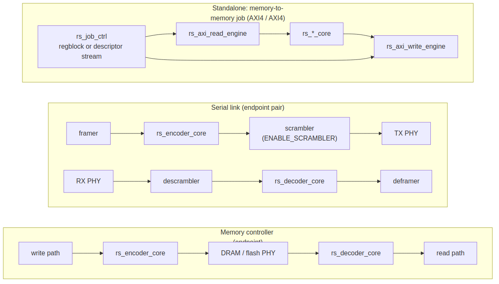

<!-- RTL Design Sherpa Documentation Header -->
<table>
<tr>
<td width="80">
  
</td>
<td>
  <strong>RTL Design Sherpa</strong> · <em>Learning Hardware Design Through Practice</em> 
  
    <a href="https://github.com/sean-galloway/RTLDesignSherpa">GitHub</a> ·
    <a href="https://github.com/sean-galloway/RTLDesignSherpa/blob/main/docs/DOCUMENTATION_INDEX.md">Documentation Index</a> ·
    <a href="https://github.com/sean-galloway/RTLDesignSherpa/blob/main/LICENSE">MIT License</a>
  
</td>
</tr>
</table>

---

<!-- End Header -->

# System Context

## An endpoint codec, not a mid-stream insert

RS protects a block, not a wire. The encoder must see k symbols before it
can emit the first parity symbol, and the decoder must see all n before it
can correct any of them, because the syndromes are a function of the whole
block. The code therefore lives where a block boundary already exists and
where the extra 2t symbols have somewhere to go. Every standard in
`References/` places it at an endpoint: the CCSDS transmitter and ground
receiver, the DVB modulator and set-top demodulator, the 802.3 PCS at each
end of a link, the CD read channel, the storage controller at write and at
read.

Dropping the codec into the middle of a fabric fails on three counts: the
parity changes the byte count, so the downstream must run faster or the
upstream must leave gaps; block alignment must survive every hop, which is
why every RS standard sits behind a sync marker, a fixed frame or a page
boundary; and the correction belongs immediately after the channel that
corrupts, not several repackings later.

### Figure 2.1: Where the codec sits

Three endpoint shapes: a memory controller with an encoder on its write path
and a decoder on its read path; a serial link pair with the scrambler on the
line side; and the standalone memory-to-memory job engine built from the
AXI4 adapters.

## The core inside a consumer

With valid/ready at both ends the core is a block in the consumer's own
datapath. The consumer supplies block boundaries (its scheduler, framer or
job control already knows where they are), absorbs the 2t/k rate change, and
keeps its own external interfaces. Nothing in the consumer's protocol
handling changes; what changes is that k symbols go in and n come out (or n
in, k out with a status).

## The standalone tops

When there is no consumer datapath to sit inside -- a codec on a fabric
port, a memory-to-memory transform -- the standalone tops wrap the core in
adapters (chapters 4.2 and 4.3) and a register block (chapter 4.4), and the
existing AXI-Stream and AXI4 monitors observe the boundaries onto the
monitor bus.

## Dependencies on the rest of the repository

| Dependency | Used for |
|---|---|
| `rtl/amba/gaxi`: `gaxi_skid_buffer`, `gaxi_fifo_sync` | stage decoupling; the decoder's block buffer |
| `rtl/common`: `counter_bin`, `shifter_beat_pack`, `shifter_lfsr_galois` | positions and iterations; symbol packing; the scrambler |
| `rtl/amba/axis4`: `axis4_slave`, `axis4_master` (+ `_monlite`) | AXIS adapters |
| `rtl/amba/axi4`: `axi4_master_rd`, `axi4_master_wr` | AXI4 adapters' timing wrappers |
| `rtl/amba/monitor`: `axis_monitor_lite` | boundary observation onto monbus |
| `bin/peakrdl_generate.py` + `utility-ip/converters` APB-to-cpuif path | the register block and its APB attachment |
| `dma-ip/stream/rtl/fub`: `axi_read_engine`, `axi_write_engine` | the model for the AXI4 job engines |
| `reedsolo`, `galois` (PyPI, MIT) | DV golden model |

: Table 2.2: Repository dependencies
