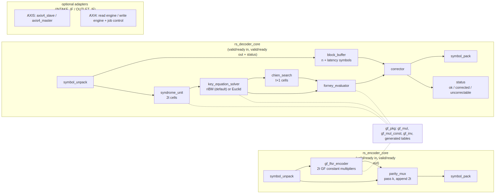

<!-- RTL Design Sherpa Documentation Header -->
<table>
<tr>
<td width="80">
  
</td>
<td>
  <strong>RTL Design Sherpa</strong> · <em>Learning Hardware Design Through Practice</em> 
  
    <a href="https://github.com/sean-galloway/RTLDesignSherpa">GitHub</a> ·
    <a href="https://github.com/sean-galloway/RTLDesignSherpa/blob/main/docs/DOCUMENTATION_INDEX.md">Documentation Index</a> ·
    <a href="https://github.com/sean-galloway/RTLDesignSherpa/blob/main/LICENSE">MIT License</a>
  
</td>
</tr>
</table>

---

<!-- End Header -->

# Block Diagram

### Figure 3.1: Codec block diagram

The two cores, the shared GF layer, and the optional adapters that wrap a
core for standalone use.

## The encoder core

Four blocks in a straight line. `symbol_unpack` slices each beat into
`SYMBOLS_PER_BEAT` symbols and tracks the position in the block.
`gf_lfsr_encoder` is the systematic encoder: a 2t-stage shift register over
GF(2^m) with the generator polynomial's coefficients as constant multipliers
on its taps; it is cleared at block start, the k data symbols shift through,
and it then holds the 2t parity symbols. `parity_mux` passes the data
symbols and then appends the parity, raising `last` on the final one.
`symbol_pack` reassembles beats. A skid buffer after the unpack and before
the pack decouples the stages.

## The decoder core

The received block is written into `block_buffer` and, in the same cycles,
into `syndrome_unit`, whose 2t cells each accumulate one syndrome by
Horner's rule as the symbols arrive. When the block is complete the
syndromes go to `key_equation_solver` -- the riBM array by default, the
modified Euclidean array when selected -- which produces the error-locator
and error-evaluator polynomials in 2t iterations, or flags the block
uncorrectable. `chien_search` then walks every position, one per cycle, in
lock-step with the buffer read-out; where it finds a root,
`forney_evaluator` computes the error value and `corrector` XORs it into the
symbol leaving the buffer. `status` counts corrections and raises the
per-block verdict with the final symbol. An all-zero syndrome set bypasses
the solver and drains the buffer uncorrected.

## The GF layer

`gf_pkg` holds the field: the primitive polynomial, the generator
coefficients and the log/antilog tables, all generated from the profile
parameters. Three primitives are built on it: `gf_mul_const` (a constant
multiply, an XOR network), `gf_mul` (full multiply, AND array plus
reduction) and `gf_inv` (table inverse). Everything arithmetic in both cores
is one of these three; the block counts are in chapter 5.3.

## The adapters

Present only when `INTAKE_IF` or `OUTLET_IF` is not `NONE`. The AXI-Stream
adapter is the house `axis4_slave` or `axis4_master` wrapper with TLAST as
the block boundary and TUSER carrying erasure flags in or status out. The
AXI4 adapter is a read engine (job in, stream out) or a write engine (stream
in, bursts out) with a job controller that sequences them from the register
block or a descriptor stream. Chapter 4 specifies each.

## Hierarchy

The complete bottom-up hierarchy -- every block, what it does and every
component it instantiates with counts -- is `docs/rs_fub_catalog.md`. This
chapter names the blocks; the catalog is the authority on their contents.
