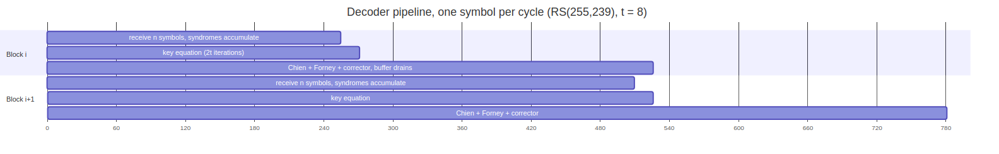

<!-- RTL Design Sherpa Documentation Header -->
<table>
<tr>
<td width="80">
  
</td>
<td>
  <strong>RTL Design Sherpa</strong> · <em>Learning Hardware Design Through Practice</em> 
  
    <a href="https://github.com/sean-galloway/RTLDesignSherpa">GitHub</a> ·
    <a href="https://github.com/sean-galloway/RTLDesignSherpa/blob/main/docs/DOCUMENTATION_INDEX.md">Documentation Index</a> ·
    <a href="https://github.com/sean-galloway/RTLDesignSherpa/blob/main/LICENSE">MIT License</a>
  
</td>
</tr>
</table>

---

<!-- End Header -->

# Data Flow

## Encoder

One beat in, one beat out, with the output stream 2t/k longer than the input.

1. A beat of `SYMBOLS_PER_BEAT` data symbols arrives with `in_valid`; the
   core accepts it when the encoder can take it (`in_ready`).
2. Each symbol enters the LFSR (updating the parity registers) and is passed
   straight to the output mux -- systematic encoding means the data are not
   delayed by the code, only by the pipeline.
3. On the k-th symbol (`in_last`), the mux switches to the parity registers
   and emits the 2t parity symbols over the following cycles, then raises
   `out_last`; the LFSR clears for the next block.
4. While parity drains, `in_ready` is low: the encoder cannot start a new
   block until the previous block's parity has left. A consumer that wants
   full-rate back-to-back blocks provides an input FIFO of at least 2t
   symbols upstream, or accepts the 2t-cycle gap.

## Decoder

One beat in, one beat out, with a block of latency in between.

1. Received symbols are written to the block buffer and fed to the syndrome
   cells. Erasure flags, if enabled, are recorded alongside each symbol.
2. On `in_last` the syndromes are complete. If all are zero the block is
   clean: the solver is skipped and the buffer drains through the corrector
   unchanged, status = ok.
3. Otherwise the key-equation solver runs 2t iterations. If the resulting
   locator degree exceeds t, or is zero, the block is already known to be
   uncorrectable.
4. Chien search steps through positions 0 .. n-1, one per cycle, while the
   buffer reads out the same positions. At each root, Forney supplies the
   error value. Every corrected symbol, data and parity alike, is fed to a
   second syndrome unit; the received data symbols and their corrections go
   to the output FIFO as separate fields.
5. On the last position the verdict is final: uncorrectable if the root count
   differs from the degree, if a derivative was zero at a root, or if the
   re-computed syndromes are not all zero. That last check is what catches the
   blocks with more than t errors whose wrong locator still has the right
   number of roots; the degree and root checks alone miscorrect some of them.
6. The block is released only once its verdict exists. Corrections are
   applied on the way out, and not at all when the block is uncorrectable, so
   an uncorrectable block leaves exactly as it arrived. The status ports hold
   the verdict for every beat of the block and `out_last` marks its k-th.
7. The next block's symbols arrive during steps 3-6 and the one after that is
   being solved while this one is walked; the buffers are sized for that
   overlap, so the decoder sustains one block per n cycles.

### Figure 3.2: Decoder timeline, one symbol per cycle

For the reference profile the first data symbol of a block emerges about
2n + 2t cycles after its first symbol arrived (the block is received, solved,
and walked to its verdict before release), and the block then drains in k
cycles while the next block is walked, so sustained throughput is one block
every n cycles -- measured at 252 to 257 cycles per RS(255,239) block.

## Block boundaries

The core does not count symbols to find a block: `in_last` is the boundary,
and the core checks it. A block shorter or longer than the configured n (or
k on the encoder side) is reported as a framing error in status and the core
resynchronises on the next `in_last`. A shortened code (`N_SYMBOLS` <
2^m - 1) is handled by the core treating the missing leading symbols as zero
in the syndromes and by offsetting the Chien positions; the consumer sees
only the shortened block.

## Multiple symbols per beat

With `SYMBOLS_PER_BEAT = S > 1` the encoder LFSR advances S symbols per
cycle and the syndrome and Chien cells are replicated or fed S-way (chapter
5.1); the solver, which works on the 2t syndromes, is unaffected. Blocks are
still delimited by `last`; a block whose length is not a multiple of S ends
with a partial final beat, marked by a per-symbol keep mask in the data
beat.
