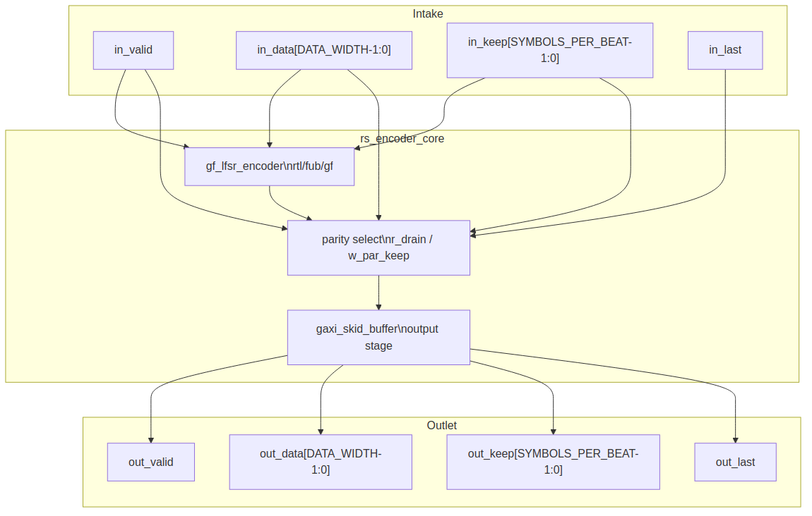

<!-- RTL Design Sherpa Documentation Header -->
<table>
<tr>
<td width="80">
  <a href="https://github.com/sean-galloway/RTLDesignSherpa">
    
  </a>
</td>
<td>
  <strong>RTL Design Sherpa</strong> · <em>Learning Hardware Design Through Practice</em><br>
  <sub>
    <a href="https://github.com/sean-galloway/RTLDesignSherpa">GitHub</a> ·
    <a href="https://github.com/sean-galloway/RTLDesignSherpa/blob/main/docs/DOCUMENTATION_INDEX.md">Documentation Index</a> ·
    <a href="https://github.com/sean-galloway/RTLDesignSherpa/blob/main/LICENSE">MIT License</a>
  </sub>
</td>
</tr>
</table>

---

<!-- End Header -->

# Encoder Core (`rs_encoder_core`)

**Module:** `rs_encoder_core.sv`
**Location:** `rtl/macro/`
**Category:** streaming datapath
**Parent:** `rs_encoder` / standalone encoder wrapper
**Status:** landed — `rtl/macro/rs_encoder_core.sv`, gate DV green on the standing profiles

---

## Purpose

`rs_encoder_core` systematically encodes a `K_SYMBOLS`-symbol data block into an
`N_SYMBOLS`-symbol Reed-Solomon codeword. Data symbols pass through unchanged;
the block then appends the `2 * T_SYMBOLS` parity symbols produced by a GF(2^m)
LFSR whose taps come from the generator polynomial computed by `gf_pkg`. The
output stream is longer than the input stream, so the encoder is not a pure
back-to-back pipeline: it holds `in_ready` low while parity drains.

### Figure 2.1: Encoder core block diagram



## Parameters

| Parameter | Type | Range | Default | Meaning | PRD |
|---|---|---|---|---|---|
| `SYMBOL_WIDTH` | int | 2..`GF_MAX_M` | 8 | `m`; field is GF(2^m) | D1 |
| `PRIM_POLY` | int | primitive of degree `m` | `0x11D` | primitive polynomial; selects the field representation | D8 per profile |
| `T_SYMBOLS` | int | 1..(2^m-1)/2 | 8 | correctable symbols per block; `2t` parity symbols | D2 |
| `N_SYMBOLS` | int | `2t+1` .. `2^m-1` | `2^m - 1` | codeword length in symbols; `< 2^m-1` is a shortened code | D3 |
| `FIRST_ROOT` | int | 0 .. `2^m-2` | 0 | `b`, first root of `g(x)` | D8 |
| `DATA_WIDTH` | int | multiple of `SYMBOL_WIDTH` | `SYMBOL_WIDTH` | beat width | D9 |
| `SKID_DEPTH` | int | 2..8 | 2 | output skid-buffer depth | D9 |
| `K_SYMBOLS` | derived | `N_SYMBOLS - 2*T_SYMBOLS` | — | data symbols per block | D3 |
| `SYMBOLS_PER_BEAT` | derived | `DATA_WIDTH / SYMBOL_WIDTH` | 1 | symbols per valid/ready beat | D6 |

: Table 2.1: Encoder core parameters

`K_SYMBOLS` and `SYMBOLS_PER_BEAT` are derived but exposed in the module header
for the consumer's convenience. Elaboration fails if `DATA_WIDTH` is not a
multiple of `SYMBOL_WIDTH`, if `N_SYMBOLS` does not exceed `2*T_SYMBOLS`, or if
`SKID_DEPTH` is outside 2..8.

## Interface

| Signal | Direction | Width | Description |
|---|---|---|---|
| `aclk` | in | 1 | one clock for the whole core |
| `aresetn` | in | 1 | active-low synchronous reset |
| `in_valid` | in | 1 | a beat of data symbols is offered |
| `in_ready` | out | 1 | the core takes it this cycle |
| `in_data` | in | `DATA_WIDTH` | data symbols, symbol 0 in the low lane |
| `in_keep` | in | `SYMBOLS_PER_BEAT` | present-symbol mask, low-aligned; partial only on the block's final beat |
| `in_last` | in | 1 | this beat carries the `K_SYMBOLS`-th data symbol |
| `out_valid` | out | 1 | a beat of coded symbols is offered |
| `out_ready` | in | 1 | the consumer takes it |
| `out_data` | out | `DATA_WIDTH` | data symbols while `!r_drain`, parity symbols while `r_drain` |
| `out_keep` | out | `SYMBOLS_PER_BEAT` | present-symbol mask; partial at the end of data and at the end of parity |
| `out_last` | out | 1 | this beat carries the `N_SYMBOLS`-th coded symbol |
| `frame_err` | out | 1 | one-cycle pulse: a block ended with other than `K_SYMBOLS` data symbols |

: Table 2.2: Encoder core ports

## Microarchitecture internals

### GF(2^m) LFSR parity generator

The parity generator is `gf_lfsr_encoder` in
`projects/components/ecc-ip/reed-solomon/rtl/fub/gf/gf_lfsr_encoder.sv`. It is a
`2 * T_SYMBOLS`-stage shift register over GF(2^m) whose tap coefficients are the
generator polynomial `g(x)` built at elaboration from `gf_pkg`:

```text
g(x) = prod_{i=0}^{2t-1} (x - alpha^(b+i))
```

The LFSR instance receives:

- `i_step`: high on every accepted input beat (`w_in_fire`)
- `i_data`: the input beat's `S` symbols
- `i_count`: how many symbols are present in the beat (`1 .. S`)
- `i_shift`: high on every drain beat (`w_drain_fire`)

One symbol step is polynomial division by `g(x)`:

```text
fb      = data ^ r[2t-1]
r[j]    = r[j-1] ^ fb * g[j]    (j = 1 .. 2t-1)
r[0]    = fb * g[0]
```

The core unrolls `S` single-symbol steps and selects the state after
`i_count` of them, so a partial final beat costs only a mux. The constant tap
multiplies fold to XOR networks; the unrolled chain is one XOR network per
register whatever `S` is.

### Output parity select

The output mux selects data beats while `r_drain` is low and parity beats once
parity starts draining:

```text
in_ready        = !r_drain && w_skid_wr_ready
w_in_fire       = in_valid && in_ready
w_drain_fire    = r_drain && w_skid_wr_ready
```

While draining, the next `S` parity symbols come from the LFSR register in
transmission order:

```text
ow_parity lane u = r_reg[2t-1-u]   (u = 0 .. S-1)
```

The final parity beat is partial when `S` does not divide `2t`. `w_par_keep`
marks the valid lanes:

```text
w_par_keep[u] = (r_drain_left != 1) || (u < PREM)
```

where `PREM = 2t - (PB-1)*S` is the number of symbols in the last parity beat
and `PB = ceil(2t / S)` is the total parity beats.

### Output skid buffer

A `gaxi_skid_buffer` (`projects/components/ecc-ip/reed-solomon/rtl/fub/` does not
own it; the block is in `rtl/amba/gaxi`) sits on the output. It decouples the
consumer's `out_ready` from the LFSR step, so the encoder can take one input
symbol per cycle when the consumer keeps up, and the `ceil(2t/S)`-cycle parity
gap is the only stall it introduces.

### Frame-length check

`r_count` tracks how many data symbols have been accepted in the current block.
On `in_last` the core compares the expected `K_SYMBOLS` against the actual count
plus the last beat's symbol count:

```text
frame_err = in_last && (w_count_next != K_SYMBOLS)
```

A block that is shorter or longer than `K_SYMBOLS` still gets encoded as given
(systematic data pass-through with parity appended to whatever data arrived);
`frame_err` is just the one-cycle pulse that tells the consumer the block was
mis-framed.

## FSM policy

This block carries **no FSM** (per `vault/handbook/design/streaming-no-fsm.md`).
The sequencing that another design might put in a state machine is replaced by:

- `r_drain`: registered flag, 0 in the DATA phase, 1 in the parity DRAIN phase
- `r_count`: counts data symbols accepted in the block, 0 .. `N_SYMBOLS-1`
- `r_drain_left`: counts parity beats still to emit, `PB` down to 0
- `w_in_count`: combinational count of valid symbols in the current input beat
- `w_skid_wr_valid` / `w_skid_wr_ready`: output skid handshake
- `w_in_fire` / `w_drain_fire`: combinational qualifiers for LFSR step and shift

`in_ready` is combinational `!r_drain && w_skid_wr_ready`.

## Timing

- One input beat is accepted per cycle while `in_ready` is high.
- The data phase is `ceil(K_SYMBOLS / SYMBOLS_PER_BEAT)` beats.
- The parity phase is `ceil(2*T_SYMBOLS / SYMBOLS_PER_BEAT)` beats.
- `in_ready` is held low during the parity phase; back-to-back blocks need an
  upstream FIFO sized for at least `2*T_SYMBOLS` symbols.
- Measured: one beat per cycle plus the `ceil(2t/S)` parity gap.

## Notes

- **Wrong-length block handling:** If `in_last` arrives before or after the
  `K_SYMBOLS`-th data symbol, `frame_err` pulses and the block is still encoded
  as given. This is the encoder-side analog of the decoder's framing-error
  status (HAS chapter 3.2).
- **Partial beats:** The encoder passes data beats through as received, so a
  partial data beat can occur at the end of the data phase. It then appends
  parity in `PB` beats, the last of which is partial when `S` does not divide
  `2t`. A consumer that needs contiguous packing puts a beat packer at the
  outlet (HAS chapter 4.2 / 4.3).
- **No separate LFSR clear:** After the last parity beat the LFSR has shifted
  itself to all zeros, so the next block starts clean with no explicit reset
  cycle.
