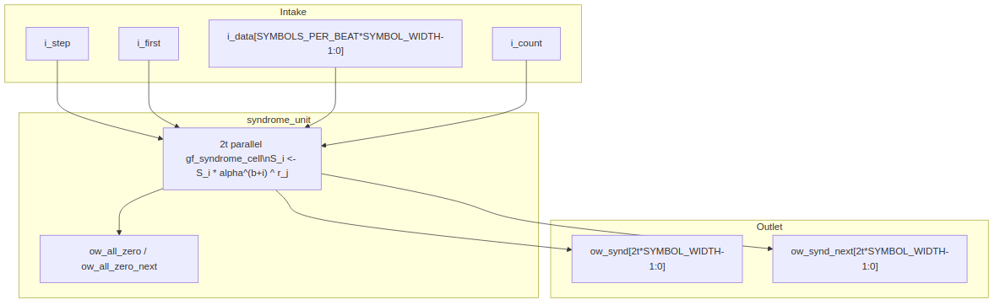

<!-- RTL Design Sherpa Documentation Header -->
<table>
<tr>
<td width="80">
  <a href="https://github.com/sean-galloway/RTLDesignSherpa">
    
  </a>
</td>
<td>
  <strong>RTL Design Sherpa</strong> · <em>Learning Hardware Design Through Practice</em><br>
  <sub>
    <a href="https://github.com/sean-galloway/RTLDesignSherpa">GitHub</a> ·
    <a href="https://github.com/sean-galloway/RTLDesignSherpa/blob/main/docs/DOCUMENTATION_INDEX.md">Documentation Index</a> ·
    <a href="https://github.com/sean-galloway/RTLDesignSherpa/blob/main/LICENSE">MIT License</a>
  </sub>
</td>
</tr>
</table>

---

<!-- End Header -->

# Syndrome Unit (`syndrome_unit`)

**Module:** `syndrome_unit.sv`
**Location:** `rtl/fub/`
**Category:** streaming datapath
**Parent:** `rs_decoder_core`
**Status:** landed — `rtl/fub/syndrome_unit.sv`, gate DV green on the standing profiles

---

## Purpose

`syndrome_unit` computes the `2t` syndromes `S_0 .. S_2t-1` of a received
Reed-Solomon codeword as the symbols arrive. Syndrome `S_i` is the received
polynomial evaluated at `alpha^(b+i)`:

```text
S_i = r(alpha^(b+i)) = sum_{j=0}^{n-1} r_j * alpha^((b+i)*j)
```

The unit contains `2t` parallel GF(2^m) multiply-accumulate lanes, one per
syndrome. It also supplies combinational `ow_*_next` versions of the outputs so
a caller can capture the finished syndromes in the same cycle as the last
symbol.

### Figure 2.2: Syndrome unit block diagram



## Parameters

| Parameter | Type | Range | Default | Meaning | PRD |
|---|---|---|---|---|---|
| `SYMBOL_WIDTH` | int | 2..`GF_MAX_M` | 8 | `m`; field is GF(2^m) | D1 |
| `PRIM_POLY` | int | primitive of degree `m` | `0x11D` | primitive polynomial; selects the field representation | D8 per profile |
| `T_SYMBOLS` | int | 1..(2^m-1)/2 | 8 | correctable symbols per block; `2t` syndromes | D2 |
| `FIRST_ROOT` | int | 0 .. `2^m-2` | 0 | `b`, exponent of the first root `alpha^b` | D8 |
| `SYMBOLS_PER_BEAT` | int | >= 1 | 1 | `S`, symbols per `i_step` | D6 |

: Table 2.3: Syndrome unit parameters

## Interface

| Signal | Direction | Width | Description |
|---|---|---|---|
| `aclk` | in | 1 | one clock |
| `aresetn` | in | 1 | active-low synchronous reset |
| `i_step` | in | 1 | advance every lane by `i_count` symbols |
| `i_first` | in | 1 | zero the accumulators first (block's first beat) |
| `i_data` | in | `SYMBOLS_PER_BEAT * SYMBOL_WIDTH` | received symbols, low lanes first |
| `i_count` | in | `$clog2(SYMBOLS_PER_BEAT+1)` | valid symbols in this beat, `1 .. S` |
| `ow_synd` | out | `2*T_SYMBOLS*SYMBOL_WIDTH` | packed syndromes, `S_0` in the low `m` bits |
| `ow_all_zero` | out | 1 | all `2t` syndromes are zero |
| `ow_synd_next` | out | `2*T_SYMBOLS*SYMBOL_WIDTH` | combinational next value of `ow_synd` |
| `ow_all_zero_next` | out | 1 | combinational next value of `ow_all_zero` |

: Table 2.4: Syndrome unit ports

## Microarchitecture internals

### Syndrome recurrence

Each lane accumulates by Horner's rule as symbols arrive in transmission order:

```text
S_i <- S_i * alpha^(b+i) + r_j
```

The multiplier by the constant `alpha^(b+i)` is a `gf_mul_fn` call on a constant
operand; synthesis folds it to a fixed XOR network. No per-position power table
is stored; the constant root is wired once per lane.

With `SYMBOLS_PER_BEAT = S > 1`, each lane performs `S` Horner steps per cycle:

```text
S_i <- (((S_i * alpha^(b+i)) + r_j0) * alpha^(b+i) + r_j1) * alpha^(b+i) + ... + r_jS-1
```

This is a short feed-forward chain of `S` constant multiplies and adds. The
state after `i_count` steps is selected by a mux, so a partial final beat costs
nothing extra in area or timing.

### Parallel cells

`syndrome_unit` instantiates `2t` copies of `gf_syndrome_cell` from
`projects/components/ecc-ip/reed-solomon/rtl/fub/gf/gf_syndrome_cell.sv`. Each
cell is parameterized with `ROOT_EXP = FIRST_ROOT + i` and exposes `ow_synd`
(the registered value) and `ow_next` (the combinational value after the current
`i_step`). The parent module concatenates the per-cell outputs into the packed
`ow_synd` and `ow_synd_next` buses.

### All-zero flag

The no-error bypass is a combinational qualifier, not a state:

```text
ow_all_zero      = (ow_synd == 0)
ow_all_zero_next = (ow_synd_next == 0)
```

When `ow_all_zero_next` is true on the cycle the last symbol is stepped, the
decoder core can skip the key-equation solver and Chien search and drain the
block buffer unchanged.

### Combinational next outputs

`ow_synd_next` and `ow_all_zero_next` are the values the registers would take if
`i_step` is high now. A caller that knows the current beat is the last one can
latch the finished syndromes immediately instead of waiting a clock for the flop
update. The decoder core uses this to close timing on the re-check path (HAS
chapter 3.2).

## FSM policy

This block carries **no FSM** (per `vault/handbook/design/streaming-no-fsm.md`).
Control is reduced to:

- `i_step`: combinational step qualifier from the caller
- `i_first`: combinational zero-and-step qualifier for the block's first beat
- `i_count`: combinational valid-symbol count for this beat
- one `m`-bit register per syndrome lane (`r_s` in `gf_syndrome_cell`)
- combinational `ow_*_next` outputs derived from the unrolled chain

Each lane is a pure multiply-accumulate datapath; the lane count and the input
qualifiers replace any state machine.

## Timing

- One received symbol advances every lane by one Horner step.
- Serial case (`SYMBOLS_PER_BEAT = 1`): `N_SYMBOLS` cycles per block.
- Parallel-beat case: `ceil(N_SYMBOLS / SYMBOLS_PER_BEAT)` cycles per block, with
  `S` chained GF constant multiplies per lane per cycle.
- The exact cycle count scales with `S` but not with `t`; the solver downstream
  is unaffected by `S`.

## Notes

- A shortened code (`N_SYMBOLS < 2^m - 1`) is handled by treating the missing
  leading symbols as zero: the Horner recurrence naturally accumulates starting
  from `S_i = 0`, which is equivalent to zero-padding the high-order
  coefficients.
- **No separate clear cycle:** `i_first` zeroes the accumulator state first,
  then applies the first beat's symbols, so the cell is ready for the next block
  the cycle after the previous block ends.
- This block is an FUB. In `rs_decoder_core` it appears twice — once on the
  received stream and once on the corrected stream for the re-check verdict —
  driven by the core's own block counters and `i_step`/`i_first` qualifiers.
