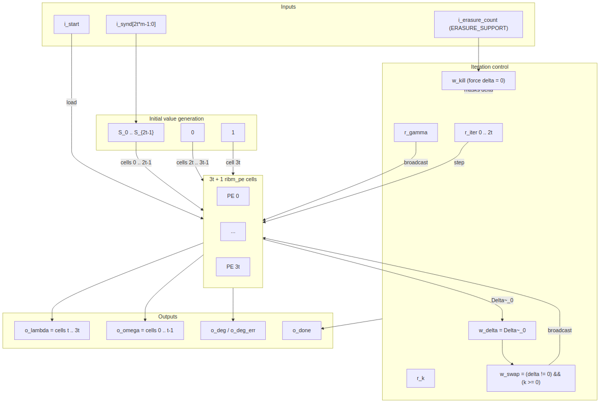

<!-- RTL Design Sherpa Documentation Header -->
<table>
<tr>
<td width="80">
  <a href="https://github.com/sean-galloway/RTLDesignSherpa">
    
  </a>
</td>
<td>
  <strong>RTL Design Sherpa</strong> · <em>Learning Hardware Design Through Practice</em><br>
  <sub>
    <a href="https://github.com/sean-galloway/RTLDesignSherpa">GitHub</a> ·
    <a href="https://github.com/sean-galloway/RTLDesignSherpa/blob/main/docs/DOCUMENTATION_INDEX.md">Documentation Index</a> ·
    <a href="https://github.com/sean-galloway/RTLDesignSherpa/blob/main/LICENSE">MIT License</a>
  </sub>
</td>
</tr>
</table>

---

<!-- End Header -->

# Key Equation Solver — riBM (`key_equation_solver_ribm`)

**Module:** `key_equation_solver_ribm.sv`
**Location:** `rtl/fub/`
**Category:** datapath + iteration counter
**Parent:** `rs_decoder_core`
**Status:** landed — `rtl/fub/key_equation_solver_ribm.sv`, gate DV green; default `KES_ALGO = "RIBM"` (D11)

---

## Purpose

`key_equation_solver_ribm` inverts the key equation from the `2t` syndromes
`S_0 .. S_{2t-1}` to the error-locator polynomial `Lambda(x)` and a companion
evaluator polynomial `Omega(x)` in a fixed number of cycles. It is the default
key-equation solver selected by `KES_ALGO = "RIBM"` in the decoder core; the
alternative is the Euclidean solver documented in chapter 2.4.

The implementation is the reformulated inversionless Berlekamp-Massey (riBM)
array from Sarwate and Shanbhag, 2001. Every coefficient cell is identical,
so the array is a pure datapath with a single broadcast control path. The
critical path is one GF multiply and one XOR, independent of `t`.

### Figure 2.3: riBM solver block diagram



## Parameters

| Parameter | Type | Range | Default | Meaning | PRD |
|---|---|---|---|---|---|
| `SYMBOL_WIDTH` | int | 3..16 | 8 | `m`; field is GF(2^m) | D1 |
| `PRIM_POLY` | int | — | `0x11D` | primitive polynomial for GF(2^m) | D1 |
| `T_SYMBOLS` | int | 1..(2^m-2)/2 | 8 | correctable symbol errors `t` | D2 |
| `ERASURE_SUPPORT` | bit | 0, 1 | 0 | accept `i_erasure_count` and kill the last `f` updates | D5 |
: Table 2.5: riBM solver parameters

## Interface

| Signal | Direction | Width | Description |
|---|---|---|---|
| `aclk` | in | 1 | clock |
| `aresetn` | in | 1 | active-low synchronous reset |
| `i_start` | in | 1 | load syndromes and begin the 2t iterations |
| `i_synd` | in | `2*T_SYMBOLS*SYMBOL_WIDTH` | packed syndromes `{S_{2t-1}, ..., S_0}` |
| `i_erasure_count` | in | `$clog2(2*T_SYMBOLS+1)` | number of erasures `f`; only used when `ERASURE_SUPPORT = 1` |
| `o_busy` | out | 1 | solver is iterating |
| `o_done` | out | 1 | single-cycle pulse when the result is valid |
| `o_lambda` | out | `(2*T_SYMBOLS+1)*SYMBOL_WIDTH` | locator coefficients `Lambda_0 .. Lambda_{2t}` |
| `o_omega` | out | `T_SYMBOLS*SYMBOL_WIDTH` | evaluator coefficients `Omega_0 .. Omega_{t-1}` |
| `o_deg` | out | `$clog2(2*T_SYMBOLS+1)` | degree of `Lambda` (highest nonzero index) |
| `o_deg_err` | out | 1 | any of `Lambda_{t+1..2t}` is nonzero — more than `t` errors |
: Table 2.6: riBM solver ports

## Microarchitecture internals

The array contains `3t + 1` identical `ribm_pe` cells. Cell `i` holds the pair
`Delta~_i` / `Theta~_i`. On `i_start` both registers in every cell load the
same initial value:

```text
i_init[i] = S_i           for i = 0 .. 2t-1
          = 0             for i = 2t .. 3t-1
          = 1             for i = 3t
```

The control state is `gamma = 1` and `k = 0`. Each of the next `2t` cycles is
one iteration:

```text
delta = Delta~_0
swap  = (delta != 0) && (k >= 0)
gamma <= swap ? delta : gamma
k     <= swap ? -k - 1 : k + 1
```

Each cell computes the Sarwate-Shanbhag recurrence:

```text
Delta_i(r+1) = gamma(r) * Delta_{i+1}(r)  ^  delta(r) * Theta_i(r)
Theta_i(r+1) = swap ? Delta_{i+1}(r) : Theta_i(r)
```

The leaf `ribm_pe` instantiates two `gf_mul` modules and two `SYMBOL_WIDTH`
registers. The `Delta_{i+1}` value comes from the neighbouring cell on the
right; `gamma`, `delta`, and `swap` are broadcast to all cells. There is no
feedback from the end of the array back to the beginning, so the critical path
is one GF multiplier followed by one XOR at any `t`.

After exactly `2t` iterations `o_done` pulses. The outputs are combinational
slices off the array:

```text
o_omega = Delta~_0 .. Delta~_{t-1}
o_lambda = Delta~_t .. Delta~_{3t}
```

`o_lambda` therefore contains `2t + 1` coefficients `Lambda_0 .. Lambda_{2t}`;
the top `t` coefficients are the degree-error check. The degree logic scans
`Lambda_0 .. Lambda_{2t}` and raises `o_deg_err` if any coefficient above
index `t` is nonzero.

With `ERASURE_SUPPORT = 1`, `i_erasure_count` carries `f` erasures. The input
is the Forney syndrome list `T` zero-padded to `2t` values; the last `f` of the
fixed `2t` iterations are killed by forcing `w_delta = 0` when
`r_iter >= 2t - f`. The array still shifts every cycle, so the readout cells
are unchanged and the result matches textbook BM on `T`.

## FSM policy

There is no control FSM. The only state registers in the control path are
`r_busy`, `r_iter`, `r_gamma`, and `r_k`. `r_busy` is set by `i_start` and
cleared when `r_iter == 2t - 1`; `o_done` is raised on that same edge. The
`swap`, `gamma`, and `k` updates are combinational or simple registered
qualifiers driven by the iteration counter and the array output `Delta~_0`.

## Timing

- Latency from `i_start` to `o_done` is exactly `2t` cycles.
- `o_done` is a single-cycle pulse; `o_lambda`, `o_omega`, `o_deg`, and
  `o_deg_err` are valid in that cycle.
- `i_start` may be asserted in the same cycle as `o_done` to begin a new block
  immediately.

## Notes

- The evaluator produced here is the **high half** of `S(x) * Lambda(x)`
  (coefficients `2t .. 3t-1`), not the textbook `Omega = S*Lambda mod x^2t`.
  The decoder core sets the Forney evaluator's `OMEGA_HIGH_HALF` constant from
  `KES_ALGO`: `1` for riBM, `0` for Euclid. `dv/tbclasses/rs_model.py` is the
  bit-exact reference for both forms.
- The solver is bit-exact against `dv/tbclasses/rs_model.py`; the verification
  posture runs both solvers on the same blocks and checks identical Chien root
  sets and Forney values. See chapter 2.4 for the Euclidean implementation.
- Trade-off: riBM pays for a `3t + 1` cell array and a fixed `2t` cycle count
  in exchange for a short, t-independent critical path and no degree counters.
  That short path is why riBM is the default at high `t`.
