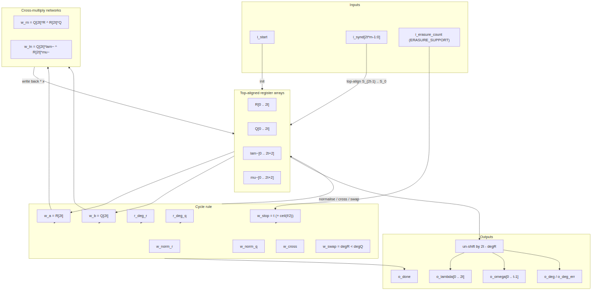

<!-- RTL Design Sherpa Documentation Header -->
<table>
<tr>
<td width="80">
  <a href="https://github.com/sean-galloway/RTLDesignSherpa">
    
  </a>
</td>
<td>
  <strong>RTL Design Sherpa</strong> · <em>Learning Hardware Design Through Practice</em><br>
  <sub>
    <a href="https://github.com/sean-galloway/RTLDesignSherpa">GitHub</a> ·
    <a href="https://github.com/sean-galloway/RTLDesignSherpa/blob/main/docs/DOCUMENTATION_INDEX.md">Documentation Index</a> ·
    <a href="https://github.com/sean-galloway/RTLDesignSherpa/blob/main/LICENSE">MIT License</a>
  </sub>
</td>
</tr>
</table>

---

<!-- End Header -->

# Key Equation Solver — Euclidean (`key_equation_solver_euclid`)

**Module:** `key_equation_solver_euclid.sv`
**Location:** `rtl/fub/`
**Category:** datapath + cycle-rule controller
**Parent:** `rs_decoder_core`
**Status:** landed — `rtl/fub/key_equation_solver_euclid.sv`, gate DV green; selected by `KES_ALGO = "EUCLID"` (D11)

---

## Purpose

`key_equation_solver_euclid` computes the same error-locator and error-evaluator
polynomials as the riBM solver, but by the inversionless extended Euclidean
algorithm. It is the alternative selected by `KES_ALGO = "EUCLID"` in the decoder
core; the default is the riBM solver documented in chapter 2.3.

The implementation keeps every polynomial top-aligned, so the cross-multiply
step needs no shifter. The number of cycles is data-dependent and can stop as
soon as the remainder degree drops below `t`.

### Figure 2.4: Euclid solver block diagram



## Parameters

| Parameter | Type | Range | Default | Meaning | PRD |
|---|---|---|---|---|---|
| `SYMBOL_WIDTH` | int | 3..16 | 8 | `m`; field is GF(2^m) | D1 |
| `PRIM_POLY` | int | — | `0x11D` | primitive polynomial for GF(2^m) | D1 |
| `T_SYMBOLS` | int | 1..(2^m-2)/2 | 8 | correctable symbol errors `t` | D2 |
| `ERASURE_SUPPORT` | bit | 0, 1 | 0 | accept `i_erasure_count` and raise the stop threshold | D5 |
: Table 2.7: Euclidean solver parameters

## Interface

| Signal | Direction | Width | Description |
|---|---|---|---|
| `aclk` | in | 1 | clock |
| `aresetn` | in | 1 | active-low synchronous reset |
| `i_start` | in | 1 | load syndromes and begin the Euclidean loop |
| `i_synd` | in | `2*T_SYMBOLS*SYMBOL_WIDTH` | packed syndromes `{S_{2t-1}, ..., S_0}` |
| `i_erasure_count` | in | `$clog2(2*T_SYMBOLS+1)` | number of erasures `f`; only used when `ERASURE_SUPPORT = 1` |
| `o_busy` | out | 1 | solver is iterating |
| `o_done` | out | 1 | single-cycle pulse when the result is valid |
| `o_lambda` | out | `(2*T_SYMBOLS+1)*SYMBOL_WIDTH` | locator coefficients `Lambda_0 .. Lambda_{2t}` |
| `o_omega` | out | `T_SYMBOLS*SYMBOL_WIDTH` | evaluator coefficients `Omega_0 .. Omega_{t-1}` |
| `o_deg` | out | `$clog2(2*T_SYMBOLS+1)` | degree of `Lambda` (highest nonzero index) |
| `o_deg_err` | out | 1 | any of `Lambda_{t+1..2t}` is nonzero, or the safety stop fired |
: Table 2.8: Euclidean solver ports

## Microarchitecture internals

The solver keeps four top-aligned register arrays:

```text
R[0 .. 2t]          remainder, length 2t + 1
Q[0 .. 2t]          divisor,  length 2t + 1
lam~[0 .. 2t+2]     Lambda * x^(2t - degR), length 2t + 3
mu~[0 .. 2t+2]      Mu    * x^(2t - degQ), length 2t + 3
```

On `i_start`:

```text
R  = x^(2t)                         (R[2t] = 1, rest 0)
Q  = S(x) top-aligned               (Q[i] = S_{i-1} for i = 1 .. 2t, Q[0] = 0)
lam~ = 0
mu~  = x                            (mu~[1] = 1, rest 0)
degR = 2t
degQ = 2t - 1
```

Each busy cycle selects one of three actions from the leading coefficients
`w_a = R[2t]` and `w_b = Q[2t]`:

```text
normalise R:  R[2t] == 0            R <- R * x,  lam~ <- lam~ * x,  degR--
normalise Q:  R[2t] != 0, Q[2t] == 0  Q <- Q * x,  mu~  <- mu~  * x,  degQ--
cross:        R[2t] != 0, Q[2t] != 0
              Rn  = (Q[2t]*R  ^ R[2t]*Q)  * x
              Ln  = (Q[2t]*lam~ ^ R[2t]*mu~) * x
              if degR < degQ:
                  swap (R, lam~, degR) with (Q, mu~, degQ)
              degR = max(degR, degQ) - 1
```

The cross step is built from two independent GF multiply/XOR banks. For each
`i` in `0 .. 2t`:

```text
w_rn[i] = Q[2t] * R[i] ^ R[2t] * Q[i]
```

and for each `i` in `0 .. 2t+2`:

```text
w_ln[i] = Q[2t] * lam~[i] ^ R[2t] * mu~[i]
```

After the cross, `R[1 .. 2t]` and `lam~[1 .. 2t+2]` load `w_rn[0 .. 2t-1]` and
`w_ln[0 .. 2t+1]`, which is the `* x` shift. A normalise step does the same
shift using the existing array contents.

The stop condition is:

```text
finished = (degR < stop) || (degQ < 0) || (r_cycles == all-ones)
stop     = t                         when ERASURE_SUPPORT = 0
stop     = t + ceil(f / 2)           when ERASURE_SUPPORT = 1
```

To avoid spending a cycle merely noticing completion, the RTL computes the
next degrees (`w_deg_r_nxt`, `w_deg_q_nxt`) combinationally and asserts
`o_done` on the same clock edge as the final array write whenever
`w_finished_nxt` is true.

The output stage un-shifts by `2t - degR`:

```text
Lambda_j = lam~[j + 2t - degR]      for j = 0 .. 2t
Omega_j  = R[j + 2t - degR]         for j = 0 .. t-1
```

`degR` is in `0 .. t-1` for a clean stop; anything else means the safety
counter retired the run and `o_deg_err` is raised. As in the riBM solver, the
top `t` locator coefficients are the more-than-`t`-errors check.

`Omega` here is the textbook `S(x) * Lambda(x) mod x^(2t)`, so the decoder
core sets the Forney evaluator's `OMEGA_HIGH_HALF = 0` for this solver.

## FSM policy

There is no explicit state-machine enum. The active operation is selected each
cycle by combinational qualifiers:

- `w_norm_r` — shift `R` / `lam~` because `R[2t] == 0`
- `w_norm_q` — shift `Q` / `mu~` because `R[2t] != 0` and `Q[2t] == 0`
- `w_cross` — perform the cross-multiply because both leading coefficients are
  nonzero
- `w_swap` — exchange the `(R, lam~)` and `(Q, mu~)` roles when `degR < degQ`

The controller's state is therefore held in the four register arrays plus
`r_deg_r`, `r_deg_q`, `r_busy`, and the safety counter `r_cycles`. The degree
comparisons are part of the datapath, which makes the per-iteration critical
path longer than riBM's.

## Timing

- Latency from `i_start` to `o_done` is data-dependent, between `t + 1` and
  `2t` iterations. The final update and `o_done` share the same clock edge.
- A zero leading syndrome at small `t` can force an extra normalise step; at
  `t <= 2` this produces the observed `2t + 1` cycle count.
- The safety counter `r_cycles` is `ceil(log2(4t + 8))` bits wide and stops the
  run before it wraps.

## Notes

- The Euclidean solver is bit-exact against `dv/tbclasses/rs_model.py::euclid`.
  The verification posture runs both solvers on the same blocks and requires
  identical Chien roots and Forney values.
- Trade-off: Euclid uses shorter arrays (`2t + 1` and `2t + 3` symbols) and can
  stop early, but the cross-multiply feeds a degree comparison that drives the
  swap decision, giving a longer per-iteration critical path than riBM. That
  longer path is why riBM is the default and Euclid is kept as a readable
  cross-check.
- The actual RTL arrays give `8t + 8` GF multipliers and `8t + 8` symbol
  registers, not the `8t` the catalog rounds to. For the reference profile
  (`t = 8`) this is 72 multipliers and 72 symbol registers, compared with
  riBM's 50.
