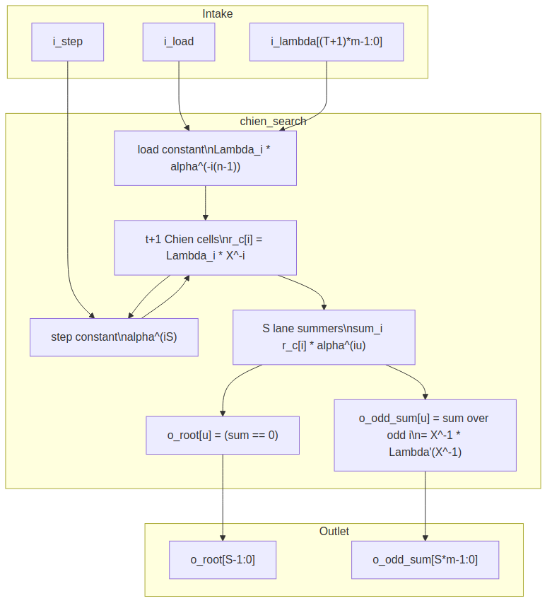

<!-- RTL Design Sherpa Documentation Header -->
<table>
<tr>
<td width="80">
  <a href="https://github.com/sean-galloway/RTLDesignSherpa">
    
  </a>
</td>
<td>
  <strong>RTL Design Sherpa</strong> · <em>Learning Hardware Design Through Practice</em><br>
  <sub>
    <a href="https://github.com/sean-galloway/RTLDesignSherpa">GitHub</a> ·
    <a href="https://github.com/sean-galloway/RTLDesignSherpa/blob/main/docs/DOCUMENTATION_INDEX.md">Documentation Index</a> ·
    <a href="https://github.com/sean-galloway/RTLDesignSherpa/blob/main/LICENSE">MIT License</a>
  </sub>
</td>
</tr>
</table>

---

<!-- End Header -->

# Chien Search (`chien_search`)

**Module:** `chien_search.sv`
**Location:** `rtl/fub/`
**Category:** streaming datapath
**Parent:** `rs_decoder_core`
**Status:** landed — `rtl/fub/chien_search.sv`, gate DV green on the standing profiles

---

## Purpose

`chien_search` walks the error-locator polynomial `Lambda(x)` across every
symbol position of the received block. A root at position `j` means the symbol
at that position is in error. Because this is a Reed-Solomon decoder, the root
flag is not enough — the block also emits the odd-index partial sum
`X^-1 * Lambda'(X^-1)` for each lane, which the Forney evaluator needs to
compute the actual error magnitude. The math is in HAS chapter 7.3
(`../reed_solomon_has/ch07_understanding_the_math/03_decoding.md`); this page
is the signal-level implementation.

### Figure 2.5: Chien search block diagram



## Parameters

| Parameter | Type | Range | Default | Meaning | PRD |
|---|---|---|---|---|---|
| `SYMBOL_WIDTH` | int | 3..16 | 8 | `m`; field is GF(2^m) | D1 |
| `PRIM_POLY` | int | — | `'h11D` | primitive polynomial | — |
| `T_SYMBOLS` | int | 1..(2^m-1)/2 | 8 | correctable symbol errors `t` | D2 |
| `N_SYMBOLS` | int | 2t+1 .. 2^m-1 | 2^m-1 | codeword length `n` in symbols | D3 |
| `SYMBOLS_PER_BEAT` | int | 1 .. `K_SYMBOLS` | 1 | symbols evaluated per beat `S` | D6 |

: Table 2.9: Chien search parameters

## Interface

| Signal | Direction | Width | Description |
|---|---|---|---|
| `aclk` | in | 1 | one clock |
| `aresetn` | in | 1 | active-low synchronous reset |
| `i_load` | in | 1 | load `Lambda` and reset cells to position 0 |
| `i_lambda` | in | `(T_SYMBOLS + 1) * SYMBOL_WIDTH` | locator coefficients `Lambda_0 .. Lambda_t` |
| `i_step` | in | 1 | advance cells to the next beat |
| `o_root` | out | `SYMBOLS_PER_BEAT` | root flag per lane |
| `o_odd_sum` | out | `SYMBOLS_PER_BEAT * SYMBOL_WIDTH` | `X^-1 * Lambda'(X^-1)` per lane |

: Table 2.10: Chien search ports

## Microarchitecture internals

### `t + 1` Chien cells

Symbol `j` (transmission order, `j = 0` first) has location
`X_j = alpha^(n-1-j)`. It is in error when `Lambda(X_j^-1) = 0`. Cell `i` holds
`Lambda_i * X_j^-i` for the beat's first position `j`:

```text
load (position 0):
  r_c[i] <- Lambda_i * alpha^(-i(n-1))

step to next beat:
  r_c[i] <- r_c[i] * alpha^(iS)
```

The load constant absorbs the shortening offset: `N_SYMBOLS` is the shortened
block length, so `alpha^(-i(n-1))` already points at the first transmitted
position.

### Lane structure

Lane `u` (position `j+u`) evaluates `sum_i r_c[i] * alpha^(iu)`:

```text
sum[u] = sum_{i=0..t} r_c[i] * alpha^(i u)
odd[u] = sum_{i odd}     r_c[i] * alpha^(i u)

o_root[u]    = (sum[u] == 0)
o_odd_sum[u] = odd[u] = X_j^-1 * Lambda'(X_j^-1)
```

`o_root[u]` is the root flag. `o_odd_sum[u]` is the formal derivative in
characteristic 2, handed to `forney_evaluator` as `i_odd_sum` so the derivative
costs nothing extra.

### Constant-multiply implementation

Every multiply in this block is by a constant. The load and step use
`gf_mul_const` instances, one per cell per direction:

```text
(t + 1) cells * 2 constants = 2(t + 1) gf_mul_const instances
```

The lane constants `alpha^(iu)` are built at elaboration by `build_lane_consts`
and applied as `(t + 1)S` generate-loop calls to `gf_mul_fn` on a constant.
Total constant multiplies: `(t + 1)(S + 2)`. For the reference profile
`t = 8, S = 1` that is `27` constant multiplies. With `S > 1` the lane count
scales linearly.

## FSM policy

This block carries **no FSM** (per
`vault/handbook/design/streaming-no-fsm.md`). The Chien walk is driven by:

- `i_load`: starts the walk at position 0
- `i_step`: moves to the next beat
- the register array `r_c[0..t]`: holds the current beat's cell values

The parent decoder core owns the position counter and the load/step sequence.

## Timing

- Serial case (`SYMBOLS_PER_BEAT = 1`): `N_SYMBOLS` cycles per block to evaluate
  every position.
- Parallel-beat case (`SYMBOLS_PER_BEAT = S`): `ceil(N_SYMBOLS / S)` cycles per
  block, with `S` independent lane evaluations per cycle.
- `o_root` and `o_odd_sum` are combinational from the registered cell array, so
  the critical path is one lane constant multiply plus the `t + 1` input XOR
  tree.

## Notes

- The `t + 1` coefficient order is `Lambda_0` (constant term) through
  `Lambda_t`. Cell `0` therefore holds `Lambda_0` unchanged and contributes the
  same value to every lane.
- Shortening is handled entirely by the load constants; there is no separate
  counter or offset register.
- The trade-off here is load-vs-step constant multiplies. Each cell carries two
  dedicated `gf_mul_const` instances because the initial value (position 0) and
  the beat-to-beat step use different constants `alpha^(-i(n-1))` and
  `alpha^(iS)`. A shared multiplier would need a mux and an extra cycle; the RTL
  pays the area to keep the walk single-cycle per beat.
- The odd-index sum is only valid when the corresponding lane has a root, but
  the block computes it for every lane anyway — it is the same partial sum the
  zero test already needs.
- Both `o_root` and `o_odd_sum` describe the beat the cells currently hold. The
  decoder core counts beats and pairs these outputs with the block buffer's
  replayed symbols. See chapter 2.6 (`forney_evaluator`) for where `o_odd_sum`
  goes, and chapter 2.8 (`rs_decoder_core`) for how the load/step sequence is
  driven.
