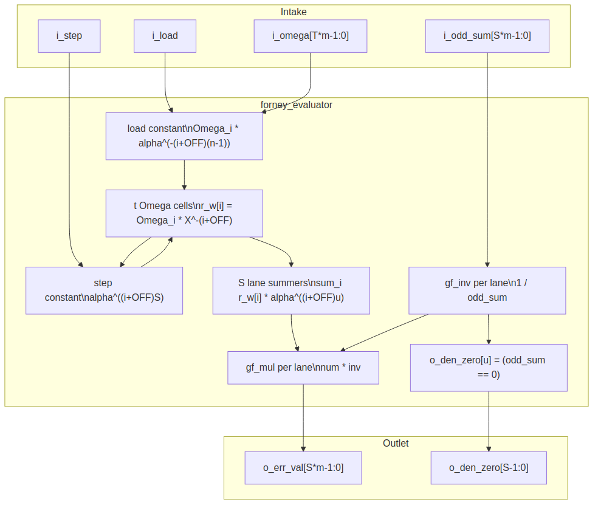

<!-- RTL Design Sherpa Documentation Header -->
<table>
<tr>
<td width="80">
  <a href="https://github.com/sean-galloway/RTLDesignSherpa">
    
  </a>
</td>
<td>
  <strong>RTL Design Sherpa</strong> · <em>Learning Hardware Design Through Practice</em><br>
  <sub>
    <a href="https://github.com/sean-galloway/RTLDesignSherpa">GitHub</a> ·
    <a href="https://github.com/sean-galloway/RTLDesignSherpa/blob/main/docs/DOCUMENTATION_INDEX.md">Documentation Index</a> ·
    <a href="https://github.com/sean-galloway/RTLDesignSherpa/blob/main/LICENSE">MIT License</a>
  </sub>
</td>
</tr>
</table>

---

<!-- End Header -->

# Forney Evaluator (`forney_evaluator`)

**Module:** `forney_evaluator.sv`
**Location:** `rtl/fub/`
**Category:** streaming datapath
**Parent:** `rs_decoder_core`
**Status:** landed — `rtl/fub/forney_evaluator.sv`, gate DV green on the standing profiles

---

## Purpose

`forney_evaluator` turns a located Chien root into the actual error magnitude
for that symbol. The block walks the error-evaluator polynomial `Omega(x)` in
lockstep with `chien_search`, divides by the formal derivative of `Lambda(x)`,
and emits one error value per lane per beat. The math is in HAS chapter 7.3
(`../reed_solomon_has/ch07_understanding_the_math/03_decoding.md`); this page
is the signal-level implementation.

### Figure 2.6: Forney evaluator block diagram



## Parameters

| Parameter | Type | Range | Default | Meaning | PRD |
|---|---|---|---|---|---|
| `SYMBOL_WIDTH` | int | 3..16 | 8 | `m`; field is GF(2^m) | D1 |
| `PRIM_POLY` | int | — | `'h11D` | primitive polynomial | — |
| `T_SYMBOLS` | int | 1..(2^m-1)/2 | 8 | correctable symbol errors `t` | D2 |
| `N_SYMBOLS` | int | 2t+1 .. 2^m-1 | 2^m-1 | codeword length `n` in symbols | D3 |
| `FIRST_ROOT` | int | 0..2^m-2 | 0 | `b`, first consecutive root of `g(x)` | — |
| `OMEGA_HIGH_HALF` | bit | 0/1 | 1 | 1 = riBM high-half Omega, 0 = Euclid textbook Omega | — |
| `SYMBOLS_PER_BEAT` | int | 1 .. `K_SYMBOLS` | 1 | symbols corrected per beat `S` | D6 |

: Table 2.11: Forney evaluator parameters

## Interface

| Signal | Direction | Width | Description |
|---|---|---|---|
| `aclk` | in | 1 | one clock |
| `aresetn` | in | 1 | active-low synchronous reset |
| `i_load` | in | 1 | load `Omega` and reset cells to position 0 |
| `i_omega` | in | `T_SYMBOLS * SYMBOL_WIDTH` | evaluator coefficients `Omega_0 .. Omega_{t-1}` |
| `i_step` | in | 1 | advance cells to the next beat |
| `i_odd_sum` | in | `SYMBOLS_PER_BEAT * SYMBOL_WIDTH` | `X^-1 * Lambda'(X^-1)` per lane from Chien |
| `o_err_val` | out | `SYMBOLS_PER_BEAT * SYMBOL_WIDTH` | error magnitude per lane |
| `o_den_zero` | out | `SYMBOLS_PER_BEAT` | denominator zero flag per lane |

: Table 2.12: Forney evaluator ports

## Microarchitecture internals

### `t` Omega cells

The error value at position `j` is:

```text
e_j = X_j^(1-b-off) * Omega(X_j^-1) / Lambda'(X_j^-1)
```

`off` depends on which solver produced `Omega`:

```text
OMEGA_HIGH_HALF = 1 (riBM): off = 2t
OMEGA_HIGH_HALF = 0 (Euclid): off = 0
```

The effective exponent offset used in the RTL is:

```text
OFF = b + off = FIRST_ROOT + (OMEGA_HIGH_HALF ? 2*T_SYMBOLS : 0)
```

`chien_search` already supplies `odd_sum = X_j^-1 * Lambda'(X_j^-1)`, so the
formula becomes:

```text
e_j = [ X_j^-(b+off) * Omega(X_j^-1) ] / odd_sum
    = [ sum_i Omega_i * X_j^-(i+OFF) ] / odd_sum
```

Cell `i` holds `Omega_i * X_j^-(i+OFF)` for the beat's first position `j`:

```text
load (position 0):
  r_w[i] <- Omega_i * alpha^(-(i+OFF)(n-1))

step to next beat:
  r_w[i] <- r_w[i] * alpha^((i+OFF)S)
```

### Lane numerator

Lane `u` (position `j+u`) sums `r_w[i] * alpha^((i+OFF)u)`:

```text
num[u] = sum_{i=0..t-1} r_w[i] * alpha^((i+OFF)u)
```

These lane constants are built at elaboration by `build_lane_consts` and
applied as `tS` generate-loop calls to `gf_mul_fn` on a constant, exactly like
the Chien lane constants.

### Per-lane inverse and multiply

Each lane finishes the Forney formula with one `gf_inv` and one `gf_mul`:

```text
w_den_inv[u] = inv(i_odd_sum[u])
o_err_val[u] = num[u] * w_den_inv[u]
o_den_zero[u] = (i_odd_sum[u] == 0)
```

`o_den_zero[u]` cannot be true at a genuine root; when it is, the block is
uncorrectable. The decoder core uses this in the final verdict.

Total primitives in the block: `2t` `gf_mul_const` instances (`t` load + `t`
step), `tS` lane constants applied as `gf_mul_fn`, `S` `gf_inv`, and `S`
`gf_mul`. For the reference profile `t = 8, S = 1` that is `16 + 8 + 1 + 1 =
26`. With `S > 1` the lane count scales linearly and the inverse/multiply pair
is replicated per lane.

## FSM policy

This block carries **no FSM** (per
`vault/handbook/design/streaming-no-fsm.md`). The evaluator walk is driven by:

- `i_load`: starts the walk at position 0
- `i_step`: moves to the next beat
- the register array `r_w[0..t-1]`: holds the current beat's cell values

The parent decoder core owns the position counter and the load/step sequence,
and keeps `i_step` aligned with the matching step on `chien_search`.

## Timing

- Serial case (`SYMBOLS_PER_BEAT = 1`): `N_SYMBOLS` cycles per block, one error
  value per cycle.
- Parallel-beat case (`SYMBOLS_PER_BEAT = S`): `ceil(N_SYMBOLS / S)` cycles per
  block, with `S` independent lane evaluations per cycle.
- The critical path is the lane summer XOR tree feeding `gf_mul`, after the
  `gf_inv` lookup. The inverse is a table lookup (log / negate / antilog), not a
  combinational recursion, so the path stays manageable.

## Notes

- `OMEGA_HIGH_HALF` is normally driven from the parent core's `KES_ALGO`
  parameter. The RTL does not decide which solver is correct; it exposes the
  offset choice and the core sets it.
- The `X^-(b+off)` factor is folded into the load and step constants, not
  applied as a separate post-multiplication. That keeps the per-lane path to
  one general multiply after the inverse.
- Shortening is handled by the load constants, just like `chien_search`:
  `N_SYMBOLS` is the shortened block length, so `alpha^(-(i+OFF)(n-1))` already
  points at the first transmitted position.
- The trade-off here is `S` inverses per beat. Every lane gets its own
  `gf_inv` and `gf_mul` so that all `S` positions in a beat can be corrected in
  the same cycle. Sharing one inverse across lanes would require either
  serialization or a crossbar, which would break the single-cycle-per-beat
  contract the decoder core relies on.
- `o_den_zero` is generated by the same `gf_inv` instance that produces the
  reciprocal; there is no separate zero comparator.
- The lane constants and the cell constants are all built by calling
  `gf_alpha_pow` at elaboration, so no runtime log/antilog tables are needed
  inside this block apart from the `gf_inv` tables. See chapter 2.5
  (`chien_search`) for the source of `i_odd_sum`, and chapter 2.8
  (`rs_decoder_core`) for how the two walks are kept aligned.
