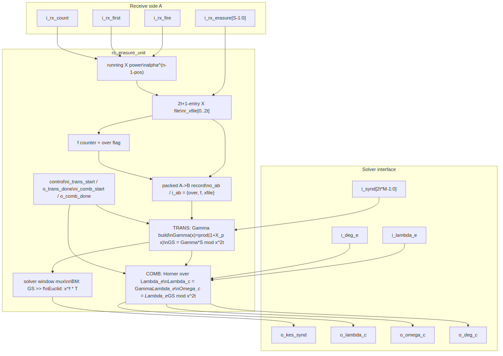

<!-- RTL Design Sherpa Documentation Header -->
<table>
<tr>
<td width="80">
  <a href="https://github.com/sean-galloway/RTLDesignSherpa">
    
  </a>
</td>
<td>
  <strong>RTL Design Sherpa</strong> · <em>Learning Hardware Design Through Practice</em><br>
  <sub>
    <a href="https://github.com/sean-galloway/RTLDesignSherpa">GitHub</a> ·
    <a href="https://github.com/sean-galloway/RTLDesignSherpa/blob/main/docs/DOCUMENTATION_INDEX.md">Documentation Index</a> ·
    <a href="https://github.com/sean-galloway/RTLDesignSherpa/blob/main/LICENSE">MIT License</a>
  </sub>
</td>
</tr>
</table>

---

<!-- End Header -->

# Erasure Unit (`rs_erasure_unit`)

**Module:** `rs_erasure_unit.sv`  
**Location:** `rtl/fub/`  
**Category:** erasure pre-processor (two halves joined by a packed A→B descriptor)  
**Parent:** `rs_decoder_core` (instantiated only when `ERASURE_SUPPORT = 1`)  
**Status:** landed — `rtl/fub/rs_erasure_unit.sv`, generated only under `ERASURE_SUPPORT = 1` (PRD D5, default 0)

---

## Purpose

`rs_erasure_unit` is the erasure half of the decoder. It records the positions of flagged symbols as the block arrives, turns the receive-side syndromes into the window the key-equation solver consumes, and builds the combined locator and evaluator the Chien/Forney walk consumes. The unit is split into a receive half (stage A) and a solve half (stage B), joined by a packed record that rides the decoder core's A→B descriptor. See [HAS chapter 3.2](../../reed_solomon_has/ch03_architecture/02_data_flow.md) for the surrounding data flow and chapter 2.8 for how the core pipelines the unit.

### Figure 2.7: Erasure unit block diagram



## Parameters

| Parameter | Type | Range | Default | Meaning | PRD |
|---|---|---|---|---|---|
| `SYMBOL_WIDTH` | int | 3..12 | 8 | `m`; field is GF(2^m) | D1 |
| `PRIM_POLY` | int | primitive | `'h11D` | field primitive polynomial | D1 |
| `T_SYMBOLS` | int | 1..(2^m-2)/2 | 8 | correctable symbol errors | D2 |
| `N_SYMBOLS` | int | 2t+1 .. 2^m-1 | `2^SYMBOL_WIDTH - 1` | codeword length in symbols | D3 |
| `SYMBOLS_PER_BEAT` | int | 1 .. `DATA_WIDTH/SYMBOL_WIDTH` | 1 | symbols per valid/ready beat | D6 |
| `KES_ALGO` | string | `"RIBM"`, `"EUCLID"` | `"RIBM"` | solver algorithm; selects the syndrome window | D11 |
| `AB_W` | int | derived | `1 + clog2(2t+1) + (2t+1)*SYMBOL_WIDTH` | width of the packed A→B record | — |

: Table 2.13: Erasure unit parameters

## Interface

| Signal | Direction | Width | Description |
|---|---|---|---|
| `aclk` | in | 1 | clock |
| `aresetn` | in | 1 | active-low synchronous reset |
| `i_rx_fire` | in | 1 | a beat is accepted on the intake |
| `i_rx_first` | in | 1 | the accepted beat starts a new block |
| `i_rx_count` | in | `$clog2(SYMBOLS_PER_BEAT+1)` | valid symbols in the accepted beat |
| `i_rx_erasure` | in | `SYMBOLS_PER_BEAT` | per-lane erasure flags, valid with the beat |
| `o_ab` | out | `AB_W` | packed A→B record `{f_over, f, xfile[0..2t]}` |
| `i_ab` | in | `AB_W` | same packed record from the A→B descriptor |
| `i_synd` | in | `2*T_SYMBOLS*SYMBOL_WIDTH` | receive-side syndromes from the descriptor |
| `i_trans_start` | in | 1 | load and run the Gamma/transform step |
| `o_trans_done` | out | 1 | TRANS finished |
| `i_comb_start` | in | 1 | start the combine step over `Lambda_e` |
| `o_comb_done` | out | 1 | COMB finished |
| `i_lambda_e` | in | `(2*T_SYMBOLS+1)*SYMBOL_WIDTH` | error locator from the solver |
| `i_deg_e` | in | `$clog2(2*T_SYMBOLS+1)` | degree of `i_lambda_e` |
| `o_kes_synd` | out | `2*T_SYMBOLS*SYMBOL_WIDTH` | solver input syndrome window |
| `o_f` | out | `$clog2(2*T_SYMBOLS+1)` | erasure count `f` for this block |
| `o_f_over` | out | 1 | more than `2t` erasures were flagged |
| `o_t_zero` | out | 1 | erasures alone explain the syndromes; solver can be skipped |
| `o_lambda_c` | out | `(2*T_SYMBOLS+1)*SYMBOL_WIDTH` | combined locator `Gamma * Lambda_e` |
| `o_omega_c` | out | `2*T_SYMBOLS*SYMBOL_WIDTH` | combined evaluator `Lambda_e * GS mod x^2t` |
| `o_deg_c` | out | `$clog2(2*T_SYMBOLS+1)+1` | combined degree, clamped at `2t+1` |

: Table 2.14: Erasure unit ports

## Microarchitecture internals

### Receive half — recording the flagged locations

On every accepted beat the unit keeps a running power register holding `alpha^(n-1-pos)` for the first symbol of the beat. It is loaded with `alpha^(n-1)` on `i_rx_first` and advanced by `alpha^(-count)` each beat, so each lane's location is `X_j = alpha^(n-1-j)`. Per lane a constant multiply by `alpha^(-u)` gives the lane location without a per-symbol counter. A lane is recorded only when `i_rx_erasure[u]` is set and `u` is inside `i_rx_count` and `i_rx_fire` is high.

Flagged locations are written into a `2t+1`-entry file in arrival order. The rank of a flagged lane within its beat selects the entry, and the per-block erasure count `f` saturates at `2t+1`. The `f_over` flag is raised as soon as `f` would exceed `2t`; such a block is uncorrectable by inspection. The packed record `o_ab = {f_over, f, xfile[2t] ... xfile[0]}` is the *next* value of the file and count, because the core samples it on the block-end edge before that edge's own flags have landed in the registers.

### Transform half — Gamma and the Forney syndrome

When the core pops the descriptor it asserts `i_trans_start`. The unit latches the unpacked record (`f` and the `xfile`) and loads the syndrome cells with `S_0..S_{2t-1}`. TRANS then walks the `f` recorded positions, updating:

```text
Gamma(x) = prod_p (1 + X_p * x)
GS       = Gamma * S mod x^(2t)
```

Each cycle does one `gf_mul` per coefficient; the latency is `f` cycles (zero when `f = 0` beyond the load cycle). After TRANS the high cells of `GS` hold `T = GS >> f`, the Forney syndrome window the solver consumes.

If every high cell of `GS` is zero, the erasures alone explain every syndrome. The unit raises `o_t_zero`, which lets the core skip the solver entirely: `Lambda_e = 1`, so `Lambda_c = Gamma` and `Omega_c = GS` are already in the registers.

### Solver input window

`KES_ALGO` selects how the `2t`-cell solver window is presented. This is the same distinction the golden model uses in `dv/tbclasses/rs_model.py`:

```text
riBM:   o_kes_synd[i] = GS[i + f]  (crossbar; cells below the shift are zero)
Euclid: o_kes_synd[i] = GS[i] when i >= f, else 0
```

riBM consumes the *dropped* window `T`; Euclid consumes the *zeroed-low* polynomial `x^f * T`. The two are equivalent because Euclid treats the polynomial as a whole, while a forward-iterating BM would be contaminated by the zero padding at the tail.

### Combine — building the walk polynomials

After the solver returns `Lambda_e` and `deg_e`, the core asserts `i_comb_start`. COMB performs a Horner multiply over `Lambda_e`'s coefficients, high to low, producing:

```text
Lambda_c = Gamma * Lambda_e
Omega_c  = Lambda_e * GS mod x^(2t)
```

Both are exactly what the Chien/Forney walk needs. The combined degree is `deg_e + f`, clamped at `2t+1`:

```text
o_deg_c = r_t_zero ? f : min(deg_e + f, 2t + 1)
```

A clean solve always lands at or below `2t`.

### Correction bound

With `f` erasures and `mu` unknown errors the decoder is bounded-distance when:

```text
2 * mu + f <= 2t
```

`dv/tbclasses/rs_model.py` (`decode()` erasure path) is the bit-exact reference for this bound and for every intermediate value; the RTL was verified against it on every matrix profile.

### Elaboration guard

The unit is instantiated only inside the decoder core generate block:

```systemverilog
if (ERASURE_SUPPORT) begin : g_erasure
    rs_erasure_unit #(...) u_erasure (...);
end
```

When `ERASURE_SUPPORT = 0` every declaration and signal is tied off; the errors-only core is bit-identical to the pre-erasure version.

## FSM policy

`rs_erasure_unit` has no control FSM of its own. The receive half is a set of counters and rank muxes; the solve half is two step counters (TRANS and COMB) driven by the core's `i_trans_start` and `i_comb_start` pulses. The core's solve-stage FSM (chapter 2.8) sequences those pulses and waits on `o_trans_done` and `o_comb_done`.

## Timing

- Receive work: one constant multiply per lane per beat, plus the rank muxes. No extra cycle.
- `i_trans_start` to `o_trans_done`: `f` cycles when `f > 0`, one load cycle when `f = 0`.
- `i_comb_start` to `o_comb_done`: `deg_e + 1` cycles, at most `t + 1`.
- Both TRANS and COMB are one `gf_mul` deep per coefficient; the critical path is a single field multiply plus an XOR tree.

## Notes

- `dv/tbclasses/rs_model.py` is the bit-exact reference. Its `decode()` erasure path uses the Forney-syndrome method (`Gamma * S mod x^2t`, drop the low `f` cells for riBM, zero the low `f` cells for Euclid), then multiplies `Gamma * Lambda_e` for the Chien/Forney walk. The RTL follows the same shape.
- The `INJ_CFG.mark` erasure-marking path is test-side only: `projects/components/utility-ip/misc/rtl/error_injector.sv` drives `out_erasure` with the beat's hit mask when `cfg_mark_erasure` is set, and `CLAUDE.md` records that this is how RAID-stripe maps or memory-controller bad-column information reach the decoder. The unit itself sees only `in_erasure` on the core port.
- With `KES_ALGO = "RIBM"` the unit shifts `GS` down by `f`; with `"EUCLID"` it zeroes the low `f` cells. Choosing the wrong window for the wrong solver is the classic erasure + BM pitfall the model caught early.
