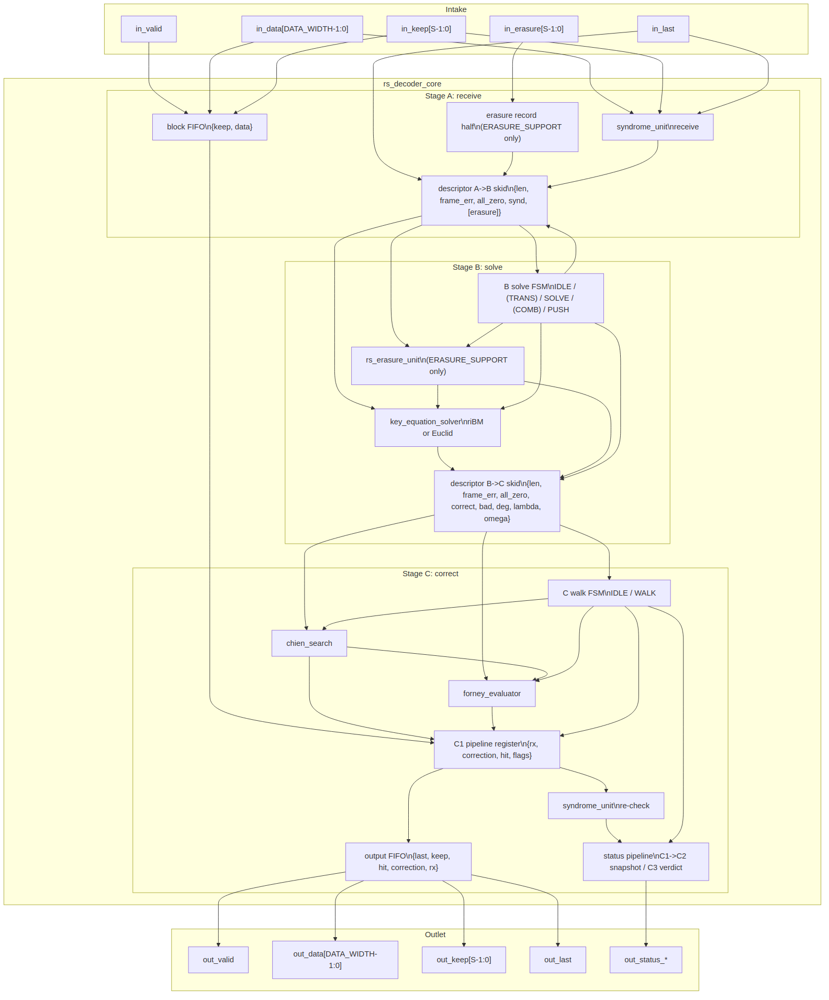

<!-- RTL Design Sherpa Documentation Header -->
<table>
<tr>
<td width="80">
  <a href="https://github.com/sean-galloway/RTLDesignSherpa">
    
  </a>
</td>
<td>
  <strong>RTL Design Sherpa</strong> · <em>Learning Hardware Design Through Practice</em><br>
  <sub>
    <a href="https://github.com/sean-galloway/RTLDesignSherpa">GitHub</a> ·
    <a href="https://github.com/sean-galloway/RTLDesignSherpa/blob/main/docs/DOCUMENTATION_INDEX.md">Documentation Index</a> ·
    <a href="https://github.com/sean-galloway/RTLDesignSherpa/blob/main/LICENSE">MIT License</a>
  </sub>
</td>
</tr>
</table>

---

<!-- End Header -->

# Decoder Core Integration (`rs_decoder_core`)

**Module:** `rs_decoder_core.sv`  
**Location:** `rtl/macro/`  
**Category:** integration block + stage control FSMs  
**Parent:** `rs_decoder` / standalone decoder wrapper  
**Status:** landed — `rtl/macro/rs_decoder_core.sv`, gate DV green; `KES_ALGO` selects riBM (default) or Euclid at elaboration

---

## Purpose

`rs_decoder_core` integrates the received-block buffer, syndrome unit, key-equation solver, Chien search, Forney evaluator, corrected-stream re-check, and output release into one valid/ready streaming block. Three stages — receive, solve, and correct — are joined by descriptor skids, so a block can be received while the previous one is solved and the one before that is corrected. The block is released only once its verdict exists, and corrections are applied at the output, not during the walk. See [HAS chapter 3.2](../../reed_solomon_has/ch03_architecture/02_data_flow.md) for the overall decoder data flow.

### Figure 2.8: Decoder core block diagram



## Parameters

| Parameter | Type | Range | Default | Meaning | PRD |
|---|---|---|---|---|---|
| `SYMBOL_WIDTH` | int | 3..12 | 8 | `m`; field is GF(2^m) | D1 |
| `PRIM_POLY` | int | primitive | `'h11D` | field primitive polynomial | D1 |
| `T_SYMBOLS` | int | 1..(2^m-2)/2 | 8 | correctable symbol errors | D2 |
| `N_SYMBOLS` | int | 2t+1 .. 2^m-1 | `2^SYMBOL_WIDTH - 1` | codeword length in symbols | D3 |
| `FIRST_ROOT` | int | 0 .. 2^m-2 | 0 | first consecutive root `b` of the generator | D1 |
| `DATA_WIDTH` | int | SYMBOL_WIDTH .. | SYMBOL_WIDTH | bus width; must be a multiple of `SYMBOL_WIDTH` | D9 |
| `SKID_DEPTH` | int | 2..8 | 2 | depth of descriptor skid buffers | D9 |
| `BLOCK_FIFO_DEPTH` | int | power of two | `2^ceil(log2((n+2t)/S+8))` | block buffer depth in beats | HAS 5.2 |
| `KES_ALGO` | string | `"RIBM"`, `"EUCLID"` | `"RIBM"` | key-equation solver algorithm | D11 |
| `ERASURE_SUPPORT` | bit | 0, 1 | 0 | per-lane erasure flags and erasure decode | D5 |
| `K_SYMBOLS` | int | derived | `N_SYMBOLS - 2*T_SYMBOLS` | data symbols per block | — |
| `SYMBOLS_PER_BEAT` | int | derived | `DATA_WIDTH / SYMBOL_WIDTH` | symbols per beat `S` | — |
| `STATUS_CNT_WIDTH` | int | derived | `clog2(2t+1)` if erasures else `clog2(t+1)` | width of `out_status_corrected` | — |

: Table 2.15: Decoder core parameters

## Interface

| Signal | Direction | Width | Description |
|---|---|---|---|
| `aclk` | in | 1 | clock |
| `aresetn` | in | 1 | active-low synchronous reset |
| `in_valid` / `in_ready` | in / out | 1 | valid/ready for received beats |
| `in_data` | in | `DATA_WIDTH` | received symbols, lane 0 in the low bits |
| `in_keep` | in | `SYMBOLS_PER_BEAT` | present-symbol mask; low-aligned, partial only on a block's last beat |
| `in_last` | in | 1 | this beat carries the block's last received symbol |
| `in_erasure` | in | `SYMBOLS_PER_BEAT` | per-lane erasure flags; dead unless `ERASURE_SUPPORT = 1` |
| `out_valid` / `out_ready` | out / in | 1 | valid/ready for corrected data beats |
| `out_data` | out | `DATA_WIDTH` | corrected data symbols; parity lanes dropped |
| `out_keep` | out | `SYMBOLS_PER_BEAT` | present-symbol mask for the data beats |
| `out_last` | out | 1 | this beat carries the block's `k`-th data symbol |
| `out_status_ok` | out | 1 | block had no errors |
| `out_status_corrected` | out | `STATUS_CNT_WIDTH` | number of symbols corrected (0 .. 2t with erasures, 0 .. t without) |
| `out_status_uncorrectable` | out | 1 | correction failed; block passes through unchanged |
| `out_status_frame_err` | out | 1 | block length was not `N_SYMBOLS` or a partial beat preceded the last |

: Table 2.16: Decoder core ports

## Microarchitecture internals

### Stage A — receive

Every accepted beat is written to the block FIFO as `{in_keep, in_data}` and fed to the receive `syndrome_unit`. On the block's last symbol (`in_last`) a descriptor is pushed to stage B. The descriptor carries length, a frame-error flag, an all-zero-syndrome flag, and the syndromes; when `ERASURE_SUPPORT = 1` it also carries the erasure unit's packed A→B record. A block that reaches the FIFO depth without seeing `in_last` is force-ended there with `frame_err`, so a runaway input stream cannot deadlock the core. The next `in_last` resynchronizes the receiver.

A partial beat on any beat other than the last is also flagged as a framing error, because `in_keep` is only allowed to be partial on the block's final beat.

### Stage B — solve

A clean block (`all_zero`) or a mis-framed block bypasses the solver. Otherwise the selected key-equation solver runs on the syndrome window from the descriptor (or from the erasure unit when erasures are enabled). When the solver finishes, `{Lambda, Omega, degree}` join a new B→C descriptor. With erasures the descriptor carries the *combined* locator and evaluator from `rs_erasure_unit` and the combined degree, which can reach `2t`.

The B stage is the only place in the core that holds a control FSM; the solver itself has its own FSM on its own page (chapter 2.3 for riBM, chapter 2.4 for Euclid). The two generate branches are:

```systemverilog
if (!ERASURE_SUPPORT) begin : g_b_err
    typedef enum logic [1:0] {B_IDLE, B_SOLVE, B_PUSH} b_state_t;
    ...
end else begin : g_b_erasure
    typedef enum logic [2:0] {BE_IDLE, BE_TRANS, BE_SOLVE, BE_COMB, BE_PUSH} be_state_t;
    ...
end
```

### Stage C — correct

Stage C is split into three pipeline phases to close timing at 100 MHz on Artix-7:

- **C1** loads the Chien/Forney cells and walks the block one beat per cycle, reading the block FIFO. Each cycle produces root flags, odd sums, Forney values, and per-lane hit flags.
- **C2** captures that result into a pipeline register. From that register the corrected symbol stream is fed to a second `syndrome_unit` (the re-check), and the received symbols together with their corrections and hit flags are pushed into the output FIFO.
- **C3** computes the verdict one cycle later, reading the re-check's *registered* `all_zero` output. That extra cycle ends the S-fold Horner chain at the syndrome cells' own flops instead of carrying it into the status path; it costs one cycle per block.

The verdict is final on the last beat:

```text
uncorrectable = correct && ( bad
                           || roots != degree
                           || den_zero_hit
                           || !rechk_zero )
```

where `bad` already covers `deg > t`, `deg == 0` (errors-only), and solver degree-error. A block is released only with its verdict; if the verdict is uncorrectable the received data pass through unchanged.

### Descriptor records

| Descriptor | Field | Width | Source / meaning |
|---|---|---|---|
| A→B | `len` | `CNT_W = clog2(BFD*S+1)` | number of received symbols in the block |
| A→B | `frame_err` | 1 | length != `n`, partial beat before last, or FIFO force-end |
| A→B | `all_zero` | 1 | receive syndromes all zero |
| A→B | `syndromes` | `2t*M` | receive-side syndrome vector `S_0..S_{2t-1}` |
| A→B | `erasure record` | `ERAB_W` | `{f_over, f, xfile[0..2t]}`; present only if `ERASURE_SUPPORT = 1` |
| B→C | `len` | `CNT_W` | number of received symbols in the block |
| B→C | `frame_err` | 1 | passed from A→B |
| B→C | `all_zero` | 1 | passed from A→B |
| B→C | `correct` | 1 | block will be corrected (not bypassed) |
| B→C | `bad` | 1 | pre-computed solver failure or `f_over` |
| B→C | `deg` | `DEGC_W` | locator degree; up to `2t` with erasures |
| B→C | `lambda` | `LAM_N*M` | locator coefficients |
| B→C | `omega` | `OM_N*M` | evaluator coefficients |

: Table 2.17: Descriptor record layouts (`DAB_W` and `DBC_W`)

`LAM_N` is `2t+1` with erasures, `t+1` without. `OM_N` is `2t` with erasures, `t` without. `DEGC_W` is `clog2(2t+1)+1` with erasures, `clog2(2t+1)` without.

### FIFO sizing

| FIFO | Depth | Width | Contents |
|---|---|---|---|
| Block FIFO | `2^ceil(log2((n+2t)/S+8))` beats | `S + S*M` | `{keep[S], received[S*M]}` |
| Output FIFO | `2^ceil(log2(2*ceil(k/S)+8))` beats | `1 + 2S + 2S*M` | `{last_data_beat, keep_data[S], hit[S], correction[S*M], received[S*M]}` |

: Table 2.18: Decoder core FIFO sizing

The block FIFO default depth is the first power of two at or above `(n + 2t)/S + 8`. The output FIFO depth is the first power of two at or above `2*ceil(k/S) + 8`.

### Status encodings

| Signal | Meaning |
|---|---|
| `out_status_ok` | `all_zero` was true and no frame error occurred |
| `out_status_corrected` | Number of corrected symbols when `correct = 1` and the block is not uncorrectable; saturates at the width's maximum |
| `out_status_uncorrectable` | Solver failure, root/degree mismatch, zero derivative at a root, or re-check syndromes non-zero |
| `out_status_frame_err` | Block framing violated; block passes through uncorrected |

: Table 2.19: Decoder core status outputs

All four status signals are valid on every beat of the released block; a consumer may sample them with `out_last`.

## FSM policy

The decoder core contains two minimal stage FSMs; every algorithmic block inside a stage is FSM-free.

- **B solve FSM** sequences the solver and, when erasures are enabled, the erasure unit's TRANS and COMB steps. Errors-only states: `B_IDLE`, `B_SOLVE`, `B_PUSH`. Erasure states: `BE_IDLE`, `BE_TRANS`, `BE_SOLVE`, `BE_COMB`, `BE_PUSH`. `B_PUSH` / `BE_PUSH` exist only to cover the backpressured case where the next descriptor skid is not ready on the cycle the result is produced.
- **C walk FSM** has two states: `C_IDLE` and `C_WALK`. The load into `C_WALK` can happen straight off the previous block's last step, so block boundaries do not add a dead cycle.

The descriptor skid buffers (`gaxi_skid_buffer`) decouple the stages and absorb backpressure. The Euclid solver's internal control is documented in chapter 2.4, not here.

## Timing

- Receive phase: `ceil(N_SYMBOLS / SYMBOLS_PER_BEAT)` beats.
- Solve phase:
  - Bypass: one cycle.
  - Errors-only: `2t` solver iterations (riBM) or `t+1` to `2t+1` cycles (Euclid can stop early).
  - With erasures: `f` TRANS cycles + solver iterations + `deg_e + 1` COMB cycles, plus a bubble per block boundary because the next block's TRANS cannot start until the current one pushes.
- Correct phase:
  - Walk: `ceil(N_SYMBOLS / SYMBOLS_PER_BEAT)` beats.
  - Verdict: one additional cycle after the last beat leaves C2.
- Measured sustained throughput: `N_SYMBOLS/SYMBOLS_PER_BEAT + 1` cycles per block at `S = 4` and `S = 8` for the reference profiles.

The extra verdict cycle is the price of registering the re-check result. It closed the 100 MHz timing path on Artix-7 that the unregistered S-fold Horner chain could not meet.

## Notes

- `dv/tbclasses/rs_model.py` is the bit-exact reference for the whole decoder. The model's `decode()` method, with `erasures` set, was used to validate the erasure path against reedsolo on every profile.
- A mis-framed block has its first `length - 2t` symbols emitted as data; when `length <= 2t` all symbols are emitted as data. The block is not corrected.
- `KES_ALGO` selects only the solver and the Forney evaluator-form constant; Chien, the buffer, the corrector, and the re-check are identical for both algorithms.
- `ERASURE_SUPPORT = 0` removes the erasure unit, ties off `in_erasure`, and keeps the errors-only core bit-for-bit. `ERASURE_SUPPORT = 1` widens the status counter to `clog2(2t+1)` and changes the B-stage occupancy; see chapter 2.7 for the unit itself.
- The output FIFO is sized to absorb the k/S data beats plus margin; the status skid holds one entry per block. A block leaves only when both the output FIFO entry and the status entry are valid, which is why an uncorrectable block still leaves exactly as it arrived.
