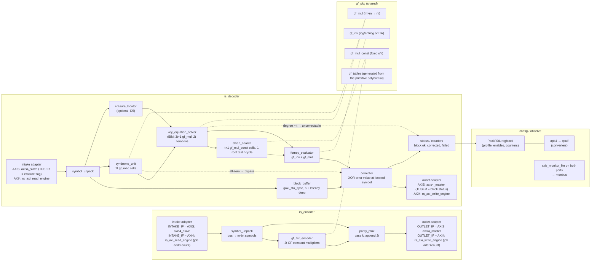

<!-- RTL Design Sherpa Documentation Header -->
<table>
<tr>
<td width="80">
  
</td>
<td>
  <strong>RTL Design Sherpa</strong> · <em>Learning Hardware Design Through Practice</em> 
  
    <a href="https://github.com/sean-galloway/RTLDesignSherpa">GitHub</a> ·
    <a href="https://github.com/sean-galloway/RTLDesignSherpa/blob/main/docs/DOCUMENTATION_INDEX.md">Documentation Index</a> ·
    <a href="https://github.com/sean-galloway/RTLDesignSherpa/blob/main/LICENSE">MIT License</a>
  
</td>
</tr>
</table>

---

<!-- End Header -->

# Reed-Solomon Codec -- Architecture Sketch

**Status:** rough block diagram, 2026-09-29. One page: what each FUB does in a
line or two, and which existing repo blocks it is built from. Sizes quoted
for the DVB-style profile RS(255,239), t = 8, GF(2^8), one symbol per cycle;
every count scales with t and m as noted. Nothing here is RTL yet.

## Block diagram

## FUBs

The block-by-block list -- every FUB, what it does, and ALL the components it
instantiates with counts, ordered bottom-up from the leaves that instantiate
nothing -- is [`rs_fub_catalog.md`](rs_fub_catalog.md). This page keeps the
diagram, the reuse map and the sizing; the catalog is the single source for
the hierarchy.

## Reuse map, by repo area

| Area | Module | Used for | Notes |
|---|---|---|---|
| `rtl/amba/gaxi` | `gaxi_skid_buffer` | ready/valid decoupling between FUBs (`DEPTH 2`) | one per stage boundary where a stage may stall |
| `rtl/amba/gaxi` | `gaxi_fifo_sync` | `block_buffer` | mux read by default; `REGISTERED=1` if the corrector needs the extra cycle |
| `rtl/amba/axis4` | `axis4_slave`, `axis4_master` (+ `_monlite`, `_cg`) | AXIS boundaries | the same wrappers the bridge uses at AXIS ports |
| `rtl/amba/axi4` | `axi4_master_rd`, `axi4_master_wr` (+ `_monlite`, `_cg`) | AXI4 boundaries, behind the read / write engines | timing isolation and monitoring exactly as STREAM's masters |
| `projects/components/dma-ip/stream/rtl/fub` | `axi_read_engine`, `axi_write_engine` | the shape (and, if the interfaces fit, the code) of `rs_axi_read_engine` / `rs_axi_write_engine` | STREAM's engines are multi-channel (`NC`) and SRAM-coupled; the RS engines are single-job and FIFO-coupled, so expect a reduction rather than an instantiation -- decide when the AXI4 boundary is built |
| `rtl/amba/monitor` | `axis_monitor_lite` | throughput / stall / TLAST observation on both ports → monbus | via the monlite wrapper variants; no hand-rolled counters |
| `rtl/amba/shared` | `axis4_master_pattern_gen`, `axis4_slave_pattern_check` | DV traffic and check at the boundaries | already used for the AXIS monitors |
| `rtl/common` | `counter_bin`, `counter_load_clear` | position, iteration and block counters | `MAX` = n for position |
| `rtl/common` | `shifter_beat_pack` | `symbol_pack` | |
| `rtl/common` | `shifter_lfsr_*` | DV only: error-pattern and data generation | not in the codec |
| `rtl/common` | `cam_tag` | **not used** | error positions arrive in order from Chien; a CAM would only be needed for out-of-order multi-block decoding, which is out of scope |
| `rtl/common` | `dataint_ecc_hamming_*` | **not used**, interface precedent only | the house ECC shape (data in, code out, error flags) that `rs_decoder`'s status follows |
| `rtl/math` | `math_multiplier_*`, `math_adder_*` | **not used** | binary arithmetic; GF(2^m) has no carries. The multiplier trees are the structural model for `gf_mul`'s AND/XOR array, nothing more |
| `projects/components/utility-ip/converters` | `apb4` → cpuif path (`peakrdl_to_cmdrsp` or the shim) | register access | exactly as STREAM's config block attaches its regblock |
| `bin/peakrdl_generate.py` | regblock, regmap, docs | `rs_regs` | never raw peakrdl |

## Sizes for the reference profile (RS(255,239), t = 8, m = 8, 1 symbol/cycle)

| Item | Count | Where it comes from |
|---|---|---|
| Encoder GF constant multipliers | 16 | 2t |
| Syndrome cells | 16 | 2t |
| Solver GF multipliers | 25 | 3t + 1 (riBM) |
| Chien cells | 9 | t + 1 |
| GF inverses | 1 (shared, one per error) | Forney |
| Block buffer | 512 × 9 bits | n = 255 symbols + solver latency (2t = 16 cycles) + Chien/Forney pipeline, rounded to a power of two |
| Decode latency | ≈ n + 2t + pipeline ≈ 280 cycles | syndromes need the whole block; Chien then walks n positions while the buffer drains |
| Throughput | 1 symbol (8 bits) per cycle | PRD D6 = serial; the parallel branch multiplies the Chien and syndrome cells by the symbols-per-cycle factor |

For CCSDS RS(255,223), t = 16: double every 2t-scaled row (32 syndrome cells,
49 solver multipliers, 17 Chien cells) and add the dual-basis conversion at
both boundaries. For 802.3 RS(544,514) over GF(2^10): m = 10 everywhere,
n = 544 so the buffer is 1024 deep, and D6 forces the parallel branch.

## What this sketch does not decide

Everything in PRD section 3 except the solver and the boundary: **riBM is
decided** (Sean, 2026-09-29; PRD D11), and **the deliverable is the
valid/ready core, with AXIS or AXI4 adapters selectable independently at each
end for standalone use** (PRD D9). The block is an endpoint codec, not a
mid-stream insert (PRD 4a). Euclidean was the alternative most FPGA cores use and is
easier to read, but needs an inverse in the loop or a longer datapath. Still
open: the throughput (serial here) and whether one build carries more than one
profile. The MAS is where those
become chapters; this page is the map that gets it started.
