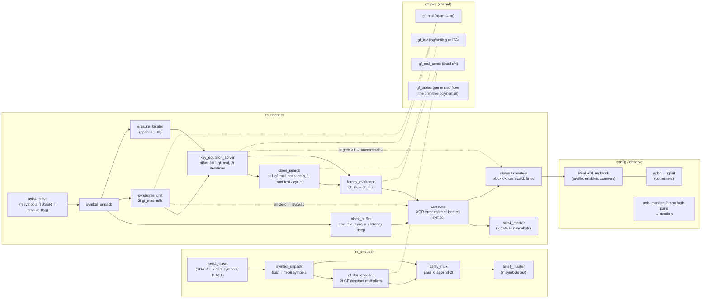

<!-- RTL Design Sherpa Documentation Header -->
<table>
<tr>
<td width="80">
  
</td>
<td>
  <strong>RTL Design Sherpa</strong> · <em>Learning Hardware Design Through Practice</em> 
  
    <a href="https://github.com/sean-galloway/RTLDesignSherpa">GitHub</a> ·
    <a href="https://github.com/sean-galloway/RTLDesignSherpa/blob/main/docs/DOCUMENTATION_INDEX.md">Documentation Index</a> ·
    <a href="https://github.com/sean-galloway/RTLDesignSherpa/blob/main/LICENSE">MIT License</a>
  
</td>
</tr>
</table>

---

<!-- End Header -->

# Reed-Solomon Codec -- Architecture Sketch

**Status:** rough block diagram, 2026-09-29. One page: what each FUB does in a
line or two, and which existing repo blocks it is built from. Sizes quoted
for the DVB-style profile RS(255,239), t = 8, GF(2^8), one symbol per cycle;
every count scales with t and m as noted. Nothing here is RTL yet.

## Block diagram

## FUBs

Each is one module in `rtl/`, one TB class, one test file, one MAS chapter.
`(new)` is RTL that does not exist anywhere in the repo yet.

| FUB | What it does | Built from |
|---|---|---|
| `gf_pkg` + `gf_tables` (new) | The field: primitive polynomial, α, log/antilog tables and the generator-polynomial coefficients, all generated from parameters (PRD R3) so a profile change is a parameter change. | new; a Python generator (`galois`) emits the tables, checked into `rtl/generated/` per Rule 0.1 |
| `gf_mul`, `gf_mul_const`, `gf_inv` (new) | GF(2^m) multiply (bit-parallel AND/XOR array plus modular reduction), constant multiply (reduces to an XOR net), inverse (table or Itoh-Tsujii). The three primitives everything else is made of. | new; the binary `math_multiplier_*` trees do not apply (no carries in GF(2^m)) |
| `symbol_unpack` / `symbol_pack` | Slice a TDATA beat into `SYMBOLS_PER_BEAT = DATA_WIDTH / SYMBOL_WIDTH` symbols and back (PRD D1: the bus must be a multiple of m, checked at elaboration), and keep TLAST aligned. | `shifter_beat_pack` (common) for the pack side; a counter from `counter_bin` |
| `line_randomizer` (generated only when `ENABLE_SCRAMBLER = 1`, PRD D12) | The standard's scrambler: a binary LFSR of fixed polynomial and seed (CCSDS x^17+x^14+1 seeded 11000111000111000 after the encoder, or the legacy 8-bit x^8+x^7+x^5+x^3+1 all-ones; DVB x^15+x^14+1 seeded 100101010000000 before it). Not part of the RS code; a parameter puts it in or leaves it out, and the OFF build is tested too. | `shifter_lfsr_galois` / `shifter_lfsr_fibonacci` (common) |
| `gf_lfsr_encoder` (new) | Systematic encoder: a 2t-stage LFSR over GF(2^m) with the generator-polynomial taps; k data symbols shift in, 2t parity symbols shift out. | 2t × `gf_mul_const`, 2t symbol registers; house `ALWAYS_FF_RST` macros |
| `parity_mux` | Passes the k data symbols through, then appends the 2t parity symbols; drives TLAST on the last parity symbol. | `counter_bin` (position), a 2:1 symbol mux |
| `block_buffer` | Holds the received block while the decoder works out where the errors are; depth = n + decoder latency symbols. Read out in lock-step with `chien_search` so the corrector meets each symbol at its position. | `gaxi_fifo_sync` (DEPTH = 512 for n = 255 plus latency, DATA_WIDTH = m + erasure bit, `MEM_STYLE` BRAM) |
| `syndrome_unit` (new) | 2t Horner evaluators, one per root α^(b+i): each is a register plus one `gf_mul_const` and an XOR, updated once per received symbol. Also the all-zero test that lets an error-free block bypass the solver. | 2t × `gf_mul_const` |
| `erasure_locator` (optional, PRD D5) | Builds the erasure-locator polynomial from TUSER flags and the position counter; feeds the solver so erasures do not spend the t budget. | `counter_bin`, t × `gf_mul`; only if D5 says erasures |
| `key_equation_solver` (new) | Reformulated inversionless Berlekamp-Massey (Sarwate-Shanbhag riBM): 2t iterations, each one systolic step over 3t + 1 cells, no GF inverse in the loop. Produces the error-locator Λ(x) and evaluator Ω(x); flags degree > t as uncorrectable. | 3t + 1 × `gf_mul` (25 for t = 8), one `counter_bin` for the iteration count |
| `chien_search` (new) | Evaluates Λ(α^-i) for every position i, one position per cycle, t + 1 cells each stepping by a constant multiply; a zero result marks an error at that position. | t + 1 × `gf_mul_const`, `counter_bin` (position) |
| `forney_evaluator` (new) | Error magnitude at each located position: Ω(X^-1) / Λ'(X^-1) times the first-root correction. Needs one GF inverse per error. | `gf_inv`, 2 × `gf_mul`, t × `gf_mul_const` for Ω |
| `corrector` | XORs the Forney value into the symbol leaving `block_buffer` when Chien says the position is in error; counts corrections. | XOR + `counter_bin`; the FIFO read strobe is the position clock |
| `status_counters` | Per-block: ok / corrected-n / uncorrectable; running totals; the uncorrectable flag also rides TUSER out (PRD R2). | `counter_bin` × 3, flags into the regblock's `hwif_in` |
| `rs_regs` (generated) | Profile selection (when more than one is compiled in), enables, counters, interrupt on uncorrectable. | PeakRDL regblock via `bin/peakrdl_generate.py`; APB in through the converters' `apb4 → cpuif` path exactly as `stream_config_block` does |
| `rs_encoder`, `rs_decoder` tops | The two deliverables; each wraps its datapath in the house AXI-Stream boundary. | `axis4_slave` in, `axis4_master` out (`SKID_DEPTH` 2-4); `axis4_*_monlite` variants when observed |

## Reuse map, by repo area

| Area | Module | Used for | Notes |
|---|---|---|---|
| `rtl/amba/gaxi` | `gaxi_skid_buffer` | ready/valid decoupling between FUBs (`DEPTH 2`) | one per stage boundary where a stage may stall |
| `rtl/amba/gaxi` | `gaxi_fifo_sync` | `block_buffer` | mux read by default; `REGISTERED=1` if the corrector needs the extra cycle |
| `rtl/amba/axis4` | `axis4_slave`, `axis4_master` (+ `_monlite`, `_cg`) | codec boundaries | the same wrappers the bridge uses at AXIS ports |
| `rtl/amba/monitor` | `axis_monitor_lite` | throughput / stall / TLAST observation on both ports → monbus | via the monlite wrapper variants; no hand-rolled counters |
| `rtl/amba/shared` | `axis4_master_pattern_gen`, `axis4_slave_pattern_check` | DV traffic and check at the boundaries | already used for the AXIS monitors |
| `rtl/common` | `counter_bin`, `counter_load_clear` | position, iteration and block counters | `MAX` = n for position |
| `rtl/common` | `shifter_beat_pack` | `symbol_pack` | |
| `rtl/common` | `shifter_lfsr_*` | DV only: error-pattern and data generation | not in the codec |
| `rtl/common` | `cam_tag` | **not used** | error positions arrive in order from Chien; a CAM would only be needed for out-of-order multi-block decoding, which is out of scope |
| `rtl/common` | `dataint_ecc_hamming_*` | **not used**, interface precedent only | the house ECC shape (data in, code out, error flags) that `rs_decoder`'s status follows |
| `rtl/math` | `math_multiplier_*`, `math_adder_*` | **not used** | binary arithmetic; GF(2^m) has no carries. The multiplier trees are the structural model for `gf_mul`'s AND/XOR array, nothing more |
| `projects/components/utility-ip/converters` | `apb4` → cpuif path (`peakrdl_to_cmdrsp` or the shim) | register access | exactly as STREAM's config block attaches its regblock |
| `bin/peakrdl_generate.py` | regblock, regmap, docs | `rs_regs` | never raw peakrdl |

## Sizes for the reference profile (RS(255,239), t = 8, m = 8, 1 symbol/cycle)

| Item | Count | Where it comes from |
|---|---|---|
| Encoder GF constant multipliers | 16 | 2t |
| Syndrome cells | 16 | 2t |
| Solver GF multipliers | 25 | 3t + 1 (riBM) |
| Chien cells | 9 | t + 1 |
| GF inverses | 1 (shared, one per error) | Forney |
| Block buffer | 512 × 9 bits | n = 255 symbols + solver latency (2t = 16 cycles) + Chien/Forney pipeline, rounded to a power of two |
| Decode latency | ≈ n + 2t + pipeline ≈ 280 cycles | syndromes need the whole block; Chien then walks n positions while the buffer drains |
| Throughput | 1 symbol (8 bits) per cycle | PRD D6 = serial; the parallel branch multiplies the Chien and syndrome cells by the symbols-per-cycle factor |

For CCSDS RS(255,223), t = 16: double every 2t-scaled row (32 syndrome cells,
49 solver multipliers, 17 Chien cells) and add the dual-basis conversion at
both boundaries. For 802.3 RS(544,514) over GF(2^10): m = 10 everywhere,
n = 544 so the buffer is 1024 deep, and D6 forces the parallel branch.

## What this sketch does not decide

Everything in PRD section 3 except the solver: **riBM is decided** (Sean,
2026-09-29; PRD D11). Euclidean was the alternative most FPGA cores use and is
easier to read, but needs an inverse in the loop or a longer datapath. Still
open: the throughput (serial here) and whether one build carries more than one
profile. The MAS is where those
become chapters; this page is the map that gets it started.
